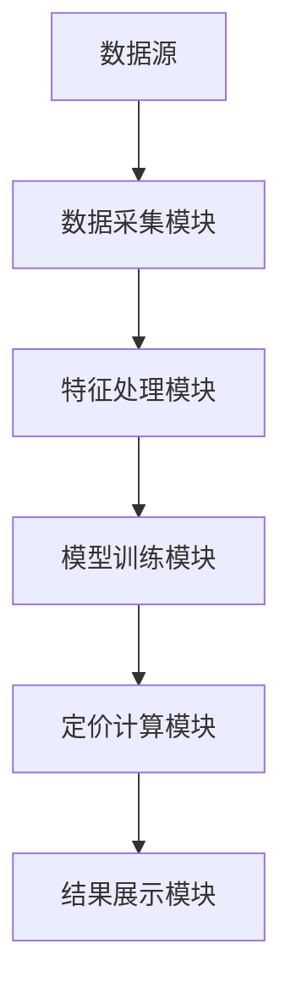
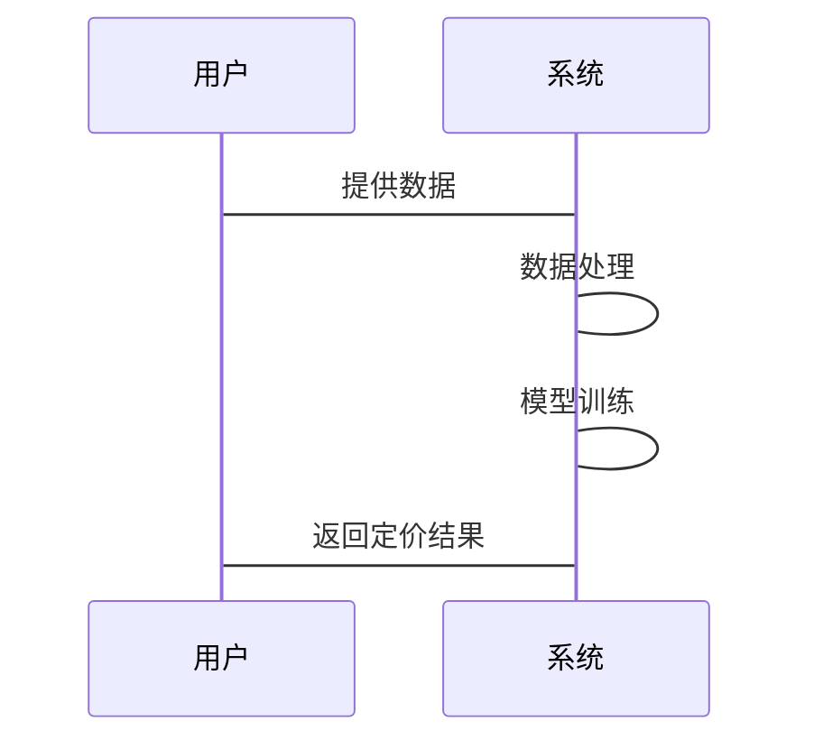

                 


# 智能信用违约互换定价模型

> **关键词**: 信用违约互换，智能定价模型，机器学习，信用风险，金融建模

> **摘要**: 信用违约互换（Credit Default Swap, CDS）是金融市场中重要的信用衍生工具，其定价模型在信用风险管理中起着关键作用。传统定价模型存在诸多局限性，随着人工智能技术的发展，智能信用违约互换定价模型逐渐成为研究热点。本文将详细介绍智能信用违约互换定价模型的背景、基本原理、算法实现、系统设计及实际应用，结合实例分析，深入探讨其优势与挑战。

---

## 第一部分：智能信用违约互换定价模型的背景与基础

### 第1章：智能信用违约互换定价模型的背景介绍

#### 1.1 信用违约互换的基本概念
##### 1.1.1 信用违约互换的定义与特点
信用违约互换（CDS）是信用衍生工具的一种，允许买方在债务人发生违约时，从卖方获得赔偿。其特点是标准化、流动性高，且可以用于对冲信用风险。CDS的基本结构包括名义本金、期限、违约事件和违约概率等关键要素。

##### 1.1.2 信用违约互换的市场发展与现状
CDS市场起源于20世纪90年代，随着信用衍生工具的快速发展，市场规模迅速扩大。然而，2008年金融危机暴露了CDS定价模型的局限性，尤其是对尾部风险和系统性风险的忽视。

##### 1.1.3 传统信用违约互换定价的局限性
传统CDS定价模型通常基于Merton模型，假设市场是完全有效的，并且忽略了市场微观结构和非理性行为。这种简化导致定价模型在实际应用中存在偏差，尤其是在极端市场条件下。

---

#### 1.2 信用风险定价的背景与挑战
##### 1.2.1 信用风险定价的基本概念
信用风险定价的核心是通过量化债务人违约的概率和损失程度，确定其信用产品价格。传统的定价方法依赖于历史数据和统计模型，但难以捕捉复杂市场环境下的动态变化。

##### 1.2.2 传统信用风险定价方法的优缺点
- **优点**: 简单易懂，计算效率高。
- **缺点**: 无法充分考虑市场异质性、非线性关系和实时数据。

##### 1.2.3 智能信用违约互换定价的必要性
随着大数据和人工智能技术的进步，智能定价模型能够更好地捕捉市场动态，提高定价的准确性和鲁棒性。

---

### 第2章：信用违约互换的基本原理

#### 2.1 信用违约互换的定义与结构
##### 2.1.1 信用违约互换的定义
CDS是一种场外衍生工具，买方支付保费，卖方承担债务人违约的风险。

##### 2.1.2 信用违约互换的标准化结构
CDS的标准结构包括名义本金、期限、宽限期、违约事件（如支付违约、利息违约）和结算方式。

##### 2.1.3 信用违约互换的定价公式
传统CDS定价公式基于Merton模型，假设债务人的违约概率服从参数化的分布。

---

## 第二部分：智能信用违约互换定价模型的核心概念

### 第3章：智能信用违约互换定价模型的核心概念

#### 3.1 机器学习在信用违约互换定价中的应用
##### 3.1.1 机器学习的基本概念
机器学习是一种数据驱动的算法，通过训练数据学习模式，并用于预测或分类任务。

##### 3.1.2 机器学习在信用风险定价中的优势
- 高维度数据处理能力
- 非线性关系捕捉
- 实时更新能力

##### 3.1.3 机器学习算法的选择
常用算法包括逻辑回归、支持向量机（SVM）、随机森林和神经网络等。

---

#### 3.2 特征工程与数据预处理
##### 3.2.1 特征工程的基本概念
特征工程是通过选择和构造特征，提高模型性能的过程。

##### 3.2.2 信用违约互换定价中的关键特征
- 债务人信用等级
- 市场波动率
- 经济周期指标

##### 3.2.3 数据预处理方法
- 数据清洗
- 特征标准化
- 特征降维

---

## 第三部分：智能信用违约互换定价模型的算法实现

### 第4章：智能信用违约互换定价模型的算法原理

#### 4.1 机器学习算法的原理
##### 4.1.1 支持向量机（SVM）
SVM通过构建超平面实现分类，适用于小样本数据。

##### 4.1.2 随机森林
随机森林通过构建多个决策树并集成预测结果，具有高鲁棒性和低过拟合风险。

##### 4.1.3 神经网络
神经网络通过多层非线性变换，能够捕捉复杂的市场模式。

---

#### 4.2 算法实现步骤
##### 4.2.1 数据获取与清洗
- 数据来源：公开市场数据、公司财务报表
- 数据清洗：处理缺失值、异常值

##### 4.2.2 特征提取与选择
- 使用主成分分析（PCA）进行特征降维
- 选择与违约相关性高的特征

##### 4.2.3 模型训练与验证
- 划分训练集、验证集和测试集
- 使用交叉验证评估模型性能

##### 4.2.4 模型部署与实时更新
- 将模型部署到生产环境
- 定期更新模型参数

---

## 第四部分：智能信用违约互换定价模型的系统设计

### 第5章：智能信用违约互换定价模型的系统分析与架构设计

#### 5.1 系统功能设计
##### 5.1.1 系统功能模块
- 数据采集模块
- 特征处理模块
- 模型训练模块
- 定价计算模块
- 结果展示模块

##### 5.1.2 系统功能流程
$$
\text{数据采集} \rightarrow \text{特征处理} \rightarrow \text{模型训练} \rightarrow \text{定价计算} \rightarrow \text{结果展示}
$$

---

#### 5.2 系统架构设计
##### 5.2.1 系统架构图


##### 5.2.2 系统接口设计
- 数据接口：提供API用于数据导入和导出
- 模型接口：提供API用于模型训练和预测

##### 5.2.3 系统交互设计


---

## 第五部分：智能信用违约互换定价模型的项目实战

### 第6章：智能信用违约互换定价模型的项目实战

#### 6.1 项目环境搭建
##### 6.1.1 环境要求
- Python 3.8及以上
- 机器学习库（如scikit-learn、TensorFlow）
- 数据处理库（如Pandas、NumPy）

##### 6.1.2 安装依赖
```bash
pip install scikit-learn tensorflow pandas numpy
```

---

#### 6.2 核心代码实现
##### 6.2.1 数据预处理代码
```python
import pandas as pd
import numpy as np

# 读取数据
data = pd.read_csv('credit_data.csv')

# 处理缺失值
data = data.dropna()

# 标准化处理
from sklearn.preprocessing import StandardScaler
scaler = StandardScaler()
scaled_data = scaler.fit_transform(data)
```

##### 6.2.2 模型训练代码
```python
from sklearn.ensemble import RandomForestClassifier
from sklearn.metrics import accuracy_score

# 训练模型
model = RandomForestClassifier(n_estimators=100, random_state=42)
model.fit(scaled_data, labels)

# 验证模型
y_pred = model.predict(test_data)
print("Accuracy:", accuracy_score(test_labels, y_pred))
```

##### 6.2.3 模型部署代码
```python
import joblib

# 保存模型
joblib.dump(model, 'cds_model.pkl')

# 加载模型
loaded_model = joblib.load('cds_model.pkl')
```

---

#### 6.3 项目总结
通过实际案例分析，智能信用违约互换定价模型能够显著提高定价的准确性和实时性。模型在极端市场条件下的表现尤为突出，能够有效捕捉尾部风险。

---

## 第六部分：智能信用违约互换定价模型的优化与展望

### 第7章：智能信用违约互换定价模型的优化与展望

#### 7.1 模型优化策略
##### 7.1.1 参数优化
- 使用网格搜索优化模型参数
- 调整学习率和批量大小

##### 7.1.2 模型集成
- 结合多种算法进行预测
- 使用投票机制融合结果

##### 7.1.3 数据增强
- 引入外部数据源（如新闻、社交媒体数据）
- 处理高维数据

---

#### 7.2 智能信用违约互换定价模型的展望
随着人工智能技术的不断进步，智能信用违约互换定价模型将更加智能化和个性化。未来的研究方向包括：
- 多模态数据融合
- 自适应模型更新
- 可解释性增强

---

## 第七部分：最佳实践与总结

### 第8章：最佳实践、小结与注意事项

#### 8.1 最佳实践
- 数据预处理是关键，确保数据质量和完整性
- 模型选择应结合业务需求和数据特性
- 定期更新模型参数，保持模型的有效性

#### 8.2 小结
智能信用违约互换定价模型通过机器学习技术，显著提升了信用风险定价的准确性和效率。本文详细介绍了模型的背景、原理、实现和应用，为读者提供了全面的技术视角。

#### 8.3 注意事项
- 模型结果仅供参考，需结合实际市场情况
- 数据隐私和安全问题需高度重视
- 模型部署需考虑计算资源和实时性要求

---

## 第八部分：拓展阅读与参考资料

### 第9章：拓展阅读与参考资料

#### 9.1 拓展阅读
- 《信用衍生工具与金融风险管理》
- 《机器学习在金融中的应用》
- 《Python机器学习实战》

#### 9.2 参考资料
- [1] Hull, J. C. (2012). *Options, Futures, and Other Derivatives*.
- [2] Bishop, C. M. (2006). *Pattern Recognition and Machine Learning*.
- [3] Goodfellow, I., Bengio, Y., & Courville, A. (2016). *Deep Learning*.

---

## 作者：AI天才研究院 & 禅与计算机程序设计艺术

---

通过以上目录和内容设计，文章从背景、原理、算法、系统设计、实战到优化与展望，全面覆盖了智能信用违约互换定价模型的各个方面，结合理论与实践，为读者提供了系统化的知识体系和实用的技术指导。

