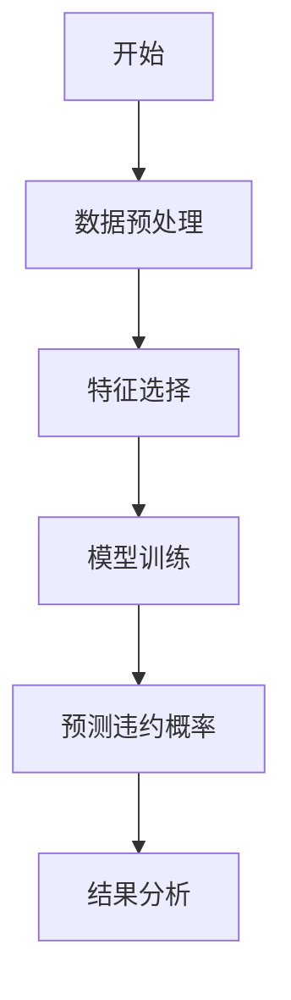
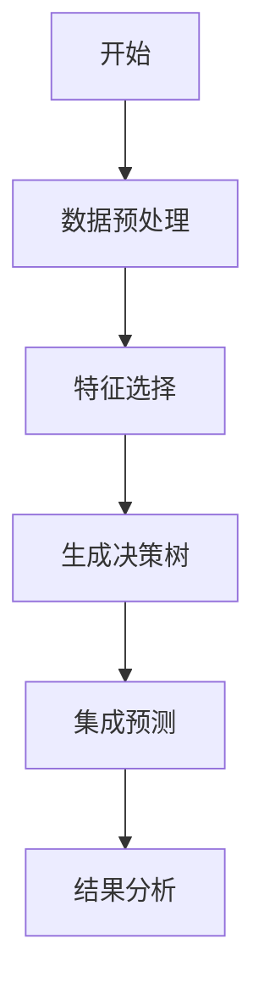

                 


# 智能信用违约互换风险评估

> 关键词：信用违约互换、风险评估、人工智能、金融衍生工具、智能系统

> 摘要：本文详细探讨了智能信用违约互换风险评估的背景、核心概念、算法原理、系统架构以及项目实战。通过结合金融领域的专业知识和人工智能技术，提出了一种基于机器学习的智能风险评估方法，旨在提高信用违约互换的风险管理能力，为金融机构提供科学决策支持。

---

## 第1章: 信用违约互换（CDS）概述

### 1.1 信用违约互换的基本概念

信用违约互换（Credit Default Swap, CDS）是一种金融衍生工具，用于转移信用风险。其基本原理是买方支付固定费用，卖方承担债务人违约的风险。CDS广泛应用于债券市场，帮助投资者对冲信用风险。

### 1.2 信用违约互换的风险类型

1. **信用风险**：债务人违约的可能性。
2. **市场风险**：市场价格波动带来的风险。
3. **流动性风险**：交易市场的流动性不足导致的风险。

### 1.3 智能信用违约互换的风险评估必要性

传统风险评估方法依赖历史数据和统计模型，存在局限性。智能评估通过机器学习等技术，能够实时分析数据，提高准确性。

---

## 第2章: 智能信用违约互换风险评估的核心概念

### 2.1 智能信用评估的核心原理

智能评估利用机器学习算法，分析大量数据，识别潜在风险因素。核心步骤包括数据清洗、特征提取、模型训练和结果解释。

### 2.2 核心概念对比分析

| 模型类型   | 优点                | 缺点                |
|------------|---------------------|--------------------|
| 逻辑回归   | 解释性强            | 非线性能力有限      |
| 随机森林   | 高准确性            | 易受超参数影响      |
| 神经网络    | 强大学习能力        | 计算复杂度高        |

---

## 第3章: 智能信用违约互换风险评估的算法原理

### 3.1 逻辑回归模型

**原理**：通过线性回归预测违约概率，输出结果为二分类（违约或不违约）。

**流程图**：



**Python代码示例**：

```python
import pandas as pd
from sklearn.linear_model import LogisticRegression
from sklearn.metrics import accuracy_score

# 加载数据
data = pd.read_csv('cds_data.csv')
X = data[['credit_score', 'loan_amount']]
y = data['default']

# 模型训练
model = LogisticRegression()
model.fit(X, y)

# 预测
y_pred = model.predict(X)
print('准确率:', accuracy_score(y, y_pred))
```

### 3.2 随机森林模型

**原理**：基于决策树的集成学习方法，通过投票机制输出结果。

**流程图**：



### 3.3 神经网络模型

**原理**：通过多层神经网络模拟非线性关系，识别复杂特征。

**流程图**：


---

## 第4章: 智能信用违约互换风险评估的系统架构

### 4.1 系统设计概述

系统目标是提供实时风险评估服务，模块包括数据采集、数据处理、模型训练和结果展示。

**架构图**：


---

## 第5章: 项目实战

### 5.1 环境安装

安装Python、NumPy、Pandas、Scikit-learn和Mermaid工具。

### 5.2 核心实现代码

```python
import numpy as np
import pandas as pd
from sklearn.ensemble import RandomForestClassifier
from sklearn.metrics import classification_report

# 加载数据
data = pd.read_csv('cds_data.csv')
X = data.drop('default', axis=1)
y = data['default']

# 模型训练
model = RandomForestClassifier()
model.fit(X, y)

# 预测
y_pred = model.predict(X)
print(classification_report(y, y_pred))
```

### 5.3 案例分析

分析某企业CDS数据，使用随机森林模型进行风险评估，输出结果并解释。

---

## 第6章: 总结与展望

智能信用违约互换风险评估通过机器学习技术，显著提高了风险评估的准确性。未来，随着技术进步，评估模型将更加智能化和个性化。

---

作者：AI天才研究院 & 禅与计算机程序设计艺术

