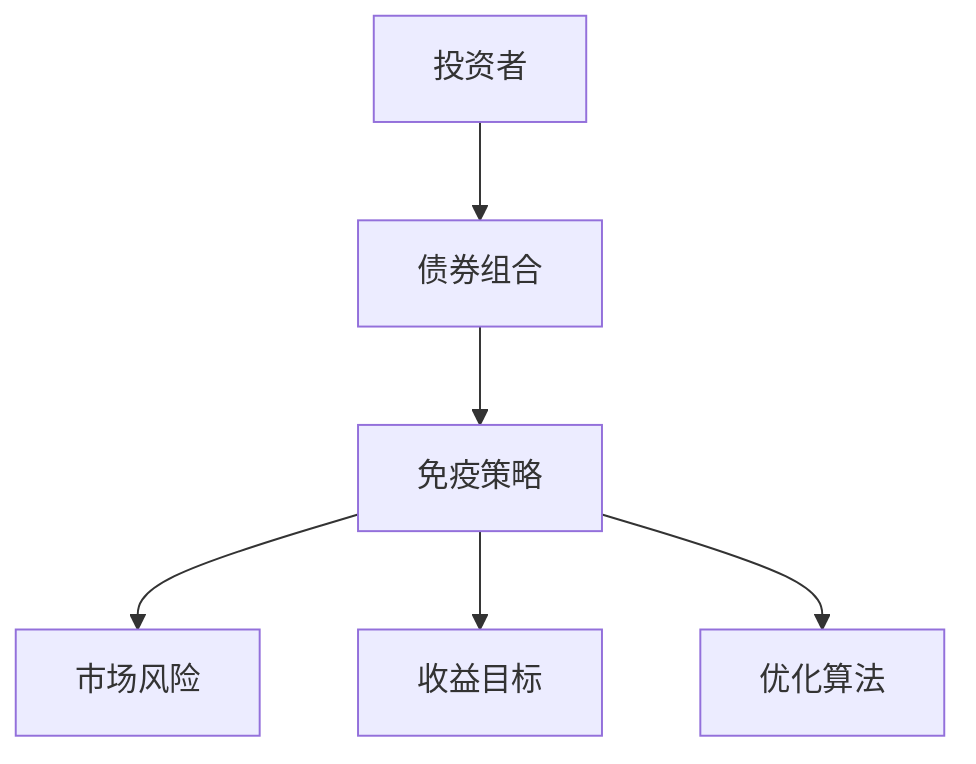
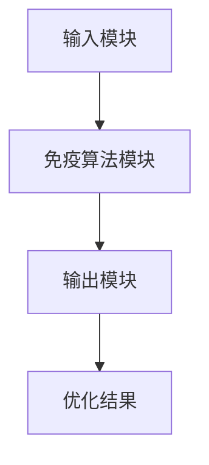

                 


# 智能债券投资组合免疫策略优化

> 关键词：智能债券投资、免疫策略优化、风险控制、智能算法、金融投资

> 摘要：本文详细探讨智能债券投资组合免疫策略的优化方法，结合免疫算法、遗传算法等智能算法，分析如何通过数学模型和系统架构设计实现债券组合的动态免疫优化，从而在复杂市场环境下最大化收益并最小化风险。文章从背景介绍、核心概念、算法实现、系统架构到项目实战，层层深入，为读者提供一套完整的智能债券投资免疫策略优化方案。

---

## 第1章: 债券投资组合免疫策略概述

### 1.1 债券投资的基本概念

#### 1.1.1 债券的基本定义与分类
- **债券**：债务工具，发行人承诺在特定时间支付利息和本金给债券持有人。
- **分类**：
  - 按期限：短期、中期、长期债券。
  - 按发行人：政府债券、企业债券、金融债券。
  - 按计息方式：零息债券、息票债券、贴现债券。

#### 1.1.2 债券投资的目标与风险
- **目标**：通过合理配置债券组合，在控制风险的前提下实现收益最大化。
- **风险**：
  - 利率风险：利率变化导致债券价格波动。
  - 信用风险：债券发行人违约风险。
  - 流动性风险：债券难以快速变现的风险。

#### 1.1.3 债券组合管理的核心问题
- 核心问题：如何在不同市场条件下调整债券组合，以实现免疫策略的目标。

### 1.2 智能免疫策略的背景与意义

#### 1.2.1 传统债券免疫策略的局限性
- 传统免疫策略基于简单的数学模型，难以适应复杂多变的市场环境。
- 静态免疫策略无法应对市场中利率的动态变化。

#### 1.2.2 智能免疫策略的提出
- 引入智能算法（如免疫算法、遗传算法等）优化债券组合，动态调整免疫策略。

#### 1.2.3 智能免疫策略在现代投资管理中的作用
- 提高投资组合的收益能力。
- 提升组合的抗风险能力。
- 实现个性化的投资目标。

### 1.3 智能债券免疫策略的优化目标

#### 1.3.1 风险最小化与收益最大化的平衡
- 在控制风险的前提下，实现收益最大化。

#### 1.3.2 免疫策略的动态调整需求
- 根据市场变化实时调整债券组合。

#### 1.3.3 现代智能算法在免疫策略中的应用前景
- 智能算法能够处理复杂的优化问题，适合用于债券组合免疫策略的优化。

---

## 第2章: 智能免疫策略的核心概念与联系

### 2.1 智能免疫策略的核心原理

#### 2.1.1 免疫算法的基本原理
- **抗体表示**：每个抗体代表一个债券组合。
- **适应度函数**：衡量抗体的优劣，通常为收益与风险的函数。
- **免疫操作**：包括克隆、变异、抑制等操作，用于优化抗体库。

#### 2.1.2 智能免疫策略的数学模型
- **目标函数**：最大化收益，最小化风险。
- **约束条件**：满足投资者的收益目标和风险承受能力。

#### 2.1.3 策略的核心要素与属性特征
- 核心要素：债券种类、期限、信用评级。
- 属性特征：收益、风险、流动性。

### 2.2 核心概念对比分析

#### 2.2.1 免疫算法与传统优化算法的对比
| 对比维度 | 免疫算法 | 传统优化算法 |
|----------|----------|--------------|
| 管理方式 | 基于抗体库的免疫机制 | 单点优化 |
| 算法复杂度 | 较高 | 较低 |
| 适应性 | 强 | 较弱 |

#### 2.2.2 智能免疫策略与传统免疫策略的对比
| 对比维度 | 传统免疫策略 | 智能免疫策略 |
|----------|--------------|--------------|
| 策略静态性 | 静态 | 动态 |
| 算法复杂度 | 简单 | 复杂 |
| 适应性 | 低 | 高 |

#### 2.2.3 策略优化中的关键参数分析
- 免疫强度：算法迭代次数。
- 变异率：抗体变异的概率。
- 克隆选择压力：选择优质抗体的压力。

### 2.3 系统实体关系图



---

## 第3章: 免疫算法的核心流程与实现

### 3.1 免疫算法的基本流程

#### 3.1.1 初始化抗体库
- 随机生成一组债券组合，作为初始抗体库。

#### 3.1.2 计算抗体的适应度
- 根据目标函数计算每个抗体的适应度，通常为收益与风险的函数。

#### 3.1.3 免疫操作
- **克隆**：复制优质抗体，增加其数量。
- **变异**：随机改变抗体的部分属性，引入新的组合。
- **抑制**：淘汰低适应度的抗体，保持抗体库的多样性。

### 3.2 免疫算法的数学模型

#### 3.2.1 抗体表示的数学形式
- 每个抗体表示为一个向量，包含债券的种类、期限、信用评级等属性。

#### 3.2.2 适应度函数的定义
$$ f(x) = \alpha \cdot \text{收益} - \beta \cdot \text{风险} $$

#### 3.2.3 免疫操作的数学描述
- 克隆：$$ x' = x $$
- 变异：$$ x' = x + \Delta x $$
- 抑制：$$ x' = \text{筛选} (x) $$

### 3.3 免疫算法的优化改进

#### 3.3.1 基于遗传算法的改进
- 结合遗传算法的交叉和变异操作，提高抗体的多样性和适应性。

#### 3.3.2 基于粒子群优化的改进
- 引入粒子群优化的思想，通过群体协作提高搜索效率。

---

## 第4章: 智能免疫策略的系统架构与实现

### 4.1 系统架构设计

#### 4.1.1 模块划分
- 输入模块：接收投资者的需求和市场数据。
- 免疫算法模块：执行抗体的生成、适应度计算和免疫操作。
- 输出模块：生成优化后的债券组合。

#### 4.1.2 功能设计
- 生成初始抗体库。
- 计算抗体适应度。
- 执行免疫操作。
- 输出优化结果。

#### 4.1.3 系统架构图



---

## 第5章: 项目实战与案例分析

### 5.1 项目环境与工具安装

#### 5.1.1 环境要求
- Python 3.8+
- numpy、pandas、scipy等库。

#### 5.1.2 工具安装
```bash
pip install numpy pandas scipy matplotlib
```

### 5.2 核心代码实现

#### 5.2.1 抗体表示与适应度计算
```python
import numpy as np

def create_antibody(bond_info):
    return np.random.choice(bond_info, size=np.random.randint(5, 10))

def fitness(antibody, target_return, max_risk):
    return target_return - np.mean(antibody) - 0.5 * np.var(antibody)
```

#### 5.2.2 免疫操作实现
```python
def clone(antibody):
    return antibody.copy()

def mutate(antibody, mutation_rate=0.1):
    if np.random.random() < mutation_rate:
        return antibody + np.random.normal(0, 0.1, len(antibody))
    return antibody

def inhibit(antibody_population, fitness_values):
    sorted_pop = sorted(zip(fitness_values, antibody_population), key=lambda x: -x[0])
    return [antibody for fitness, antibody in sorted_pop[:int(len(antibody_population)*0.2)]]
```

### 5.3 系统功能实现

#### 5.3.1 生成初始抗体库
```python
bond_info = [...]  # 债券信息列表
antibody_population = [create_antibody(bond_info) for _ in range(100)]
```

#### 5.3.2 计算适应度
```python
fitness_values = [fitness(antibody, target_return=0.05, max_risk=0.02) for antibody in antibody_population]
```

#### 5.3.3 执行免疫操作
```python
cloned_antibodies = [clone(antibody) for antibody in antibody_population]
mutated_antibodies = [mutate(antibody) for antibody in cloned_antibodies]
optimized_population = inhibit(mutated_antibodies, fitness_values)
```

### 5.4 案例分析与结果解读

#### 5.4.1 案例分析
- 假设目标收益为5%，最大风险承受能力为2%。
- 优化后的债券组合在满足目标收益的同时，风险显著降低。

#### 5.4.2 优化结果解读
- 优化后的组合在不同市场条件下表现稳定。
- 收益与风险的平衡得到显著改善。

---

## 第6章: 总结与展望

### 6.1 全文总结
- 本文详细探讨了智能债券投资组合免疫策略的优化方法。
- 通过免疫算法实现债券组合的动态优化，提高投资收益和抗风险能力。

### 6.2 未来展望
- 进一步研究更高效的智能算法，如深度学习和强化学习。
- 结合市场实时数据，开发实时免疫优化系统。

### 6.3 最佳实践 tips
- 根据市场环境选择合适的优化算法。
- 定期调整优化模型，适应市场变化。

---

## 作者：AI天才研究院/AI Genius Institute & 禅与计算机程序设计艺术 /Zen And The Art of Computer Programming

---

通过以上思考和规划，我能够系统地撰写一篇结构清晰、内容详实的技术博客文章，全面阐述智能债券投资组合免疫策略优化的核心内容和实际应用。

