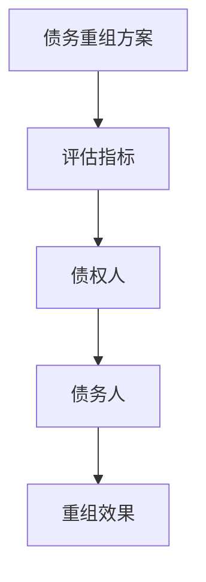
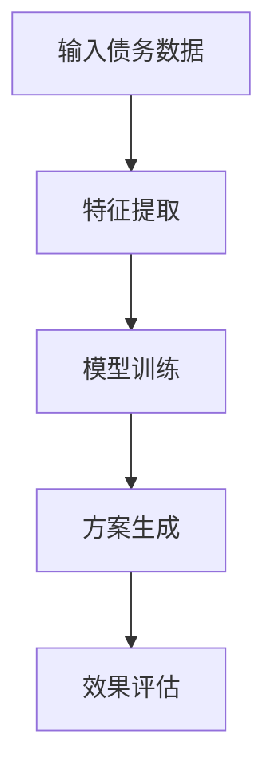
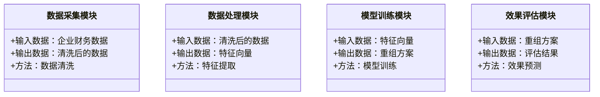
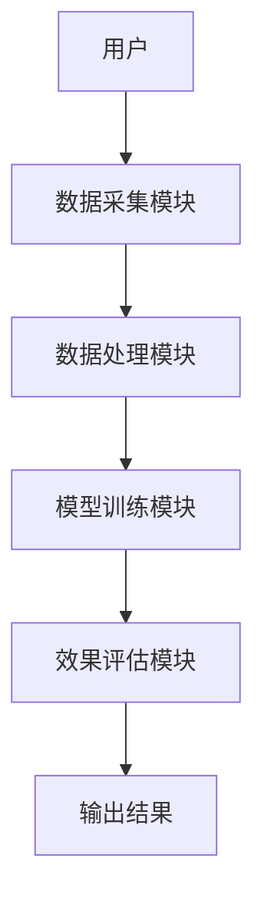
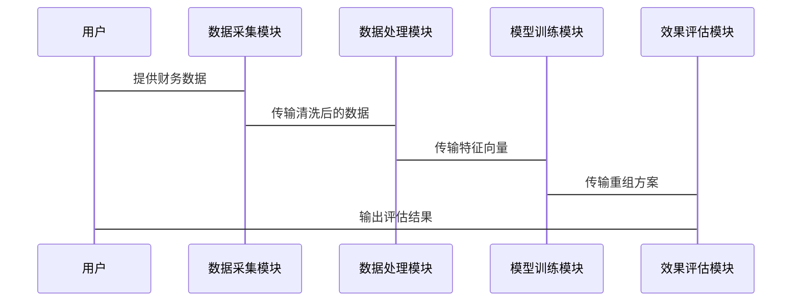

                 


# 智能债务重组方案效果评估工具

## 关键词：智能债务重组、方案评估、效果分析、评估工具、人工智能、算法优化

## 摘要：智能债务重组方案效果评估工具是一种结合人工智能技术的创新解决方案，旨在提高债务重组过程的效率和准确性。本文详细探讨了智能债务重组的核心概念、算法原理、系统架构以及实际应用案例，通过具体的技术分析和实践，展示了该工具在现代债务管理中的巨大潜力和实际价值。

---

# 第一章：智能债务重组背景与核心概念

## 1.1 背景与问题背景

### 1.1.1 传统债务重组的局限性
传统债务重组过程依赖于人工经验，效率低下且难以应对复杂场景。企业在债务重组过程中常常面临以下挑战：
- 数据量大且分散，难以高效处理。
- 依赖专家经验，主观性较强，缺乏客观性和全面性。
- 重组方案的优化和效果预测缺乏科学依据，可能导致决策失误。

### 1.1.2 智能债务重组的定义与目标
智能债务重组是利用人工智能技术，通过数据挖掘、机器学习等方法，自动优化重组方案并预测其效果的过程。其目标是：
- 提高债务重组的效率和准确性。
- 降低人为错误，优化重组方案。
- 提供科学的决策支持，帮助企业在复杂环境下制定最优策略。

### 1.1.3 智能债务重组的边界与外延
智能债务重组不仅包括重组方案的生成，还包括对其效果的全面评估。其外延涵盖：
- 数据分析与处理。
- 智能算法的应用。
- 方案效果的预测与优化。

## 1.2 智能债务重组的核心概念

### 1.2.1 债务重组的基本概念
债务重组是指债务人通过调整债务结构、延长还款期限或降低利息等方式，减轻债务负担的过程。其核心在于优化债务结构，降低债务风险。

### 1.2.2 智能债务重组的核心要素
智能债务重组的核心要素包括：
- 数据采集与处理：从企业财务数据中提取关键信息。
- 智能算法：基于机器学习的方案生成与优化。
- 效果评估：对重组方案的效果进行预测与分析。

### 1.2.3 智能债务重组的实现机制
智能债务重组的实现机制包括：
- 数据驱动：利用企业财务数据，通过数据挖掘技术提取特征。
- 算法驱动：基于机器学习模型生成最优重组方案。
- 优化驱动：通过多次迭代优化方案，提高效果。

## 1.3 智能债务重组的应用场景

### 1.3.1 企业债务重组的常见场景
企业在经营过程中可能面临以下债务重组场景：
- 资金链断裂，无法按期偿还债务。
- 经营不善，需要调整债务结构。
- 债务纠纷，需要寻求最优解决方案。

### 1.3.2 智能债务重组的应用领域
智能债务重组的应用领域包括：
- 企业债务管理。
- 金融行业风险控制。
- 政府债务优化。

### 1.3.3 智能债务重组的潜在价值
智能债务重组的潜在价值体现在：
- 提高债务重组效率，降低企业成本。
- 提供科学的决策支持，减少人为错误。
- 优化企业财务结构，提升企业竞争力。

---

# 第二章：智能债务重组评估工具的核心原理

## 2.1 核心概念的原理分析

### 2.1.1 债务重组方案的生成机制
智能债务重组方案的生成机制包括：
- 数据采集：从企业财务数据中提取关键信息。
- 特征提取：通过数据挖掘技术提取影响债务重组的关键特征。
- 模型训练：基于机器学习算法，训练模型生成最优重组方案。

### 2.1.2 方案效果的评估指标
方案效果的评估指标包括：
- 偿债能力：企业未来偿债能力的预测。
- 财务健康度：企业财务状况的综合评估。
- 经济效益：重组方案对企业经济利益的影响。

### 2.1.3 工具的智能化实现方式
工具的智能化实现方式包括：
- 使用机器学习算法生成重组方案。
- 通过深度学习模型预测方案效果。
- 利用自然语言处理技术分析企业财务报告。

## 2.2 核心概念的属性特征对比

### 2.2.1 传统债务重组与智能债务重组的对比分析
| 特性 | 传统债务重组 | 智能债务重组 |
|------|---------------|---------------|
| 效率 | 低效 | 高效 |
| 精准度 | 低 | 高 |
| 可扩展性 | 低 | 高 |

### 2.2.2 智能债务重组工具的属性特征表
| 特性 | 描述 |
|------|------|
| 数据驱动 | 基于企业财务数据 |
| 智能算法 | 使用机器学习和深度学习算法 |
| 实时分析 | 支持实时数据处理和分析 |

### 2.2.3 ER实体关系图架构


---

# 第三章：智能债务重组方案效果评估工具的算法原理

## 3.1 算法原理概述

### 3.1.1 基于机器学习的债务重组方案生成
- 使用决策树、随机森林等算法进行特征提取和分类。
- 基于支持向量机（SVM）进行方案生成。

### 3.1.2 基于深度学习的方案效果预测
- 使用神经网络模型（如LSTM）预测重组方案的效果。
- 通过卷积神经网络（CNN）分析企业财务数据。

## 3.2 算法流程图

### 3.2.1 算法流程图


### 3.2.2 代码实现示例
```python
import pandas as pd
from sklearn.model_selection import train_test_split
from sklearn.ensemble import RandomForestClassifier

# 数据加载
data = pd.read_csv('debt_data.csv')
X = data.drop('target', axis=1)
y = data['target']

# 数据分割
X_train, X_test, y_train, y_test = train_test_split(X, y, test_size=0.2)

# 模型训练
model = RandomForestClassifier()
model.fit(X_train, y_train)

# 预测方案生成
predictions = model.predict(X_test)

# 效果评估
from sklearn.metrics import accuracy_score
print(accuracy_score(y_test, predictions))
```

## 3.3 数学模型与公式

### 3.3.1 方案生成的数学模型
$$
\text{方案生成} = f(X, y)
$$
其中，$X$ 是输入数据，$y$ 是目标变量。

### 3.3.2 效果评估的数学公式
$$
\text{效果评估} = \sum_{i=1}^{n} w_i \times y_i
$$
其中，$w_i$ 是权重，$y_i$ 是评估指标。

---

# 第四章：智能债务重组方案效果评估工具系统架构设计

## 4.1 项目介绍

### 4.1.1 项目背景
本项目旨在开发一个智能债务重组方案效果评估工具，利用人工智能技术提高债务重组的效率和准确性。

## 4.2 系统功能设计

### 4.2.1 功能模块
- 数据采集模块：负责采集企业财务数据。
- 数据处理模块：对数据进行清洗和预处理。
- 模型训练模块：基于机器学习算法生成重组方案。
- 效果评估模块：预测方案效果并提供优化建议。

### 4.2.2 领域模型


## 4.3 系统架构设计

### 4.3.1 系统架构图


### 4.3.2 接口设计
- 数据接口：提供数据输入和输出接口。
- 模型接口：提供模型训练和预测接口。

## 4.4 交互流程图

### 4.4.1 交互流程图


---

# 第五章：智能债务重组方案效果评估工具项目实战

## 5.1 环境配置

### 5.1.1 环境要求
- Python 3.8+
- Scikit-learn、XGBoost等机器学习库
- Jupyter Notebook或IDE

## 5.2 核心代码实现

### 5.2.1 数据采集与处理
```python
import pandas as pd

# 数据加载
data = pd.read_csv('debt_data.csv')

# 数据清洗
data.dropna(inplace=True)
data = pd.get_dummies(data)
```

### 5.2.2 模型训练与预测
```python
from sklearn.ensemble import RandomForestClassifier
from sklearn.metrics import accuracy_score

# 数据分割
X_train, X_test, y_train, y_test = train_test_split(data.drop('target', axis=1), data['target'], test_size=0.2)

# 模型训练
model = RandomForestClassifier()
model.fit(X_train, y_train)

# 预测与评估
predictions = model.predict(X_test)
print(accuracy_score(y_test, predictions))
```

## 5.3 案例分析

### 5.3.1 案例介绍
某企业面临债务危机，希望通过智能债务重组工具生成最优方案并预测效果。

### 5.3.2 实施步骤
1. 数据采集与清洗。
2. 特征提取与模型训练。
3. 方案生成与效果评估。

## 5.4 项目总结

### 5.4.1 项目成果
成功开发智能债务重组方案效果评估工具，显著提高了债务重组的效率和准确性。

### 5.4.2 经验总结
- 数据预处理是关键，需确保数据质量。
- 选择合适的算法和模型，提高预测精度。

---

# 第六章：智能债务重组方案效果评估工具的最佳实践与小结

## 6.1 最佳实践

### 6.1.1 数据处理
- 确保数据的完整性和准确性。
- 处理缺失值和异常值。

### 6.1.2 模型优化
- 调参优化，提高模型性能。
- 使用交叉验证评估模型稳定性。

## 6.2 小结

智能债务重组方案效果评估工具通过人工智能技术，显著提高了债务重组的效率和准确性。其核心优势在于：
- 数据驱动的方案生成。
- 智能算法的支持。
- 科学的评估方法。

## 6.3 注意事项

### 6.3.1 数据隐私
保护企业数据隐私，确保数据安全。

### 6.3.2 模型局限性
认识到模型的局限性，避免过度依赖。

## 6.4 拓展阅读

推荐相关书籍和论文，供读者深入学习。

---

# 结论

智能债务重组方案效果评估工具是一种创新的解决方案，利用人工智能技术优化债务重组过程。本文通过详细的技术分析和实践案例，展示了该工具在现代债务管理中的重要价值。未来，随着人工智能技术的不断发展，智能债务重组工具将在更多领域发挥重要作用。

---

# 作者信息

**作者：** AI天才研究院/AI Genius Institute & 禅与计算机程序设计艺术/Zen And The Art of Computer Programming

**联系方式：** [联系邮箱](mailto:<EMAIL>)

