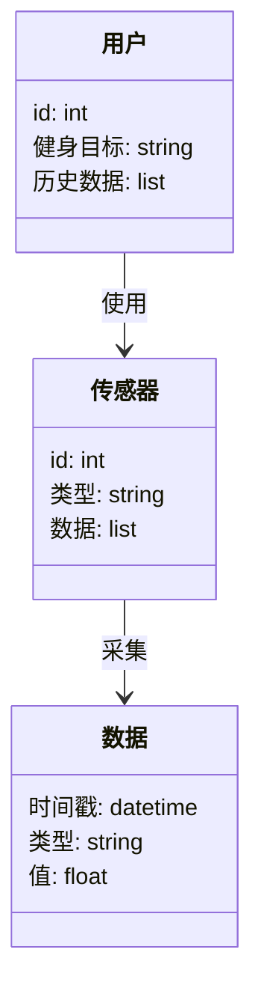
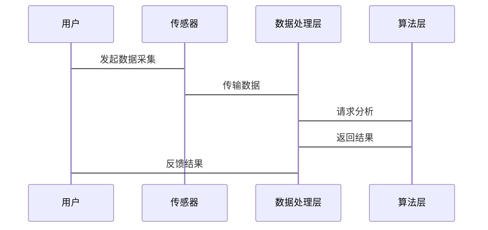

                 


```markdown
# 智能健身服：AI Agent的运动数据分析

> 关键词：智能健身服、AI Agent、运动数据分析、机器学习、传感器技术

> 摘要：本文深入探讨了智能健身服在运动数据分析中的应用，结合AI Agent技术，分析了其在健身领域的核心作用。文章从背景、原理、算法、系统架构到项目实战，全面解析了智能健身服的技术实现与应用场景，为读者提供了详尽的技术指导。

---

# 第一部分: 智能健身服与AI Agent概述

# 第1章: 智能健身服与AI Agent概述

## 1.1 智能健身服的背景与意义

### 1.1.1 传统健身方式的局限性
传统的健身方式主要依赖人工记录和主观感受，存在数据不准确、缺乏个性化指导等问题。

### 1.1.2 智能健身服的定义与特点
智能健身服是一种结合了传感器技术和AI算法的智能服装，能够实时采集并分析运动数据，为用户提供个性化的健身建议。

### 1.1.3 AI Agent在健身领域的应用价值
AI Agent能够通过数据处理和分析，为用户提供智能化的健身指导，优化运动效果。

## 1.2 运动数据分析的核心问题

### 1.2.1 运动数据的采集与处理
运动数据的采集需要高精度的传感器，数据处理则需要复杂的数据清洗和预处理步骤。

### 1.2.2 数据分析的目标与方法
数据分析的目标是提取有用的信息，用于指导用户的运动计划。

### 1.2.3 AI Agent在运动数据分析中的角色
AI Agent负责数据的处理、分析和反馈，是智能健身服的核心技术。

## 1.3 智能健身服的应用场景

### 1.3.1 专业运动员的训练优化
AI Agent可以帮助运动员优化训练计划，提高运动表现。

### 1.3.2 普通用户的健身指导
智能健身服为普通用户提供个性化的健身建议，帮助他们科学锻炼。

### 1.3.3 特殊人群的健康监测
对于康复期患者或老年人，智能健身服可以提供健康监测和风险预警。

## 1.4 本章小结
智能健身服通过AI Agent技术，能够实时采集和分析运动数据，为用户提供智能化的健身指导，具有广泛的应用场景。

---

# 第二部分: AI Agent与运动数据分析的核心概念

# 第2章: AI Agent的基本原理

## 2.1 AI Agent的定义与分类

### 2.1.1 AI Agent的定义
AI Agent是一种能够感知环境并采取行动以实现目标的智能实体。

### 2.1.2 AI Agent的分类与特点
AI Agent可以分为简单反射型、基于模型的反应型、目标驱动型和效用驱动型等。

### 2.1.3 AI Agent与传统软件的区别
AI Agent具有自主性、反应性和社会性，能够适应环境变化。

## 2.2 运动数据分析的关键技术

### 2.2.1 数据采集技术
数据采集技术包括传感器的选择与布置、数据采集的频率和精度等。

### 2.2.2 数据预处理方法
数据预处理包括数据清洗、缺失值处理、异常值处理等步骤。

### 2.2.3 数据分析算法
数据分析算法包括统计分析、机器学习算法等。

## 2.3 AI Agent在运动数据分析中的核心功能

### 2.3.1 数据采集与整合
AI Agent负责从传感器中采集数据，并将其整合到统一的数据流中。

### 2.3.2 数据分析与决策
AI Agent通过机器学习算法对数据进行分析，生成决策建议。

### 2.3.3 个性化反馈与指导
AI Agent根据分析结果，为用户提供个性化的反馈和指导。

## 2.4 本章小结
AI Agent通过数据采集、分析和反馈，为智能健身服提供了核心的技术支持。

---

# 第三部分: AI Agent的算法原理与数学模型

# 第3章: 数据采集与预处理算法

## 3.1 数据采集技术

### 3.1.1 传感器原理与类型
传感器包括加速度计、陀螺仪、心率传感器等，用于采集运动数据。

### 3.1.2 数据采集的流程
数据采集流程包括传感器部署、数据采集、数据传输等步骤。

### 3.1.3 数据采集的挑战与解决方案
数据采集面临噪声干扰、数据同步等问题，解决方案包括滤波算法和同步技术。

## 3.2 数据预处理算法

### 3.2.1 数据清洗方法
数据清洗包括去除噪声、填补缺失值、去除异常值等。

### 3.2.2 数据标准化与归一化
数据标准化通过缩放到相同的尺度，归一化通过转换到统一的范围。

### 3.2.3 时间序列数据的处理
时间序列数据处理包括平滑、差分、分解等方法。

## 3.3 数据预处理的数学模型

### 3.3.1 数据清洗的数学表达
例如，使用中位数填补缺失值：$x' = median(x)$

### 3.3.2 数据标准化的公式
标准化公式：$\frac{x - \mu}{\sigma}$

### 3.3.3 时间序列数据的处理流程
时间序列数据处理流程包括去趋势、去季节性等步骤。

## 3.4 本章小结
数据预处理是运动数据分析的基础，通过有效的预处理可以提高后续分析的准确性。

---

# 第4章: 数据分析与机器学习算法

## 4.1 数据分析的基本方法

### 4.1.1 统计分析方法
统计分析方法包括均值、方差、相关性分析等。

### 4.1.2 可视化分析
可视化分析通过图表展示数据分布和趋势。

### 4.1.3 时间序列分析
时间序列分析用于预测未来的运动趋势。

## 4.2 机器学习算法

### 4.2.1 监督学习算法
监督学习算法包括线性回归、支持向量机、随机森林等。

### 4.2.2 无监督学习算法
无监督学习算法包括聚类分析、主成分分析等。

### 4.2.3 深度学习算法
深度学习算法包括神经网络、卷积神经网络等。

## 4.3 机器学习算法的选择与应用

### 4.3.1 算法选择的原则
算法选择需要考虑数据量、计算能力、模型复杂度等因素。

### 4.3.2 机器学习算法的应用场景
监督学习适合分类问题，无监督学习适合聚类问题，深度学习适合复杂模式识别。

## 4.4 本章小结
机器学习算法是运动数据分析的核心，选择合适的算法可以提高分析的准确性。

---

# 第五部分: 系统分析与架构设计

# 第5章: 系统功能设计与架构

## 5.1 问题场景介绍
智能健身服需要实时采集运动数据，并通过AI Agent进行分析，为用户提供反馈。

## 5.2 系统功能设计

### 5.2.1 领域模型设计
领域模型包括用户、传感器、数据、算法等核心要素。



### 5.2.2 系统架构设计
系统架构包括数据采集层、数据处理层、算法层、用户界面层。


### 5.2.3 接口设计
接口设计包括传感器接口、数据接口、算法接口。

### 5.2.4 交互设计
交互设计包括用户输入、系统反馈、数据更新等。

## 5.3 系统交互设计

### 5.3.1 交互流程
用户发起请求，系统响应处理，反馈结果。

### 5.3.2 序列图


## 5.4 本章小结
系统设计是智能健身服实现的关键，通过合理的架构设计和交互设计，可以确保系统的高效运行。

---

# 第六部分: 项目实战

# 第6章: 项目实现与案例分析

## 6.1 项目实战环境安装

### 6.1.1 开发环境
需要安装Python、传感器库、机器学习库等。

### 6.1.2 数据集准备
需要准备运动数据集，包括心率、加速度等。

## 6.2 核心系统实现

### 6.2.1 传感器数据采集
使用Python代码采集传感器数据。

```python
import sensorlib

def collect_data():
    data = sensorlib.read_sensor()
    return data
```

### 6.2.2 数据预处理
对采集到的数据进行清洗和标准化处理。

```python
def preprocess(data):
    # 去除异常值
    cleaned_data = [x for x in data if x > 0]
    # 标准化
    from sklearn.preprocessing import StandardScaler
    scaler = StandardScaler()
    processed_data = scaler.fit_transform(cleaned_data)
    return processed_data
```

### 6.2.3 机器学习算法实现
实现一个分类算法，用于分析运动类型。

```python
from sklearn.tree import DecisionTreeClassifier

def train_model(data, labels):
    model = DecisionTreeClassifier()
    model.fit(data, labels)
    return model
```

### 6.2.4 系统集成与测试
将各个模块集成，进行系统测试。

## 6.3 实际案例分析

### 6.3.1 数据分析与结果解读
通过具体案例分析，展示系统的实际效果。

### 6.3.2 案例小结
总结案例分析的结果，提出改进建议。

## 6.4 本章小结
通过项目实战，验证了系统的可行性和有效性。

---

# 第七部分: 最佳实践与未来展望

# 第7章: 最佳实践与未来展望

## 7.1 小结
智能健身服通过AI Agent技术，为运动数据分析提供了新的解决方案。

## 7.2 注意事项
在实际应用中，需要注意数据隐私、传感器精度等问题。

## 7.3 拓展阅读
推荐阅读相关领域的书籍和论文，深入了解AI Agent和运动数据分析的技术细节。

## 7.4 未来展望
未来，智能健身服将更加智能化，结合更多AI技术，提供更个性化的服务。

## 7.5 本章小结
智能健身服的应用前景广阔，随着技术的发展，将有更多创新。

---

# 作者：AI天才研究院/AI Genius Institute & 禅与计算机程序设计艺术 /Zen And The Art of Computer Programming
```

