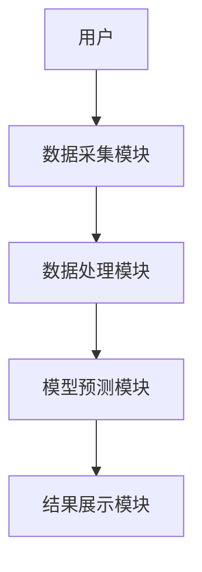
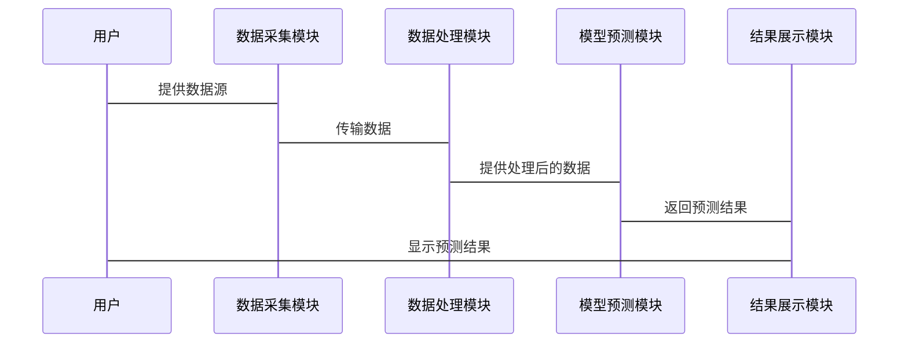

                 


# 智能养老金缺口预测与规划系统

> 关键词：养老金缺口预测，人工智能，机器学习，深度学习，系统架构设计，数据驱动

> 摘要：本文详细探讨了智能养老金缺口预测与规划系统的构建与实现。通过分析养老金缺口预测的背景与挑战，结合机器学习和深度学习算法，提出了系统化的解决方案。文章从核心算法原理到系统架构设计，再到项目实战，全面阐述了如何利用智能技术解决养老金缺口预测问题，为相关领域的从业者提供了理论与实践的双重参考。

---

## 第1章: 养老金缺口预测的背景与挑战

### 1.1 养老金缺口问题的背景

#### 1.1.1 人口老龄化与养老金压力
随着全球人口老龄化的加剧，养老金缺口问题日益严峻。传统养老金体系面临资金不足、支出增加的双重压力，如何通过智能化手段优化养老金预测与规划，成为亟待解决的问题。

#### 1.1.2 养老金缺口的定义与影响
养老金缺口是指退休人员实际需求与现有养老金支付能力之间的差距。缺口的存在可能导致退休生活质量下降，甚至引发社会问题。因此，准确预测养老金缺口并制定合理的规划方案至关重要。

#### 1.1.3 智能化预测的必要性
传统养老金预测方法依赖于简单的线性回归模型，难以应对复杂多变的经济环境。智能化预测通过引入机器学习和深度学习技术，能够更好地捕捉数据中的非线性关系，提高预测精度。

### 1.2 智能养老金预测的核心概念

#### 1.2.1 数据驱动的预测方法
数据驱动预测通过分析历史数据，挖掘潜在规律，从而实现对未来趋势的预测。在养老金缺口预测中，数据来源包括人口统计数据、经济指标、社会保障政策等。

#### 1.2.2 人工智能在养老金预测中的应用
人工智能技术，尤其是机器学习和深度学习，能够处理海量数据，提取特征，并建立复杂的预测模型。这些技术在养老金缺口预测中的应用，显著提高了预测的准确性和可靠性。

#### 1.2.3 系统化规划的重要性
养老金缺口预测不仅需要准确的模型，还需要系统的规划方案。通过系统化规划，可以制定个性化的养老金管理策略，确保退休生活的可持续性。

---

## 第2章: 智能养老金缺口预测系统的核心概念

### 2.1 系统架构与功能模块

#### 2.1.1 数据采集模块
数据采集模块负责收集与养老金缺口预测相关的数据，包括人口统计数据、经济指标、社会保障政策等。数据来源多样，需确保数据的准确性和完整性。

#### 2.1.2 数据处理模块
数据处理模块对采集到的数据进行清洗、转换和特征提取。通过数据预处理，可以消除噪声，提取有用的特征，为后续预测提供高质量的数据支持。

#### 2.1.3 模型预测模块
模型预测模块是系统的核心，负责利用训练好的模型对养老金缺口进行预测。常用的算法包括线性回归、随机森林、LSTM等。

#### 2.1.4 结果展示模块
结果展示模块将预测结果以可视化的方式呈现给用户，便于理解和决策。可视化方式包括图表、仪表盘等。

### 2.2 核心算法与技术

#### 2.2.1 机器学习算法
- **线性回归**：用于简单的线性关系预测。
- **随机森林**：通过集成学习提高预测准确性。
- **支持向量机（SVM）**：适用于非线性关系的分类与回归。

#### 2.2.2 深度学习算法
- **神经网络**：通过多层神经网络提取数据特征。
- **LSTM**：适用于时间序列数据的预测。
- **Transformer**：在处理长序列数据时表现优异。

#### 2.2.3 时间序列分析
- **ARIMA**：经典的时间序列预测模型。
- **Prophet**：Facebook开源的时间序列预测工具。

### 2.3 数据来源与特征分析

#### 2.3.1 数据来源的多样性
数据来源包括政府统计数据、金融市场数据、社会保障政策文件等。多样化的数据来源能够提高预测的准确性。

#### 2.3.2 数据特征的提取与选择
通过特征工程，提取与养老金缺口相关的特征，如人口年龄分布、经济增长率、通货膨胀率等。特征选择是提高模型性能的关键步骤。

#### 2.3.3 数据预处理方法
常用的数据预处理方法包括数据清洗、标准化、缺失值处理等。预处理步骤能够提高数据质量，确保模型训练的有效性。

### 2.4 系统边界与外延

#### 2.4.1 系统的输入与输出
系统的输入包括历史数据、当前经济指标等，输出是养老金缺口预测结果及规划建议。

#### 2.4.2 系统的适用范围与限制
系统适用于个人和机构的养老金缺口预测，但受限于数据质量和模型的泛化能力，预测结果仅供参考。

#### 2.4.3 系统的扩展性与可维护性
系统设计应具备良好的扩展性和可维护性，方便后续功能的添加和模型的更新。

---

## 第3章: 智能养老金预测的核心算法原理

### 3.1 机器学习算法原理

#### 3.1.1 线性回归模型
线性回归是一种简单但有效的回归模型，适用于线性关系的预测。其数学模型为：
$$ y = \beta_0 + \beta_1x + \epsilon $$
其中，$\beta_0$和$\beta_1$是回归系数，$\epsilon$是误差项。

#### 3.1.2 随机森林
随机森林是一种基于决策树的集成学习方法。通过构建多棵决策树并进行投票或平均，随机森林能够显著提高预测的准确性和鲁棒性。

#### 3.1.3 支持向量机（SVM）
SVM通过在特征空间中寻找最优超平面，将数据分为两类。对于非线性可分的数据，SVM可以通过核函数映射到高维空间。

### 3.2 深度学习算法原理

#### 3.2.1 神经网络基础
神经网络由多个神经元组成，通过多层结构能够提取复杂的特征。典型的神经网络结构包括卷积层、池化层、全连接层等。

#### 3.2.2 长短期记忆网络（LSTM）
LSTM是一种特殊的RNN，通过门控机制能够有效处理长序列数据。其核心组件包括输入门、遗忘门和输出门。

#### 3.2.3 Transformer模型
Transformer基于自注意力机制，通过并行计算提高效率。其核心思想是将序列中的每个位置与其他位置进行注意力计算。

### 3.3 时间序列预测算法

#### 3.3.1 ARIMA模型
ARIMA（自回归积分滑动平均模型）是一种常用的时间序列预测模型。其数学模型为：
$$ ARIMA(p, d, q) $$
其中，$p$是自回归阶数，$d$是差分阶数，$q$是滑动平均阶数。

#### 3.3.2 Prophet模型
Prophet由Facebook开源，适用于非 stationary 的时间序列数据。其模型主要包括趋势、周期性和节假日效应。

### 3.4 算法对比与选择

#### 3.4.1 不同算法的优缺点对比
| 算法 | 优点 | 缺点 |
|------|------|------|
| 线性回归 | 简单，易解释 | 仅适用于线性关系 |
| 随机森林 | 高准确性，鲁棒性好 | 需要大量计算资源 |
| LSTM | 适合长序列数据 | 训练时间长 |
| Prophet | 易用，适合业务人员 | 对异常值敏感 |

#### 3.4.2 数据特征对算法选择的影响
数据特征的类型和分布会影响算法的选择。例如，时间序列数据更适合使用LSTM或Prophet模型。

#### 3.4.3 算法选择的步骤
1. 理解业务需求和数据特征。
2. 选择合适的算法进行实验。
3. 对比不同算法的性能，选择最优模型。

---

## 第4章: 智能养老金缺口预测系统的实现

### 4.1 系统架构设计

#### 4.1.1 系统功能模块
- 数据采集模块
- 数据处理模块
- 模型预测模块
- 结果展示模块

#### 4.1.2 系统架构图


### 4.2 系统接口设计

#### 4.2.1 数据接口
- 数据输入接口：接收外部数据源的数据。
- 数据输出接口：将处理后的数据输出到模型预测模块。

#### 4.2.2 模型接口
- 模型训练接口：对模型进行训练。
- 模型预测接口：利用训练好的模型进行预测。

### 4.3 系统交互流程



---

## 第5章: 项目实战

### 5.1 环境搭建

#### 5.1.1 安装Python
```bash
python --version
pip install numpy
pip install scikit-learn
pip install prophet
```

#### 5.1.2 安装Jupyter Notebook
```bash
pip install jupyter
jupyter notebook
```

### 5.2 系统核心实现

#### 5.2.1 数据采集与处理
```python
import pandas as pd
data = pd.read_csv('pension.csv')
data.head()
```

#### 5.2.2 特征工程
```python
from sklearn.preprocessing import StandardScaler
scaler = StandardScaler()
data_scaled = scaler.fit_transform(data)
```

#### 5.2.3 模型训练与预测
```python
from sklearn.ensemble import RandomForestRegressor
model = RandomForestRegressor()
model.fit(data_scaled, target)
```

#### 5.2.4 结果展示
```python
import matplotlib.pyplot as plt
plt.plot(predicted_values, label='预测值')
plt.plot(actual_values, label='实际值')
plt.legend()
plt.show()
```

### 5.3 实际案例分析

#### 5.3.1 数据准备
假设我们有如下数据：
| 年龄 | 收入 | 养老金支出 |
|------|------|------------|
| 60   | 5000 | 3000       |
| 61   | 5500 | 3200       |
| 62   | 6000 | 3400       |

#### 5.3.2 模型训练
```python
X = data[['年龄', '收入']]
y = data['养老金支出']
model.fit(X, y)
```

#### 5.3.3 预测结果
```python
model.predict([[63, 6500]])
```

### 5.4 项目小结

---

## 第6章: 最佳实践与未来展望

### 6.1 小结
智能养老金缺口预测系统通过机器学习和深度学习技术，显著提高了预测的准确性和效率。系统设计注重模块化和可扩展性，便于后续功能的添加和优化。

### 6.2 注意事项
- 数据质量对预测结果影响重大，需重视数据清洗和特征工程。
- 模型的选择应结合业务需求和数据特征，避免盲目追求复杂模型。
- 系统的部署和维护需要专业的技术团队支持。

### 6.3 未来展望
未来，随着人工智能技术的不断发展，养老金缺口预测系统将更加智能化和个性化。结合区块链技术，可以实现养老金的透明管理和智能分配。

---

## 附录

### 附录A: 数据集
提供数据集的详细信息和获取方式。

### 附录B: 工具库
列出本文中使用到的工具库及其版本。

### 附录C: 参考文献
提供本文中引用的文献和资料。

### 附录D: 术语表
解释文中出现的专业术语。

---

## 作者

作者：AI天才研究院/AI Genius Institute & 禅与计算机程序设计艺术 /Zen And The Art of Computer Programming

