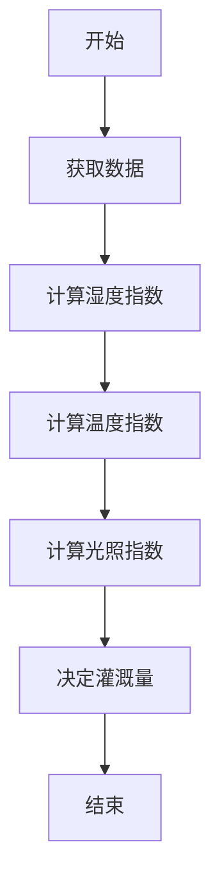
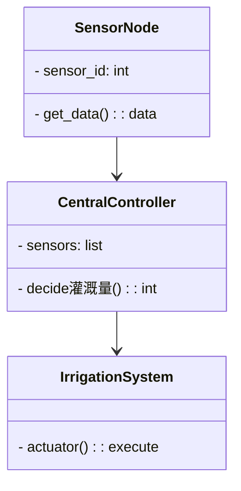

                 


# 智能农业：AI Agent控制的精准灌溉系统

## 关键词：
智能农业, AI Agent, 精准灌溉, 人工智能, 农业技术, 自动控制系统, 数学模型

## 摘要：
本文详细介绍AI Agent在精准灌溉系统中的应用，从背景到实现，涵盖核心技术、算法原理、系统架构和项目实战，旨在帮助读者掌握如何利用AI技术优化农业灌溉。

---

# 第1章 智能农业与精准灌溉概述

## 1.1 智能农业的背景与发展趋势
### 1.1.1 农业现代化的背景
传统农业面临资源浪费和效率低下问题，智能农业通过技术手段提升生产效率和可持续性。

### 1.1.2 智能农业的核心概念
智能农业利用AI、物联网等技术，实现农业过程的智能化管理。

### 1.1.3 精准灌溉的重要性
精准灌溉通过优化水资源利用，减少浪费，提高作物产量。

## 1.2 AI Agent在农业中的应用
### 1.2.1 AI Agent的定义与特点
AI Agent是能够感知环境、自主决策并执行任务的智能体。

### 1.2.2 AI Agent在农业中的应用场景
AI Agent用于环境监测、作物管理、资源优化等领域。

## 1.3 精准灌溉系统的总体框架
### 1.3.1 系统目标
实现对灌溉的精准控制，提高水资源利用率。

### 1.3.2 系统组成部分
包括传感器、数据采集、AI决策、执行机构和用户界面。

### 1.3.3 实现流程
数据采集、处理、决策、执行。

---

# 第2章 AI Agent的基本原理

## 2.1 AI Agent的定义与分类
### 2.1.1 定义
AI Agent是具备感知、决策和执行能力的智能体。

### 2.1.2 分类
基于智能水平分为基于规则、机器学习和深度学习的AI Agent。

## 2.2 AI Agent的核心算法
### 2.2.1 基于规则的AI Agent
通过预设规则进行决策，适用于简单场景。

### 2.2.2 基于机器学习的AI Agent
利用数据训练模型，适应复杂环境。

### 2.2.3 基于深度学习的AI Agent
使用深度神经网络进行复杂决策。

## 2.3 AI Agent在精准灌溉中的应用
### 2.3.1 AI Agent的基本功能
数据处理、决策支持、执行控制。

### 2.3.2 AI Agent与传统自动控制系统的区别
AI Agent具备自主学习和适应能力，而传统系统依赖预设规则。

---

# 第3章 精准灌溉的核心技术

## 3.1 土壤湿度监测技术
### 3.1.1 传感器原理
土壤湿度传感器测量土壤中的水分含量。

### 3.1.2 数据采集与传输
传感器采集数据并传输到中央控制系统。

## 3.2 气象数据采集技术
### 3.2.1 气象传感器
温度、湿度、光照强度等参数的测量。

### 3.2.2 数据分析
结合气象数据优化灌溉策略。

## 3.3 传感器网络
### 3.3.1 网络架构
传感器节点、网关和中央服务器的结构。

### 3.3.2 数据融合技术
多源数据的整合与处理。

---

# 第4章 系统的数学模型与算法实现

## 4.1 模糊控制算法
### 4.1.1 算法原理
根据土壤湿度和气象数据，模糊逻辑控制灌溉量。

### 4.1.2 数学模型
$$
\text{灌溉量} = f(\text{湿度}, \text{温度}, \text{光照})
$$

## 4.2 算法实现
### 4.2.1 代码示例
```python
def fuzzy_control(humidity, temperature, light):
    # 模糊逻辑处理
    pass
```

### 4.2.2 流程图


---

# 第5章 系统架构设计

## 5.1 系统模块划分
### 5.1.1 数据采集模块
负责收集土壤湿度、气象数据。

### 5.1.2 AI Agent决策模块
处理数据并生成灌溉指令。

## 5.2 系统架构图


---

# 第6章 项目实战

## 6.1 环境搭建
### 6.1.1 硬件设备
土壤湿度传感器、气象传感器、 irrigation控制器。

### 6.1.2 软件环境
Python、机器学习库、物联网平台。

## 6.2 核心代码实现
### 6.2.1 传感器数据采集
```python
import serial

ser = serial.Serial('COM3', 9600)
data = ser.readline().decode().strip()
```

### 6.2.2 AI Agent决策
```python
from sklearn import tree

model = tree.DecisionTreeClassifier()
model.fit(features, labels)
prediction = model.predict(new_data)
```

## 6.3 系统测试
### 6.3.1 测试用例设计
不同湿度、温度下的灌溉量测试。

### 6.3.2 测试结果分析
系统准确性和稳定性评估。

---

# 第7章 总结与展望

## 7.1 总结
AI Agent在精准灌溉中的应用显著提升了效率和节水效果。

## 7.2 未来展望
AI Agent的自我学习能力，多因素优化，数据安全优化。

---

# 作者：AI天才研究院 & 禅与计算机程序设计艺术

---

这本书通过系统地介绍AI Agent在精准灌溉中的应用，从理论到实践，为读者提供了丰富的知识和实用的指导。

