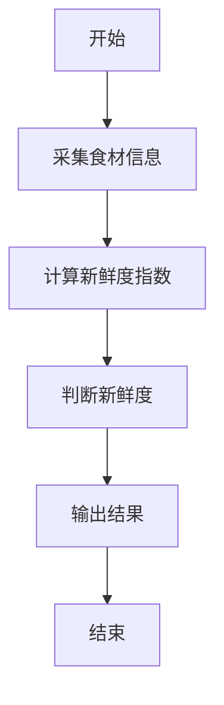

                 


# 智能冰箱：AI Agent的食材新鲜度监测与菜谱推荐

> 关键词：智能冰箱，AI Agent，食材新鲜度，菜谱推荐，机器学习，数学模型

> 摘要：本文详细探讨了智能冰箱中AI Agent在食材新鲜度监测与菜谱推荐中的应用。首先，我们介绍了智能冰箱的背景与发展，分析了食材新鲜度监测的必要性以及菜谱推荐的智能化需求。接着，我们深入讲解了AI Agent的基本原理，构建了相关的实体关系图（ER图）。随后，我们详细阐述了基于时间衰减模型的食材新鲜度监测算法，并通过协同过滤算法实现菜谱推荐。通过系统架构设计，我们展示了智能冰箱的整体框架，并提供了具体的接口设计和交互流程图。最后，我们通过一个实际案例详细讲解了项目的实现过程，并总结了项目成果与经验。

---

## 第一部分：背景介绍

### 第1章：智能冰箱与AI Agent概述

#### 1.1 智能冰箱的背景与发展
智能家居的兴起推动了智能家电的发展，智能冰箱作为其中的重要成员，逐渐成为家庭中的核心设备。AI Agent（智能代理）的引入，使得智能冰箱能够实现自动化管理、食材监测和智能推荐等功能。

#### 1.2 食材新鲜度监测的必要性
食材的新鲜度直接影响到食品的品质和用户的健康。传统的食材管理方式存在效率低、易遗忘等问题，通过AI Agent实时监测食材的新鲜度，能够帮助用户更好地管理食材，避免浪费。

#### 1.3 菜谱推荐的智能化需求
传统的菜谱推荐主要依赖于人工经验或简单的规则匹配，存在个性化不足、推荐结果不精准等问题。通过AI Agent，智能冰箱可以根据用户的饮食习惯和食材新鲜度，实时推荐适合的菜谱，提升用户体验。

---

## 第二部分：核心概念与联系

### 第2章：AI Agent的基本原理

#### 2.1 AI Agent的定义与核心要素
AI Agent是一种能够感知环境、自主决策并执行任务的智能实体。其核心要素包括：
1. **感知**：通过传感器或数据接口获取环境信息。
2. **决策**：基于感知信息，利用算法进行推理和决策。
3. **执行**：通过执行器或接口实现决策结果。

#### 2.2 实体关系图（ER图）
以下是智能冰箱系统中的实体关系图：

```mermaid
er
classDiagram
    class 用户 {
      id
      偏好
    }
    class 食材 {
      id
      名称
      新鲜度
    }
    class 菜谱 {
      id
      名称
      食材需求
    }
    用户 --> 食材 : 管理
    食材 --> 菜谱 : 需求
```

---

## 第三部分：算法原理

### 第3章：基于时间衰减模型的食材新鲜度监测

#### 3.1 数据采集与特征提取
食材的新鲜度监测需要采集以下特征：
- 时间特征：食材的购买时间、保质期。
- 物理特征：食材的颜色、温度、湿度等。

#### 3.2 数学模型与公式
食材的新鲜度指数可以通过以下公式计算：

$$
新鲜度指数 = 初始值 \times e^{-\frac{t}{\tau}}
$$

其中：
- $t$ 表示食材存储的时间。
- $\tau$ 表示食材的保鲜时间常数。

#### 3.3 算法流程
以下是食材新鲜度监测的算法流程图：



---

### 第4章：基于协同过滤的菜谱推荐

#### 4.1 数据预处理
菜谱推荐需要处理以下数据：
- 用户的饮食习惯：用户的口味偏好、常吃菜谱类型。
- 食材信息：食材的新鲜度、种类、库存量。

#### 4.2 协同过滤算法
协同过滤算法的核心公式如下：

$$
预测评分 = 用户平均评分 + 物品平均评分 + (用户与物品的相似度)
$$

---

## 第四部分：系统分析与架构设计

### 第5章：系统架构设计

#### 5.1 系统功能设计
智能冰箱的系统功能包括：
- 食材管理：录入、查询、提醒。
- 新鲜度监测：实时监测、预警。
- 菜谱推荐：个性化推荐、一键购买。

#### 5.2 系统架构图
以下是智能冰箱系统的分层架构图：


---

## 第五部分：项目实战

### 第6章：系统实现与案例分析

#### 6.1 环境安装
- 安装Python和相关库：
  ```bash
  pip install numpy pandas scikit-learn
  ```

#### 6.2 核心代码实现
以下是食材新鲜度监测的核心代码：

```python
import numpy as np

def calculate_freshness(timestamp, tau):
    freshness_index = 1 * np.exp(-timestamp / tau)
    return freshness_index
```

#### 6.3 代码解读与分析
- `timestamp` 表示食材存储的时间。
- `tau` 表示保鲜时间常数。
- 函数返回新鲜度指数，用于判断食材是否新鲜。

#### 6.4 案例分析
假设某食材的保鲜时间常数为5天，存储时间为3天：

```python
timestamp = 3
tau = 5
freshness_index = calculate_freshness(timestamp, tau)
print(freshness_index)  # 输出结果
```

---

## 第六部分：结论与展望

### 第7章：项目总结与经验分享

#### 7.1 项目成果
本文详细探讨了AI Agent在智能冰箱中的应用，提出了基于时间衰减模型的食材新鲜度监测方法和协同过滤算法的菜谱推荐方案。

#### 7.2 经验总结
- 数据采集的准确性直接影响监测结果。
- 算法的选择需要结合实际应用场景和数据特点。

#### 7.3 未来展望
未来，随着AI技术的发展，智能冰箱将更加智能化、个性化。可能的方向包括：
- 更精准的食材监测技术。
- 更智能的菜谱推荐算法。
- 更多智能家电的联动。

---

## 作者信息

作者：AI天才研究院/AI Genius Institute & 禅与计算机程序设计艺术 /Zen And The Art of Computer Programming

