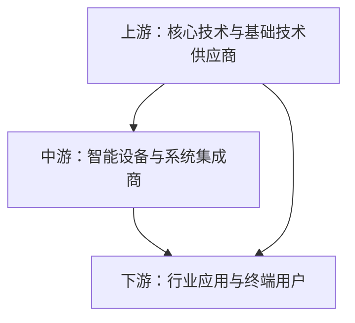

                 

# 《智能制造趋势下的产业链投资分析》

---

## 关键词：智能制造，产业链，投资分析，工业互联网，人工智能，大数据，物联网

---

## 摘要：  
智能制造作为第四次工业革命的核心驱动力，正在重塑全球制造业的格局。本文从智能制造的定义、发展趋势、产业链结构、核心技术与应用、投资机会与风险等方面进行深入分析，结合实际案例，为投资者提供系统的投资分析框架和决策建议。文章通过技术与商业的双重视角，探讨智能制造产业链的投资价值与风险，并总结了最佳投资策略和注意事项。

---

## 第一章：智能制造的定义与发展趋势

### 1.1 智能制造的定义与核心概念

智能制造是一种通过数字化、网络化、智能化技术，实现制造过程的全生命周期优化与管理的先进制造模式。其核心在于将传统制造业与新兴技术（如人工智能、大数据、物联网等）深度融合，提升生产效率、降低成本、提高产品质量和灵活性。

#### 核心概念对比表

| **核心概念**       | **定义**                                                                 |
|---------------------|--------------------------------------------------------------------------|
| 数字化制造         | 利用数字技术对产品设计、生产、管理等环节进行数字化改造。                     |
| 智能化制造         | 在数字化制造的基础上，引入人工智能、机器学习等技术，实现自主决策与优化。   |
| 工业4.0             | 德国提出的以智能制造为核心的第四次工业革命，强调智能化、网络化和个性化生产。 |

---

### 1.2 智能制造的驱动因素

智能制造的发展受到多种因素的驱动：

#### 技术驱动  
- **人工智能（AI）**：用于优化生产流程、预测维护和质量控制。  
- **大数据技术**：通过海量数据的分析，实现精准决策。  
- **物联网（IoT）**：实现设备与系统的互联互通，实时监控生产状态。  

#### 市场驱动  
- 消费者需求的变化推动制造业向个性化、定制化方向发展。  
- 竞争加剧促使企业不断提高效率和创新能力。  

#### 政策驱动  
- 各国政府通过政策支持和资金投入，推动智能制造技术的研发与应用。  

---

### 1.3 智能制造的全球发展趋势

#### 1.3.1 全球智能制造市场的现状与规模  
根据市场研究机构的数据，2022年全球智能制造市场规模已超过3000亿美元，预计到2030年将突破1万亿美元。中国、德国、美国是智能制造的主要市场，其中中国市场的年增长率超过20%。

#### 1.3.2 主要国家的智能制造发展现状  
- **中国**：政府提出“制造强国”战略，推动“互联网+制造”和“工业互联网”发展。  
- **德国**：以工业4.0为代表，强调智能化、数字化和网络化的制造体系。  
- **美国**：依托强大的技术实力，重点发展人工智能和机器人技术。  

#### 1.3.3 未来智能制造的发展趋势与预测  
- **技术融合**：人工智能、大数据、物联网等技术的深度融合将推动智能制造向更高层次发展。  
- **绿色制造**：智能制造将与可持续发展紧密结合，推动绿色生产。  
- **个性化制造**：通过灵活的生产系统满足消费者的个性化需求。  

---

## 第二章：智能制造产业链的结构与分工

### 2.1 智能制造产业链的构成

智能制造产业链可以分为三个主要部分：

#### 2.1.1 上游：核心技术与基础技术供应商  
- 提供芯片、传感器、工业软件等基础技术产品。  
- 例如：芯片供应商（如英特尔、英伟达）、工业软件供应商（如西门子、PTC）。  

#### 2.1.2 中游：智能设备与系统集成商  
- 包括工业机器人、自动化设备、工业互联网平台等。  
- 例如：机器人制造商（如ABB、发那科）、工业互联网平台（如通用电气的Predix）。  

#### 2.1.3 下游：行业应用与终端用户  
- 包括汽车、电子、化工等行业的制造企业。  
- 例如：汽车制造商（如特斯拉、宝马）通过智能制造实现智能化生产。  

#### 产业链分工关系图（Mermaid）

---

### 2.2 产业链的关键环节分析

#### 2.2.1 工业互联网平台  
工业互联网平台是连接设备、数据、应用的桥梁，通过整合资源实现智能制造的协同优化。  

#### 2.2.2 工业自动化与机器人  
工业自动化技术（如PLC、SCADA）和机器人技术是智能制造的基础，广泛应用于生产过程的各个环节。  

#### 2.2.3 大数据与人工智能技术  
通过大数据分析和人工智能算法，实现生产过程的智能化决策与优化。  

---

### 2.3 产业链的协同与整合

#### 2.3.1 产业链协同的重要性  
智能制造的实现需要产业链上下游的协同合作，尤其是在数据共享、技术集成和业务流程对接方面。  

#### 2.3.2 产业链整合的策略与案例  
- **技术整合**：通过收购或合作，整合上游的核心技术。  
- **业务整合**：通过合作或联盟，实现产业链上下游的协同。  

---

## 第三章：智能制造产业链的核心技术与应用

### 3.1 工业互联网与物联网技术

#### 3.1.1 工业互联网的定义与特点  
工业互联网是通过人、设备、产品、服务的全面互联，实现制造系统的智能化和高效化。  

#### 3.1.2 物联网在智能制造中的应用  
- 设备监控与预测维护  
- 实时数据采集与分析  
- 智能物流与供应链管理  

---

### 3.2 人工智能与大数据技术

#### 3.2.1 人工智能在智能制造中的应用  
- 智能质量检测：通过图像识别技术检测产品质量。  
- 智能调度：基于机器学习算法优化生产计划。  

#### 3.2.2 大数据技术在智能制造中的应用  
- 数据分析与预测：通过大数据分析预测市场需求和生产风险。  
- 供应链优化：基于数据驱动的决策优化供应链管理。  

#### 3.2.3 人工智能与大数据的融合应用  
- 智能诊断：结合AI和大数据技术，实现设备故障的精准诊断。  
- 智能预测：通过数据建模预测生产过程中的潜在问题。  

---

### 3.3 数字化与智能化的融合

#### 3.3.1 数字化转型的必要性  
- 提高生产效率  
- 降低运营成本  
- 提升企业竞争力  

#### 3.3.2 智能化升级的实现路径  
- 引入AI和大数据技术  
- 构建工业互联网平台  
- 优化生产流程  

---

## 第四章：智能制造产业链的投资机会与风险

### 4.1 智能制造产业链的投资机会

#### 4.1.1 工业自动化与机器人领域的投资机会  
- 工业机器人市场增长迅速，尤其是在汽车和电子制造领域。  

#### 4.1.2 工业互联网与物联网领域的投资机会  
- 工业互联网平台的市场潜力巨大，尤其是在数据驱动的制造业中。  

#### 4.1.3 人工智能与大数据领域的投资机会  
- AI技术在智能制造中的应用广泛，尤其是在质量检测和生产优化方面。  

---

### 4.2 智能制造产业链的投资风险

#### 4.2.1 技术风险  
- 技术更新速度快，存在技术替代的风险。  

#### 4.2.2 市场风险  
- 市场需求波动大，存在竞争加剧的风险。  

#### 4.2.3 政策风险  
- 政策变化可能对行业产生重大影响，尤其是在数据隐私和网络安全方面。  

---

### 4.3 投资策略与风险管理

#### 4.3.1 投资策略的制定与优化  
- 关注技术领先的企业  
- 选择具有强大研发能力和市场竞争力的公司  

#### 4.3.2 风险管理的要点与方法  
- 建立风险评估机制  
- 制定应急预案  

---

## 第五章：智能制造产业链的投资分析与决策

### 5.1 投资分析的基本框架

#### 5.1.1 投资分析的定义与目标  
- 投资分析是通过系统的方法，评估投资项目的价值和风险，从而做出科学的投资决策。  

#### 5.1.2 投资分析的流程与方法  
1. **确定投资目标**：明确投资方向和目标。  
2. **收集信息**：通过市场调研和数据分析，获取相关信息。  
3. **评估项目价值**：通过财务分析、技术评估等方法，评估项目的可行性。  
4. **制定投资策略**：根据评估结果，制定投资策略。  

---

### 5.2 投资决策的逻辑与步骤

#### 5.2.1 投资目标的设定  
- 确定投资目标，例如：追求高回报、低风险等。  

#### 5.2.2 投资项目的筛选与评估  
- 通过财务指标（如净现值、内部收益率）和技术可行性评估，筛选出优质项目。  

#### 5.2.3 投资决策的最终确定  
- 根据评估结果和风险承受能力，最终确定是否投资。  

---

### 5.3 投资分析的案例与实践

#### 5.3.1 某工业自动化企业的投资分析  
- 以某工业自动化企业为例，分析其市场地位、财务状况、技术优势和竞争环境。  

#### 5.3.2 某工业互联网平台的投资分析  
- 以某工业互联网平台为例，分析其商业模式、市场前景和潜在风险。  

---

## 总结与展望

智能制造作为第四次工业革命的核心，正在深刻改变全球制造业的格局。通过本文的分析，我们可以看到，智能制造产业链的投资机会与风险并存，投资者需要结合技术趋势、市场需求和政策环境，制定科学的投资策略。未来，随着技术的不断进步和产业的深度融合，智能制造将为投资者带来更多的机会。

---

## 作者：AI天才研究院/AI Genius Institute & 禅与计算机程序设计艺术 /Zen And The Art of Computer Programming

---

* 如果您觉得这篇文章对您有帮助，欢迎分享与收藏。更多深度技术内容，请关注我们的技术博客：[点击此处](#)

