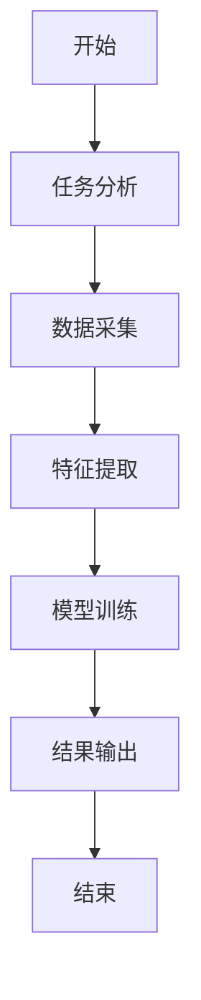
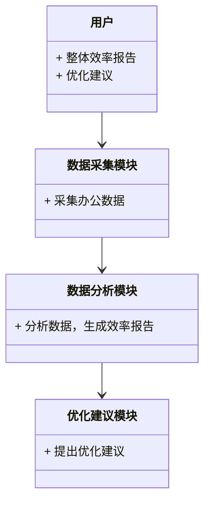
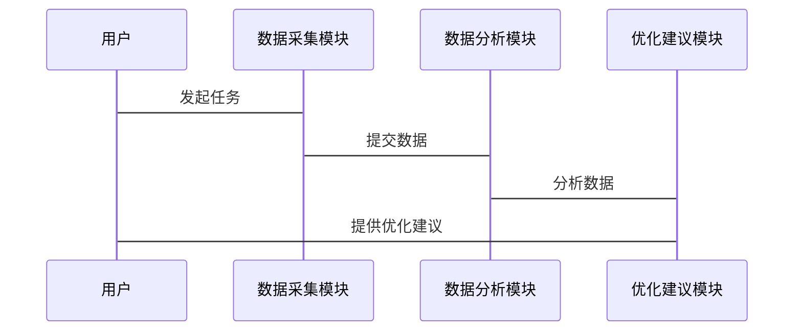

                 


# 智能办公文具：AI Agent的工作效率追踪

> 关键词：AI Agent，工作效率追踪，智能办公文具，办公效率，人工智能，算法原理

> 摘要：随着人工智能技术的快速发展，AI Agent在办公场景中的应用越来越广泛。本文将深入探讨AI Agent如何通过智能办公文具实现工作效率追踪，并分析其核心概念、算法原理、系统架构及实际应用场景。文章将从背景介绍、核心概念、算法原理、系统设计、项目实战、最佳实践等多个维度展开，帮助读者全面理解AI Agent在工作效率追踪中的重要作用和实现方式。

---

# 第1章: 智能办公文具与AI Agent的背景介绍

## 1.1 问题背景与问题描述

### 1.1.1 办公效率低下问题的现状
现代办公环境中，员工面临诸多效率问题，如任务分散、时间管理不善、信息处理复杂等。这些问题导致员工工作效率低下，企业资源浪费。

### 1.1.2 AI技术在办公场景中的应用潜力
人工智能技术的快速发展为办公效率提升提供了新的可能性。AI Agent（人工智能代理）可以通过自动化处理、智能推荐、实时反馈等方式，帮助员工优化工作流程。

### 1.1.3 AI Agent在工作效率追踪中的作用
AI Agent可以通过数据采集、分析和反馈，实时追踪员工的工作效率，识别瓶颈并提出改进建议，从而提升整体办公效率。

## 1.2 智能办公文具的核心概念

### 1.2.1 智能办公文具的定义与特点
智能办公文具是指集成AI技术的办公工具，能够通过传感器、OCR识别、语音交互等方式采集办公数据，并利用AI算法进行分析和优化。

### 1.2.2 AI Agent的基本原理
AI Agent是一种智能体，能够感知环境、执行任务并根据反馈优化行为。在办公场景中，AI Agent通过数据采集、分析和决策，帮助员工完成任务并提升效率。

### 1.2.3 工作效率追踪的实现方式
通过AI Agent采集员工的工作数据，如任务完成时间、任务量、注意力集中度等，结合算法模型进行分析，生成效率报告并提出改进建议。

## 1.3 问题解决与边界定义

### 1.3.1 AI Agent如何提升办公效率
AI Agent通过自动化处理、智能推荐和实时反馈，帮助员工减少重复性工作，优化时间管理，提升工作效率。

### 1.3.2 工作效率追踪的边界与外延
AI Agent的工作效率追踪应以不影响员工正常工作为前提，数据采集需遵循隐私保护原则，且追踪范围应聚焦于工作相关的任务和行为。

### 1.3.3 核心要素与组成结构
AI Agent的工作效率追踪系统由数据采集模块、数据分析模块、反馈模块三部分组成，分别负责数据采集、分析和反馈。

## 1.4 本章小结
本章介绍了智能办公文具和AI Agent的基本概念，分析了AI Agent在工作效率追踪中的作用，并明确了系统的边界和核心要素。

---

# 第2章: AI Agent的核心概念原理

## 2.1 核心概念原理分析

### 2.1.1 AI Agent的基本原理
AI Agent通过感知环境、执行任务和优化行为，帮助用户完成目标。在办公场景中，AI Agent可以自动处理邮件、安排日程、优化任务分配。

### 2.1.2 智能办公文具的功能模块
智能办公文具通常包含数据采集模块、数据处理模块、算法分析模块和用户交互模块，各模块协同工作以实现效率追踪。

### 2.1.3 工作效率追踪的实现机制
AI Agent通过采集员工的行为数据、任务数据和环境数据，结合机器学习算法进行分析，生成效率报告并提出改进建议。

## 2.2 核心概念属性特征对比

| 特性         | AI Agent             | 智能办公文具           |
|--------------|----------------------|-----------------------|
| 核心功能     | 自动化处理、智能推荐 | 数据采集、分析与反馈 |
| 输入方式     | 用户指令、环境数据 | 文本、语音、传感器数据 |
| 输出方式     | 动作、反馈、建议     | 报告、提醒、优化方案 |

### 2.2.3 ER实体关系图架构

```mermaid
er
  actor: 用户
  agent: AI Agent
  task: 任务
  efficiency: 效率数据
  document: 文档
  relation-1: 用户 -> 使用 AI Agent
  relation-2: AI Agent -> 监测任务
  relation-3: 任务 -> 生成效率数据
  relation-4: 效率数据 -> 分析生成报告
```

## 2.4 本章小结
本章详细分析了AI Agent的核心概念和原理，并通过对比和ER图展示了智能办公文具与AI Agent的关系。

---

# 第3章: AI Agent的算法原理

## 3.1 算法原理概述

### 3.1.1 基于自然语言处理的办公场景分析
AI Agent通过自然语言处理技术分析邮件、文档等文本数据，提取关键信息并生成摘要或提醒。

### 3.1.2 基于强化学习的任务优化算法
强化学习算法通过不断试错优化任务分配策略，帮助员工在有限时间内完成更多高价值任务。

### 3.1.3 基于监督学习的效率预测模型
监督学习算法通过历史数据训练模型，预测员工在特定任务中的效率，从而优化任务分配。

## 3.2 算法流程图



## 3.3 算法实现代码

```python
def efficiency_prediction():
    import numpy as np
    import pandas as pd
    from sklearn.model_selection import train_test_split
    from sklearn.linear_model import LinearRegression

    # 假设我们有一个包含任务特征和效率标签的数据集
    data = pd.DataFrame({
        '任务特征': [1, 2, 3, 4, 5],
        '效率标签': [0.8, 0.9, 0.7, 0.6, 0.9]
    })

    # 数据分割
    X = data[['任务特征']]
    y = data['效率标签']
    X_train, X_test, y_train, y_test = train_test_split(X, y, test_size=0.2)

    # 模型训练
    model = LinearRegression()
    model.fit(X_train, y_train)

    # 预测
    predictions = model.predict(X_test)

    return predictions
```

## 3.4 算法的数学模型和公式

### 3.4.1 监督学习模型
$$ y = \beta_0 + \beta_1x + \epsilon $$

其中，$y$ 是目标变量（效率），$x$ 是自变量（任务特征），$\beta_0$ 和 $\beta_1$ 是模型参数，$\epsilon$ 是误差项。

### 3.4.2 强化学习模型
$$ Q(s, a) = Q(s, a) + \alpha (r + \gamma V(s') - Q(s, a)) $$

其中，$s$ 是状态，$a$ 是动作，$r$ 是奖励，$V(s')$ 是下一个状态的值，$\alpha$ 是学习率，$\gamma$ 是折扣因子。

---

# 第4章: 系统分析与架构设计方案

## 4.1 问题场景介绍

### 4.1.1 项目介绍
本项目旨在开发一个基于AI Agent的智能办公文具系统，实现对员工工作效率的实时追踪和优化。

### 4.1.2 系统功能设计
- 数据采集：通过传感器、OCR、语音识别等技术采集办公数据。
- 数据分析：利用机器学习算法分析数据，生成效率报告。
- 优化建议：根据分析结果，提出任务优化建议。

## 4.2 系统架构设计

### 4.2.1 领域模型（Mermaid 类图）



### 4.2.2 系统架构图（Mermaid 架构图）

```mermaid
archi
    客户端 --> 数据采集模块
    数据采集模块 --> 数据存储模块
    数据存储模块 --> 数据分析模块
    数据分析模块 --> 优化建议模块
    优化建议模块 --> 客户端
```

### 4.2.3 系统交互设计（Mermaid 序列图）



---

# 第5章: 项目实战

## 5.1 环境安装与配置

### 5.1.1 开发环境
- Python 3.8+
- Jupyter Notebook
- 必要的Python库：numpy, pandas, scikit-learn

### 5.1.2 安装步骤
```bash
pip install numpy pandas scikit-learn mermaid
```

## 5.2 系统核心实现源代码

```python
import numpy as np
import pandas as pd
from sklearn.linear_model import LinearRegression
from sklearn.metrics import mean_squared_error

# 数据准备
data = pd.DataFrame({
    '任务特征': [1, 2, 3, 4, 5],
    '效率标签': [0.8, 0.9, 0.7, 0.6, 0.9]
})

# 数据分割
X = data[['任务特征']]
y = data['效率标签']
X_train, X_test, y_train, y_test = train_test_split(X, y, test_size=0.2)

# 模型训练
model = LinearRegression()
model.fit(X_train, y_train)

# 预测与评估
predictions = model.predict(X_test)
print(mean_squared_error(y_test, predictions))
```

## 5.3 代码应用解读与分析

### 5.3.1 数据准备
- 数据集包含“任务特征”和“效率标签”两列，表示不同任务特征下的效率值。

### 5.3.2 模型训练
- 使用线性回归模型对任务特征和效率标签进行建模，训练模型参数。

### 5.3.3 模型评估
- 使用均方误差（MSE）评估模型性能，数值越小表示预测越准确。

---

# 第6章: 最佳实践与注意事项

## 6.1 最佳实践

### 6.1.1 数据隐私保护
在采集和处理员工数据时，必须遵守相关隐私保护法规，确保数据安全。

### 6.1.2 系统性能优化
通过优化算法和减少数据处理时间，提升系统的运行效率。

### 6.1.3 用户体验提升
设计友好的用户界面，确保员工能够轻松使用智能办公文具。

## 6.2 小结
本章总结了AI Agent在工作效率追踪中的最佳实践，强调了数据安全、系统性能和用户体验的重要性。

## 6.3 注意事项
- 数据采集需遵循员工隐私保护原则。
- 系统设计应考虑可扩展性和可维护性。
- 用户反馈应及时处理，不断优化系统功能。

---

# 第7章: 拓展阅读与未来展望

## 7.1 拓展阅读
建议读者阅读以下书籍和论文，深入了解AI Agent和工作效率追踪的相关技术：

- 《人工智能：一种现代的方法》（Russell & Norvig）
- 《机器学习实战》（周志华）
- 《自然语言处理实战：基于Python的 SpaCy 和深度学习》（arrison H. K.)

## 7.2 未来展望
随着AI技术的不断发展，AI Agent在工作效率追踪中的应用将更加广泛和智能化。未来的研究方向包括更高效的算法、更智能的交互方式和更精准的效率预测模型。

---

# 作者：AI天才研究院/AI Genius Institute & 禅与计算机程序设计艺术 /Zen And The Art of Computer Programming

