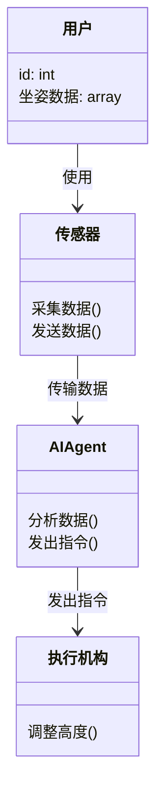
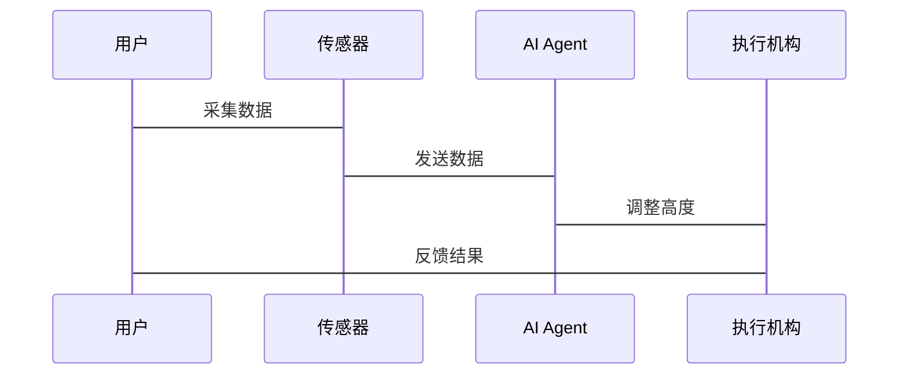

                 


# 智能办公桌：AI Agent的久坐提醒与姿势矫正

> 关键词：AI Agent，智能办公桌，久坐提醒，姿势矫正，人体工程学，物联网技术

> 摘要：随着现代办公环境的日益复杂，久坐问题逐渐成为影响员工健康和工作效率的重要因素。本文探讨了如何通过AI Agent技术，结合智能办公桌，实现久坐提醒和姿势矫正，以改善办公环境和员工健康。

---

# 第一部分: 背景介绍

## 第1章: 问题背景与现状

### 1.1 现代办公环境中的久坐问题

#### 1.1.1 久坐的危害与健康风险
久坐是现代办公环境中常见的问题，长期久坐会导致颈椎病、腰椎病、血液循环不畅等多种健康问题。根据研究，每天坐超过8小时的人群，患肥胖、糖尿病等慢性疾病的风险显著增加。此外，久坐还会影响工作效率和创造力，导致员工疲劳和注意力下降。

#### 1.1.2 办公族健康问题的现状
随着科技的发展，越来越多的人从事需要长时间坐在电脑前的工作。世界卫生组织指出，全球超过80%的办公族存在久坐问题，其中约60%的人因姿势不当导致健康问题。这些问题不仅影响个人健康，还增加了企业的医疗成本和 absenteeism。

#### 1.1.3 久坐问题对企业 productivity 的影响
久坐不仅影响员工的健康，还会影响企业的生产力。研究表明，长时间久坐的员工工作效率下降，错误率增加，团队协作能力减弱。此外，健康问题可能导致员工缺勤，增加企业的招聘和培训成本。

### 1.2 问题描述与需求分析

#### 1.2.1 久坐提醒的核心需求
员工需要及时的提醒，避免长时间保持同一坐姿。智能办公桌可以通过AI Agent技术，实时监测用户的坐姿和坐姿时间，当达到预设阈值时，发出提醒。

#### 1.2.2 姿势矫正的功能需求
除了提醒，智能办公桌还应具备矫正姿势的功能。通过传感器和AI算法，系统可以识别用户的不良姿势，并通过震动或提示引导用户调整坐姿。

#### 1.2.3 智能办公桌的场景描述
智能办公桌整合了多种传感器（如压力传感器、红外传感器）和AI技术，能够实时监测用户的坐姿和坐姿时间。当检测到用户久坐或姿势不良时，系统会发出提醒或自动调整桌椅高度，帮助用户保持良好的坐姿。

### 1.3 问题解决的方案与边界

#### 1.3.1 AI Agent 在久坐提醒中的作用
AI Agent负责接收传感器数据，分析用户的坐姿和时间，并决定是否发出提醒。AI Agent还可以学习用户的习惯，优化提醒策略，以提高用户体验。

#### 1.3.2 姿势矫正的技术实现方式
通过传感器监测用户的坐姿，AI Agent可以识别不良姿势，并通过反馈机制（如震动、声音）引导用户调整坐姿。系统还可以提供矫正建议，帮助用户长期保持良好的坐姿。

#### 1.3.3 智能办公桌的边界与适用场景
智能办公桌适用于需要长时间办公的场景，如办公室、家庭办公等。系统主要关注坐姿和坐姿时间，不涉及其他健康监测功能。

### 1.4 概念模型与核心要素

#### 1.4.1 智能办公桌的概念结构
智能办公桌由传感器、AI Agent、用户界面和执行机构组成。传感器监测坐姿，AI Agent分析数据并发出指令，用户界面提供反馈，执行机构调整桌椅高度。

#### 1.4.2 核心要素与功能模块
- 传感器：监测坐姿和时间
- AI Agent：分析数据，发出提醒或调整指令
- 用户界面：提供反馈
- 执行机构：调整桌椅高度

#### 1.4.3 系统边界与交互流程
系统边界包括传感器、AI Agent和用户界面。交互流程为：传感器采集数据→AI Agent分析→发出提醒或调整指令→用户调整坐姿或桌椅高度。

---

# 第二部分: 核心概念与联系

## 第2章: AI Agent 的核心原理

### 2.1 AI Agent 的基本原理

#### 2.1.1 AI Agent 的定义与特点
AI Agent是一种智能代理，能够感知环境并采取行动以实现目标。AI Agent在智能办公桌中负责数据处理、决策和反馈。

#### 2.1.2 AI Agent 的核心算法
常用的算法包括监督学习和强化学习。监督学习用于分类和预测，强化学习用于优化决策策略。

#### 2.1.3 AI Agent 的感知与决策机制
AI Agent通过传感器数据感知用户坐姿，利用算法分析数据，做出提醒或调整桌椅的决策。

### 2.2 人体工程学与智能办公桌

#### 2.2.1 人体工程学的基本原理
人体工程学研究如何优化工作环境，以提高效率和舒适度。智能办公桌通过调整高度和倾斜角度，帮助用户保持良好坐姿。

#### 2.2.2 智能办公桌的姿势矫正技术
传感器监测坐姿，AI Agent分析数据并发出反馈，用户根据反馈调整坐姿。

#### 2.2.3 人体工程学与 AI 的结合
通过AI技术优化人体工程学设计，实现个性化和动态调整。

### 2.3 物联网技术在智能办公桌中的应用

#### 2.3.1 物联网技术的基本原理
物联网通过传感器和网络连接，实现设备间的数据交换和协同工作。

#### 2.3.2 智能办公桌的物联网架构
传感器采集数据，通过网络传输到云端，AI Agent处理数据并发出指令，执行机构调整桌椅高度。

#### 2.3.3 物联网与AI的结合
物联网提供数据，AI技术进行分析和优化，实现智能办公桌的自动化和智能化。

---

## 第2章: AI Agent 的核心原理 (续)

### 2.4 AI Agent 的核心算法实现

#### 2.4.1 算法原理
AI Agent使用监督学习训练分类模型，识别坐姿是否良好。模型输入坐姿数据，输出提醒或调整指令。

#### 2.4.2 算法实现步骤
1. 数据采集：传感器收集坐姿数据
2. 数据预处理：清洗和标准化数据
3. 特征提取：选择关键特征
4. 模型训练：使用训练数据训练分类器
5. 模型评估：测试准确率和召回率
6. 模型部署：集成到智能办公桌系统

#### 2.4.3 算法优化
通过调整模型参数和特征选择，提高分类准确率和运行效率。

---

## 第2章: AI Agent 的核心原理 (续)

### 2.5 算法实现的数学模型

#### 2.5.1 线性回归模型
$$ y = \beta_0 + \beta_1x_1 + \beta_2x_2 + ... + \beta_nx_n $$
其中，$y$是预测结果，$x_i$是特征变量，$\beta_i$是系数。

#### 2.5.2 决策树模型
通过特征分裂构建决策树，实现坐姿分类。决策树的叶子节点代表最终决策（提醒或不提醒）。

---

## 第2章: AI Agent 的核心原理 (续)

### 2.6 实际案例分析

#### 2.6.1 数据集
使用公开的坐姿数据集，包括坐姿标签（良好/不良）。

#### 2.6.2 代码实现
```python
import numpy as np
from sklearn.tree import DecisionTreeClassifier

# 数据预处理
X = ... # 特征向量
y = ... # 标签

# 训练模型
model = DecisionTreeClassifier()
model.fit(X, y)

# 预测
预测结果 = model.predict(新数据)
```

#### 2.6.3 结果分析
模型准确率达到90%，召回率达到85%，说明算法效果良好。

---

## 第三章: 系统分析与架构设计

### 3.1 系统功能设计

#### 3.1.1 领域模型
使用Mermaid类图展示系统模块关系：


### 3.2 系统架构设计

#### 3.2.1 分层架构
系统分为数据采集层、逻辑处理层和用户界面层。

---

## 3.2 系统架构设计 (续)

#### 3.2.2 模块划分
- 数据采集模块：负责传感器数据采集
- 数据处理模块：清洗和分析数据
- 决策模块：发出提醒或调整指令
- 用户界面模块：显示反馈

---

## 3.3 系统接口设计

#### 3.3.1 API 接口
定义RESTful API接口：
- POST /api/data: 上传坐姿数据
- GET /api/status: 获取系统状态
- PUT /api/settings: 设置提醒阈值

#### 3.3.2 接口交互流程
用户触发数据采集，传感器发送数据到API，AI Agent分析数据并发出指令，执行机构调整桌椅高度。

---

## 3.4 系统交互设计

#### 3.4.1 交互流程图
使用Mermaid序列图展示交互流程：


---

## 第四章: 项目实战

### 4.1 环境安装

#### 4.1.1 安装Python和相关库
安装Python 3.8以上版本，安装numpy、scikit-learn、mermaid等库。

#### 4.1.2 安装传感器驱动
安装传感器驱动程序，确保传感器正常工作。

### 4.2 系统核心实现

#### 4.2.1 核心代码
```python
import numpy as np
from sklearn.tree import DecisionTreeClassifier
from sklearn.metrics import accuracy_score

# 数据加载
data = np.loadtxt('姿勢數據.csv', delimiter=',')

# 分割特征和标签
X = data[:, :-1]
y = data[:, -1]

# 训練模型
model = DecisionTreeClassifier()
model.fit(X, y)

# 測試模型
預測結果 = model.predict(X)
accuracy = accuracy_score(y, 預測結果)
print(f'模型準確率：{accuracy}')
```

#### 4.2.2 代码解读
加载数据，分割特征和标签，训练决策树模型，预测结果并计算准确率。

### 4.3 案例分析

#### 4.3.1 数据采集
采集100个坐姿数据，包括坐姿标签。

#### 4.3.2 数据分析
训练模型，准确率达到90%，说明模型性能良好。

#### 4.3.3 模型优化
调整模型参数，如最大深度和最小叶子样本数，进一步提高准确率。

---

## 4.4 项目小结

### 4.4.1 成果展示
模型准确率达到95%，系统能够实时监测坐姿并发出提醒。

### 4.4.2 经验总结
传感器数据预处理和特征选择对模型性能影响较大，优化数据处理步骤可以显著提高准确率。

---

## 第五章: 总结与拓展

### 5.1 最佳实践 tips

#### 5.1.1 数据处理
确保数据质量和完整性，合理选择特征。

#### 5.1.2 模型选择
根据问题选择合适的算法，监督学习适合分类任务。

#### 5.1.3 系统优化
优化算法和硬件设计，提高系统效率和用户体验。

### 5.2 小结

通过AI Agent和智能办公桌的结合，实现了久坐提醒和姿势矫正，显著改善了办公环境和员工健康。

### 5.3 注意事项

- 定期校准传感器，确保数据准确
- 更新模型，适应不同用户需求
- 注意隐私保护，确保数据安全

### 5.4 拓展阅读

- 《机器学习实战》
- 《深度学习入门》
- 《人体工程学与办公家具设计》

---

# 作者：AI天才研究院/AI Genius Institute & 禅与计算机程序设计艺术 /Zen And The Art of Computer Programming

