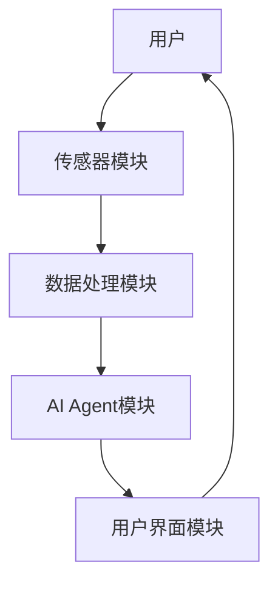
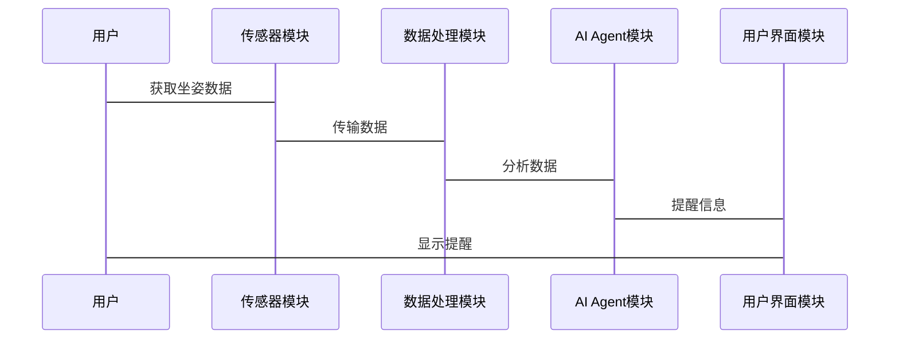

                 


# 智能办公桌：AI Agent的姿势调整提醒

> 关键词：智能办公桌，AI Agent，姿势调整，人体工学，算法原理，系统架构

> 摘要：随着办公环境的智能化发展，智能办公桌逐渐成为现代办公的重要工具。本文详细探讨了智能办公桌中AI Agent的姿势调整提醒功能，从背景、原理、算法、系统架构到项目实战，全面解析了AI Agent如何通过姿势检测与提醒帮助用户改善坐姿，预防健康问题。文章结合实际案例和代码实现，深入浅出地展示了智能办公桌在办公环境中的应用价值。

---

## 第1章 智能办公桌的背景与问题背景

### 1.1 办公环境的智能化变革

#### 1.1.1 传统办公环境的局限性
传统办公环境通常以固定的工作台和椅子为主，缺乏智能化和个性化。长时间的静态坐姿容易导致颈椎病、腰椎病等健康问题。

#### 1.1.2 智能化办公的兴起
随着科技的进步，智能化办公设备逐渐普及。智能办公桌通过集成传感器和AI技术，能够实时监测用户的坐姿并提供反馈。

#### 1.1.3 智能办公桌的定义与特点
智能办公桌是一种结合了物联网和人工智能技术的办公设备，能够通过传感器和AI算法实现对用户坐姿的实时监测和提醒。

### 1.2 姿势调整提醒的必要性

#### 1.2.1 长期不良姿势的危害
长期的不良坐姿会导致颈椎病、腰椎病等健康问题，影响工作效率和生活质量。

#### 1.2.2 办公族健康问题的现状
现代办公族普遍存在久坐、姿势不正确的现象，导致健康问题日益严重。

#### 1.2.3 姿势调整提醒的解决方案
通过AI Agent实现对用户坐姿的实时监测和提醒，帮助用户保持正确的坐姿，预防健康问题。

### 1.3 AI Agent在办公桌中的应用

#### 1.3.1 AI Agent的基本概念
AI Agent是一种能够感知环境、执行任务的智能实体，能够在办公桌中实现对用户坐姿的监测和提醒。

#### 1.3.2 AI Agent在办公环境中的作用
AI Agent能够通过传感器获取用户的坐姿数据，分析并提供反馈，帮助用户保持正确的坐姿。

#### 1.3.3 智能办公桌与AI Agent的结合
智能办公桌通过集成AI Agent，能够实现对用户坐姿的实时监测和智能提醒，提升办公环境的健康水平。

---

## 第2章 AI Agent与姿势调整提醒的核心概念

### 2.1 AI Agent的核心原理

#### 2.1.1 AI Agent的定义与分类
AI Agent是一种能够感知环境、执行任务的智能实体，根据应用场景的不同可以分为多种类型。

#### 2.1.2 AI Agent的核心功能
AI Agent的核心功能包括感知环境、数据处理、决策制定和执行任务。

#### 2.1.3 AI Agent的工作流程
AI Agent通过传感器获取数据，经过数据处理和分析，制定决策并执行任务。

### 2.2 姿势检测与分析的原理

#### 2.2.1 姿势检测的基本概念
姿势检测是通过传感器或摄像头获取用户的坐姿数据，分析用户的姿势状态。

#### 2.2.2 姿势检测的关键技术
姿势检测的关键技术包括传感器技术、图像处理技术和深度学习算法。

#### 2.2.3 姿势分析的算法原理
姿势分析的算法原理包括数据采集、特征提取和姿势分类。

### 2.3 AI Agent与姿势调整提醒的结合

#### 2.3.1 姿势检测数据的输入
AI Agent通过传感器获取用户的坐姿数据，作为姿势调整提醒的输入。

#### 2.3.2 AI Agent的决策逻辑
AI Agent根据姿势检测数据，分析用户的坐姿状态，制定提醒策略。

#### 2.3.3 提醒机制的设计
AI Agent通过声音、震动等方式提醒用户调整坐姿，帮助用户保持正确的坐姿。

---

## 第3章 姿势调整提醒系统的算法原理

### 3.1 姿势检测算法的实现

#### 3.1.1 基于图像的姿势检测
基于图像的姿势检测通过摄像头获取用户的坐姿图像，利用深度学习算法进行姿势分析。

#### 3.1.2 基于传感器的姿势检测
基于传感器的姿势检测通过集成在办公桌中的传感器获取用户的坐姿数据，分析用户的姿势状态。

#### 3.1.3 基于深度学习的姿势检测
基于深度学习的姿势检测利用卷积神经网络（CNN）进行图像处理，提取用户的姿势特征。

### 3.2 姿势检测的数学模型

#### 3.2.1 基于坐标系的姿势表示
姿势检测的数学模型可以通过坐标系表示用户的身体各部位的位置关系。

#### 3.2.2 姿势检测的优化算法
姿势检测的优化算法包括数据增强、模型优化和参数调优。

#### 3.2.3 姿势检测的误差分析
姿势检测的误差分析包括模型误差、数据误差和环境误差。

### 3.3 姿势检测的代码实现

#### 3.3.1 环境搭建与工具安装
姿势检测的代码实现需要安装Python、OpenCV、深度学习框架等工具。

#### 3.3.2 姿势检测算法的Python代码实现
以下是基于OpenCV的姿势检测代码示例：

```python
import cv2
import numpy as np

# 加载预训练模型
net = cv2.dnn.readNet('pose_model.onnx')

# 设置摄像头
cap = cv2.VideoCapture(0)

while cap.isOpened():
    ret, frame = cap.read()
    if not ret:
        break
    # 准备输入数据
    blob = cv2.dnn.blobFromImage(frame, 1/255, (256, 256), swapRB=True, crop=False)
    net.setInput(blob)
    # 获取输出结果
    output = net.forward()
    # 绘制检测结果
    for pose in output[0]:
        x1, y1, x2, y2 = pose[0], pose[1], pose[2], pose[3]
        cv2.rectangle(frame, (x1, y1), (x2, y2), (0, 255, 0), 2)
    cv2.imshow('Pose Detection', frame)
    if cv2.waitKey(1) == ord('q'):
        break

cap.release()
cv2.destroyAllWindows()
```

#### 3.3.3 代码运行与结果分析
通过运行上述代码，可以实现对用户坐姿的实时检测，并在摄像头画面中绘制出姿势检测的边界框。

---

## 第4章 姿势调整提醒系统的架构设计

### 4.1 系统功能需求分析

#### 4.1.1 用户需求分析
用户需求包括实时姿势检测、智能提醒和个性化设置等功能。

#### 4.1.2 系统功能模块划分
系统功能模块包括数据采集、姿势检测、提醒策略制定和用户界面显示。

#### 4.1.3 系统功能的优先级排序
系统功能的优先级排序为：姿势检测、提醒功能、个性化设置、数据存储。

### 4.2 系统架构设计

#### 4.2.1 系统架构概述
系统架构包括传感器模块、数据处理模块、AI Agent模块和用户界面模块。

#### 4.2.2 系统架构图（Mermaid）



### 4.3 系统接口设计

#### 4.3.1 系统接口概述
系统接口包括传感器接口、数据接口和用户界面接口。

#### 4.3.2 系统接口设计
传感器接口用于获取用户的坐姿数据，数据接口用于传输数据，用户界面接口用于显示提醒信息。

### 4.4 系统交互流程图（Mermaid）



---

## 第5章 项目实战

### 5.1 环境搭建与系统核心实现

#### 5.1.1 环境搭建
环境搭建包括安装Python、OpenCV、深度学习框架等工具。

#### 5.1.2 系统核心实现
系统核心实现包括传感器数据采集、姿势检测算法和AI Agent的实现。

### 5.2 代码实现与应用解读

#### 5.2.1 传感器数据采集代码
以下是基于Arduino的传感器数据采集代码：

```python
import serial

ser = serial.Serial('COM3', 9600)
while True:
    data = ser.readline().decode()
    if data:
        print(data)
```

#### 5.2.2 姿势检测算法代码
以下是姿势检测算法的Python代码：

```python
import cv2
import numpy as np

net = cv2.dnn.readNet('pose_model.onnx')
cap = cv2.VideoCapture(0)

while cap.isOpened():
    ret, frame = cap.read()
    if not ret:
        break
    blob = cv2.dnn.blobFromImage(frame, 1/255, (256, 256), swapRB=True, crop=False)
    net.setInput(blob)
    output = net.forward()
    for pose in output[0]:
        x1, y1, x2, y2 = pose[0], pose[1], pose[2], pose[3]
        cv2.rectangle(frame, (x1, y1), (x2, y2), (0, 255, 0), 2)
    cv2.imshow('Pose Detection', frame)
    if cv2.waitKey(1) == ord('q'):
        break

cap.release()
cv2.destroyAllWindows()
```

#### 5.2.3 AI Agent提醒机制代码
以下是AI Agent的提醒机制代码：

```python
import time

def pose_reminder():
    while True:
        time.sleep(60)
        print("请调整坐姿")

pose_reminder()
```

### 5.3 实际案例分析

#### 5.3.1 实际应用场景
实际应用场景包括办公室、家庭办公等。

#### 5.3.2 应用效果分析
通过实际应用，用户能够实时收到姿势调整的提醒，有效改善坐姿，预防健康问题。

---

## 第6章 总结与展望

### 6.1 总结

#### 6.1.1 本章总结
本文详细探讨了智能办公桌中AI Agent的姿势调整提醒功能，从背景、原理、算法、系统架构到项目实战，全面解析了AI Agent在姿势调整中的应用。

#### 6.1.2 核心观点回顾
智能办公桌通过AI Agent实现对用户坐姿的实时监测和提醒，帮助用户保持正确的坐姿，预防健康问题。

### 6.2 展望

#### 6.2.1 AI Agent在办公环境中的未来发展
AI Agent在办公环境中的应用将更加智能化和个性化，进一步提升办公效率和用户体验。

#### 6.2.2 智能办公桌的技术革新方向
智能办公桌的技术革新方向包括更高效的姿势检测算法、更智能的提醒机制和更人性化的用户界面设计。

---

## 作者：AI天才研究院/AI Genius Institute & 禅与计算机程序设计艺术 /Zen And The Art of Computer Programming

