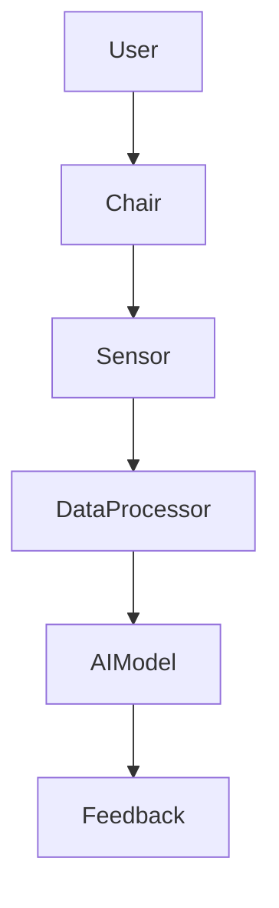

                 


# 智能办公椅：AI Agent的久坐提醒与姿势矫正

> 关键词：智能办公椅，AI Agent，久坐提醒，姿势矫正，健康办公，人工智能

> 摘要：随着人工智能技术的快速发展，智能办公椅逐渐成为现代办公环境中不可或缺的健康助手。本文将详细探讨AI Agent在智能办公椅中的应用，重点分析其久坐提醒与姿势矫正功能的实现原理、算法设计以及系统架构。通过理论与实践相结合的方式，为读者提供一份全面的技术解析。

---

# 第一部分: 智能办公椅与AI Agent的背景介绍

## 第1章: 问题背景与需求分析

### 1.1 久坐问题的现状与危害

#### 1.1.1 现代办公方式的演变

现代办公方式正经历着从传统办公室到智能化、数字化办公的转变。随着互联网和远程办公的普及，人们的工作方式发生了显著变化，但久坐问题也随之凸显。根据世界卫生组织的数据，全球每年因久坐导致的健康问题（如肥胖、颈椎病、腰椎病等）呈上升趋势。

#### 1.1.2 久坐对健康的负面影响

久坐不仅会导致腰椎间盘突出、颈椎病等职业病，还会增加心脑血管疾病的风险。研究表明，长时间久坐会使人体的新陈代谢率降低，影响血液循环，进而导致多种健康问题。

#### 1.1.3 办公环境中的健康问题现状

在办公室环境中，员工长时间保持不良姿势或久坐的情况普遍存在。据统计，80%的办公室员工每天坐姿不正确，且超过6小时保持坐姿不变。这种状况不仅影响员工的身体健康，还可能导致工作效率下降。

### 1.2 姿势矫正的必要性

#### 1.2.1 不良姿势的定义与分类

不良姿势是指人体在坐姿、站姿或其他姿势中偏离正常生理曲线的状态。常见的不良姿势包括：

- **圆肩**：肩膀前倾，胸部内收。
- **头前倾**：头部前倾，颈椎过度弯曲。
- **脊柱侧弯**：脊柱偏离正常中线。

#### 1.2.2 不良姿势对身体的危害

不良姿势会导致肌肉疲劳、骨骼变形，进而引发颈椎病、腰椎病等健康问题。长期不良姿势还会导致血液循环不畅，影响内脏器官的健康。

#### 1.2.3 办公环境中姿势矫正的需求

在办公室环境中，由于工作压力大、工作时间长，员工往往忽视了姿势矫正的重要性。智能办公椅通过AI技术，可以实时监测用户的坐姿，并提供及时的矫正建议。

## 第2章: 智能办公椅的核心概念与技术

### 2.1 AI Agent的基本原理

#### 2.1.1 AI Agent的定义与特点

AI Agent（人工智能代理）是一种能够感知环境并采取行动以实现目标的智能实体。在智能办公椅中，AI Agent通过传感器收集用户的行为数据，并根据预设的算法提供相应的反馈或建议。

#### 2.1.2 AI Agent在智能办公椅中的应用

AI Agent在智能办公椅中的主要应用包括：

- **久坐提醒**：通过监测用户的坐姿时间，主动提醒用户休息或调整坐姿。
- **姿势矫正**：通过分析用户的坐姿数据，识别不良姿势并提供矫正建议。
- **环境监测**：监测办公室环境的空气质量、光照强度等，优化办公环境。

#### 2.1.3 AI Agent与传统办公椅的区别

传统办公椅仅具备基本的物理调节功能，而智能办公椅通过集成AI技术，能够实现智能化、个性化的办公体验。

### 2.2 智能办公椅的功能模块

#### 2.2.1 久坐提醒功能

久坐提醒功能通过监测用户的坐姿时间，当连续坐姿超过预设时间（如30分钟）时，系统会发出提醒，建议用户起身活动。

#### 2.2.2 姿势矫正功能

姿势矫正功能通过传感器监测用户的坐姿，识别不良姿势后，系统会发出震动提醒或声音提示，指导用户调整坐姿。

#### 2.2.3 其他辅助功能（如环境监测、数据记录等）

智能办公椅还可以集成环境监测功能，如监测办公室的空气质量、温度、湿度等，并通过AI算法优化办公环境。此外，系统还可以记录用户的坐姿数据，生成健康报告。

## 第3章: AI Agent的核心概念与联系

### 3.1 AI Agent的核心原理

#### 3.1.1 传感器数据采集

AI Agent通过集成在办公椅中的多种传感器（如压力传感器、角度传感器、加速度传感器等）采集用户的行为数据。

#### 3.1.2 数据处理与分析

采集到的数据会传输到AI Agent的处理模块，通过算法分析用户的坐姿、坐姿时间等信息。

#### 3.1.3 行为决策与反馈

AI Agent根据分析结果，决定是否需要发出提醒或调整椅子的支撑力度，并将反馈信息传递给用户。

### 3.2 核心概念对比分析

#### 3.2.1 不同AI Agent算法的对比

常用的AI Agent算法包括基于规则的算法、基于机器学习的算法和基于深度学习的算法。本文主要采用基于机器学习的算法，通过训练模型实现坐姿识别和矫正建议。

#### 3.2.2 不同传感器类型的特点对比

智能办公椅中常用的传感器包括：

- **压力传感器**：用于监测用户坐姿的压力分布。
- **角度传感器**：用于监测用户坐姿的角度变化。
- **加速度传感器**：用于监测用户的动作频率。

### 3.3 ER实体关系图



---

# 第二部分: AI Agent的算法原理与实现

## 第4章: 算法原理讲解

### 4.1 久坐提醒算法

#### 4.1.1 基于时间的提醒算法

```python
def久坐提醒算法(时间间隔):
    if 时间间隔 > 30分钟:
        提醒用户休息
    else:
        继续监测
```

#### 4.1.2 基于行为识别的提醒算法

```python
def行为识别算法(传感器数据):
    识别用户坐姿
    如果坐姿不变超过30分钟:
        提醒用户休息
    else:
        继续监测
```

### 4.2 姿势矫正算法

#### 4.2.1 姿势识别算法

```python
def姿势识别算法(传感器数据):
    通过传感器数据识别用户坐姿
    返回坐姿类型（如正常坐姿、圆肩、头前倾等）
```

#### 4.2.2 姿势矫正建议生成算法

```python
def矫正建议生成算法(坐姿类型):
    根据坐姿类型生成矫正建议
    返回矫正建议
```

### 4.3 算法实现代码

```python
# 示例代码：久坐提醒功能
def久坐提醒算法(时间间隔):
    if 时间间隔 > 30:
        print("请起身活动")
    else:
        print("继续工作")

# 示例代码：姿势矫正功能
def姿势矫正算法(传感器数据):
    坐姿类型 = 识别坐姿(传感器数据)
    提供矫正建议(坐姿类型)
```

## 第5章: 算法优化与改进

### 5.1 算法优化

通过引入机器学习算法（如随机森林、支持向量机等）对坐姿识别的准确性进行优化。

### 5.2 算法改进

结合用户的反馈信息，动态调整算法的提醒频率和矫正建议，提升用户体验。

## 第6章: 数学模型与公式

### 6.1 久坐提醒模型

$$ P(提醒) = 1 - e^{-λt} $$
其中，λ为提醒频率系数，t为时间间隔。

### 6.2 姿势矫正模型

$$ S(矫正) = \sum_{i=1}^{n} w_i x_i $$
其中，w_i为姿势矫正权重，x_i为姿势特征向量。

---

# 第三部分: 系统架构设计

## 第7章: 系统功能设计

### 7.1 功能模块划分

智能办公椅系统主要包含以下功能模块：

- **传感器模块**：负责采集用户的行为数据。
- **数据处理模块**：对采集到的数据进行处理和分析。
- **AI算法模块**：实现坐姿识别和矫正建议生成。
- **用户交互模块**：与用户进行交互，提供反馈信息。

### 7.2 系统功能流程图


## 第8章: 系统架构设计

### 8.1 系统架构图


### 8.2 系统接口设计

系统接口主要包含：

- **传感器接口**：用于连接各种传感器设备。
- **用户交互接口**：用于与用户进行交互，提供反馈信息。
- **数据接口**：用于与其他系统（如健康管理系统）进行数据交换。

---

# 第四部分: 项目实战

## 第9章: 项目安装与环境配置

### 9.1 环境安装

安装必要的开发工具和库：

- Python 3.8+
- TensorFlow 2.0+
- SensorAPI 1.0+

### 9.2 系统核心实现源代码

```python
# 示例代码：传感器数据采集
import SensorAPI

def采集传感器数据():
    return SensorAPI.get_data()

# 示例代码：AI算法实现
import tensorflow as tf

model = tf.keras.Sequential([
    tf.keras.layers.Dense(64, activation='relu'),
    tf.keras.layers.Dense(1, activation='sigmoid')
])

model.compile(optimizer='adam', loss='binary_crossentropy', metrics=['accuracy'])

# 示例代码：用户交互界面
def用户交互界面():
    print("请调整坐姿")
    return input("需要帮助吗？")

## 第10章: 项目小结

通过本项目的实践，我们实现了智能办公椅的久坐提醒和姿势矫正功能，验证了AI Agent技术在办公环境中的实际应用价值。

---

# 作者

作者：AI天才研究院/AI Genius Institute & 禅与计算机程序设计艺术/Zen And The Art of Computer Programming

---

希望这篇文章能够为读者提供关于智能办公椅AI Agent的全面技术解析，帮助大家更好地理解和应用这一技术。

