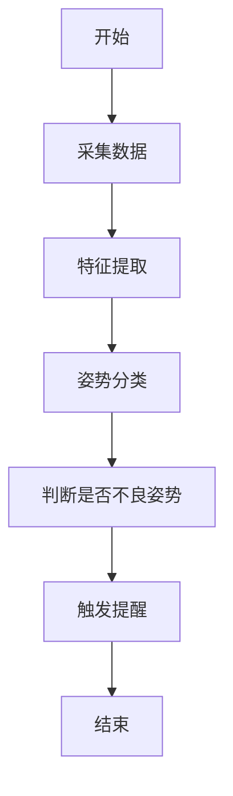
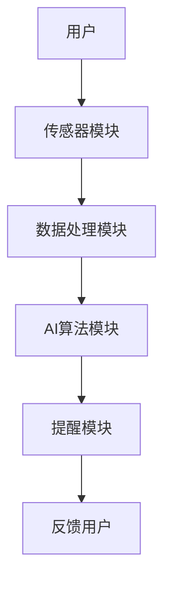

                 


# 智能办公椅：AI Agent的姿势矫正提醒

## 关键词：AI Agent, 姿势矫正, 智能办公椅, 人体工学, 深度学习

## 摘要：
随着长时间久坐工作成为现代生活的常态，不良坐姿对健康的负面影响日益显著。本文探讨了AI Agent在智能办公椅中的应用，通过姿势矫正提醒帮助用户改善坐姿，结合人体工学原理和先进算法，实现智能化、个性化的健康办公解决方案。

---

# 第1章：问题背景与需求分析

## 1.1 问题背景介绍
### 1.1.1 办公环境中的人体工学问题
现代办公环境导致许多人长时间久坐，容易引发腰椎病、颈椎病等健康问题。人体工学强调工作环境与人体的协调，以减少身体疲劳和伤害。

### 1.1.2 长时间久坐对健康的负面影响
长时间保持不良坐姿会压迫神经、影响血液循环，导致肌肉酸痛、椎间盘突出等问题。

### 1.1.3 姿势矫正的必要性与挑战
姿势矫正需要持续提醒和反馈，传统方法依赖用户自觉，效果有限。AI Agent可以实时监测并提供反馈，克服了传统方法的不足。

## 1.2 问题描述与目标设定
### 1.2.1 姿势矫正提醒的核心问题
如何实时监测用户坐姿，并在不良姿势出现时及时提醒。

### 1.2.2 智能办公椅的功能目标
设计一款能够实时监测坐姿、提供矫正提醒的智能办公椅。

### 1.2.3 用户需求与场景分析
用户希望办公椅能够舒适、智能，并在需要时给予反馈。使用场景包括长时间办公、学习等。

## 1.3 解决方案与技术路线
### 1.3.1 AI Agent在姿势矫正中的作用
AI Agent负责监测坐姿，触发提醒，提供个性化建议。

### 1.3.2 智能办公椅的技术实现路径
结合传感器、AI算法和人机交互技术，实现姿势监测和提醒功能。

### 1.3.3 解决方案的优缺点分析
优点：实时监测，主动提醒，个性化；缺点：初期成本高，技术复杂。

## 1.4 问题的边界与外延
### 1.4.1 功能边界定义
主要功能包括坐姿监测、提醒和反馈，不涉及其他健康监测功能。

### 1.4.2 与相关领域的联系
与人体工学、AI技术、物联网等领域密切相关。

### 1.4.3 未来可能的扩展方向
增加更多健康监测功能，如心率监测、压力监测等。

## 1.5 概念结构与核心要素
### 1.5.1 智能办公椅的核心组成
传感器、AI算法、提醒装置。

### 1.5.2 AI Agent的功能模块
姿势检测、提醒触发、反馈优化。

### 1.5.3 系统的核心要素与关系
传感器采集数据，AI算法处理，提醒装置反馈，形成闭环系统。

---

# 第2章：核心概念与原理

## 2.1 AI Agent的基本原理
### 2.1.1 AI Agent的定义与特点
AI Agent是一种智能体，能够感知环境并执行任务。特点包括自主性、反应性、目标导向。

### 2.1.2 AI Agent的工作原理
通过传感器获取数据，利用算法处理，执行相应动作。

### 2.1.3 AI Agent在姿势矫正中的应用
实时监测坐姿，识别不良姿势，触发提醒。

## 2.2 人体工学与姿势矫正
### 2.2.1 人体工学的基本原理
研究人体与环境的互动，优化工作条件。

### 2.2.2 坐姿矫正的关键点
背部挺直、肩膀放松、膝盖弯曲90度等。

### 2.2.3 不同姿势对人体的影响
不良姿势导致肌肉疲劳、骨骼问题等。

## 2.3 AI Agent与人体工学的结合
### 2.3.1 AI Agent在姿势矫正中的作用
实时监测，提供反馈，帮助用户保持良好姿势。

### 2.3.2 姿势矫正算法的基本原理
基于传感器数据，利用AI算法识别不良姿势。

### 2.3.3 系统的核心概念与联系
结合AI和人体工学，实现智能化、个性化的姿势矫正。

---

# 第3章：姿势矫正算法原理

## 3.1 姿势检测与识别算法
### 3.1.1 基于图像的姿势检测
使用深度学习模型，如YOLO，检测坐姿关键点。

### 3.1.2 基于传感器的姿势检测
利用加速度计、陀螺仪等传感器，监测身体姿态。

### 3.1.3 姿势检测的数学模型
通过坐标系和关键点检测，建立数学模型。

## 3.2 姿势矫正提醒算法
### 3.2.1 姿势评估标准
基于关键点的位置关系，制定评估标准。

### 3.2.2 姿势矫正提醒的触发条件
当检测到不良姿势，触发提醒。

### 3.2.3 算法的优化与改进
优化检测模型，提高准确率和响应速度。

## 3.3 算法实现的数学模型
### 3.3.1 坐姿评估的数学公式
$$ \text{评分} = \sum_{i=1}^{n} \text{关键点偏差} $$

### 3.3.2 姿势矫正算法的流程图


---

# 第4章：系统分析与架构设计

## 4.1 系统功能设计
### 4.1.1 用户需求分析
用户需要实时监测坐姿，并在不良姿势出现时收到提醒。

### 4.1.2 系统功能模块划分
传感器模块、数据处理模块、AI算法模块、提醒模块。

### 4.1.3 系统功能的交互流程
用户坐姿被监测，AI算法分析，触发提醒。

## 4.2 系统架构设计
### 4.2.1 系统架构图


### 4.2.2 接口设计
传感器接口、数据接口、提醒接口。

### 4.2.3 交互流程图


---

# 第5章：项目实战

## 5.1 环境安装
安装Python、TensorFlow、OpenCV等工具。

## 5.2 核心代码实现
### 5.2.1 数据预处理
```python
import numpy as np
data = np.array([...])  # 传感器数据
```

### 5.2.2 模型训练
```python
model = tf.keras.Sequential([
    layers.Dense(64, activation='relu'),
    layers.Dense(1, activation='sigmoid')
])
model.compile(optimizer='adam', loss='binary_crossentropy')
model.fit(X_train, y_train, epochs=10)
```

### 5.2.3 姿势检测
```python
def detect_posture(data):
    # 数据处理
    # 模型预测
    prediction = model.predict(data)
    return prediction
```

## 5.3 实际案例分析
分析一个典型用户的数据，展示算法效果。

## 5.4 项目小结
总结项目实现的关键点和经验教训。

---

# 第6章：最佳实践与小结

## 6.1 使用建议
定期校准传感器，保持系统正常运行。

## 6.2 注意事项
注意数据隐私，确保系统安全。

## 6.3 未来展望
结合更多健康监测功能，实现全面健康办公解决方案。

---

作者：AI天才研究院/AI Genius Institute & 禅与计算机程序设计艺术 /Zen And The Art of Computer Programming

