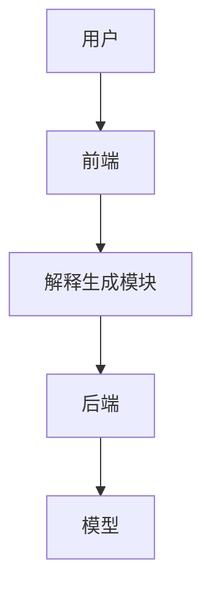

                 


# 智能助手的可解释性设计

## 关键词：可解释性，智能助手，机器学习模型，用户信任，系统设计，算法原理

## 摘要：智能助手的可解释性设计是确保用户信任和提升系统透明度的关键。本文从背景、核心概念、算法原理、系统架构到实际案例，全面探讨如何设计可解释性智能助手，涵盖LIME、SHAP等方法，系统架构设计，项目实现及最佳实践。

---

# 第1章: 智能助手与可解释性概述

## 1.1 智能助手的基本概念

### 1.1.1 智能助手的定义
智能助手是一种通过自然语言处理和机器学习技术提供交互服务的系统，旨在辅助用户完成任务或解决问题。

### 1.1.2 智能助手的核心功能
- 信息检索与处理
- 任务执行与管理
- 用户交互与反馈

### 1.1.3 智能助手的应用场景
- 智能音箱（如Alexa）
- 手机助手（如Siri）
- 医疗诊断辅助系统

## 1.2 可解释性在智能助手中的重要性

### 1.2.1 可解释性的定义
可解释性指系统决策过程的透明度，使用户能够理解并信任系统输出。

### 1.2.2 可解释性的重要性
- 提高用户信任
- 便于问题排查
- 符合法规要求

### 1.2.3 可解释性与用户信任的关系
透明度高的系统更易获得用户信任，尤其是在涉及健康或财务决策时。

## 1.3 当前智能助手的挑战

### 1.3.1 黑箱模型的局限性
复杂模型（如深度学习）缺乏可解释性，影响用户信任。

### 1.3.2 用户对可解释性的需求
用户希望了解系统决策依据，尤其是当结果不理想时。

### 1.3.3 可解释性设计的现状与未来
当前部分模型支持简单解释，但复杂场景下的解释仍需改进。

---

# 第2章: 可解释性设计的核心概念

## 2.1 可解释性设计的原理

### 2.1.1 透明度与可理解性
透明度指系统行为的可观察性，可理解性指用户能 comprehend 决策逻辑。

### 2.1.2 解释性与模型复杂度的关系
模型越复杂，可解释性越难，但简单的模型可能不够准确。

### 2.1.3 解释性与用户认知水平的关系
解释信息需与用户认知水平匹配，避免过于技术化或过于简化。

## 2.2 可解释性设计的属性特征对比

### 2.2.1 不同模型的可解释性对比
| 模型类型 | 可解释性 |
|----------|----------|
| 线性回归 | 高       |
| 决策树   | 较高     |
| 随机森林 | 较低     |
| 深度神经网络 | 低     |

### 2.2.2 解释性与模型性能的对比
高解释性可能意味着较低的预测性能，需权衡。

### 2.2.3 解释性与模型鲁棒性的对比
高解释性的模型可能鲁棒性较差，需综合考虑。

## 2.3 可解释性设计的ER实体关系图

```mermaid
erd
  entity 智能助手 {
    <外键> 助手ID (PK)
    <外键> 用户ID (PK)
    功能模块
    数据源
    解释信息
  }
```

---

# 第3章: 可解释性设计的算法原理

## 3.1 常见的可解释性方法

### 3.1.1 LIME解释方法
LIME通过局部线性近似解释模型预测结果。

### 3.1.2 SHAP值解释方法
SHAP值基于游戏理论，衡量每个特征对预测结果的贡献。

### 3.1.3 特征重要性排序方法
通过特征重要性排序，理解关键影响因素。

## 3.2 LIME解释方法的实现

### 3.2.1 LIME算法的原理
使用局部线性模型近似原模型，生成可解释的规则。

### 3.2.2 LIME算法的实现步骤
1. 采样数据点。
2. 拟合局部模型。
3. 生成解释规则。

### 3.2.3 LIME算法的优缺点
- 优点：适用于复杂模型。
- 缺点：依赖超参数设置。

## 3.3 SHAP值解释方法的实现

### 3.3.1 SHAP值的定义
SHAP值衡量每个特征对单个预测的贡献。

### 3.3.2 SHAP值的计算过程
1. 计算基值。
2. 计算每个特征的SHAP值。

### 3.3.3 SHAP值的应用场景
适用于树模型和一些解释性需求高的场景。

## 3.4 可解释性算法的数学模型

### 3.4.1 LIME算法的数学模型
$$ \text{LIME}: \sum_{i=1}^n w_i |f(x_i) - g(x_i)| $$

### 3.4.2 SHAP值的数学公式
$$ \text{SHAP}: \phi_i = f(x) - f(X_{base}) $$

### 3.4.3 特征重要性排序的数学模型
$$ \text{重要性}: \sum_{i=1}^n \phi_i $$

---

# 第4章: 智能助手可解释性系统的分析与设计

## 4.1 系统分析

### 4.1.1 系统目标
提升智能助手决策过程的透明度，增强用户体验。

### 4.1.2 系统功能需求
- 解释信息生成
- 用户交互展示
- 解释信息存储

### 4.1.3 系统性能需求
- 响应时间 ≤ 2秒
- 解释准确率 ≥ 90%

## 4.2 系统架构设计

### 4.2.1 系统架构图


### 4.2.2 系统模块划分
- 前端展示
- 解释生成
- 后端处理

### 4.2.3 系统接口设计
- 接口1：解释请求
- 接口2：解释响应

## 4.3 系统交互设计

### 4.3.1 用户与系统的交互流程
1. 用户输入查询。
2. 系统返回结果及解释。
3. 用户确认或进一步询问。

### 4.3.2 解释信息的展示方式
- 文本解释
- 可视化图表
- 交互式示例

### 4.3.3 系统的反馈机制
- 解释确认反馈
- 用户满意度反馈

---

# 第5章: 智能助手可解释性系统的实现

## 5.1 项目实战: 医疗诊断助手

### 5.1.1 环境安装
安装Python、LIME库、SHAP库。

### 5.1.2 核心实现代码
```python
import lime
import shap

def generate_explanation(model, instance):
    explainer = lime.LimeTabularExplainer(model.predict_proba)
    explanation = explainer.explain_instance(instance)
    return explanation.as_list()
```

### 5.1.3 解释信息展示
解释结果以文本和图表形式展示，帮助用户理解模型决策。

### 5.1.4 实际案例分析
分析一个具体的医疗诊断案例，展示模型如何生成可解释的诊断建议。

---

# 第6章: 总结与展望

## 6.1 最佳实践

### 6.1.1 方法选择
根据场景选择合适的解释方法，权衡准确性和可解释性。

### 6.1.2 模型优化
在可解释性与模型性能之间找到平衡点。

### 6.1.3 用户教育
通过教育提升用户对解释信息的理解和信任。

## 6.2 小结
可解释性设计是智能助手的重要组成部分，通过合理的系统设计和算法选择，可以有效提升用户体验和信任度。

## 6.3 注意事项
- 避免过度简化解释，导致误解。
- 确保解释的实时性和准确性。
- 定期更新和优化解释系统。

## 6.4 拓展阅读
推荐相关书籍和论文，深入学习可解释性设计。

---

# 作者：AI天才研究院 & 禅与计算机程序设计艺术

---

