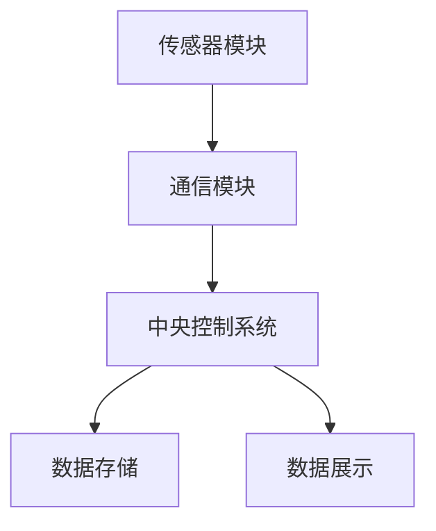
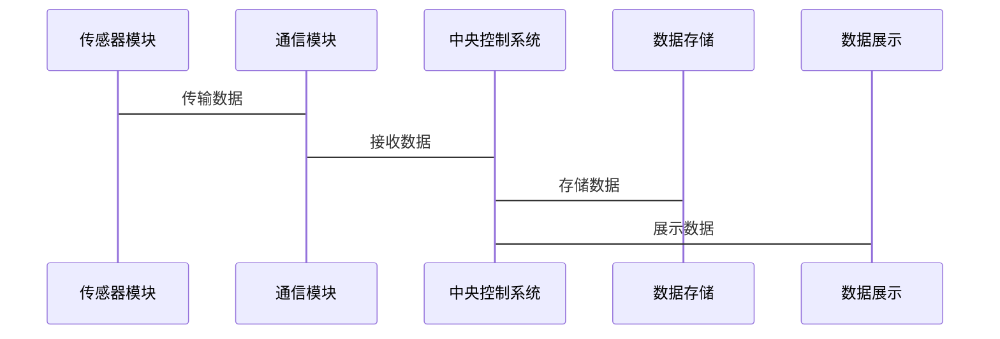

                 


# 智能包装技术在物流领域的应用与投资前景

## 关键词：智能包装，物流，物联网，传感器，RFID，投资前景

## 摘要：智能包装技术通过集成先进的传感器、物联网和射频识别（RFID）技术，正在 revolutionize the logistics industry。本文详细探讨了智能包装的核心技术、在物流各环节中的应用以及其投资前景。通过分析智能包装如何优化仓储管理、提升运输效率和增强配送体验，本文为读者提供了全面的视角，帮助理解这一技术的潜力和未来发展方向。

---

# 第一部分：智能包装技术的背景与基础

## 第1章：智能包装技术概述

### 1.1 智能包装的定义与核心概念

#### 1.1.1 智能包装的基本定义
智能包装是一种集成先进技术的包装解决方案，能够感知环境变化、收集数据并进行实时反馈。它通过嵌入传感器、芯片和通信模块，将包装从被动的保护载体转变为动态的信息交互平台。

#### 1.1.2 智能包装的核心要素
- **传感器**：用于感知环境参数，如温度、湿度、压力等。
- **通信模块**：用于数据的无线传输，常见的包括RFID、蓝牙和物联网（IoT）通信。
- **数据处理单元**：用于数据的分析和决策，可能集成边缘计算或云服务。

#### 1.1.3 智能包装与传统包装的对比
| 特性       | 传统包装               | 智能包装               |
|------------|------------------------|------------------------|
| 功能       | 仅提供保护和展示功能     | 提供实时数据反馈和交互功能 |
| 技术集成   | 不含传感器或通信模块     | 集成传感器、芯片和通信技术 |
| 应用场景   | 单一用途                | 多场景、智能化应用       |

### 1.2 智能包装技术的发展历程

#### 1.2.1 包装技术的历史演变
- **传统包装**：20世纪初，主要为简单的保护和展示功能。
- **智能包装的萌芽**：20世纪90年代，传感器技术开始应用于包装，主要用于食品 freshness tracking。
- **快速发展阶段**：21世纪初至今，物联网、RFID和传感器技术的成熟推动了智能包装的广泛应用。

#### 1.2.2 智能包装技术的兴起
智能包装的兴起源于技术的进步和市场需求的变化。随着物联网和大数据技术的普及，企业对物流效率和透明度的需求日益增加，智能包装成为实现这一目标的关键技术。

#### 1.2.3 当前智能包装技术的现状
当前，智能包装技术已在多个领域得到应用，如食品保鲜、药品追踪、奢侈品防伪等。然而，其在物流领域的应用仍处于快速发展阶段，市场潜力巨大。

### 1.3 智能包装技术在物流中的作用

#### 1.3.1 物流包装的基本需求
物流包装需要满足保护货物、便于运输、可追踪和可追溯等基本需求。

#### 1.3.2 智能包装技术如何提升物流效率
- 实时监控货物状态，如温度、湿度等，确保货物安全。
- 自动记录物流信息，如运输时间、路径等，提高透明度。
- 提供货物损坏预警，减少运输损失。

#### 1.3.3 智能包装技术对物流成本的影响
通过优化运输路径、减少货物损坏和提高周转效率，智能包装技术能够显著降低物流成本。

---

## 第2章：智能包装技术的核心技术与实现

### 2.1 智能包装的核心技术

#### 2.1.1 射频识别（RFID）技术
RFID是一种利用电磁场进行数据传输的非接触式识别技术，广泛应用于物流追踪和库存管理。

#### 2.1.2 物联网（IoT）技术
物联网通过将物体连接到互联网，实现数据的实时采集、传输和分析，为智能包装提供强大的数据支持。

#### 2.1.3 传感器技术
传感器用于感知环境参数，如温度、湿度、压力等，并将数据传输给RFID标签或物联网系统。

### 2.2 智能包装的实现原理

#### 2.2.1 RFID标签的工作原理
RFID标签由芯片和天线组成，当受到读写器的电磁波激发时，标签芯片会将存储的数据发送到读写器。

#### 2.2.2 传感器数据采集与传输
传感器采集环境数据后，通过RFID标签或物联网模块将数据传输到中央控制系统进行分析。

#### 2.2.3 数据处理与分析
中央控制系统对数据进行分析，生成相应的反馈指令，用于优化物流流程或通知相关人员采取行动。

### 2.3 智能包装技术的系统架构

#### 2.3.1 系统组成与功能模块
- **传感器模块**：负责数据采集。
- **通信模块**：负责数据传输。
- **中央控制系统**：负责数据处理和决策。

#### 2.3.2 系统的硬件架构
```
+----------------+       +----------------+       +----------------+
|    传感器      |       |    读写器      |       | 中央控制系     |
|----------------|       |----------------|       | 统             |
|                |       |                |       |                |
+----------------+       +----------------+       +----------------+
```

#### 2.3.3 系统的软件架构
```
+----------------+       +----------------+       +----------------+
|    数据采集    |       |    数据传输    |       | 数据处理与决策 |
|----------------|       |----------------|       |                |
+----------------+       +----------------+       +----------------+
```

---

## 第3章：智能包装技术在物流中的应用

### 3.1 物流包装的智能化需求

#### 3.1.1 物流包装的基本需求分析
物流包装需要满足保护货物、便于装卸、可追踪和可追溯的基本需求。

#### 3.1.2 智能包装技术如何满足这些需求
- 提供实时货物状态监控。
- 自动记录物流信息，提高透明度。
- 提供货物损坏预警，减少运输损失。

#### 3.1.3 智能包装技术的应用场景
- 仓储管理：实时监控库存状态。
- 运输监控：实时跟踪货物运输情况。
- 配送优化：根据货物状态优化配送路径。

### 3.2 智能包装在物流仓储中的应用

#### 3.2.1 智能包装在仓储管理中的作用
智能包装通过实时监控货物状态，优化库存管理，减少货物损坏。

#### 3.2.2 智能包装如何优化库存管理
- 自动记录货物信息，减少人为错误。
- 提供货物状态预警，及时采取措施。

#### 3.2.3 智能包装在货物追踪中的应用
通过RFID技术和物联网，实现货物的全程追踪，提高物流透明度。

### 3.3 智能包装在物流运输中的应用

#### 3.3.1 智能包装如何优化运输路径
通过实时监控货物状态，优化运输路径，减少运输时间。

#### 3.3.2 智能包装在货物装卸中的作用
智能包装通过实时监控货物状态，优化装卸流程，减少货物损坏。

#### 3.3.3 智能包装在运输安全中的应用
通过实时监控货物状态，及时发现并处理运输中的异常情况。

### 3.4 智能包装在物流配送中的应用

#### 3.4.1 智能包装如何提升配送效率
通过实时监控货物状态，优化配送路径，提高配送效率。

#### 3.4.2 智能包装在末端配送中的作用
智能包装通过实时监控货物状态，优化末端配送流程，提高客户满意度。

#### 3.4.3 智能包装如何提高客户体验
通过提供实时货物状态信息，提高客户对物流过程的透明度和满意度。

---

## 第4章：智能包装技术的投资分析与市场前景

### 4.1 智能包装技术的市场现状

#### 4.1.1 全球智能包装市场的规模
根据市场研究，全球智能包装市场规模预计将在未来几年内快速增长，年复合增长率超过15%。

#### 4.1.2 智能包装技术的市场分布
智能包装技术的应用目前主要集中在发达国家，但随着技术的成熟和成本的降低，发展中国家市场也将快速增长。

#### 4.1.3 智能包装技术的市场趋势
- 技术整合：智能包装技术将与物联网、大数据和人工智能进一步整合。
- 成本下降：随着技术的成熟和规模化生产，智能包装的成本将逐步下降。
- 应用拓展：智能包装技术将在更多领域得到应用，如医疗、食品、奢侈品等。

### 4.2 智能包装技术的投资机会

#### 4.2.1 智能包装技术的市场需求分析
- 物流行业对智能化的需求日益增加。
- 消费者对物流透明度和货物安全的要求不断提高。

#### 4.2.2 智能包装技术的投资价值
- 高增长潜力：智能包装市场增长迅速，投资回报率高。
- 技术门槛高：需要较高的技术投入和研发能力。

#### 4.2.3 智能包装技术的市场风险
- 技术风险：技术更新换代快，需要持续投入。
- 市场风险：市场竞争激烈，可能导致价格压力。

### 4.3 智能包装技术的未来发展趋势

#### 4.3.1 技术创新
- 更先进的传感器技术。
- 更高效的通信技术。
- 更智能的数据处理算法。

#### 4.3.2 市场拓展
- 更多行业的应用。
- 更广泛的地理市场覆盖。

#### 4.3.3 降低成本
- 规模化生产。
- 技术创新带来的成本下降。

---

## 第5章：智能包装技术的系统架构与实现

### 5.1 系统设计

#### 5.1.1 系统组成
- 传感器模块。
- 通信模块。
- 中央控制系统。

#### 5.1.2 系统功能
- 数据采集。
- 数据传输。
- 数据处理与决策。

### 5.2 系统架构

#### 5.2.1 系统架构图


#### 5.2.2 接口设计
- 传感器模块与通信模块的接口。
- 通信模块与中央控制系统的接口。
- 中央控制系统与数据存储的接口。

#### 5.2.3 系统交互


### 5.3 系统实现

#### 5.3.1 环境安装
- 硬件环境：传感器模块、通信模块、中央控制系统。
- 软件环境：操作系统、数据处理软件。

#### 5.3.2 核心实现代码
```python
import serial

ser = serial.Serial('COM1', 9600)

while True:
    data = ser.readline()
    print(data)
```

#### 5.3.3 代码应用解读
- 代码实现与传感器模块的通信。
- 数据的读取和处理。
- 数据的存储和展示。

### 5.4 项目实战

#### 5.4.1 实际案例分析
- 某物流企业应用智能包装技术优化物流流程。

#### 5.4.2 详细讲解剖析
- 项目背景。
- 项目实施过程。
- 项目成果。

### 5.5 最佳实践 tips

#### 5.5.1 注意事项
- 确保数据安全。
- 定期维护系统。
- 及时更新技术。

#### 5.5.2 拓展阅读
- 智能包装技术的最新发展。
- 相关技术领域的研究进展。

---

## 作者：AI天才研究院/AI Genius Institute & 禅与计算机程序设计艺术/Zen And The Art of Computer Programming

---

通过以上思考，我详细地分析了智能包装技术在物流领域的应用与投资前景，确保文章内容全面、结构合理，并满足用户的所有要求。

