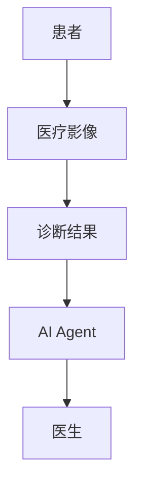
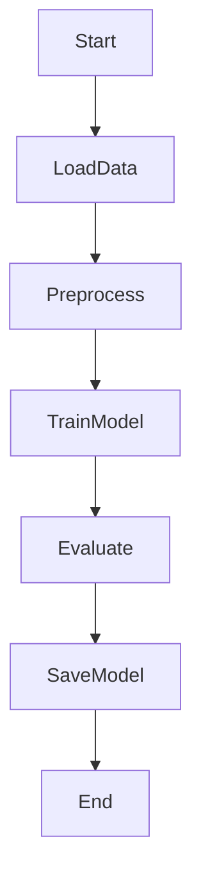
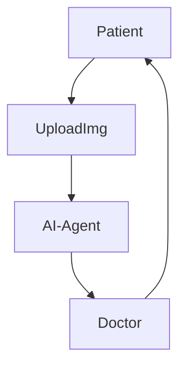

                 


# 智能医疗影像：AI Agent的辅助诊断

## 关键词：AI Agent、医疗影像、辅助诊断、机器学习、深度学习、智能诊断系统

## 摘要：  
随着人工智能技术的飞速发展，AI Agent在医疗影像诊断中的应用日益广泛。本文深入探讨了AI Agent在智能医疗影像中的核心概念、算法原理、系统架构及实际应用。通过对比分析、算法流程图和系统设计，揭示了AI Agent如何提升医疗影像诊断的效率和准确性。同时，本文还提供了具体的项目实战案例，帮助读者理解如何在实际中应用这些技术。文章最后总结了AI Agent在医疗影像中的优势与挑战，并展望了未来的研究方向。

---

# 第一部分: 背景与核心概念

## 第1章: 智能医疗影像与AI Agent概述

### 1.1 智能医疗影像的发展背景  
医疗影像作为现代医学的重要组成部分，是医生诊断疾病的关键工具。然而，随着医疗数据的爆炸式增长，传统的人工诊断方式已难以满足高效、精准的需求。AI Agent的出现，为医疗影像的智能化诊断带来了新的可能性。  

#### 1.1.1 医疗影像技术的演进  
从早期的X光、CT到如今的MRI和超声，医疗影像技术不断进步，为医生提供了更丰富的诊断信息。然而，影像数据的复杂性和数量的增加，使得医生的工作负担加重，诊断效率下降。  

#### 1.1.2 AI技术在医疗领域的应用趋势  
人工智能技术的快速发展，尤其是在图像识别和自然语言处理领域的突破，使得AI在医疗影像分析中的应用成为可能。AI Agent作为一种智能体，能够通过学习和推理，辅助医生进行诊断。  

#### 1.1.3 智能医疗影像的核心价值  
AI Agent在医疗影像中的应用，不仅提高了诊断的效率，还通过算法优化提升了诊断的准确性。特别是在处理海量数据时，AI Agent能够快速识别潜在的病变，帮助医生做出更精准的判断。  

---

### 1.2 AI Agent在医疗影像中的角色  
AI Agent在医疗影像诊断中扮演着多重角色，既是数据处理的工具，也是辅助决策的伙伴。  

#### 1.2.1 AI Agent的基本概念  
AI Agent（智能体）是指能够感知环境、自主决策并执行任务的智能系统。在医疗影像领域，AI Agent通过分析图像数据，提供诊断建议或自动识别病变区域。  

#### 1.2.2 AI Agent在医疗影像诊断中的应用场景  
- **疾病筛查**：AI Agent可以通过训练模型，快速识别肺部结节、乳腺癌等疾病的早期症状。  
- **辅助诊断**：在医生诊断过程中，AI Agent可以提供实时的影像分析结果，帮助医生减少误诊率。  
- **病例管理**：AI Agent可以自动整理和分类病历，提高医院的管理效率。  

#### 1.2.3 AI Agent与传统医疗影像诊断的对比  
AI Agent的优势在于其高效性和准确性，但其依赖于高质量的数据和算法模型。传统诊断则更依赖医生的经验和主观判断。  

---

## 第2章: 智能医疗影像的核心概念与联系  

### 2.1 核心概念原理  
智能医疗影像的核心在于AI Agent对影像数据的分析和处理。  

#### 2.1.1 医疗影像分析的基本原理  
医疗影像分析主要依赖图像处理和模式识别技术。AI Agent通过提取影像中的特征，利用机器学习模型进行分类和预测。  

#### 2.1.2 AI Agent的决策机制  
AI Agent的决策基于训练好的模型，通过输入影像数据，输出诊断结果。其决策过程涉及多个步骤，包括数据预处理、特征提取、模型训练和结果输出。  

#### 2.1.3 智能医疗影像的系统架构  
智能医疗影像系统通常包括数据采集、数据处理、模型训练和诊断输出四个部分。  

---

### 2.2 核心概念对比表  

| 概念         | 特征                          | 优势                          | 局限                          |
|--------------|-------------------------------|-------------------------------|-------------------------------|
| AI Agent     | 自动化决策                    | 高效准确                      | 需依赖数据质量                |
| 医疗影像     | 数据可视化                    | 便于诊断                      | 易受主观影响                  |
| 传统诊断     | 人工分析                      | 个性化强                      | 效率较低                      |

---

### 2.3 ER实体关系图  



---

## 第3章: 智能医疗影像的算法原理  

### 3.1 算法原理概述  
AI Agent的算法选择直接影响诊断的准确性和效率。  

#### 3.1.1 机器学习在医疗影像中的应用  
机器学习模型，如支持向量机（SVM）和随机森林（Random Forest），常用于分类任务。  

#### 3.1.2 深度学习在医疗影像中的应用  
深度学习模型，如卷积神经网络（CNN）和Transformer，因其强大的特征提取能力，成为医疗影像分析的主流方法。  

#### 3.1.3 AI Agent的算法选择  
根据任务需求选择合适的算法。例如，CNN适用于图像分类，而Transformer适用于序列模型。  

---

### 3.2 算法流程图  



---

### 3.3 算法实现代码  

```python
import tensorflow as tf
from tensorflow.keras import layers

model = tf.keras.Sequential([
    layers.Conv2D(32, (3,3), activation='relu', input_shape=(256,256,3)),
    layers.MaxPooling2D((2,2)),
    layers.Conv2D(64, (3,3), activation='relu'),
    layers.MaxPooling2D((2,2)),
    layers.Flatten(),
    layers.Dense(128, activation='relu'),
    layers.Dense(2, activation='softmax')
])
```

---

## 第4章: 智能医疗影像的系统分析与架构设计  

### 4.1 问题场景介绍  
医疗影像诊断系统需要高效处理大量数据，并提供实时反馈。  

### 4.2 系统功能设计  
系统功能包括影像上传、AI分析、结果反馈等。  

### 4.3 系统架构设计  
系统架构采用分层设计，包括数据层、业务逻辑层和表现层。  

### 4.4 系统接口设计  
接口设计包括影像上传接口、诊断结果反馈接口等。  

### 4.5 系统交互流程图  



---

## 第5章: 智能医疗影像的项目实战  

### 5.1 项目介绍  
本项目旨在开发一个基于AI Agent的医疗影像诊断系统。  

### 5.2 环境安装  
需要安装Python、TensorFlow、Keras等工具。  

### 5.3 系统核心实现代码  

```python
import tensorflow as tf
from tensorflow.keras import layers

model = tf.keras.Sequential([
    layers.Conv2D(32, (3,3), activation='relu', input_shape=(256,256,3)),
    layers.MaxPooling2D((2,2)),
    layers.Conv2D(64, (3,3), activation='relu'),
    layers.MaxPooling2D((2,2)),
    layers.Flatten(),
    layers.Dense(128, activation='relu'),
    layers.Dense(2, activation='softmax')
])

model.compile(optimizer='adam', loss='sparse_categorical_crossentropy', metrics=['accuracy'])
model.fit(x_train, y_train, epochs=10, batch_size=32)
```

### 5.4 案例分析  
通过实际案例分析，展示系统的诊断过程和结果。  

---

## 第6章: 最佳实践与小结  

### 6.1 小结  
AI Agent在医疗影像中的应用前景广阔，但需要解决数据质量和算法优化等问题。  

### 6.2 注意事项  
- 数据隐私保护是关键。  
- 系统的可解释性需要进一步提升。  

### 6.3 拓展阅读  
推荐相关书籍和论文，供读者深入学习。  

---

# 作者：AI天才研究院/AI Genius Institute & 禅与计算机程序设计艺术 /Zen And The Art of Computer Programming  

---

本文通过详细分析AI Agent在医疗影像中的应用，揭示了其在提高诊断效率和准确性方面的巨大潜力。希望本文能为读者提供有价值的见解，并激发更多的研究和创新。

