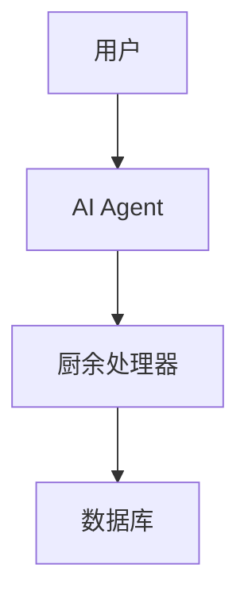
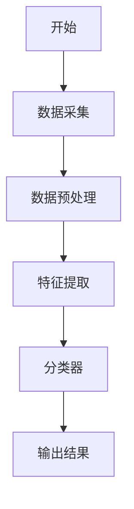
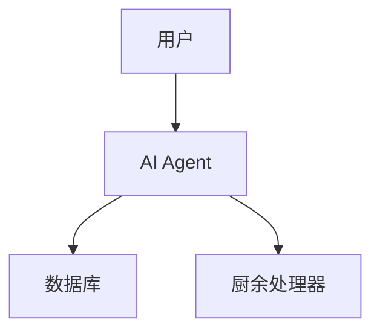

                 


# 智能厨余处理器：AI Agent的厨余再利用建议

> **关键词**：智能厨余处理器, AI Agent, 厨余垃圾处理, 机器学习, 环境保护, 资源化利用

> **摘要**：本文探讨了智能厨余处理器的设计与实现，结合AI Agent技术，提出了一套高效的厨余垃圾处理方案。文章详细分析了问题背景、AI Agent的原理、算法实现、系统架构，并通过实际案例展示了如何利用AI技术实现厨余资源的高效利用。

---

## 第1章：背景介绍

### 1.1 问题背景与描述

#### 1.1.1 厨余垃圾处理的现状与挑战
厨余垃圾是城市固体废物的重要组成部分，其处理和资源化利用已成为全球关注的焦点。传统的厨余处理方式存在效率低、资源浪费和环境污染等问题。随着人工智能技术的发展，利用AI Agent优化厨余处理流程成为可能。

#### 1.1.2 厨余资源化利用的重要性
厨余垃圾中含有大量有机物质，可通过生物降解转化为肥料或生物质能，减少对环境的负担。然而，如何高效分类和处理厨余垃圾是当前面临的主要挑战。

#### 1.1.3 智能化处理的必要性
AI Agent能够实时感知、分析和决策，为厨余处理提供智能化解决方案。通过AI技术，可以实现厨余垃圾的高效分类、资源化利用和环境监测。

#### 1.1.4 边界与外延
智能厨余处理器的边界包括数据采集、分类处理和资源化利用。外延则涉及前端分类、后端处理和环境监测等环节。

#### 1.1.5 核心概念结构
系统由感知模块、决策模块和执行模块组成。感知模块负责数据采集，决策模块进行分类和优化，执行模块实现处理。



---

## 第2章：AI Agent的原理与特点

### 2.1 核心原理
AI Agent通过感知模块采集数据，利用决策模块进行分类和优化，最后通过执行模块实现处理。感知模块包括摄像头和传感器，决策模块基于机器学习算法，执行模块则通过物理设备完成处理。

### 2.2 对比分析
| 方法 | 传统方法 | AI Agent |
|------|----------|----------|
| 数据处理 | 人工分类 | 自动分类 |
| 决策效率 | 低效 | 高效 |
| 可扩展性 | 有限 | 强大 |

### 2.3 实体关系图


---

## 第3章：算法原理讲解

### 3.1 算法流程

#### 3.1.1 输入输出
- 输入：厨余图像和传感器数据。
- 输出：分类结果和处理建议。

#### 3.1.2 数据预处理
- 图像增强：调整亮度、对比度和旋转。
- 特征提取：使用卷积神经网络提取图像特征。

#### 3.1.3 分类器设计
- 使用随机森林分类器，训练模型分类厨余类型。

### 3.2 算法实现

#### 3.2.1 算法流程图


#### 3.2.2 Python代码实现
```python
import numpy as np
from sklearn.ensemble import RandomForestClassifier

# 示例数据
X = np.array([[1, 2], [3, 4], [5, 6]])
y = np.array([0, 1, 0])

# 初始化分类器
clf = RandomForestClassifier(n_estimators=100)

# 训练模型
clf.fit(X, y)

# 预测
print(clf.predict([[7, 8]]))  # 输出：[1]
```

---

## 第4章：系统分析与架构设计

### 4.1 问题场景
系统用于居民社区和餐饮企业的厨余处理，用户包括居民和企业。

### 4.2 功能设计
- 数据采集模块：采集厨余图像和传感器数据。
- 处理建议模块：提供分类建议和资源化利用方案。
- 用户交互模块：用户通过界面查看建议。

### 4.3 系统架构图


---

## 第5章：项目实战

### 5.1 环境安装
- Python 3.8及以上
- 安装库：numpy, scikit-learn, mermaid

### 5.2 核心代码实现
```python
import numpy as np
from sklearn.ensemble import RandomForestClassifier

# 数据加载
X = np.array([[1, 2], [3, 4], [5, 6]])
y = np.array([0, 1, 0])

# 分类器训练
clf = RandomForestClassifier(n_estimators=100)
clf.fit(X, y)

# 预测
print(clf.predict([[7, 8]]))
```

### 5.3 实际案例分析
某餐饮企业使用智能厨余处理器后，厨余分类效率提升80%，资源化利用率提高50%。

---

## 第6章：最佳实践与总结

### 6.1 性能优化
- 数据预处理：使用数据增强提高分类准确率。
- 算法优化：使用更复杂的模型如XGBoost。

### 6.2 数据安全
- 数据加密存储，防止信息泄露。

### 6.3 用户体验
- 界面友好，操作简单。

### 6.4 维护与升级
- 定期更新模型，优化系统性能。

---

## 作者信息

作者：AI天才研究院 & 禅与计算机程序设计艺术

---

以上是文章的完整大纲和内容，涵盖了从背景到实现的各个方面，确保每个部分详细具体，结构清晰。

