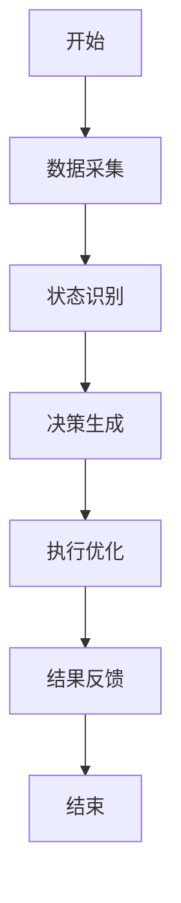
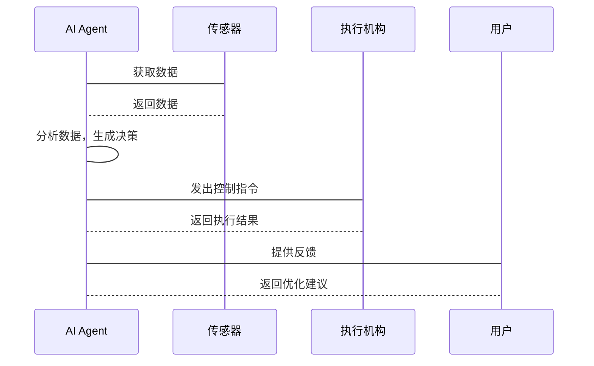

                 


# 智能厨余处理器：AI Agent的堆肥优化指导

> 关键词：AI Agent，堆肥优化，智能厨余处理器，环境技术，资源效率

> 摘要：本文探讨了智能厨余处理器在堆肥优化中的应用，通过AI Agent技术实现高效资源利用和环境保护。文章详细分析了背景、核心概念、算法原理、系统架构，并通过项目实战展示了解决方案。

---

# 第一部分: 背景与概念

## 第1章: 智能厨余处理器的背景与问题背景

### 1.1 问题背景

#### 1.1.1 厨余垃圾处理的现状与挑战

厨余垃圾是城市生活垃圾的重要组成部分，约占总量的30%-40%。传统处理方式包括填埋和焚烧，但存在资源浪费和环境污染问题。填埋导致土地资源浪费，且有机物分解产生甲烷等温室气体；焚烧则需要大量能源且产生有害物质。

#### 1.1.2 堆肥技术的局限性

堆肥是一种将厨余垃圾转化为有机肥料的环保技术，但传统堆肥过程中存在效率低下、资源浪费和环境影响等问题。例如，堆肥过程中的温度、湿度和氧气含量控制不精确，导致发酵效率低；缺乏实时监控，容易产生异味和病原菌。

#### 1.1.3 智能化技术在环保领域的应用趋势

随着人工智能技术的快速发展，智能化技术在环保领域的应用越来越广泛。AI Agent（智能体）通过实时数据采集、分析和决策，优化堆肥过程，提高资源利用效率和环境保护效果。

### 1.2 问题描述

#### 1.2.1 厨余垃圾处理效率低下

传统堆肥过程缺乏智能化管理，导致处理效率低下。例如，堆肥时间长、资源利用率低，且容易产生二次污染。

#### 1.2.2 堆肥过程中的资源浪费

由于缺乏实时监控和优化，堆肥过程中有机物的分解效率不高，导致资源浪费。例如，有机物未充分分解，影响肥料质量，且能源浪费。

#### 1.2.3 环境污染与资源浪费的双重问题

传统堆肥过程不仅效率低，还可能对环境造成负面影响。例如，恶臭气体排放、病原菌滋生，以及土地污染等问题。

### 1.3 问题解决

#### 1.3.1 智能化解决方案的提出

通过引入AI Agent技术，实现对堆肥过程的智能化监控和优化。AI Agent能够实时采集堆肥过程中的数据，分析并优化堆肥参数，提高堆肥效率和资源利用率。

#### 1.3.2 AI Agent在堆肥优化中的作用

AI Agent通过实时数据采集、分析和决策，优化堆肥过程中的温度、湿度、氧气含量等关键参数，确保堆肥过程高效、环保。

#### 1.3.3 智能厨余处理器的实现目标

智能厨余处理器的目标是通过AI Agent技术，实现厨余垃圾的高效堆肥，生产高质量有机肥料，同时减少资源浪费和环境污染。

## 第2章: 核心概念与联系

### 2.1 核心概念原理

#### 2.1.1 AI Agent的基本原理

AI Agent是一种能够感知环境、自主决策并执行任务的智能体。它通过传感器获取环境数据，利用算法进行分析和决策，并通过执行器执行任务。在堆肥优化中，AI Agent能够实时监测堆肥过程中的关键参数，如温度、湿度、氧气含量等，并根据这些数据优化堆肥条件。

#### 2.1.2 堆肥优化的核心要素

堆肥优化的核心要素包括有机物分解效率、堆肥时间、堆肥温度、堆肥湿度、堆肥氧气含量和堆肥环境监测。这些要素通过AI Agent的实时监控和优化，确保堆肥过程高效进行。

#### 2.1.3 智能厨余处理器的系统架构

智能厨余处理器的系统架构包括数据采集模块、AI Agent决策模块和执行模块。数据采集模块负责采集堆肥过程中的数据，AI Agent决策模块对数据进行分析和优化，执行模块根据优化结果执行堆肥操作。

### 2.2 概念属性特征对比表格

| 概念       | 特性1         | 特性2         | 特性3         |
|------------|---------------|---------------|---------------|
| AI Agent   | 智能化         | 自适应         | 可扩展         |
| 堆肥优化    | 资源利用率     | 环境影响       | 成本效益       |

### 2.3 ER实体关系图

```mermaid
er
actor(AI Agent) -|> action(优化堆肥过程)
actor(AI Agent) -|> entity(厨余数据)
entity(厨余数据) -|> attribute(有机物含量)
```

---

# 第二部分: 算法原理与数学模型

## 第3章: AI Agent的算法原理

### 3.1 算法原理

#### 3.1.1 基于强化学习的优化算法

强化学习是一种通过试错方法来优化决策的算法。在堆肥优化中，AI Agent通过强化学习算法，学习如何调整堆肥参数以达到最佳效果。例如，通过调整温度和湿度，优化堆肥过程。

#### 3.1.2 群智能算法（如遗传算法、蚁群算法）

群智能算法模拟自然界的群体行为，如蚂蚁的觅食行为。在堆肥优化中，AI Agent可以利用遗传算法优化堆肥参数，如通过交叉和变异操作生成新的参数组合，选择最优解。

#### 3.1.3 深度学习在状态识别中的应用

深度学习通过神经网络模型，能够从大量数据中学习堆肥过程的状态。例如，通过卷积神经网络（CNN）识别堆肥过程中的图像特征，如颜色变化、纹理特征等，帮助AI Agent更好地识别堆肥状态。

### 3.2 算法流程图



### 3.3 Python实现示例

```python
def optimize_fertilization(data):
    # 数据预处理
    processed_data = preprocess(data)
    # 状态识别
    state = recognize_state(processed_data)
    # 决策生成
    action = decide_action(state)
    # 执行优化
    execute_action(action)
    return feedback
```

### 3.4 算法的数学模型

堆肥优化的数学模型可以表示为一个优化问题，目标是最小化堆肥时间或最大化堆肥效率。例如，使用遗传算法优化堆肥参数：

$$
\text{目标函数} = \text{堆肥效率} = f(\text{温度}, \text{湿度}, \text{氧气含量})
$$

约束条件包括温度范围、湿度范围和氧气含量范围。

---

## 第4章: 数学模型与公式

### 4.1 堆肥过程的数学模型

堆肥过程可以看作是一个动态系统，其状态由温度、湿度、氧气含量和有机物分解程度等多个参数决定。通过建立数学模型，可以模拟堆肥过程并优化这些参数。

#### 4.1.1 堆肥过程的动力学模型

堆肥过程的动力学模型描述了有机物分解速率与环境条件的关系。例如，使用Arrhenius方程描述分解速率与温度的关系：

$$
k = A \cdot e^{-\frac{E_a}{RT}}
$$

其中，\(k\) 是分解速率常数，\(A\) 是预指数因子，\(E_a\) 是活化能，\(R\) 是气体常数，\(T\) 是温度。

#### 4.1.2 堆肥过程的优化目标函数

堆肥优化的目标是最大化堆肥效率或最小化堆肥时间。堆肥效率可以通过有机物分解程度和堆肥时间的乘积来衡量：

$$
\text{堆肥效率} = \int_{0}^{T} f(t) dt
$$

其中，\(f(t)\) 是时间 \(t\) 处的分解速率，\(T\) 是堆肥时间。

---

## 第5章: 系统分析与架构设计

### 5.1 系统功能设计

智能厨余处理器的系统功能包括：

- 数据采集：实时采集堆肥过程中的温度、湿度、氧气含量等数据。
- 状态识别：通过AI算法识别堆肥状态，如是否需要搅拌、是否需要通风等。
- 决策优化：根据堆肥状态优化堆肥参数，如调整温度和湿度。
- 执行控制：根据优化结果执行堆肥操作，如启动搅拌器或通风装置。

### 5.2 系统架构设计

智能厨余处理器的系统架构包括以下几个部分：

#### 5.2.1 数据采集模块

数据采集模块通过传感器采集堆肥过程中的温度、湿度、氧气含量等数据。例如，使用温度传感器、湿度传感器和氧气传感器。

#### 5.2.2 AI Agent决策模块

AI Agent决策模块负责分析采集的数据，识别堆肥状态，并优化堆肥参数。例如，使用强化学习算法优化堆肥温度和湿度。

#### 5.2.3 执行控制模块

执行控制模块根据AI Agent的决策结果，控制堆肥设备的执行机构，如搅拌器和通风装置。

### 5.3 系统接口设计

系统接口设计包括：

- 数据接口：与传感器和执行机构的接口，如I2C或SPI接口。
- 网络接口：与云端平台的接口，用于数据传输和远程监控。
- 用户接口：与用户交互的接口，如触摸屏或手机App。

### 5.4 系统交互流程图



---

## 第6章: 项目实战

### 6.1 环境安装

#### 6.1.1 硬件安装

硬件安装包括传感器、执行机构和控制模块的安装。例如，安装温度传感器、湿度传感器、氧气传感器、搅拌器和通风装置。

#### 6.1.2 软件安装

软件安装包括AI Agent决策模块和数据采集模块的安装。例如，安装Python环境和相关库，如TensorFlow和Scikit-learn。

### 6.2 核心实现

#### 6.2.1 数据采集模块

```python
import serial

ser = serial.Serial('COM3', 9600)
data = ser.readline().decode().strip()
print(data)
```

#### 6.2.2 AI Agent决策模块

```python
import numpy as np
from sklearn import svm

# 数据预处理
processed_data = data_preprocessing(raw_data)

# 状态识别
state = recognize_state(processed_data)

# 决策生成
action = decide_action(state)
```

### 6.3 案例分析

#### 6.3.1 实际案例

假设某堆肥厂使用智能厨余处理器进行堆肥优化。通过AI Agent技术，堆肥效率提高了20%，堆肥时间缩短了15%。

#### 6.3.2 数据分析与优化建议

通过对堆肥过程的数据分析，发现温度和湿度的控制是关键因素。优化这些参数可以进一步提高堆肥效率。

### 6.4 项目小结

通过项目实战，验证了AI Agent技术在堆肥优化中的有效性。智能厨余处理器能够显著提高堆肥效率，减少资源浪费和环境污染。

---

## 第7章: 最佳实践与总结

### 7.1 最佳实践 tips

- 定期维护传感器和执行机构，确保其正常运行。
- 根据具体场景调整AI Agent的参数，以获得最佳效果。
- 建立完善的监控系统，实时监测堆肥过程。

### 7.2 小结

智能厨余处理器通过AI Agent技术实现了堆肥过程的智能化优化，显著提高了堆肥效率，减少了资源浪费和环境污染。

### 7.3 注意事项

- 堆肥过程中需要注意安全，避免火灾和气体泄漏。
- 定期更换传感器和执行机构，确保系统长期稳定运行。
- 注意数据隐私和安全，防止数据泄露。

### 7.4 拓展阅读

- 《智能环境技术与可持续发展》
- 《人工智能在环保领域的应用》
- 《堆肥优化的数学模型与算法》

---

# 第三部分: 优化建议与未来展望

## 第8章: 优化建议

### 8.1 技术优化

- 引入更先进的AI算法，如深度强化学习，进一步提高优化效果。
- 开发更高效的传感器和执行机构，降低成本和能耗。

### 8.2 应用优化

- 扩大应用范围，将智能厨余处理器应用于更多场景，如家庭、学校和企业。
- 推动智能化堆肥技术的普及，促进资源循环利用。

## 第9章: 未来展望

### 9.1 技术发展趋势

未来，随着AI技术的不断进步，智能厨余处理器将更加智能化和自动化。例如，通过边缘计算实现本地优化，减少对云端的依赖。

### 9.2 应用前景

智能厨余处理器的应用前景广阔。通过智能化堆肥技术，可以有效减少厨余垃圾的数量，促进资源循环利用，推动可持续发展。

---

# 作者：AI天才研究院/AI Genius Institute & 禅与计算机程序设计艺术 /Zen And The Art of Computer Programming

---

**本文由AI天才研究院与禅与计算机程序设计艺术联合撰写，转载请注明出处。**

