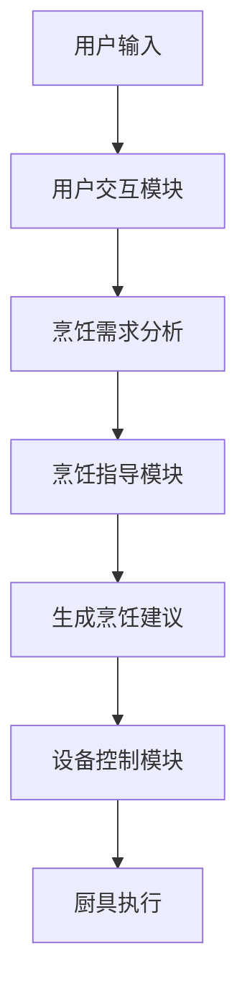
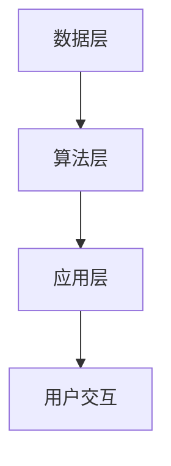

                 


# 智能厨具：AI Agent的烹饪指导系统

## 关键词：智能厨具，AI Agent，烹饪指导系统，机器学习，自然语言处理

## 摘要：  
本文探讨了AI Agent在智能厨具中的应用，特别是其在烹饪指导系统中的作用。通过分析系统架构、算法原理、数学模型和实际案例，本文详细介绍了如何利用AI技术提升烹饪体验，帮助用户实现智能化烹饪。  

---

## 第1章: 智能厨具与AI Agent的背景与概念

### 1.1 智能厨具的定义与分类  
智能厨具是指集成传感器、物联网和AI技术的厨房设备，能够通过用户交互实现自动化烹饪、食材推荐和智能控制。  

#### 1.1.1 智能厨具的定义  
智能厨具结合了传统厨具的功能与智能技术，能够通过传感器和AI算法优化烹饪过程。  

#### 1.1.2 智能厨具的主要分类  
- **智能灶具**：支持语音控制和自动调节火力。  
- **智能锅具**：具备温度监测和智能烹饪模式。  
- **智能厨具套装**：集成多种设备的综合性解决方案。  

#### 1.1.3 智能厨具的市场现状与发展趋势  
当前市场中，智能厨具逐渐普及，预计未来将深度融合AI技术，实现更智能化的烹饪体验。  

### 1.2 AI Agent的基本概念  
AI Agent是一种能够感知环境、自主决策并执行任务的智能体。  

#### 1.2.1 AI Agent的定义  
AI Agent通过感知环境和用户输入，利用算法生成最优决策并执行操作。  

#### 1.2.2 AI Agent的核心特征  
- **自主性**：能够自主决策。  
- **反应性**：实时感知并响应环境变化。  
- **目标导向性**：基于目标优化决策过程。  

#### 1.2.3 AI Agent与传统AI的区别  
AI Agent强调与环境的动态交互，而传统AI主要解决静态问题。  

### 1.3 智能厨具与AI Agent的结合  
AI Agent为智能厨具提供了智能化的烹饪指导功能，通过自然语言处理和机器学习提升用户体验。  

#### 1.3.1 智能厨具中AI Agent的应用场景  
- **语音交互**：用户通过语音指令控制厨具。  
- **智能推荐**：基于用户偏好推荐食谱。  
- **烹饪指导**：实时指导烹饪步骤。  

#### 1.3.2 AI Agent在烹饪指导中的作用  
AI Agent通过分析用户需求和环境数据，提供个性化的烹饪建议和实时指导。  

#### 1.3.3 智能厨具与AI Agent结合的实现方式  
通过嵌入AI芯片和传感器，智能厨具能够实时采集数据并借助AI算法优化烹饪过程。  

---

## 第2章: 智能厨具AI Agent的系统架构  

### 2.1 系统核心模块  
智能厨具AI Agent系统主要由用户交互模块、烹饪指导模块和设备控制模块组成。  

#### 2.1.1 用户交互模块  
负责接收用户的输入指令，并通过语音或屏幕与用户互动。  

#### 2.1.2 烹饪指导模块  
基于用户需求和环境数据，生成烹饪建议和步骤。  

#### 2.1.3 设备控制模块  
根据AI Agent的决策，控制厨具的运行状态。  

### 2.2 系统功能设计  
系统功能设计基于用户需求分析，划分为用户交互、烹饪指导和设备控制三大模块。  

#### 2.2.1 用户需求分析  
通过用户调研和数据分析，明确用户对智能厨具的主要需求。  

#### 2.2.2 系统功能模块划分  
- **用户交互模块**：负责用户输入和输出。  
- **烹饪指导模块**：提供烹饪建议和步骤。  
- **设备控制模块**：控制厨具的运行。  

#### 2.2.3 系统功能流程图  


### 2.3 系统架构设计  
系统采用分层架构，包括数据层、算法层和应用层。  

#### 2.3.1 分层架构设计  
- **数据层**：采集和存储烹饪数据。  
- **算法层**：处理数据并生成决策。  
- **应用层**：与用户交互并执行操作。  

#### 2.3.2 模块间交互关系  
各模块通过API接口进行数据传递和功能调用。  

#### 2.3.3 系统架构图  


---

## 第3章: AI Agent在烹饪指导中的算法原理  

### 3.1 烹饪指导算法概述  
烹饪指导算法主要基于机器学习和自然语言处理技术。  

#### 3.1.1 基于规则的烹饪指导  
通过预设规则提供简单的烹饪建议。  

#### 3.1.2 基于机器学习的烹饪推荐  
利用用户数据和历史行为推荐食谱。  

#### 3.1.3 基于自然语言处理的交互  
通过NLP技术实现自然语言对话。  

### 3.2 烹饪推荐算法  
基于用户偏好推荐食谱，主要采用协同过滤和内容推荐算法。  

#### 3.2.1 基于协同过滤的推荐算法  
计算用户之间的相似度，推荐相似用户的食谱。  

公式：$$ sim(i,j) = \frac{\sum_{k} r_{ik} r_{jk}}{\sqrt{\sum_{k} r_{ik}^2} \sqrt{\sum_{k} r_{jk}^2}} $$  

#### 3.2.2 基于内容的推荐算法  
基于食谱的特征推荐相似食谱。  

#### 3.2.3 混合推荐算法  
结合协同过滤和内容推荐的优势，提升推荐精度。  

### 3.3 自然语言处理在烹饪指导中的应用  
通过NLP技术实现烹饪步骤的自动生成和对话理解。  

#### 3.3.1 基于词袋模型的烹饪指令解析  
将烹饪指令转换为关键词向量，用于理解和执行。  

#### 3.3.2 基于序列模型的烹饪步骤生成  
利用序列模型生成连贯的烹饪步骤。  

#### 3.3.3 基于注意力机制的烹饪对话理解  
通过注意力机制理解对话中的关键信息。  

---

## 第4章: 烹饪指导系统的数学模型与公式  

### 4.1 烹饪推荐算法的数学模型  
协同过滤算法通过计算用户相似度推荐食谱。  

公式：$$ sim(i,j) = \frac{\sum_{k} r_{ik} r_{jk}}{\sqrt{\sum_{k} r_{ik}^2} \sqrt{\sum_{k} r_{jk}^2}} $$  

### 4.2 烹饪对话理解的数学模型  
基于序列模型的烹饪对话理解，公式如下：  
$$ P(y|x) = \frac{P(y|x,z)}{P(z)} $$  

---

## 第5章: 烹饪指导系统的项目实战  

### 5.1 环境配置  
安装必要的库和工具，例如Python、TensorFlow和Keras。  

### 5.2 核心代码实现  
实现AI Agent的烹饪指导功能，包括用户交互、烹饪推荐和设备控制。  

#### 5.2.1 用户交互模块  
```python
def user_interaction():
    while True:
        command = input("请输入指令：")
        process_command(command)
```

#### 5.2.2 烹饪推荐模块  
```python
def recommend_recipe(user_id):
    # 调用协同过滤算法推荐食谱
    return recipes
```

#### 5.2.3 设备控制模块  
```python
def control_device(action):
    # 发送指令到厨具设备
    pass
```

### 5.3 案例分析  
通过具体案例分析烹饪指导系统的实际应用。  

### 5.4 项目总结  
总结项目成果，分析存在的问题，并提出改进建议。  

---

## 第6章: 最佳实践与小结  

### 6.1 最佳实践  
- 定期更新模型，提升推荐精度。  
- 提供多语言支持，扩大用户群体。  

### 6.2 小结  
本文详细介绍了AI Agent在智能厨具中的应用，通过系统架构、算法原理和项目实战的讲解，展示了如何利用AI技术提升烹饪体验。  

### 6.3 注意事项  
- 数据隐私保护至关重要。  
- 系统稳定性需保证。  

### 6.4 拓展阅读  
推荐相关领域的书籍和论文，供读者深入学习。  

---

## 作者：AI天才研究院/AI Genius Institute & 禅与计算机程序设计艺术 /Zen And The Art of Computer Programming

