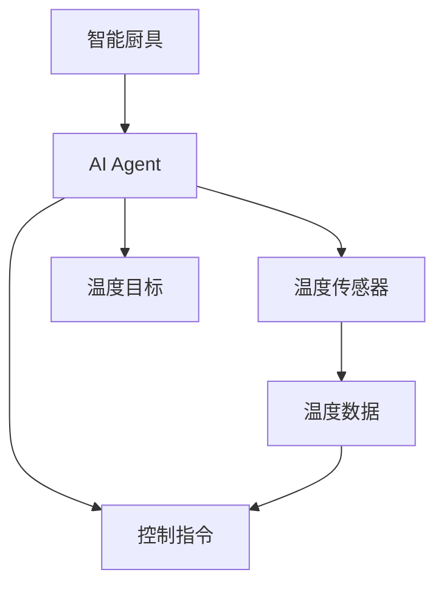
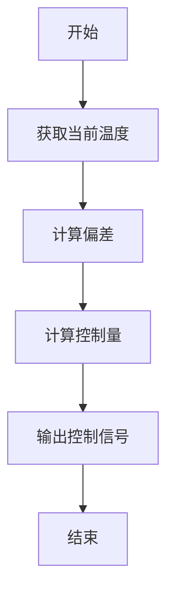
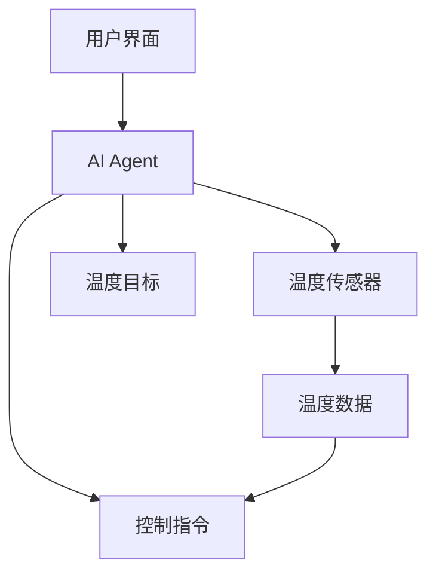

                 


# 智能厨具：AI Agent的烹饪温度控制

## 关键词：智能厨具，AI Agent，烹饪温度控制，PID算法，模糊控制，机器学习，物联网

## 摘要：本文详细探讨了AI Agent在智能厨具中的烹饪温度控制应用，从理论基础到算法实现，再到系统架构设计，最后通过实际案例分析，深入剖析了智能厨具的AI温度控制技术。文章旨在为读者提供全面的技术见解，帮助理解并掌握智能厨具中的AI温度控制技术。

---

# 第1章: 智能厨具与AI Agent的背景介绍

## 1.1 智能厨具的发展历程
### 1.1.1 传统厨具的局限性
传统厨具依赖手动操作，存在温度不稳定、操作复杂、效率低下等问题。

### 1.1.2 智能化厨具的兴起
随着物联网和人工智能技术的发展，智能厨具逐渐普及，能够实现自动化控制和智能化管理。

### 1.1.3 AI技术在厨具中的应用
AI技术通过传感器、数据处理和智能决策，提升了厨具的功能性和用户体验。

## 1.2 AI Agent的基本概念
### 1.2.1 什么是AI Agent
AI Agent是一种能够感知环境、做出决策并执行动作的智能体，具备自主性、反应性、目标导向和社交能力。

### 1.2.2 AI Agent的核心特征
- 自主性：能够独立决策和行动。
- 反应性：能够实时感知环境并做出反应。
- 目标导向：基于目标进行优化决策。
- 社交能力：能够与其他智能体或系统进行交互。

### 1.2.3 AI Agent与传统自动控制的区别
AI Agent能够根据环境动态调整策略，而传统自动控制依赖预设规则。

## 1.3 智能厨具中的AI Agent应用
### 1.3.1 智能厨具的功能需求
- 实时温度监测
- 智能调节温度
- 多场景模式切换
- 用户自定义功能

### 1.3.2 AI Agent在烹饪温度控制中的作用
AI Agent通过学习和优化算法，实现精准的温度控制，提升烹饪效果和用户体验。

### 1.3.3 智能厨具的市场现状与发展趋势
智能厨具市场快速增长，AI Agent的应用将成为未来的主要趋势。

## 1.4 本章小结
本章介绍了智能厨具的发展背景、AI Agent的基本概念及其在烹饪温度控制中的应用，为后续内容奠定了基础。

---

# 第2章: 智能厨具AI Agent的核心概念与联系

## 2.1 核心概念原理
### 2.1.1 温度控制的数学模型
温度控制是一个典型的动态过程，可以通过数学模型描述其变化规律。

### 2.1.2 AI Agent的决策机制
AI Agent通过感知环境信息、分析数据并做出决策，实现对温度的精准控制。

### 2.1.3 智能厨具的系统架构
智能厨具由传感器、AI Agent、执行机构和用户界面组成，各部分协同工作实现温度控制。

## 2.2 核心概念属性特征对比
| 特性 | 温度控制 | AI Agent |
|------|----------|----------|
| 输入 | 温度数据 | 用户指令、环境数据 |
| 输出 | 控制信号 | 执行指令 |
| 目标 | 达到设定温度 | 优化烹饪效果 |
| 反应 | 瞬时响应 | 实时调整策略 |

## 2.3 ER实体关系图


## 2.4 本章小结
本章详细介绍了智能厨具AI Agent的核心概念及其在温度控制中的应用，通过对比分析和实体关系图，进一步明确了系统架构和各部分之间的关系。

---

# 第3章: AI Agent温度控制算法原理

## 3.1 算法原理概述
### 3.1.1 基于PID的温度控制算法
PID（比例-积分-微分）控制是一种经典的控制方法，适用于线性系统。

### 3.1.2 基于模糊逻辑的温度控制算法
模糊逻辑控制能够处理非线性系统和不确定性，适合复杂场景。

### 3.1.3 基于机器学习的温度控制算法
机器学习算法通过数据训练，能够自适应地优化控制策略。

## 3.2 算法实现流程


## 3.3 数学模型与公式
### 3.3.1 PID控制公式
$$u(t) = K_p \cdot e(t) + K_i \cdot \int_{0}^{t} e(\tau) d\tau + K_d \cdot \frac{de(t)}{dt}$$

### 3.3.2 模糊控制规则
```plaintext
如果温度偏差大，那么调整幅度大
如果温度偏差小，那么调整幅度小
```

### 3.3.3 机器学习模型
$$y = \theta_0 + \theta_1x_1 + \theta_2x_2 + ... + \theta_nx_n$$

## 3.4 本章小结
本章详细介绍了三种温度控制算法及其原理，分析了它们在不同场景下的适用性。

---

# 第4章: 智能厨具系统架构设计

## 4.1 问题场景介绍
### 4.1.1 烹饪温度控制的挑战
温度波动、环境干扰、用户需求多样化等问题亟待解决。

### 4.1.2 用户需求分析
用户需求包括精准控温、操作便捷、智能化推荐等。

### 4.1.3 系统目标设定
实现高精度温度控制、智能化决策、用户友好的交互界面。

## 4.2 系统功能设计
### 4.2.1 温度传感器数据采集
通过传感器实时采集烹饪过程中的温度数据。

### 4.2.2 AI Agent决策模块
基于传感器数据和用户需求，AI Agent生成控制指令。

### 4.2.3 控制执行模块
根据AI Agent的指令，执行机构调整火力或电磁炉功率。

## 4.3 系统架构设计


## 4.4 本章小结
本章从问题场景出发，详细设计了智能厨具的系统架构，明确了各模块的功能和交互关系。

---

# 第5章: 项目实战

## 5.1 环境安装
### 5.1.1 安装Python和必要的库
安装Python 3.8及以上版本，安装numpy、scipy、matplotlib等库。

### 5.1.2 安装硬件设备
安装温度传感器（如DS18B20）和控制模块（如Raspberry Pi）。

## 5.2 系统核心实现源代码
### 5.2.1 PID控制算法实现
```python
import numpy as np

def pid_control(setpoint, current_temp, kp, ki, kd, dt):
    error = setpoint - current_temp
    integral = integral_prev + error * dt
    derivative = (error - error_prev) / dt
    output = kp * error + ki * integral + kd * derivative
    return output
```

### 5.2.2 模糊控制算法实现
```python
def fuzzy_control(error):
    if error > 20:
        return 'high'
    elif 10 < error <= 20:
        return 'medium'
    else:
        return 'low'
```

### 5.2.3 机器学习模型实现
```python
from sklearn.linear_model import LinearRegression

model = LinearRegression()
model.fit(X, y)
```

## 5.3 代码应用解读与分析
### 5.3.1 PID控制代码解读
PID控制算法通过计算比例、积分和微分项，输出控制信号。

### 5.3.2 模糊控制代码解读
模糊逻辑控制通过规则判断，输出调整幅度。

### 5.3.3 机器学习模型解读
机器学习模型通过训练数据，学习最优控制策略。

## 5.4 实际案例分析
### 5.4.1 烤蛋糕的温度控制
设定温度为180°C，通过AI Agent实现精准控温。

### 5.4.2 煎牛排的温度控制
根据用户需求，动态调整温度和烹饪时间。

## 5.5 本章小结
本章通过实际案例分析，展示了AI Agent在烹饪温度控制中的应用，验证了算法的有效性和实用性。

---

# 第6章: 总结与展望

## 6.1 总结
本文详细介绍了AI Agent在智能厨具中的温度控制应用，从理论到实践，全面剖析了系统的实现过程。

## 6.2 展望
未来，随着AI技术的进步，智能厨具将更加智能化和个性化，为用户带来更好的烹饪体验。

## 6.3 注意事项
在实际应用中，需注意系统的稳定性和安全性，避免温度失控带来的安全隐患。

## 6.4 最佳实践 Tips
- 定期校准传感器，确保数据准确性。
- 根据具体场景选择合适的控制算法。
- 提供用户友好的交互界面，提升用户体验。

## 6.5 本章小结
总结全文内容，强调AI Agent在智能厨具中的重要性，并展望未来的发展方向。

---

# 作者：AI天才研究院/AI Genius Institute & 禅与计算机程序设计艺术 /Zen And The Art of Computer Programming

---

以上是《智能厨具：AI Agent的烹饪温度控制》的技术博客文章目录大纲和部分正文内容。希望对您有所帮助！

