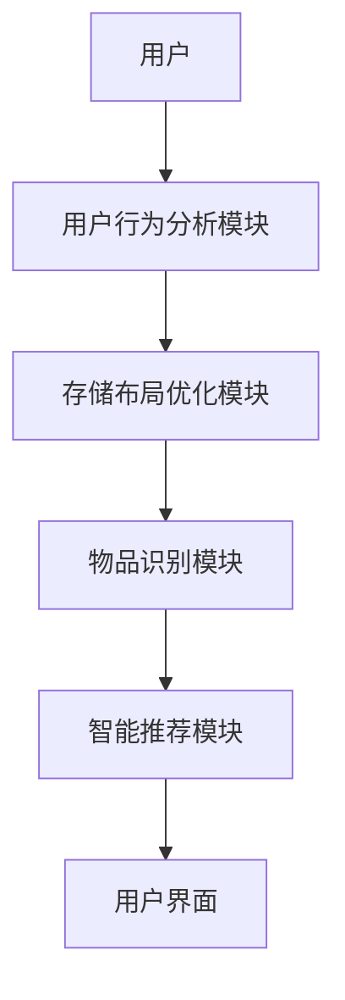
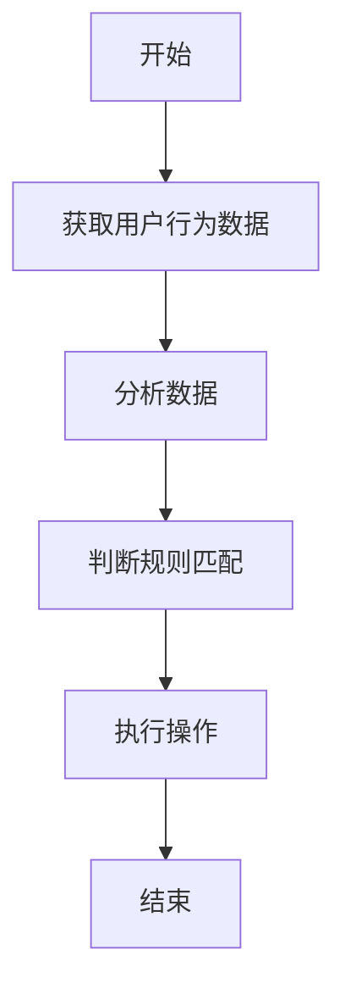
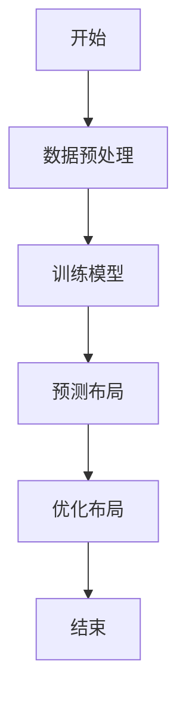
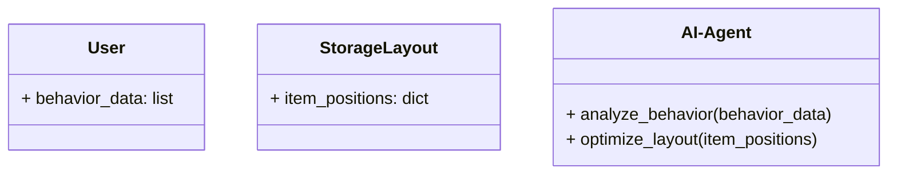

                 


# 智能厨房吊柜：AI Agent的厨房效率提升建议

---

## 关键词

- 智能厨房吊柜
- AI Agent
- 厨房效率
- 智能家居
- 系统架构
- 人工智能

---

## 摘要

本文探讨了AI Agent在厨房吊柜中的应用，通过分析厨房效率低下问题，提出智能厨房吊柜的设计思路。文章从背景介绍、核心概念、算法原理、系统架构、项目实战到最佳实践，详细阐述了如何利用AI技术优化厨房吊柜的功能，提升用户体验。

---

## 正文

---

### 第一部分：背景介绍

#### 第1章：问题背景与描述

##### 1.1 问题背景

现代厨房中，吊柜作为重要的储物空间，往往面临使用效率低下、空间浪费等问题。用户在使用过程中，常常难以快速找到所需物品，导致厨房使用效率降低。此外，传统厨房吊柜不具备智能化功能，无法根据用户习惯优化存储布局。

##### 1.2 问题描述

- **问题一**：厨房吊柜空间利用不合理，物品查找效率低。
- **问题二**：用户行为和习惯无法有效引导存储布局优化。
- **问题三**：传统厨房吊柜缺乏智能化，无法与其他智能家居设备协同工作。

##### 1.3 问题解决

引入AI Agent技术，通过智能化算法优化存储布局，提升物品查找效率，并实现与智能家居设备的协同工作。

##### 1.4 边界与外延

- **系统边界**：智能厨房吊柜的功能范围，包括物品识别、存储优化、智能推荐等。
- **外延功能**：与其他智能家居设备的协同，如智能冰箱、智能灶具等。
- **交互方式**：支持语音控制、手机APP操作等。

##### 1.5 概念结构与核心要素

- **核心概念**：AI Agent、厨房吊柜、智能化存储。
- **核心要素**：物品识别、存储布局优化、用户行为分析。

---

### 第二部分：核心概念与联系

#### 第2章：AI Agent的基本原理

##### 2.1 AI Agent的定义与特点

- **定义**：AI Agent是一种能够感知环境、自主决策并执行任务的智能体。
- **特点**：
  - 智能感知
  - 自主决策
  - 人机交互
  - 持续优化

##### 2.2 AI Agent的工作原理

- **感知环境**：通过传感器或摄像头获取环境信息。
- **判断与决策**：基于感知信息进行分析和决策。
- **执行操作**：根据决策结果执行操作，如调整存储布局。

##### 2.3 AI Agent与厨房吊柜的结合

- **功能**：优化存储布局、智能推荐、物品识别。
- **优势**：提升厨房效率，增强用户体验。

---

#### 第3章：AI Agent的系统架构

##### 3.1 系统架构设计



##### 3.2 核心模块功能

- **用户行为分析模块**：分析用户的使用习惯，优化存储布局。
- **存储布局优化模块**：根据分析结果调整物品存储位置。
- **物品识别模块**：识别用户放入或取出的物品。
- **智能推荐模块**：推荐相关物品，提升查找效率。

---

### 第三部分：算法原理讲解

#### 第4章：基于规则的推理算法

##### 4.1 算法流程



##### 4.2 代码实现

```python
def get_recommendations(user_behavior):
    # 分析用户行为
    frequently_used = get_frequently_used_items(user_behavior)
    # 推荐相关物品
    recommendations = get_recommendations_from_frequently_used(frequently_used)
    return recommendations
```

##### 4.3 数学模型

$$ 推荐概率 = \frac{使用频率}{总操作次数} $$

---

#### 第5章：机器学习模型

##### 5.1 算法流程



##### 5.2 代码实现

```python
import tensorflow as tf
model = tf.keras.Sequential([
    tf.keras.layers.Dense(64, activation='relu'),
    tf.keras.layers.Dense(1, activation='sigmoid')
])
model.compile(optimizer='adam', loss='binary_crossentropy')
```

##### 5.3 数学模型

$$ 概率预测 = \sigma(wx + b) $$

其中，$\sigma$ 是sigmoid函数，$w$ 和 $b$ 是模型参数。

---

### 第四部分：系统分析与架构设计

#### 第6章：系统分析

##### 6.1 问题场景

- **场景一**：用户需要快速找到所需物品。
- **场景二**：用户希望优化厨房存储布局。

##### 6.2 系统功能设计



---

#### 第7章：系统架构设计

##### 7.1 系统架构


##### 7.2 接口设计

- **输入接口**：用户行为数据、物品识别请求。
- **输出接口**：优化后的存储布局、智能推荐结果。

---

### 第五部分：项目实战

#### 第8章：环境安装

##### 8.1 安装Python和相关库

```bash
pip install numpy tensorflow scikit-learn
```

##### 8.2 安装TensorFlow

```bash
pip install tensorflow
```

---

#### 第9章：系统实现

##### 9.1 核心功能实现

```python
def optimize_storage_layout(items):
    # 分析物品使用频率
    frequency = calculate_frequency(items)
    # 优化布局
    optimized_layout = optimize(frequency)
    return optimized_layout
```

##### 9.2 代码解读

- **物品识别模块**：通过摄像头或传感器识别物品。
- **存储布局优化模块**：根据使用频率优化存储位置。

---

#### 第10章：案例分析

##### 10.1 实际案例

- **案例一**：用户常用物品存储位置优化。
- **案例二**：智能推荐减少查找时间。

---

### 第六部分：最佳实践

#### 第11章：小结

- AI Agent在厨房吊柜中的应用显著提升了厨房效率。
- 通过智能化设计，优化存储布局和用户交互体验。

---

#### 第12章：注意事项

- **数据隐私**：确保用户行为数据的安全性。
- **系统兼容性**：确保与现有智能家居设备兼容。
- **用户体验**：注重用户交互设计，提升易用性。

---

#### 第13章：拓展阅读

- 《强化学习入门》
- 《人工智能在智能家居中的应用》

---

## 作者信息

作者：AI天才研究院 & 禅与计算机程序设计艺术

