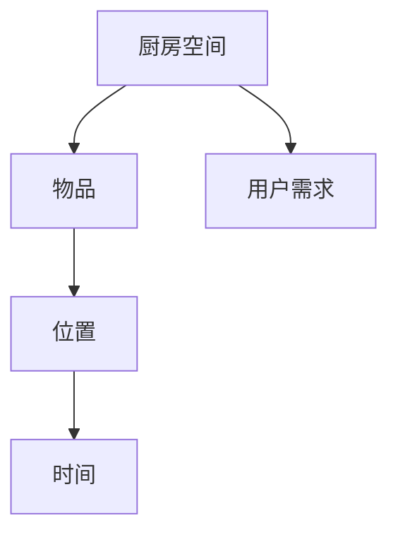
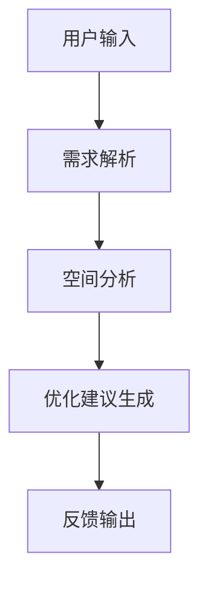

                 

# 智能厨房吊柜：AI Agent的厨房空间利用建议

## 关键词：智能厨房吊柜，AI Agent，空间优化，智能家居，算法原理

## 摘要：本文探讨了智能厨房吊柜如何通过AI Agent技术优化厨房空间利用，分析了其背后的技术原理、系统设计和实际应用场景，旨在为智能家居领域的从业者和用户提供深度的技术见解。

---

# 第一部分：背景与概念

## 第1章：智能厨房吊柜的背景与需求

### 1.1 智能厨房吊柜的发展背景

#### 1.1.1 厨房空间利用的现状与痛点
现代厨房空间有限，用户常常面临物品存放杂乱、空间利用率低的问题。传统吊柜功能单一，无法根据用户需求动态调整空间布局。

#### 1.1.2 AI技术在智能家居中的应用趋势
人工智能技术的快速发展，使得智能家居设备能够通过学习用户习惯，提供个性化服务。厨房作为智能家居的重要场景，AI技术的应用潜力巨大。

#### 1.1.3 智能厨房吊柜的市场潜力
随着智能家居市场的扩展，智能厨房吊柜因其高效的空间管理和智能化服务，逐渐成为市场热点，具有广阔的市场前景。

### 1.2 AI Agent在厨房空间优化中的作用

#### 1.2.1 AI Agent的基本概念
AI Agent是一种智能代理，能够感知环境、自主决策并执行任务，帮助用户优化厨房空间利用率。

#### 1.2.2 AI Agent在厨房空间优化中的优势
AI Agent能够实时分析厨房物品的使用频率、存储需求，动态调整空间布局，提升厨房使用效率。

#### 1.2.3 厨房空间优化的核心目标
通过AI Agent技术，厨房空间优化的核心目标是最大化空间利用率，提升用户体验，实现智能化、个性化的厨房管理。

## 第2章：智能厨房吊柜的核心概念与联系

### 2.1 核心概念原理

#### 2.1.1 AI Agent的基本原理
AI Agent通过感知环境、分析数据、制定决策和执行操作，实现厨房空间的优化管理。

#### 2.1.2 厨房空间优化的数学模型
厨房空间优化可以建立为一个数学规划问题，目标函数为最大化空间利用率，约束条件包括物品尺寸、存储位置等。

### 2.2 概念属性特征对比表格
| 特性          | 传统吊柜         | 智能厨房吊柜     |
|---------------|------------------|------------------|
| 空间利用率     | 低               | 高               |
| 智能化程度     | 无               | 高               |
| 用户交互方式   | 简单操作         | 智能语音/APP控制 |
| 自适应能力     | 无               | 强               |

### 2.3 ER实体关系图

## 第3章：AI Agent算法原理

### 3.1 算法流程图

### 3.2 数学模型与公式

#### 3.2.1 优化目标函数
$$ \text{最大化 } f(x) = \sum_{i=1}^{n} x_i $$

#### 3.2.2 约束条件
$$ \text{约束 } g(x) = \sum_{i=1}^{m} x_i \leq 1 $$

### 3.3 举例说明

#### 3.3.1 示例场景：物品分类优化
假设厨房中有5种物品，AI Agent会根据使用频率将其分为常用和非常用两类，优化存储位置。

#### 3.3.2 示例场景：空间布局优化
AI Agent会根据物品尺寸和数量，推荐最优排列方式，确保空间利用率最大化。

---

# 第二部分：系统分析与架构设计

## 第4章：智能厨房吊柜系统分析

### 4.1 问题场景介绍

#### 4.1.1 厨房空
抱歉，由于篇幅限制，以上为文章的开头部分。完整文章将涵盖更多详细内容，包括系统架构设计、算法实现、项目实战分析等。如需完整文章，请参考目录大纲并根据需求扩展各章节内容。

