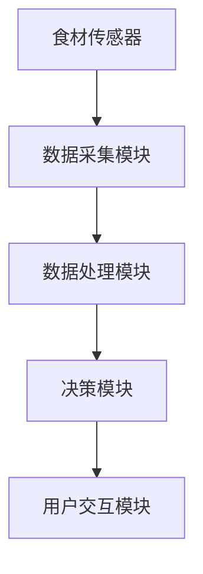

                 


# 智能厨房吊柜：AI Agent的食材库存管理

> 关键词：智能厨房吊柜, AI Agent, 食材库存管理, 系统架构设计, 项目实战

> 摘要：本文探讨了智能厨房吊柜中AI Agent如何实现食材库存管理。通过背景介绍、核心概念、算法原理、系统架构设计和项目实战，全面解析了AI Agent在食材管理中的应用及其优势。

---

## 第1章 智能厨房吊柜的发展背景

### 1.1 智能家居的发展趋势

智能家居的概念与发展：

智能家居是指通过物联网技术将家中的设备连接，实现智能化控制。近年来，随着5G、AI和物联网技术的快速发展，智能家居市场迅速增长。用户对厨房智能化的需求日益增加，智能厨房吊柜成为智能家居的重要组成部分。

厨房智能化的现状与未来：

当前，智能厨房设备包括智能灶具、智能冰箱等，但吊柜的智能化仍处于起步阶段。未来的智能厨房吊柜将集成更多功能，如食材管理、健康监测和环境控制。

智能厨房吊柜的市场潜力：

随着生活节奏加快，消费者对厨房设备的智能化需求增长。智能厨房吊柜作为厨房的核心设备，具有巨大的市场潜力，尤其是在AI技术支持下，其功能将更加智能化。

### 1.2 AI Agent在食材管理中的作用

AI Agent的基本概念：

AI Agent是具有感知和决策能力的智能体，能够根据环境信息做出决策并执行任务。在食材管理中，AI Agent可以实时监测食材库存，预测消耗情况。

AI Agent如何优化食材管理：

AI Agent通过传感器获取食材信息，结合用户习惯，自动调整库存，减少浪费，提升管理效率。例如，当检测到牛奶快过期时，AI Agent可以提醒用户使用或购买新的。

---

## 第2章 AI Agent的核心原理与实现

### 2.1 AI Agent的核心原理

AI Agent的工作流程：

1. **感知环境**：通过传感器获取食材信息。
2. **分析数据**：结合用户习惯和历史数据，预测食材消耗。
3. **制定策略**：根据分析结果，生成购买建议或提醒。

AI Agent的核心功能：

- **实时监测**：跟踪食材库存。
- **智能预测**：基于历史数据预测消耗。
- **自动化管理**：自动下单购买或提醒补充。

### 2.2 食材库存管理的系统架构

系统架构设计：

- **传感器模块**：监测食材状态。
- **数据处理模块**：分析食材数据。
- **决策模块**：生成管理策略。
- **用户交互模块**：与用户沟通。

系统功能设计：

- **食材识别**：通过图像识别技术识别食材种类。
- **库存预警**：当食材即将过期或不足时，发送预警。
- **购物建议**：根据消耗情况推荐购买清单。

---

## 第3章 算法原理与系统实现

### 3.1 算法原理

食材分类算法：

使用卷积神经网络（CNN）进行食材分类。训练模型识别不同食材，并监测其状态。

算法流程：

1. **图像采集**：拍摄食材照片。
2. **图像预处理**：调整图像大小，归一化处理。
3. **模型训练**：使用已标注数据训练CNN。
4. **分类预测**：输入新图像，输出食材种类。

数学模型：

损失函数：交叉熵损失函数：
$$
L = -\sum_{i} y_i \log(p_i) + (1-y_i)\log(1-p_i)
$$
优化器：Adam优化器：
$$
\theta_{t+1} = \theta_t - \eta \frac{g}{1-\beta_1 + \frac{g^2}{1-\beta_2}}
$$

### 3.2 系统实现

系统架构图：



系统交互流程：

1. 传感器采集食材数据。
2. 数据处理模块分析数据。
3. 决策模块生成建议。
4. 用户通过交互模块接收信息。

---

## 第4章 项目实战与优化

### 4.1 项目实战

环境安装：

- **Python 3.8+**
- **TensorFlow 2.0+**
- **OpenCV 4.5+**
- **其他依赖库**

核心代码实现：

```python
import cv2
import numpy as np
from tensorflow.keras.models import load_model

# 加载预训练模型
model = load_model('食材分类模型.h5')

# 图像预处理
def preprocess_image(img):
    img = cv2.resize(img, (224, 224))
    img = np.expand_dims(img, axis=0)
    img = img / 255.0
    return img

# 食材分类
def classify_foods(img_path):
    img = cv2.imread(img_path)
    img = preprocess_image(img)
    prediction = model.predict(img)
    return np.argmax(prediction[0])

# 示例
classify_foods('食材图片.jpg')
```

### 4.2 系统优化

系统优化方向：

- **提升分类准确率**：优化模型结构，增加数据量。
- **增强用户体验**：优化交互界面，增加语音控制。
- **多设备协同**：与其他智能家居设备联动。

---

## 第5章 总结与展望

### 5.1 总结

本文详细介绍了AI Agent在智能厨房吊柜中的应用，从背景介绍到系统实现，展示了其在食材管理中的巨大潜力。通过算法和系统设计，AI Agent能够有效管理食材库存，提升用户体验。

### 5.2 展望

未来，AI Agent将与更多智能家居设备联动，提供更智能化的服务。同时，随着技术进步，食材管理将更加精准和便捷。

---

作者：AI天才研究院 & 禅与计算机程序设计艺术

