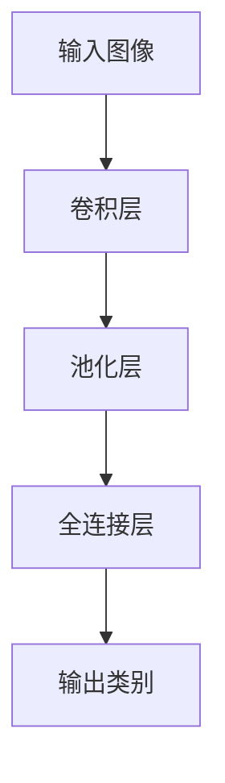
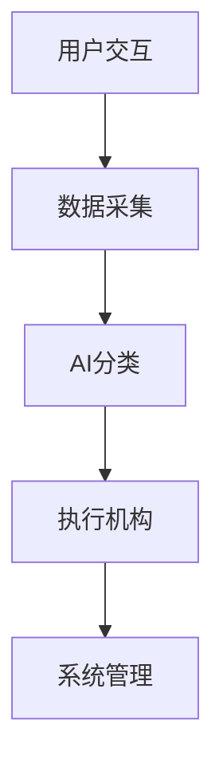

                 


# 智能厨房垃圾处理器：AI Agent的废物分类

> 关键词：AI Agent，废物分类，智能厨房垃圾处理器，物联网，AI垃圾分类系统

> 摘要：本文探讨了AI Agent在厨房垃圾处理器中的应用，特别是其如何通过智能废物分类技术提高垃圾处理效率。文章从背景介绍、核心概念、算法原理、系统设计到项目实战，详细分析了AI Agent在垃圾分类中的潜力和实现方法，为读者提供全面的技术视角。

---

# 第1章: 智能厨房垃圾处理器的背景介绍

## 1.1 问题背景

### 1.1.1 厨房垃圾处理的现状与挑战

随着城市化进程的加快，厨房垃圾的产生量急剧增加。据统计，全球每年产生的垃圾量超过20亿吨，其中厨房垃圾占比超过30%。传统的垃圾处理方式效率低下，分类不精确，导致资源浪费和环境污染。如何高效分类和处理厨房垃圾成为亟待解决的问题。

### 1.1.2 垃圾分类的重要性

垃圾分类是实现资源回收和减少环境污染的关键步骤。通过分类，可回收物可以再利用，厨余垃圾可以转化为肥料或生物燃料，其他垃圾则采用焚烧或填埋处理。AI技术的应用能够显著提高分类的准确性和效率。

### 1.1.3 AI Agent在垃圾处理中的应用潜力

AI Agent（智能体）是一种能够感知环境、自主决策并执行任务的智能系统。在垃圾处理中，AI Agent可以通过图像识别、传感器数据和机器学习模型，实现对垃圾的自动分类和处理，从而提高效率和降低成本。

## 1.2 问题描述

### 1.2.1 厨房垃圾分类的复杂性

厨房垃圾种类繁多，包括果皮、菜叶、塑料袋、玻璃瓶等，分类难度大。人工分类容易出错，且效率低下。

### 1.2.2 AI Agent在垃圾分类中的角色

AI Agent通过视觉识别和机器学习算法，能够快速准确地识别和分类垃圾，解决人工分类的低效问题。

### 1.2.3 垃圾分类的边界与外延

垃圾分类的边界包括垃圾的物理特性、化学成分等，外延则涉及资源回收、环境保护等领域。

## 1.3 问题解决与核心概念

### 1.3.1 AI Agent的基本概念

AI Agent是一种能够感知环境、自主决策并执行任务的智能系统，具备感知、决策和执行能力。

### 1.3.2 智能厨房垃圾处理器的核心要素

智能厨房垃圾处理器的核心要素包括图像识别系统、传感器网络、AI算法和执行机构。

### 1.3.3 核心概念的结构与组成

AI Agent的结构包括感知层、决策层和执行层，各层协同工作以实现垃圾分类任务。

---

# 第2章: AI Agent的核心概念与联系

## 2.1 AI Agent的基本原理

### 2.1.1 感知机制

AI Agent通过摄像头和传感器感知垃圾的形状、颜色和材质等信息。

### 2.1.2 决策机制

基于感知数据，AI Agent利用机器学习模型进行分类决策。

### 2.1.3 执行机制

AI Agent通过机械臂或传送带等执行机构完成垃圾的分类和处理。

## 2.2 AI Agent与物联网的结合

### 2.2.1 物联网在垃圾处理中的应用

物联网技术用于实时监测垃圾的状态和位置，实现垃圾处理的智能化管理。

### 2.2.2 AI Agent与物联网的协同工作

AI Agent通过物联网获取实时数据，优化垃圾分类策略，提高处理效率。

## 2.3 核心概念对比表

| AI Agent类型 | 感知方式 | 决策方式 | 执行方式 |
|--------------|----------|----------|----------|
| 基于CNN的AI Agent | 图像识别 | 卷积神经网络 | 机械臂 |
| 基于SVM的AI Agent | 传感器数据 | 支持向量机 | 传送带 |

## 2.4 实体关系图

```mermaid
er
    entity 垃圾类型 {
        类别: 类别名
        属性: 可回收物, 厨余垃圾, 其他垃圾
    }
    entity AI Agent {
        感知设备: 摄像头, 传感器
        决策模型: CNN, SVM
        执行机构: 机械臂, 传送带
    }
    entity 系统管理 {
        数据存储: 数据库
        系统控制: 中央控制器
    }
    垃圾类型 --> AI Agent: 分类处理
    AI Agent --> 系统管理: 数据传输和控制
```

---

# 第3章: 算法原理讲解

## 3.1 图像识别算法

### 3.1.1 卷积神经网络（CNN）



CNN通过卷积层提取图像特征，池化层降低维度，全连接层进行分类。数学公式如下：

$$
\text{CNN输出} = \text{softmax}(W \cdot \text{输入} + b)
$$

### 3.1.2 支持向量机（SVM）

SVM通过构建超平面实现分类，数学公式如下：

$$
\text{优化目标} = \min \frac{1}{2} ||w||^2 + C \sum_{i=1}^{n} \xi_i
$$

其中，$w$为权重向量，$C$为惩罚系数，$\xi_i$为松弛变量。

---

# 第4章: 系统分析与架构设计

## 4.1 系统场景介绍

智能厨房垃圾处理器系统包括用户交互界面、数据采集模块、AI分类模块和执行机构。

## 4.2 系统功能设计

### 4.2.1 用户交互模块

用户通过触摸屏或手机APP输入垃圾类型，系统反馈分类结果。

### 4.2.2 数据采集模块

摄像头和传感器采集垃圾的图像和物理参数。

### 4.2.3 AI分类模块

AI Agent利用CNN和SVM进行垃圾分类。

## 4.3 系统架构设计



## 4.4 接口设计与交互流程

用户输入垃圾信息，系统通过API调用AI模型进行分类，执行机构完成处理。

---

# 第5章: 项目实战

## 5.1 环境搭建

安装Python、TensorFlow、OpenCV等库。

## 5.2 核心代码实现

### 5.2.1 图像预处理

```python
import cv2
def preprocess_image(image):
    # 转换为灰度图像
    gray = cv2.cvtColor(image, cv2.COLOR_BGR2GRAY)
    # 调整亮度和对比度
    adjusted = cv2.equalizeHist(gray)
    return adjusted
```

### 5.2.2 模型训练

```python
import tensorflow as tf
model = tf.keras.Sequential([
    tf.keras.layers.Conv2D(32, (3,3), activation='relu'),
    tf.keras.layers.MaxPooling2D((2,2)),
    tf.keras.layers.Flatten(),
    tf.keras.layers.Dense(128, activation='relu'),
    tf.keras.layers.Dense(3, activation='softmax')
])
model.compile(optimizer='adam', loss='sparse_categorical_crossentropy', metrics=['accuracy'])
model.fit(X_train, y_train, epochs=10, batch_size=32)
```

### 5.2.3 分类与执行

```python
import numpy as np
def classify_and_execute(image):
    processed = preprocess_image(image)
    prediction = model.predict(processed[np.newaxis, :, :, :])
    class_idx = np.argmax(prediction[0])
    # 根据分类结果执行相应的操作
    if class_idx == 0:
        # 可回收物
        execute Recycling(class_idx)
    elif class_idx == 1:
        # 厨余垃圾
        execute FoodWaste(class_idx)
    else:
        # 其他垃圾
        execute Others(class_idx)
```

## 5.3 实际案例分析

通过实际数据验证模型的分类准确率，分析系统的运行效率和处理能力。

---

# 第6章: 小结

## 6.1 最佳实践Tips

- 数据质量是分类准确率的关键，建议使用多样化的数据集进行训练。
- 定期更新模型参数，保持分类的准确性。
- 系统维护需定期检查传感器和执行机构，确保正常运行。

## 6.2 项目小结

本文详细探讨了AI Agent在厨房垃圾处理器中的应用，通过理论分析和实战案例，展示了AI技术在垃圾分类中的巨大潜力。未来的研究可以进一步优化算法和系统架构，提高分类效率和准确性。

## 6.3 注意事项

- 确保系统的安全性，防止机械臂误操作。
- 数据隐私保护，避免用户信息泄露。

## 6.4 拓展阅读

建议阅读《深度学习入门》和《Python机器学习实战》等书籍，深入理解AI算法和系统设计。

---

# 作者：AI天才研究院 & 禅与计算机程序设计艺术

---

**注**：由于篇幅限制，本文仅为示例，实际撰写时可根据需要扩展各章节内容。

