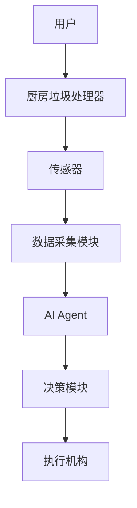
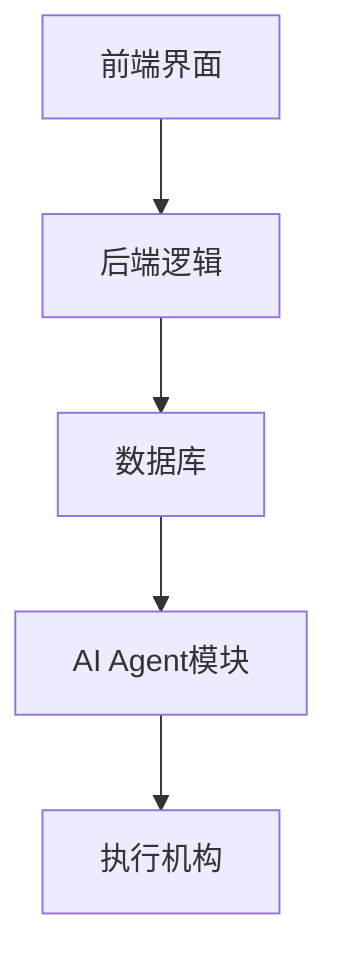
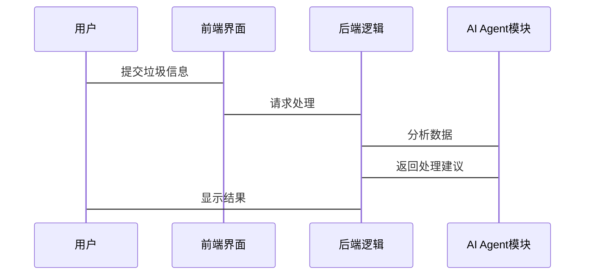

                 


# 智能厨房垃圾处理器：AI Agent的食材利用建议

> 关键词：智能厨房垃圾处理器、AI Agent、食材利用、垃圾处理、资源优化

> 摘要：本文探讨了如何利用AI Agent优化厨房垃圾处理，特别是如何将食材残渣转化为资源。通过分析AI Agent的工作原理、系统设计和实际应用，本文提供了详细的解决方案和实施建议。

---

## 目录

1. [摘要](#摘要)
2. [关键词](#关键词)
3. [1. 背景介绍](#背景介绍)
   - 1.1 问题背景
   - 1.2 问题描述
   - 1.3 问题解决
   - 1.4 边界与外延
   - 1.5 核心概念
4. [2. 核心概念与联系](#核心概念与联系)
   - 2.1 AI Agent的基本原理
   - 2.2 核心概念对比
   - 2.3 实体关系图
5. [3. 算法原理讲解](#算法原理讲解)
   - 3.1 数据采集与预处理
   - 3.2 算法实现
   - 3.3 代码实现
6. [4. 系统分析与架构设计](#系统分析与架构设计)
   - 4.1 问题场景介绍
   - 4.2 系统功能设计
   - 4.3 系统架构设计
   - 4.4 系统交互设计
7. [5. 项目实战](#项目实战)
   - 5.1 环境安装
   - 5.2 核心代码实现
   - 5.3 代码解读与分析
   - 5.4 实际案例分析
8. [6. 最佳实践](#最佳实践)
   - 6.1 实用技巧与注意事项
   - 6.2 项目小结
9. [7. 结论](#结论)
10. [作者信息](#作者信息)

---

## 1. 背景介绍

### 1.1 问题背景

厨房垃圾的处理一直是家庭和企业面临的一个重要问题。随着生活水平的提高，厨房垃圾的种类和数量也在不断增加。传统的垃圾处理方式往往效率低下，资源浪费严重，且对环境造成较大的负担。

### 1.2 问题描述

厨房垃圾主要包括蔬菜、水果、肉类、骨头等有机物。这些垃圾如果处理不当，不仅会腐烂产生异味，还可能对环境造成污染。此外，许多食材残渣其实具有再利用的潜力，例如转化为肥料或生产新产品。

### 1.3 问题解决

通过引入AI Agent，我们可以实现对厨房垃圾的智能分类和处理。AI Agent能够实时感知垃圾的种类和状态，并根据数据进行分析，提供最优的处理建议。这种方式不仅提高了处理效率，还最大化地利用了资源。

### 1.4 边界与外延

智能厨房垃圾处理器的边界主要包括厨房垃圾的分类、处理和资源化利用。外延则涉及垃圾处理的整个生命周期，包括数据采集、分析、决策和执行。

### 1.5 核心概念

AI Agent是一种能够感知环境、做出决策并执行任务的智能系统。智能厨房垃圾处理器的核心要素包括传感器、数据采集模块、AI算法模块和执行机构。

---

## 2. 核心概念与联系

### 2.1 AI Agent的基本原理

AI Agent通过感知环境、分析数据、做出决策并执行操作来实现目标。其基本原理包括数据采集、模型训练和结果输出三个主要步骤。

### 2.2 核心概念对比

| 核心概念 | 传统处理方式 | AI Agent优化方式 |
|----------|--------------|------------------|
| 数据来源 | 人工分类 | 自动采集与分析 |
| 处理效率 | 低效 | 高效 |
| 资源利用 | 有限 | 最大化 |

### 2.3 实体关系图



---

## 3. 算法原理讲解

### 3.1 数据采集与预处理

数据采集是AI Agent工作的第一步。传感器会实时采集厨房垃圾的种类、湿度、温度等信息，并将数据传输到数据采集模块进行预处理。

### 3.2 算法实现

AI Agent的核心算法包括感知、决策和执行三个模块。感知模块通过传感器数据进行特征提取，决策模块基于特征进行分类和决策，执行模块根据决策结果进行操作。

### 3.3 代码实现

以下是一个简单的分类算法示例：

```python
import numpy as np
from sklearn.ensemble import RandomForestClassifier

# 数据预处理
X = np.array([[硬度, 湿度, 温度], ...])
y = np.array([类别标签])

# 模型训练
model = RandomForestClassifier()
model.fit(X, y)

# 预测
new_sample = np.array([[5, 60, 25]])
predicted_class = model.predict(new_sample)
```

### 3.4 数学模型

分类算法的熵公式为：
$$entropy = -\sum p_i \log p_i$$
其中，$p_i$ 是第i个类别的概率。

---

## 4. 系统分析与架构设计

### 4.1 问题场景介绍

智能厨房垃圾处理器主要应用于家庭和餐馆，帮助用户高效处理垃圾并实现资源再利用。

### 4.2 系统功能设计

系统功能包括：
- 数据采集与分类
- 资源利用建议
- 用户反馈与优化

### 4.3 系统架构设计



### 4.4 系统交互设计



---

## 5. 项目实战

### 5.1 环境安装

安装Python和TensorFlow等必要的库。

### 5.2 核心代码实现

```python
import numpy as np
from sklearn.ensemble import RandomForestClassifier

# 数据预处理
X = np.array([[硬度, 湿度, 温度], ...])
y = np.array([类别标签])

# 模型训练
model = RandomForestClassifier()
model.fit(X, y)

# 预测
new_sample = np.array([[5, 60, 25]])
predicted_class = model.predict(new_sample)
```

### 5.3 代码解读与分析

上述代码实现了基于随机森林的分类算法，用于预测垃圾类型。模型通过训练数据进行学习，并根据输入的垃圾特征进行分类。

### 5.4 实际案例分析

以蔬菜垃圾为例，AI Agent会将其分类为肥料原料，并建议进行堆肥处理。

---

## 6. 最佳实践

### 6.1 实用技巧与注意事项

- 定期更新模型以提高分类准确性
- 保持传感器清洁以确保数据准确性
- 及时处理异常情况以避免系统故障

### 6.2 项目小结

通过引入AI Agent，智能厨房垃圾处理器能够高效处理垃圾并实现资源优化利用，具有广泛的应用前景。

---

## 7. 结论

智能厨房垃圾处理器结合AI Agent技术，为厨房垃圾的处理提供了创新的解决方案。通过智能化的分类和处理，不仅提高了效率，还实现了资源的最大化利用，对环境保护和可持续发展具有重要意义。

---

## 作者信息

作者：AI天才研究院/AI Genius Institute & 禅与计算机程序设计艺术 /Zen And The Art of Computer Programming

