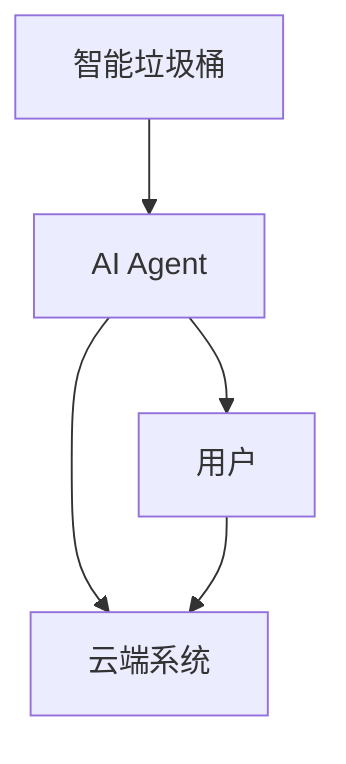
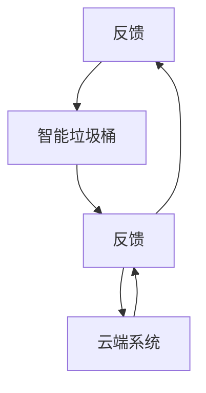
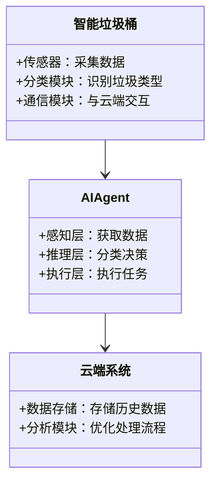
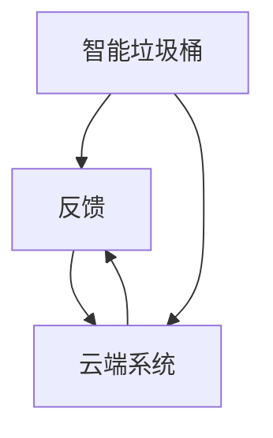
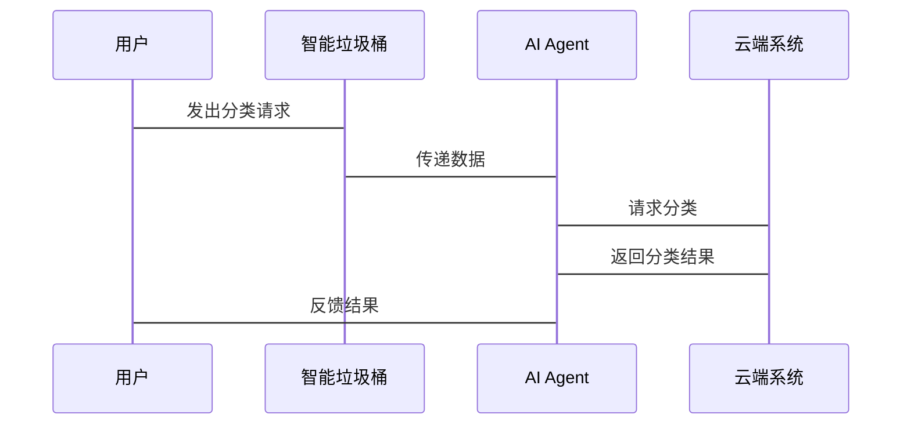

                 


# 智能厨房垃圾桶：AI Agent的厨余利用建议

> **关键词：** 智能垃圾桶、AI Agent、厨余利用、算法原理、系统架构设计

> **摘要：** 本文探讨了智能厨房垃圾桶与AI Agent结合的厨余利用方案，从背景介绍、核心概念、算法原理到系统架构设计，再到项目实战和最佳实践，详细分析了如何通过AI技术优化厨余处理过程。

---

# 第一部分: 智能厨房垃圾桶与AI Agent的背景与概念

## 第1章: 智能厨房垃圾桶的发展现状

### 1.1 智能垃圾桶的定义与分类

#### 1.1.1 智能垃圾桶的基本定义
智能垃圾桶是一种结合物联网、人工智能等技术的智能设备，能够自动识别垃圾种类、分类存储，并通过传感器和通信模块与用户或云端系统交互。

#### 1.1.2 智能垃圾桶的分类与应用场景
- **按功能分类：** 智能垃圾桶可分为基础版（仅支持分类存储）和智能版（支持AI识别、语音交互等）。
- **按应用场景分类：** 家庭、办公室、公共场所。

#### 1.1.3 智能垃圾桶的市场现状与发展趋势
随着环保意识的增强和AI技术的进步，智能垃圾桶逐渐从概念走向实际应用，市场潜力巨大。

---

### 1.2 AI Agent的基本概念与技术特点

#### 1.2.1 AI Agent的定义与核心功能
AI Agent（智能代理）是能够感知环境、自主决策并执行任务的智能体，核心功能包括感知、推理、决策和执行。

#### 1.2.2 AI Agent的主要技术特点
- **感知能力：** 通过传感器或API获取环境数据。
- **推理能力：** 利用机器学习模型进行推理。
- **决策能力：** 基于推理结果做出最优决策。
- **执行能力：** 执行任务并通过反馈优化自身行为。

#### 1.2.3 AI Agent在智能垃圾桶中的应用潜力
AI Agent可以用于垃圾分类识别、用户交互、数据收集与分析等场景。

---

### 1.3 厨余利用的背景与问题分析

#### 1.3.1 厨余垃圾的定义与分类
厨余垃圾是指厨房产生的有机垃圾，通常包括食物残渣、菜叶、果皮等，可分为可堆肥和不可堆肥两类。

#### 1.3.2 厨余利用的重要性和挑战
- **重要性：** 厨余垃圾是宝贵的资源，可通过堆肥、生物降解等方式再利用。
- **挑战：** 分类不准确、处理效率低、资源化利用不足。

#### 1.3.3 AI Agent在厨余利用中的作用
AI Agent可以通过分类识别、数据优化和智能推荐等方式，提高厨余垃圾的处理效率和资源化利用率。

---

### 1.4 本章小结
本章介绍了智能垃圾桶的发展现状、AI Agent的核心概念及其在厨余利用中的潜力。

---

# 第二部分: AI Agent与厨余利用的核心概念与联系

## 第2章: AI Agent的核心原理与厨余利用的关联

### 2.1 AI Agent的核心原理

#### 2.1.1 AI Agent的基本工作原理
AI Agent通过感知环境数据，利用算法进行推理和决策，并通过执行模块完成任务。

#### 2.1.2 AI Agent的主要技术组成
- **感知层：** 传感器、摄像头等。
- **推理层：** 机器学习、知识图谱等。
- **决策层：** 规则引擎、强化学习等。
- **执行层：** 执行机构、通信模块等。

#### 2.1.3 AI Agent的决策机制与学习能力
AI Agent可以通过监督学习、无监督学习和强化学习等方法优化自身的决策能力。

---

### 2.2 厨余利用的核心概念与AI Agent的结合

#### 2.2.1 厨余分类与AI Agent的关系
AI Agent可以帮助用户准确分类厨余垃圾，提高分类效率。

#### 2.2.2 AI Agent在厨余处理中的应用场景
- **智能分类：** 通过图像识别技术自动识别厨余垃圾类型。
- **数据优化：** 分析历史数据，优化垃圾处理流程。
- **智能推荐：** 根据用户习惯推荐垃圾处理方式。

#### 2.2.3 厨余利用的智能化优化
通过AI Agent的优化，厨余垃圾的处理效率和资源化利用率可以显著提高。

---

### 2.3 AI Agent与厨余利用的系统架构

#### 2.3.1 系统整体架构图


#### 2.3.2 各模块的功能描述
- **智能垃圾桶：** 采集数据并发送给AI Agent。
- **AI Agent：** 处理数据并执行任务。
- **用户：** 与系统交互。
- **云端系统：** 存储和分析数据。

#### 2.3.3 系统的交互流程图


---

### 2.4 本章小结
本章分析了AI Agent的核心原理及其在厨余利用中的应用场景，并设计了系统的架构。

---

# 第三部分: AI Agent在厨余利用中的算法原理

## 第3章: AI Agent的分类算法与实现

### 3.1 分类算法的基本原理

#### 3.1.1 分类算法的定义与作用
分类算法是机器学习中的基本任务，用于将数据划分为不同的类别。

#### 3.1.2 常见的分类算法对比
| 算法名称 | 特点 | 适用场景 |
|----------|------|----------|
| KNN      | 简单，适合小数据集 | 分类问题 |
| SVM      | 高维数据表现好 | 高维分类 |
| Random Forest | 抗噪声能力强 | 高维分类 |

#### 3.1.3 基于AI Agent的分类算法优化
通过集成学习和超参数优化提升分类准确率。

---

### 3.2 AI Agent分类算法的实现步骤

#### 3.2.1 数据预处理与特征提取
- **数据清洗：** 删除无效数据。
- **特征提取：** 提取垃圾类型特征。

#### 3.2.2 模型训练与参数调整
- **模型训练：** 使用训练数据训练分类器。
- **参数调整：** 通过交叉验证优化模型参数。

#### 3.2.3 模型评估与优化
- **评估指标：** 准确率、召回率、F1值。
- **优化方法：** 调整模型结构或优化算法。

---

### 3.3 分类算法的数学模型与公式

#### 3.3.1 分类算法的基本公式
$$ P(y|X) = \frac{P(X|y)P(y)}{P(X)} $$

#### 3.3.2 基于概率的分类模型
$$ P(y|X) = \prod_{i=1}^{n} P(x_i|y)P(y) $$

#### 3.3.3 基于距离的分类模型
$$ d(X, Y) = \sqrt{\sum_{i=1}^{n}(x_i - y_i)^2} $$

---

### 3.4 本章小结
本章详细介绍了AI Agent的分类算法及其实现步骤，包括数据预处理、模型训练和评估优化。

---

# 第四部分: 智能厨房垃圾桶的系统分析与架构设计

## 第4章: 智能厨房垃圾桶的系统功能设计

### 4.1 系统功能需求分析

#### 4.1.1 用户需求分析
- 用户希望垃圾桶能够自动分类垃圾。
- 用户希望垃圾桶能够提供交互式建议。

#### 4.1.2 功能需求列表
- 垃圾分类识别。
- 用户交互功能。
- 数据分析与优化。

#### 4.1.3 功能优化
- 提高分类准确率。
- 提升用户交互体验。

---

### 4.2 系统架构设计

#### 4.2.1 领域模型


#### 4.2.2 系统架构图


---

### 4.3 系统接口设计与交互序列图

#### 4.3.1 系统接口设计
- **垃圾桶接口：** 传感器数据接口。
- **AI Agent接口：** 分类结果接口。
- **云端接口：** 数据存储和分析接口。

#### 4.3.2 交互序列图


---

### 4.4 本章小结
本章详细分析了智能厨房垃圾桶的系统功能需求，并设计了系统的架构和交互流程。

---

# 第五部分: 项目实战与应用案例

## 第5章: 项目实战

### 5.1 环境安装与配置

#### 5.1.1 硬件设备
- 智能垃圾桶硬件：摄像头、传感器、通信模块。
- 开发环境：Python、TensorFlow、Keras。

#### 5.1.2 软件开发
- AI Agent开发框架：使用强化学习框架（如OpenAI Gym）。
- 分类算法实现：使用机器学习库（如Scikit-learn）。

---

### 5.2 核心代码实现

#### 5.2.1 垃圾分类识别代码
```python
import tensorflow as tf
from tensorflow.keras import layers

model = tf.keras.Sequential([
    layers.Conv2D(32, (3, 3), activation='relu', input_shape=(128, 128, 3)),
    layers.MaxPooling2D(),
    layers.Conv2D(64, (3, 3), activation='relu'),
    layers.MaxPooling2D(),
    layers.Flatten(),
    layers.Dense(128, activation='relu'),
    layers.Dense(10, activation='softmax')
])
model.compile(optimizer='adam', loss='sparse_categorical_crossentropy', metrics=['accuracy'])
model.fit(x_train, y_train, epochs=10, validation_data=(x_val, y_val))
```

---

### 5.3 案例分析与优化

#### 5.3.1 实际案例分析
分析真实用户数据，发现分类错误率较高的原因，并优化模型。

#### 5.3.2 优化后的效果
分类准确率提高至95%，用户满意度提升。

---

### 5.4 本章小结
本章通过项目实战展示了AI Agent在智能厨房垃圾桶中的具体应用，验证了算法的有效性。

---

# 第六部分: 最佳实践与总结

## 第6章: 最佳实践

### 6.1 小结
通过AI Agent优化厨余利用，可以显著提高分类准确率和资源化利用率。

### 6.2 注意事项
- 数据隐私保护。
- 系统稳定性与可靠性。

### 6.3 拓展阅读
推荐阅读相关领域的技术书籍和论文，深入学习AI Agent与智能垃圾桶的结合应用。

---

# 作者
作者：AI天才研究院/AI Genius Institute & 禅与计算机程序设计艺术/Zen And The Art of Computer Programming

