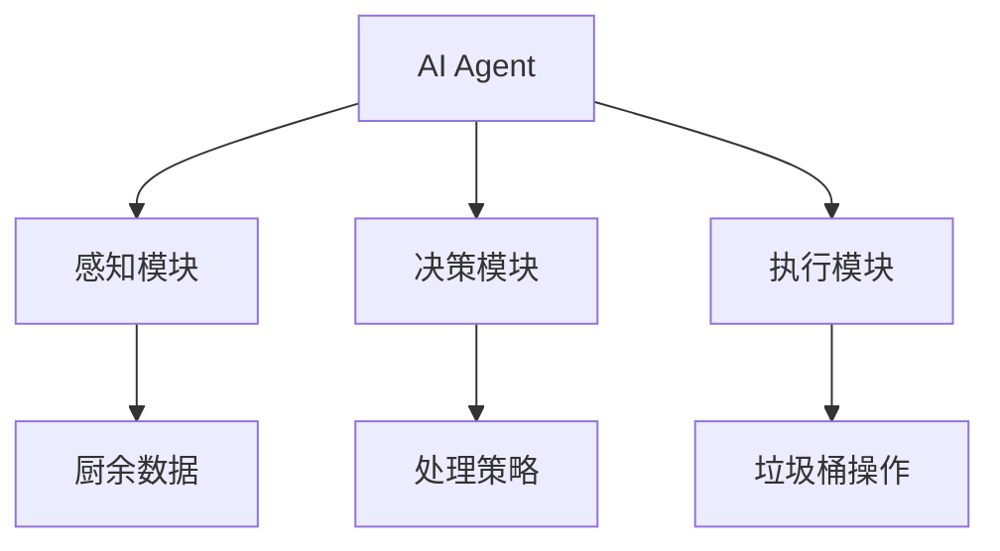
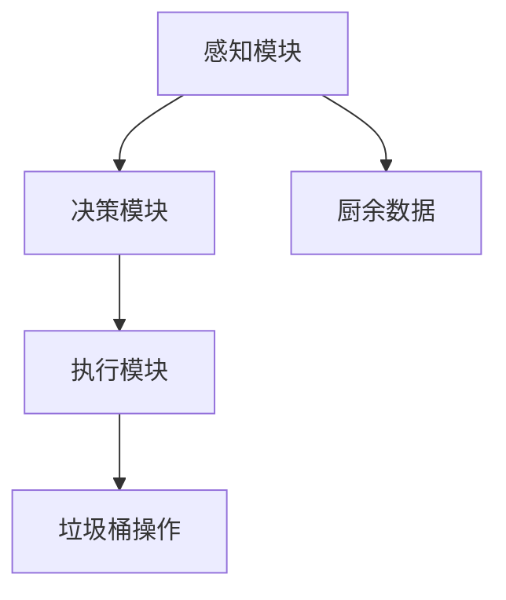
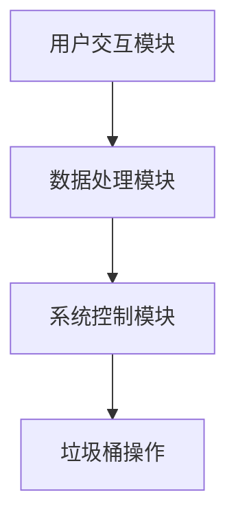

                 


# 智能厨房垃圾桶：AI Agent的厨余处理建议

> 关键词：智能厨房垃圾桶, AI Agent, 厨余处理, 图像识别, 机器学习, 系统架构

> 摘要：本文探讨了智能厨房垃圾桶的设计与实现，结合AI Agent技术，详细分析了厨余处理的算法原理、系统架构及项目实战。通过背景介绍、核心概念、算法原理、系统设计和项目实现五个部分，系统地阐述了智能厨房垃圾桶的构建过程，为读者提供了从理论到实践的全面指导。

---

# 第一部分: 背景与概念

# 第1章: 智能厨房垃圾桶的发展与现状

## 1.1 厨房垃圾桶的演变历程

### 1.1.1 传统垃圾桶的功能与局限
传统垃圾桶主要功能是存储垃圾，依赖人工分类和处理，存在分类效率低、资源浪费等问题。

### 1.1.2 智能化垃圾桶的兴起背景
随着环保意识的增强和AI技术的发展，智能化垃圾桶逐渐兴起，能够实现自动分类、智能处理。

### 1.1.3 智能厨房垃圾桶的市场现状
当前市场上，智能厨房垃圾桶主要以图像识别和AI分类为主，但仍面临成本高、普及率低等问题。

## 1.2 AI Agent在厨余处理中的应用

### 1.2.1 AI Agent的基本概念
AI Agent（智能体）是指能够感知环境、自主决策并执行任务的智能系统。

### 1.2.2 AI Agent在厨余处理中的优势
AI Agent能够通过图像识别和机器学习，实现厨余的精准分类和高效处理。

### 1.2.3 智能厨房垃圾桶的核心功能
智能厨房垃圾桶的核心功能包括垃圾识别、分类、压缩和提醒。

## 1.3 本书的核心目标与内容框架

### 1.3.1 本书的核心目标
通过AI Agent技术，实现智能厨房垃圾桶的高效厨余处理。

### 1.3.2 本书的主要内容框架
- 章节一：背景与概念
- 章节二：AI Agent的基本原理
- 章节三：智能厨房垃圾桶的系统架构
- 章节四：厨余识别与分类算法
- 章节五：AI Agent的决策算法
- 章节六：系统功能设计
- 章节七：项目实战
- 章节八：总结与展望

### 1.3.3 本书的读者群体
适合技术人员、AI爱好者、智能家居开发者及相关领域研究者。

---

# 第二部分: 核心概念与原理

# 第2章: AI Agent的基本原理

## 2.1 AI Agent的定义与分类

### 2.1.1 AI Agent的定义
AI Agent是一种能够感知环境、自主决策并执行任务的智能系统。

### 2.1.2 AI Agent的分类与特点
AI Agent可以分为基于规则的和基于机器学习的两类。

### 2.1.3 AI Agent在厨余处理中的应用
AI Agent能够通过图像识别和机器学习，实现厨余的精准分类和高效处理。

## 2.2 AI Agent的核心模块

### 2.2.1 感知模块
感知模块负责收集环境中的数据，包括图像、声音等。

### 2.2.2 决策模块
决策模块负责分析数据并制定处理策略。

### 2.2.3 执行模块
执行模块负责根据决策模块的指令执行具体操作。

## 2.3 AI Agent的实体关系图



---

# 第3章: 智能厨房垃圾桶的系统架构

## 3.1 系统功能模块

### 3.1.1 感知模块
感知模块负责收集厨余的图像数据。

### 3.1.2 决策模块
决策模块负责分析图像数据并制定分类策略。

### 3.1.3 执行模块
执行模块负责根据决策模块的指令进行垃圾桶的操作。

## 3.2 系统架构设计



---

# 第三部分: 算法原理

# 第4章: 厨余识别与分类算法

## 4.1 图像识别算法

### 4.1.1 基于深度学习的图像分类
使用卷积神经网络（CNN）进行图像分类。

### 4.1.2 垃圾分类的常用数据集
常用的垃圾分类数据集包括ImageNet、COCO等。

### 4.1.3 垃圾分类的模型训练流程
模型训练流程包括数据预处理、模型选择、训练与优化。

## 4.2 分类算法的数学模型

$$L = -\sum_{i=1}^{n} y_i \log p(y_i) + (1 - y_i) \log (1 - p(y_i))$$

其中：
- $L$ 是损失函数
- $y_i$ 是真实标签
- $p(y_i)$ 是预测概率

---

# 第5章: AI Agent的决策算法

## 5.1 基于规则的决策算法

### 5.1.1 基于规则的决策流程
根据预设规则进行分类。

### 5.1.2 垃圾分类规则的制定
制定基于规则的分类策略。

## 5.2 基于机器学习的决策算法

### 5.2.1 基于逻辑回归的分类
使用逻辑回归算法进行分类。

### 5.2.2 基于决策树的分类
使用决策树算法进行分类。

---

# 第四部分: 系统实现

# 第6章: 系统功能设计

## 6.1 系统功能模块

### 6.1.1 用户交互模块
用户可以通过界面与系统交互。

### 6.1.2 数据处理模块
负责处理和分析厨余数据。

### 6.1.3 系统控制模块
负责协调各模块的工作。

## 6.2 系统架构设计



---

# 第五部分: 项目实战

# 第7章: 项目实战

## 7.1 环境安装

### 7.1.1 安装Python
安装Python 3.8及以上版本。

### 7.1.2 安装依赖库
安装TensorFlow、Keras、OpenCV等库。

## 7.2 核心代码实现

### 7.2.1 图像分类代码
```python
import tensorflow as tf
from tensorflow.keras import layers

model = tf.keras.Sequential([
    layers.Conv2D(32, (3,3), activation='relu', input_shape=(224, 224, 3)),
    layers.MaxPooling2D((2,2)),
    layers.Conv2D(64, (3,3), activation='relu'),
    layers.MaxPooling2D((2,2)),
    layers.Flatten(),
    layers.Dense(128, activation='relu'),
    layers.Dense(10, activation='softmax')
])
```

### 7.2.2 决策逻辑代码
```python
def decision_algorithm(image):
    # 图像分类
    prediction = model.predict(image)
    # 根据预测结果执行操作
    if prediction[0][0] > 0.5:
        return '可回收物'
    else:
        return '不可回收物'
```

## 7.3 项目小结

---

# 第五部分: 总结与展望

# 第8章: 总结与展望

## 8.1 本书的总结
通过AI Agent技术，智能厨房垃圾桶能够实现高效的厨余处理。

## 8.2 未来的展望
未来，智能厨房垃圾桶将更加智能化和普及化，为环保事业做出更大贡献。

---

# 作者：AI天才研究院/AI Genius Institute & 禅与计算机程序设计艺术 /Zen And The Art of Computer Programming

