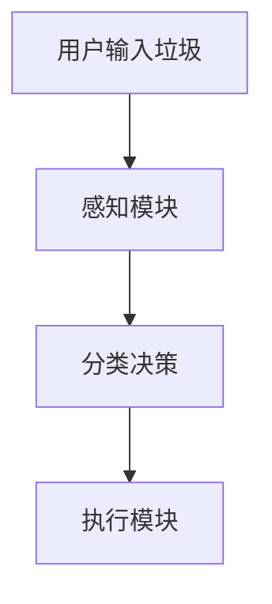
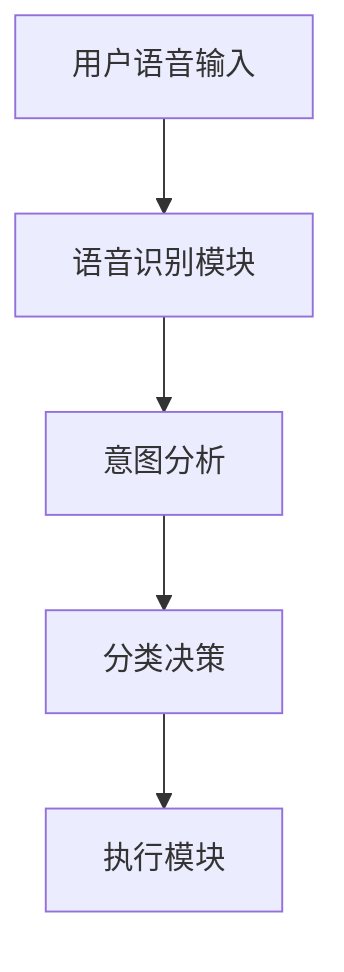
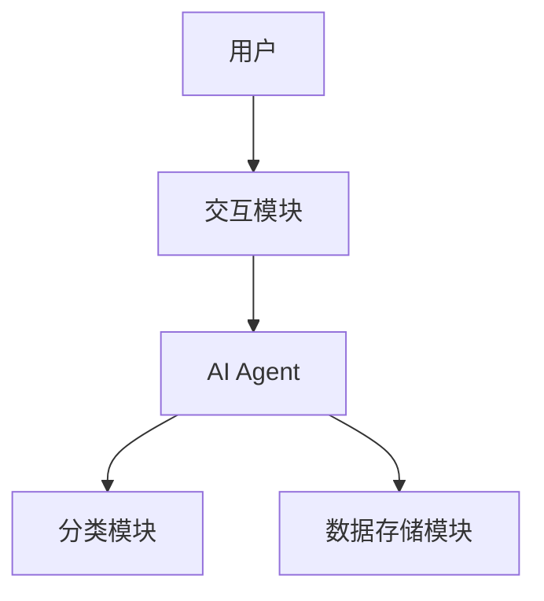
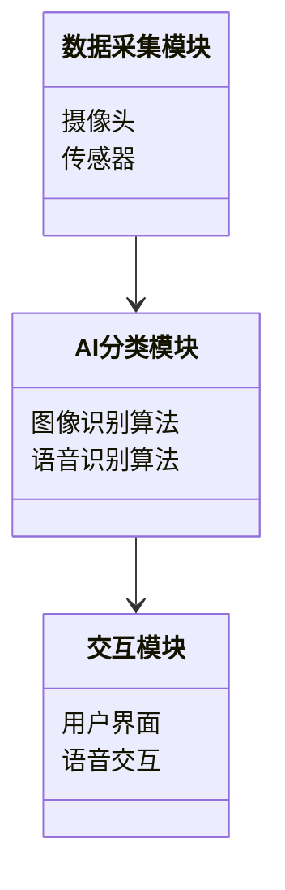
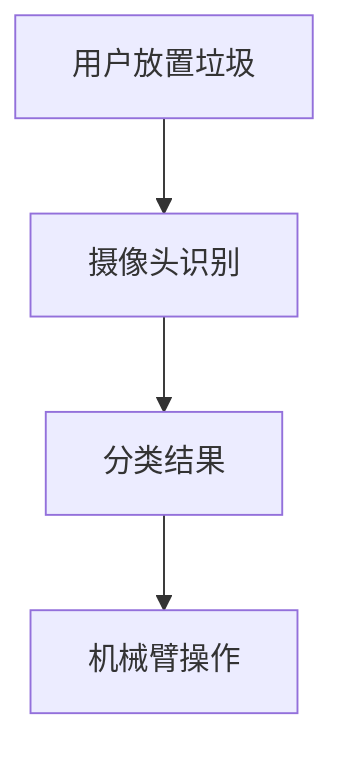
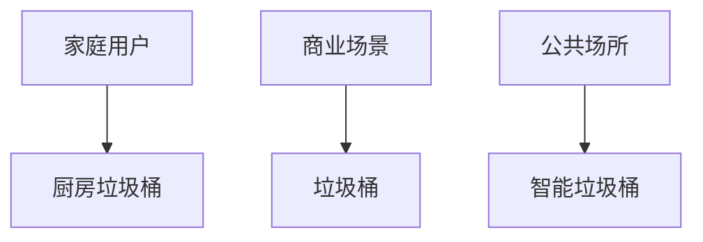
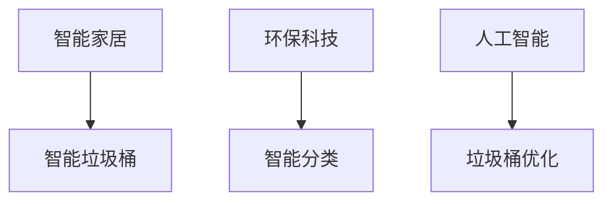

                 


# 智能厨房垃圾桶：AI Agent的废物分类指导

---

## 关键词：智能垃圾桶、AI Agent、废物分类、人工智能、物联网、智能厨房

---

## 摘要：  
随着环保意识的增强和人工智能技术的快速发展，智能厨房垃圾桶逐渐成为智能家居的重要组成部分。本文详细探讨了AI Agent在智能垃圾桶中的应用，从背景、技术原理到系统设计、项目实战，再到实际应用和未来展望，全面解析了如何通过AI技术实现高效的废物分类，为用户和环保事业提供智能化解决方案。

---

## 目录

1. **背景与概念**  
   1.1 问题背景与需求分析  
   1.2 AI Agent的基本概念与原理  

2. **技术原理**  
   2.1 AI Agent的核心算法  
   2.2 模式识别与图像分类技术  
   2.3 语音交互系统  

3. **系统设计**  
   3.1 系统架构设计  
   3.2 功能模块设计  
   3.3 交互设计与用户界面  

4. **项目实战**  
   4.1 环境搭建与工具安装  
   4.2 AI Agent的实现  
   4.3 模式识别模块的实现  
   4.4 语音交互模块的实现  

5. **实际应用与优化**  
   5.1 智能垃圾桶的实际应用场景  
   5.2 系统优化建议  
   5.3 市场前景与发展趋势  

6. **总结与展望**  

---

## 正文

---

### 第1章：背景与概念

#### 1.1 问题背景与需求分析

随着城市化进程的加快和环保意识的增强，垃圾分类成为全球关注的焦点。传统垃圾桶无法满足高效分类的需求，用户在使用过程中常常面临分类错误、效率低下等问题。此外，不同地区的垃圾分类标准不一，增加了分类的复杂性。因此，智能化的解决方案成为迫切需求。

**智能厨房垃圾桶**通过AI Agent实现对垃圾的智能分类，能够有效提高分类效率，减少错误率，并为用户提供便捷的交互体验。AI Agent在垃圾桶中的应用不仅提升了垃圾分类的准确性，还能通过数据收集和分析，为用户提供个性化的分类建议，优化垃圾处理流程。

#### 1.2 AI Agent的基本概念与原理

**AI Agent（人工智能代理）**是指能够感知环境、自主决策并执行任务的智能体。在智能垃圾桶中，AI Agent主要负责接收用户输入、识别垃圾类型、执行分类操作，并通过反馈机制优化分类策略。

AI Agent的核心功能包括：  
1. **感知环境**：通过摄像头、传感器等设备获取垃圾桶中的垃圾信息。  
2. **分类识别**：利用图像识别和自然语言处理技术，识别垃圾种类。  
3. **决策与执行**：根据分类结果，指导机械臂或分类装置完成垃圾投放。  
4. **反馈优化**：根据分类结果和用户反馈，优化识别算法，提高准确性。

---

### 第2章：技术原理

#### 2.1 AI Agent的核心算法

AI Agent的核心算法主要包括基于规则的推理和机器学习算法。以下是一个简单的基于规则的推理流程图：



在机器学习方面，常用的算法包括支持向量机（SVM）和随机森林（Random Forest）。以下是一个简单的分类器实现示例：

```python
from sklearn.svm import SVC
import numpy as np

# 垃圾类型数据
X = np.array([[1, 1], [0, 1], [1, 0], [0, 0]])
y = np.array(['可回收物', '厨余垃圾', '有害垃圾', '其他垃圾'])

# 训练分类器
clf = SVC(gamma='auto')
clf.fit(X, y)
```

#### 2.2 模式识别与图像分类技术

模式识别在智能垃圾桶中主要用于识别垃圾的形状和颜色。常用的图像分类算法包括卷积神经网络（CNN）。以下是一个简单的CNN模型示例：

```python
import tensorflow as tf
from tensorflow.keras import layers

# 构建CNN模型
model = tf.keras.Sequential([
    layers.Conv2D(32, (3, 3), activation='relu', input_shape=(64, 64, 3)),
    layers.MaxPooling2D((2, 2)),
    layers.Conv2D(64, (3, 3), activation='relu'),
    layers.MaxPooling2D((2, 2)),
    layers.Flatten(),
    layers.Dense(128, activation='relu'),
    layers.Dense(4, activation='softmax')
])

# 编译模型
model.compile(optimizer='adam', loss='sparse_categorical_crossentropy', metrics=['accuracy'])
```

#### 2.3 语音交互系统

语音交互系统通过自然语言处理技术实现与用户的对话。以下是一个简单的语音识别流程图：



---

### 第3章：系统设计

#### 3.1 系统架构设计

智能垃圾桶的系统架构主要包括以下模块：



#### 3.2 功能模块设计

功能模块设计包括数据采集模块、AI分类模块和交互模块。以下是功能模块的类图：



#### 3.3 交互设计与用户界面

交互设计需要考虑用户体验，以下是交互流程图：



---

### 第4章：项目实战

#### 4.1 环境搭建与工具安装

项目实战需要以下工具和库：  
- Python 3.8+  
- TensorFlow  
- OpenCV  
- SpeechRecognition  
- Flask

#### 4.2 AI Agent的实现

AI Agent的核心实现代码如下：

```python
import numpy as np
from sklearn.svm import SVC

# 垃圾类型数据
X = np.array([[1, 1], [0, 1], [1, 0], [0, 0]])
y = np.array(['可回收物', '厨余垃圾', '有害垃圾', '其他垃圾'])

# 训练分类器
clf = SVC(gamma='auto')
clf.fit(X, y)

# 预测垃圾类型
print(clf.predict([[1, 0]]))  # 输出：['有害垃圾']
```

#### 4.3 模式识别模块的实现

模式识别模块的实现代码如下：

```python
import cv2
from tensorflow.keras.models import load_model

# 加载预训练模型
model = load_model('garbage_classifier.h5')

# 读取图片并预测
image = cv2.imread('garbage.jpg')
prediction = model.predict(image)
print(prediction)
```

#### 4.4 语音交互模块的实现

语音交互模块的实现代码如下：

```python
import speech_recognition as sr

# 初始化识别器
r = sr.Recognizer()

# 读取音频文件
audio_file = sr.AudioFile('garbage_command.wav')
with audio_file as source:
    audio = r.record(source)

# 转换为文本
text = r.recognize_google(audio)
print(text)
```

---

### 第5章：实际应用与优化

#### 5.1 智能垃圾桶的实际应用场景

智能垃圾桶可以在家庭、办公室、公共场所等多种场景中应用，帮助用户高效分类垃圾，减少环境污染。以下是应用场景的示例：



#### 5.2 系统优化建议

系统优化建议包括：  
1. 提高算法的准确率。  
2. 优化交互设计，提升用户体验。  
3. 加强数据安全和隐私保护。

#### 5.3 市场前景与发展趋势

智能垃圾桶市场前景广阔，随着AI技术的不断发展，未来的垃圾桶将更加智能化、个性化和高效化。以下是市场前景的分析：



---

### 第6章：总结与展望

本文详细探讨了AI Agent在智能厨房垃圾桶中的应用，从背景、技术原理到系统设计和项目实战，再到实际应用和未来展望，全面解析了智能垃圾桶的技术实现和应用价值。通过AI Agent的引入，智能垃圾桶能够高效分类垃圾，提升用户的生活质量，为环保事业贡献力量。

未来，随着AI技术的不断进步，智能垃圾桶将更加智能化和个性化，为用户和环保事业带来更多的便利和价值。

---

## 作者：AI天才研究院/AI Genius Institute & 禅与计算机程序设计艺术 /Zen And The Art of Computer Programming

---

希望这篇技术博客能够为您提供清晰的思路和实用的知识，帮助您更好地理解和应用智能厨房垃圾桶中的AI Agent技术！

