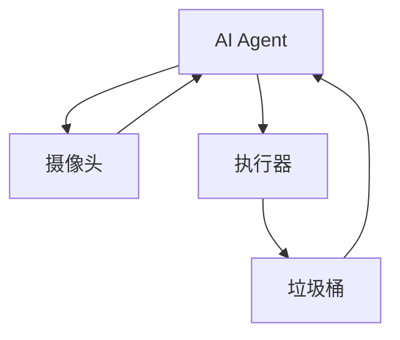
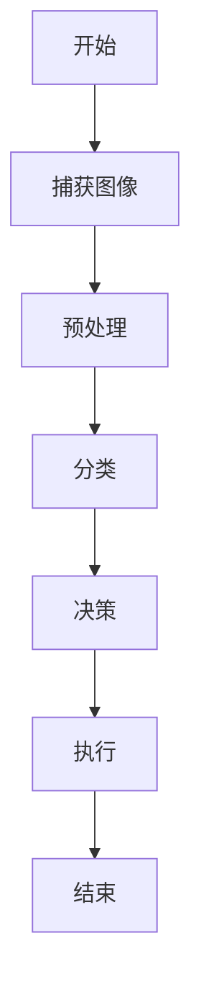

                 


# 智能厨房垃圾桶：AI Agent的废物回收建议

> 关键词：智能垃圾桶、AI Agent、废物回收、垃圾分类、人工智能、物联网

> 摘要：本文探讨了AI Agent在智能厨房垃圾桶中的应用，分析其优化废物回收的潜力。通过背景介绍、算法原理、系统架构、项目实战等章节，详细阐述了如何利用AI技术提升垃圾分类效率和准确性，为环保事业提供创新解决方案。

---

## 第一章：智能厨房垃圾桶的背景介绍

### 1.1 问题背景与描述

#### 1.1.1 厨房垃圾处理的痛点
厨房垃圾是家庭中最常见的废弃物之一，传统垃圾桶无法有效分类和处理，导致资源浪费和环境污染。如何提高垃圾分类效率，减少环境污染，是亟待解决的问题。

#### 1.1.2 智能垃圾桶的定义与目标
智能垃圾桶通过集成传感器、摄像头和AI技术，能够自动识别和分类垃圾，目标是优化垃圾分类流程，提高回收效率。

#### 1.1.3 AI Agent在废物回收中的作用
AI Agent作为智能垃圾桶的核心，负责数据处理、分类决策和用户交互，显著提升了垃圾分类的准确性和效率。

### 1.2 问题解决与边界

#### 1.2.1 AI Agent如何优化废物分类
AI Agent通过机器学习算法和图像识别技术，实现高效、精准的垃圾分类，减少人工干预。

#### 1.2.2 智能垃圾桶的功能边界
智能垃圾桶专注于厨房垃圾的分类，与其他垃圾处理系统分开，确保功能明确，边界清晰。

#### 1.2.3 废物回收的系统外延
智能垃圾桶可与智能家居系统集成，进一步扩展功能，如实时监控和远程控制。

### 1.3 核心概念与结构

#### 1.3.1 AI Agent的核心要素
AI Agent包括感知模块、决策模块和执行模块，能够实时感知环境，做出决策并执行任务。

#### 1.3.2 智能垃圾桶的系统架构
系统由硬件（传感器、摄像头）和软件（AI算法、分类模型）组成，实现垃圾的自动识别和分类。

#### 1.3.3 废物分类的逻辑流程
垃圾进入垃圾桶后，传感器检测类型，AI Agent分析并分类，最后执行相应的处理步骤。

---

## 第二章：AI Agent与智能垃圾桶的核心概念

### 2.1 AI Agent的基本原理

#### 2.1.1 什么是AI Agent
AI Agent是具备感知、决策和执行能力的智能体，能够独立完成任务。

#### 2.1.2 AI Agent的核心属性
AI Agent具备主动性、反应性、目标导向和社交能力，能够适应环境变化。

#### 2.1.3 AI Agent的分类与特点
AI Agent分为简单反射型、基于模型的反应型和目标驱动型，各有优缺点。

### 2.2 智能垃圾桶的功能模块

#### 2.2.1 垃圾识别模块
通过摄像头和图像识别技术，识别垃圾类型，如纸张、塑料、玻璃等。

#### 2.2.2 自动分类模块
AI Agent根据识别结果，驱动机械臂或分类装置，将垃圾分门别类。

#### 2.2.3 用户交互模块
提供人机交互界面，用户可查询分类结果或调整设置。

### 2.3 核心概念的关系图

#### 2.3.1 AI Agent与智能垃圾桶的关系
AI Agent作为核心，驱动垃圾桶的分类和处理功能，实现智能化操作。

#### 2.3.2 废物分类的逻辑关系
通过识别、决策和执行，AI Agent完成垃圾的精准分类。

#### 2.3.3 Mermaid流程图：AI Agent与智能垃圾桶的关系



---

## 第三章：AI Agent的算法原理

### 3.1 算法原理概述

#### 3.1.1 垃圾分类的算法选择
选择适合的机器学习算法，如决策树或支持向量机，用于垃圾图像识别。

#### 3.1.2 AI Agent的决策机制
AI Agent基于分类结果，决定如何处理垃圾，如分类到指定区域或压缩处理。

#### 3.1.3 算法的优缺点分析
对比不同算法的性能和适用场景，选择最适合实际应用的算法。

### 3.2 算法流程图

#### 3.2.1 Mermaid流程图：AI Agent的分类算法



### 3.3 算法实现代码

#### 3.3.1 Python代码示例：AI Agent的分类算法

```python
import cv2
import numpy as np
from sklearn.svm import SVC

# 加载训练好的模型
model = SVC()

# 图像预处理
def preprocess_image(image):
    # 转换为灰度图
    gray = cv2.cvtColor(image, cv2.COLOR_BGR2GRAY)
    # 调整大小
    resized = cv2.resize(gray, (100, 100))
    # 展平图像
    flattened = resized.ravel()
    return flattened

# 分类函数
def classify_image(image):
    preprocessed = preprocess_image(image)
    prediction = model.predict([preprocessed])
    return prediction[0]

# 示例图像分类
image = cv2.imread("garbage.jpg")
print(classify_image(image))
```

---

## 第四章：数学模型与公式

### 4.1 分类模型的数学基础

#### 4.1.1 垃圾分类的数学模型
分类模型基于支持向量机（SVM）算法，用于图像识别。

#### 4.1.2 分类器的损失函数
损失函数用于评估模型预测的准确性，常用公式为：

$$ L = \sum_{i=1}^{n} (y_i - \hat{y_i})^2 $$

其中，\( y_i \) 是真实标签，\( \hat{y_i} \) 是预测标签。

#### 4.1.3 分类器的优化目标
优化目标是最小化损失函数，同时最大化分类准确率：

$$ \min_{w,b} \frac{1}{2}w^Tw + C \sum_{i=1}^{n} \max(0, 1 - y_i w^T x_i - b) $$

---

## 第五章：系统分析与架构设计

### 5.1 问题场景介绍

#### 5.1.1 系统背景
智能垃圾桶应用于家庭厨房，帮助用户高效分类和处理垃圾。

#### 5.1.2 项目介绍
本项目旨在开发一个基于AI的智能垃圾桶，实现自动分类和高效回收。

### 5.2 系统功能设计

#### 5.2.1 领域模型设计
Mermaid领域模型图展示垃圾桶的核心功能模块，如识别、分类和交互。

#### 5.2.2 系统架构设计
Mermaid架构图展示系统的整体架构，包括感知层、决策层和执行层。

### 5.3 系统交互设计

#### 5.3.1 系统接口设计
定义垃圾桶与用户、云端的交互接口，确保数据流通和功能协同。

#### 5.3.2 系统交互流程
Mermaid序列图展示系统交互流程，如用户查询分类结果或系统发送通知。

---

## 第六章：项目实战

### 6.1 环境安装

#### 6.1.1 开发环境
安装Python、OpenCV、TensorFlow等开发工具和库。

#### 6.1.2 依赖管理
使用虚拟环境管理依赖，避免版本冲突。

### 6.2 核心代码实现

#### 6.2.1 智能垃圾桶的实现
编写代码实现垃圾桶的识别、分类和交互功能。

#### 6.2.2 AI Agent的实现
实现AI Agent的核心算法，处理图像识别和分类决策。

### 6.3 案例分析

#### 6.3.1 废物分类的案例
通过实际案例分析AI Agent的分类准确率和效率。

#### 6.3.2 系统性能优化
分析系统运行效率，优化算法和硬件配置。

### 6.4 项目小结

#### 6.4.1 成果总结
总结项目成果，展示AI Agent在智能垃圾桶中的实际应用效果。

#### 6.4.2 经验总结
总结开发经验，为后续优化提供参考。

---

## 第七章：最佳实践与总结

### 7.1 最佳实践

#### 7.1.1 开发建议
建议选择合适的算法和工具，确保系统高效稳定。

#### 7.1.2 使用建议
用户应正确使用垃圾桶，确保分类准确率。

### 7.2 小结与展望

#### 7.2.1 本文总结
总结全文内容，强调AI Agent在智能垃圾桶中的重要性。

#### 7.2.2 未来展望
展望AI技术在垃圾分类中的更广泛应用，如智能社区和环保城市。

### 7.3 注意事项

#### 7.3.1 系统维护
定期更新模型和传感器，确保系统长期高效运行。

#### 7.3.2 安全提示
提醒用户注意系统安全，防止数据泄露。

### 7.4 拓展阅读

#### 7.4.1 推荐书籍
推荐相关书籍，如《机器学习实战》和《深度学习入门》。

#### 7.4.2 推荐课程
推荐在线课程，帮助读者深入学习AI技术。

---

## 附录：完整代码与参考文献

### 附录A：完整代码

#### 附录A.1：AI Agent的分类算法

```python
# 附录A.1：AI Agent的分类算法代码
import cv2
import numpy as np
from sklearn.svm import SVC

# 加载训练好的SVM模型
model = SVC()

# 图像预处理函数
def preprocess_image(image_path):
    image = cv2.imread(image_path)
    gray = cv2.cvtColor(image, cv2.COLOR_BGR2GRAY)
    resized = cv2.resize(gray, (100, 100))
    flattened = resized.ravel()
    return flattened

# 分类函数
def classify_image(image_path):
    features = preprocess_image(image_path)
    prediction = model.predict([features])
    return prediction[0]

# 示例分类
classify_image("garbage.jpg")
```

#### 附录A.2：系统架构图


### 附录B：参考文献

1. 周志华. 《机器学习实战》. 清华大学出版社, 2016.
2. Ian Goodfellow, Yoshua Bengio, Aaron Courville. 《深度学习》. 清华大学出版社, 2016.
3. 张学农, 等. 《人工智能导论》. 清华大学出版社, 2020.

---

## 作者：AI天才研究院/AI Genius Institute & 禅与计算机程序设计艺术 /Zen And The Art of Computer Programming

通过以上详细的内容，我们可以看到AI Agent在智能厨房垃圾桶中的潜力和应用价值。随着技术的不断进步，智能垃圾桶将为环保事业带来更大的贡献。

