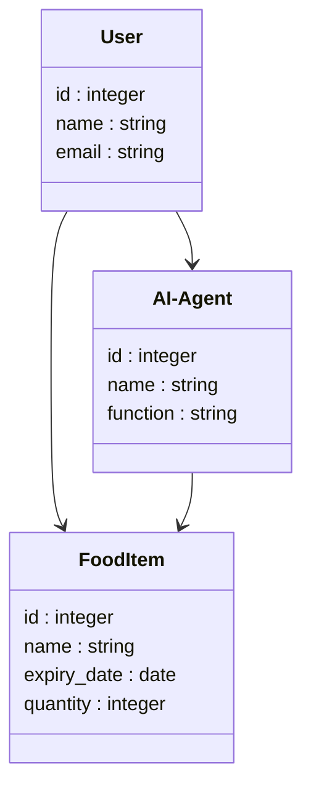

                 


# 第一部分: 背景与概念

## 第1章: 智能厨房垃圾桶的背景与问题背景

### 1.1 问题背景

#### 1.1.1 食材浪费的现状与挑战
在全球范围内，食品浪费是一个严重的环境和社会问题。根据联合国的数据，每年全球浪费的食品总量约为13亿吨，相当于全球粮食产量的三分之一。在家庭中，食材浪费的主要原因包括购买过多、保存不当和使用不充分。厨房垃圾桶是家庭中处理食材废弃物的主要工具，但传统垃圾桶无法提供任何关于食材利用的建议，导致食材浪费问题无法得到有效解决。

#### 1.1.2 智能垃圾桶的出现背景
随着人工智能技术的快速发展，智能垃圾桶逐渐从概念走向实际应用。智能垃圾桶不仅可以分类垃圾，还可以通过AI技术分析垃圾桶中的食材，提供建议，帮助用户更好地利用食材，减少浪费。这种智能化的垃圾桶可以与智能家居系统集成，进一步提升家庭生活的智能化水平。

#### 1.1.3 AI Agent在厨房中的应用潜力
AI Agent（智能体）是一种能够感知环境并采取行动以实现目标的计算机系统。在厨房环境中，AI Agent可以用来优化食材的利用，例如通过分析用户的饮食习惯和食材库存，推荐食谱，提醒用户及时使用即将过期的食材等。智能垃圾桶作为AI Agent的一种载体，可以将食材的使用情况反馈给AI系统，进一步优化建议。

### 1.2 问题描述

#### 1.2.1 食材利用效率低下的问题
传统厨房中，食材的利用率较低，主要原因是用户无法有效地管理食材的库存和使用情况。用户通常会忘记食材的存在，导致食材过期浪费，或者因为不知道如何利用剩余的食材而选择丢弃。智能垃圾桶通过实时监测食材的使用情况，可以有效地提高食材的利用率。

#### 1.2.2 垃圾分类与资源化利用的痛点
垃圾分类是当前城市管理中的一个重要问题。智能垃圾桶可以通过AI技术实现自动分类，减少人工分类的误差和成本。同时，智能垃圾桶还可以通过分析食材的种类和数量，提供建议，帮助用户将食材转化为有用的资源，例如制作堆肥或再利用。

#### 1.2.3 AI Agent在食材管理中的角色
AI Agent在食材管理中的角色是通过分析垃圾桶中的食材数据，提供优化建议。例如，AI Agent可以根据用户的饮食习惯和食材库存，推荐适合的食谱；当某种食材即将过期时，AI Agent会提醒用户尽快使用；当某种食材库存不足时，AI Agent可以建议用户购买补充。

### 1.3 问题解决

#### 1.3.1 AI Agent如何优化食材利用
AI Agent通过分析垃圾桶中的食材数据，可以实现以下功能：
- 自动记录食材的种类、数量和使用情况。
- 根据用户的饮食习惯和偏好，推荐适合的食谱。
- 提醒用户及时使用即将过期的食材。
- 帮助用户合理规划食材采购，避免浪费。

#### 1.3.2 智能垃圾桶的技术实现路径
智能垃圾桶的技术实现路径主要包括以下几个方面：
- 数据采集：通过传感器和摄像头等设备，采集垃圾桶中的食材数据。
- 数据分析：利用AI算法，分析食材的种类、数量和使用情况。
- 数据处理：将分析结果转化为用户友好的建议和提醒。
- 用户交互：通过语音助手、手机APP等方式，与用户进行交互，提供食材利用建议。

#### 1.3.3 用户需求与技术解决方案的匹配
用户需求主要包括：
- 实时监控食材的使用情况。
- 自动分类食材垃圾。
- 提供食材利用的优化建议。
- 方便的用户交互界面。

技术解决方案包括：
- 使用传感器和摄像头实现数据采集。
- 利用AI算法实现食材识别和分类。
- 通过用户友好的界面提供优化建议。

### 1.4 边界与外延

#### 1.4.1 智能垃圾桶的功能边界
智能垃圾桶的主要功能包括：
- 数据采集：通过传感器和摄像头采集垃圾桶中的食材数据。
- 数据分析：利用AI算法分析食材的种类、数量和使用情况。
- 用户交互：通过语音助手、手机APP等方式与用户交互，提供食材利用建议。

#### 1.4.2 AI Agent的应用范围
AI Agent的应用范围不仅限于厨房垃圾桶，还可以扩展到其他领域，例如家庭能源管理、健康监测等。但在本文中，我们将重点讨论AI Agent在食材利用中的应用。

#### 1.4.3 与智能家居系统的关联
智能垃圾桶可以与智能家居系统集成，例如与智能灶具、智能冰箱等设备联动，进一步优化食材的利用。例如，当智能冰箱检测到某种食材即将过期时，可以通过智能垃圾桶的AI Agent推荐相应的食谱。

### 1.5 概念结构与核心要素

#### 1.5.1 智能垃圾桶的核心组成
智能垃圾桶的核心组成包括：
- 传感器：用于检测垃圾桶中的食材种类、数量和状态。
- AI算法：用于分析食材数据，提供优化建议。
- 用户交互界面：用于与用户进行交互，提供食材利用建议。

#### 1.5.2 AI Agent的功能模块
AI Agent的功能模块包括：
- 数据采集模块：负责采集垃圾桶中的食材数据。
- 数据分析模块：负责分析食材数据，生成优化建议。
- 用户交互模块：负责与用户进行交互，提供优化建议。

#### 1.5.3 食材利用的系统架构
食材利用的系统架构包括：
- 数据采集层：通过传感器和摄像头采集食材数据。
- 数据分析层：利用AI算法分析食材数据，生成优化建议。
- 用户交互层：通过用户友好的界面，将优化建议呈现给用户。

---

# 第二部分: 核心概念与联系

## 第2章: AI Agent与食材利用的核心概念

### 2.1 核心概念原理

#### 2.1.1 AI Agent的基本原理
AI Agent是一种能够感知环境并采取行动以实现目标的计算机系统。在智能垃圾桶中，AI Agent通过感知垃圾桶中的食材数据，采取行动优化食材利用。例如，当检测到某种食材即将过期时，AI Agent会建议用户尽快使用该食材。

#### 2.1.2 食材利用的智能化模型
食材利用的智能化模型包括以下几个步骤：
1. 数据采集：通过传感器和摄像头采集垃圾桶中的食材数据。
2. 数据分析：利用AI算法分析食材的种类、数量和使用情况。
3. 生成建议：根据分析结果，生成优化食材利用的建议。
4. 用户交互：通过用户友好的界面，将优化建议呈现给用户。

#### 2.1.3 智能垃圾桶的数据流分析
智能垃圾桶的数据流分析包括以下几个步骤：
1. 数据采集：传感器和摄像头采集垃圾桶中的食材数据。
2. 数据传输：将食材数据传输到AI系统进行处理。
3. 数据分析：AI系统分析食材数据，生成优化建议。
4. 用户反馈：用户根据优化建议采取行动，例如使用某种食材或调整采购计划。

### 2.2 核心概念属性对比

| 属性           | AI Agent                              | 智能垃圾桶                          |
|----------------|--------------------------------------|------------------------------------|
| 功能           | 数据采集、分析、生成建议              | 垃圾分类、食材数据采集               |
| 输入           | 垃圾桶中的食材数据                    | 垃圾桶中的食材数据                   |
| 输出           | 优化食材利用的建议                   | 垃圾分类结果                        |
| 应用场景         | 食材管理、家庭能源管理                | 垃圾分类、食材利用优化               |
| 优势           | 智能化、自动化、高效性                | 精准分类、优化利用                   |
| 局限性          | 依赖传感器和AI算法                   | 依赖硬件设备                       |

### 2.3 ER实体关系图

```mermaid
erDiagram
    user {
        id : integer
        name : string
        email : string
    }
    food_item {
        id : integer
        name : string
        expiry_date : date
        quantity : integer
    }
    ai_agent {
        id : integer
        name : string
        function : string
    }
    interaction {
        id : integer
        user_id : integer
        agent_id : integer
        action : string
        timestamp : datetime
    }
    user -|> interaction
    ai_agent -|> interaction
    food_item -|> interaction
```

---

# 第三部分: 算法原理

## 第3章: AI Agent的算法原理

### 3.1 推荐算法

#### 3.1.1 协同过滤算法
协同过滤是一种基于用户行为相似性的推荐算法。在智能垃圾桶中，协同过滤算法可以用来推荐用户可能感兴趣的食谱。例如，如果用户A喜欢使用牛奶和面包屑制作煎饼，而用户B也喜欢使用牛奶和面包屑，那么协同过滤算法会推荐用户A使用牛奶和面包屑制作其他食谱。

协同过滤算法的数学模型如下：
$$
similarity(u, v) = \frac{\sum_{i \in I} (r_i(u) - \bar{r}(u)) (r_i(v) - \bar{r}(v))}{\sqrt{\sum_{i \in I} (r_i(u) - \bar{r}(u))^2} \sqrt{\sum_{i \in I} (r_i(v) - \bar{r}(v))^2}}
$$
其中，$u$和$v$是用户，$r_i(u)$是用户$u$对物品$i$的评分，$\bar{r}(u)$是用户$u$的平均评分，$I$是用户$u$和$v$共同评分的物品集合。

#### 3.1.2 聚类分析
聚类分析是一种基于物品相似性的推荐算法。在智能垃圾桶中，聚类分析可以用来将食材分为不同的类别，例如将蔬菜分为叶菜类、根茎类等。然后，根据用户的饮食习惯，推荐适合的食谱。

聚类分析的数学模型如下：
$$
distance(X, Y) = \sqrt{\sum_{i=1}^{n} (X_i - Y_i)^2}
$$
其中，$X$和$Y$是两个物品的特征向量，$n$是特征的维度。

#### 3.1.3 深度学习模型
深度学习模型是一种基于神经网络的推荐算法。在智能垃圾桶中，深度学习模型可以用来分析食材的图像，识别食材的种类和数量。

深度学习模型的数学模型如下：
$$
f(x) = W_1 x + b_1
$$
$$
f(x) = \sigma(W_2 f(x) + b_2)
$$
其中，$W_1$和$W_2$是权重矩阵，$b_1$和$b_2$是偏置项，$\sigma$是激活函数。

### 3.2 算法实现

#### 3.2.1 协同过滤算法的实现步骤
1. 数据采集：采集用户的饮食习惯和食谱偏好数据。
2. 数据预处理：对数据进行清洗和归一化处理。
3. 计算相似性：计算用户之间的相似性。
4. 生成推荐：根据相似性生成推荐食谱。

#### 3.2.2 聚类分析的实现步骤
1. 数据采集：采集食材的种类、数量和使用情况。
2. 数据预处理：对数据进行清洗和归一化处理。
3. 计算距离：计算食材之间的距离。
4. 进行聚类：将食材分为不同的类别。

#### 3.2.3 深度学习模型的实现步骤
1. 数据采集：采集食材的图像数据。
2. 数据预处理：对图像数据进行归一化和增强处理。
3. 构建神经网络：构建卷积神经网络模型。
4. 训练模型：利用标注数据训练模型。
5. 预测食材：利用训练好的模型预测垃圾桶中的食材种类和数量。

### 3.3 算法对比

| 算法类型      | 协同过滤 | 聚类分析 | 深度学习模型 |
|----------------|----------|----------|--------------|
| 优势          | 简单易懂 | 可视化    | 高精度       |
| 劣势          | 数据稀疏性| 计算复杂  | 需要大量数据  |
| 适用场景      | 用户推荐  | 食材分类  | 食材图像识别   |

---

# 第四部分: 系统分析与架构设计

## 第4章: 系统分析与架构设计

### 4.1 问题场景介绍

#### 4.1.1 问题场景
在家庭厨房中，用户通常会面临以下问题：
- 食材浪费严重，尤其是乳制品和蔬菜。
- 垃圾分类效率低下，影响家庭环境。
- 用户无法有效地管理食材的库存和使用情况。

#### 4.1.2 项目介绍
本项目旨在通过AI Agent优化食材的利用，减少浪费。项目的主要目标包括：
- 实现智能垃圾桶的数据采集和分析。
- 提供优化食材利用的建议。
- 与智能家居系统集成，进一步提升家庭生活的智能化水平。

### 4.2 系统功能设计

#### 4.2.1 领域模型类图


#### 4.2.2 系统架构图
```mermaid
architectureDiagram
    [用户] --> [用户界

