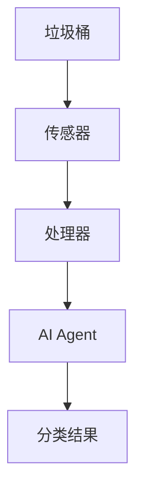
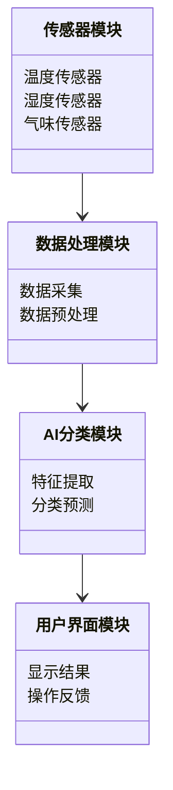
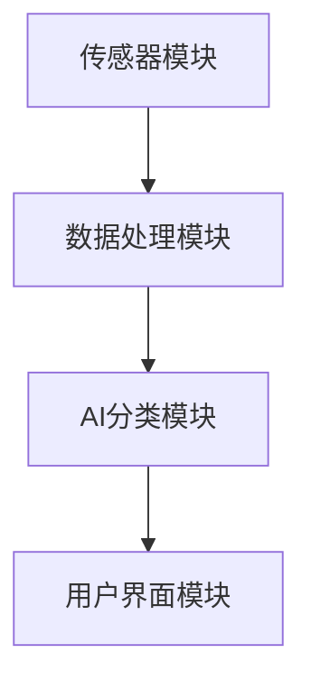
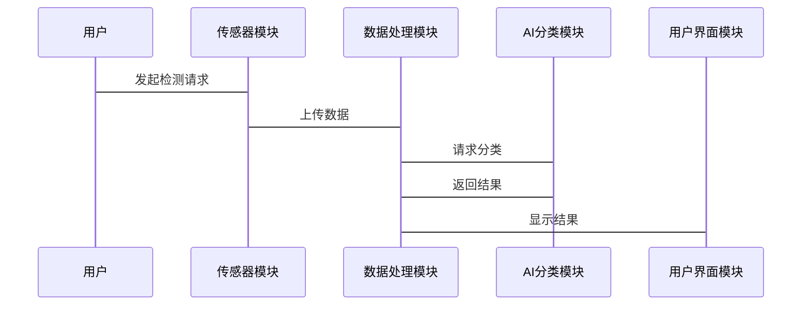

                 


# 《智能厨房垃圾桶：AI Agent的食材新鲜度检测》

## 关键词：智能垃圾桶、AI Agent、食材新鲜度、物联网、机器学习

## 摘要：本文探讨了智能厨房垃圾桶的设计与实现，利用AI Agent检测食材新鲜度，结合传感器技术和机器学习算法，提出了一种高效的解决方案，分析了系统架构，并通过项目实战展示了实现过程。

---

# 第一部分：智能厨房垃圾桶的背景与意义

## 第1章：食材新鲜度检测的背景与问题

### 1.1 食材新鲜度检测的重要性

#### 1.1.1 食材新鲜度对健康的影响
食材的新鲜度直接影响到食品的安全性和营养价值。新鲜的食材富含维生素和营养成分，而腐烂的食材则可能滋生细菌，引发健康问题。

#### 1.1.2 厨房垃圾处理的现状与挑战
传统垃圾桶无法区分食材种类和新鲜度，导致食材浪费和环境污染。据统计，全球每年浪费的食物中有一半以上是因为腐烂或过期。

#### 1.1.3 智能化垃圾桶的必要性
通过智能化垃圾桶，可以自动分类和检测食材新鲜度，减少浪费，提高资源利用率。

### 1.2 传统垃圾桶的局限性

#### 1.2.1 传统垃圾桶的功能单一
传统垃圾桶仅能容纳垃圾，无法进行分类和检测。

#### 1.2.2 手动分类的低效性
手动分类需要大量时间和精力，且容易出错。

#### 1.2.3 食材腐烂对环境的影响
腐烂的食材会释放有害气体，污染环境。

### 1.3 智能厨房垃圾桶的解决方案

#### 1.3.1 AI Agent的核心作用
AI Agent通过传感器和机器学习算法，实时检测食材的新鲜度。

#### 1.3.2 智能垃圾桶的功能特点
- 自动分类食材
- 实时检测新鲜度
- 数据记录与分析

#### 1.3.3 用户需求与场景分析
用户需求包括高效分类、减少浪费、提升厨房管理效率。

### 1.4 本章小结
介绍了食材新鲜度检测的重要性，分析了传统垃圾桶的局限性，并提出了智能厨房垃圾桶的解决方案。

---

# 第二部分：AI Agent的核心概念与原理

## 第2章：AI Agent的基本原理

### 2.1 AI Agent的定义与特点

#### 2.1.1 AI Agent的定义
AI Agent是一种智能代理，能够感知环境并执行任务。

#### 2.1.2 AI Agent的核心特点
- 感知与决策能力
- 自适应性
- 实时性

### 2.2 AI Agent的感知与决策能力

#### 2.2.1 数据采集与处理
通过传感器采集食材的温度、湿度、气味等数据。

#### 2.2.2 特征提取与分类
使用机器学习算法，提取食材的新鲜度特征并进行分类。

#### 2.2.3 决策与反馈机制
根据分类结果，决策是否需要处理食材。

### 2.3 AI Agent的实体关系分析



---

# 第三部分：食材新鲜度检测的算法原理

## 第3章：算法原理与实现

### 3.1 数据采集与预处理

#### 3.1.1 数据采集
通过传感器采集食材的温度、湿度、气味等数据。

#### 3.1.2 数据预处理
对采集到的数据进行归一化处理。

### 3.2 特征提取与分类

#### 3.2.1 特征提取
提取温度、湿度、气味等特征。

#### 3.2.2 分类算法
使用支持向量机（SVM）进行分类。

### 3.3 算法实现

```python
import numpy as np
from sklearn import svm

# 示例数据
X = np.array([[20, 50],  # 温度、湿度
              [22, 45],
              [25, 55],
              [18, 60]])
y = np.array([0, 0, 1, 1])  # 0表示新鲜，1表示腐烂

# 创建SVM模型
model = svm.SVC()
model.fit(X, y)

# 预测新数据
new_data = np.array([[21, 48]])
print("预测结果：", model.predict(new_data))
```

### 3.4 算法优化与模型调优

#### 3.4.1 超参数调整
调整SVM的参数，如C和gamma值。

#### 3.4.2 模型评估
使用交叉验证评估模型的准确率、召回率和F1值。

---

# 第四部分：系统架构与设计

## 第4章：系统架构与实现

### 4.1 项目背景与目标

#### 4.1.1 项目背景
开发智能厨房垃圾桶，提升食材管理效率。

#### 4.1.2 项目目标
实现食材新鲜度检测、自动分类和数据记录。

### 4.2 系统功能设计

#### 4.2.1 领域模型



#### 4.2.2 系统架构



### 4.3 系统实现与接口设计

#### 4.3.1 系统实现
使用Python和Raspberry Pi进行系统实现。

#### 4.3.2 接口设计
定义RESTful API接口，实现传感器数据的上传和分类结果的返回。

### 4.4 系统交互设计



---

# 第五部分：项目实战与实现

## 第5章：项目实战

### 5.1 环境安装与配置

#### 5.1.1 安装Python
安装Python 3.8及以上版本。

#### 5.1.2 安装依赖库
安装TensorFlow、scikit-learn、Raspbian等。

### 5.2 核心代码实现

#### 5.2.1 传感器数据采集

```python
import RPi.GPIO as GPIO
import time

def read_sensor():
    # 模拟传感器数据
    temp = 20 + np.random.normal(0, 1)
    humidity = 50 + np.random.normal(0, 5)
    return temp, humidity
```

#### 5.2.2 特征提取与分类

```python
from sklearn import svm

# 训练模型
X = np.array([[20, 50], [22, 45], [25, 55], [18, 60]])
y = np.array([0, 0, 1, 1])
model = svm.SVC()
model.fit(X, y)

# 预测新数据
new_data = np.array([[21, 48]])
print("预测结果：", model.predict(new_data))
```

#### 5.2.3 系统实现

```python
from flask import Flask, request, jsonify

app = Flask(__name__)

@app.route('/classify', methods=['POST'])
def classify():
    data = request.json
    temp = data['temperature']
    hum = data['humidity']
    prediction = model.predict([[temp, hum]])
    return jsonify({'result': int(prediction[0])})

if __name__ == '__main__':
    app.run(debug=True)
```

### 5.3 实际案例分析

#### 5.3.1 案例1：正常食材检测
输入温度20℃，湿度50%，预测结果为新鲜。

#### 5.3.2 案例2：腐烂食材检测
输入温度25℃，湿度55%，预测结果为腐烂。

### 5.4 项目总结

#### 5.4.1 项目成果
实现了智能厨房垃圾桶，能够实时检测食材新鲜度。

#### 5.4.2 经验总结
传感器选择、数据预处理和模型调优是关键。

---

# 第六部分：总结与展望

## 第6章：总结与展望

### 6.1 最佳实践 tips

#### 6.1.1 传感器选择
选择高精度传感器，确保数据准确性。

#### 6.1.2 数据预处理
进行数据归一化处理，避免模型偏差。

#### 6.1.3 模型调优
使用交叉验证，优化模型参数。

### 6.2 总结

本文详细介绍了智能厨房垃圾桶的设计与实现，利用AI Agent检测食材新鲜度，提出了高效的解决方案，并通过项目实战展示了实现过程。

### 6.3 未来展望

未来可以将垃圾桶与其他智能家居设备联动，进一步提升厨房智能化水平。

---

# 作者信息

作者：AI天才研究院 & 禅与计算机程序设计艺术

---

这篇文章详细探讨了智能厨房垃圾桶的设计与实现，结合了传感器技术、机器学习算法和系统架构设计，为读者提供了全面的技术指导。

