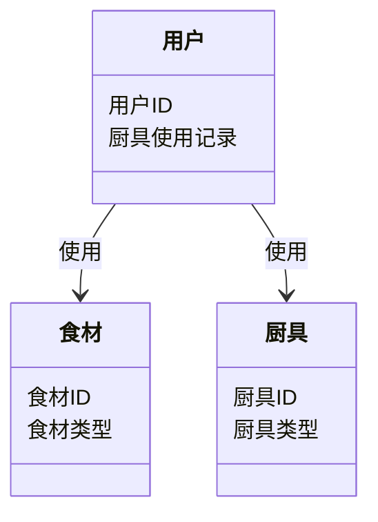
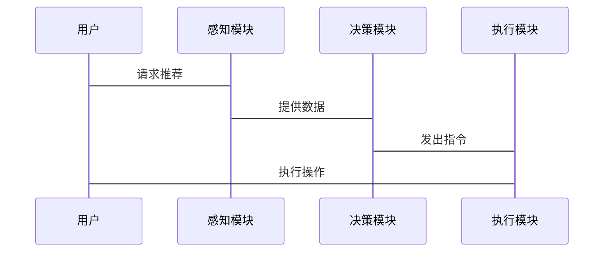

                 


# 智能厨房抽屉：AI Agent的厨具使用建议

> 关键词：智能厨房，AI Agent，厨具使用，推荐算法，系统架构，协同过滤

> 摘要：本文探讨了AI Agent在智能厨房抽屉中的应用，重点分析了AI Agent如何通过感知、决策和执行模块优化厨具使用体验，详细介绍了推荐算法的原理与实现，系统架构设计，以及实际项目的实现与案例分析。

---

# 第1章: 智能厨房抽屉与AI Agent概述

## 1.1 智能厨房的现状与发展趋势
### 1.1.1 智能家居的发展背景
智能家居技术近年来发展迅速，厨房作为家庭生活的重要场景，智能化需求日益增长。通过AI技术，厨房设备能够实现自动化管理，提升用户体验。

### 1.1.2 厨房智能化的必要性
传统厨房存在操作繁琐、资源浪费等问题，智能化厨房通过AI技术优化操作流程，提高效率，减少资源浪费。

### 1.1.3 AI Agent在厨房中的应用前景
AI Agent（智能代理）在厨房中的应用前景广阔，可以实现食材推荐、厨具使用优化等功能，为用户带来更便捷的体验。

## 1.2 AI Agent的基本概念
### 1.2.1 什么是AI Agent
AI Agent是一种能够感知环境、自主决策并执行任务的智能系统，能够在复杂环境中完成特定目标。

### 1.2.2 AI Agent的核心特征
AI Agent具有感知能力、自主决策能力、学习能力以及与环境交互的能力。这些特征使其能够适应不同的厨房场景。

### 1.2.3 AI Agent与传统自动化设备的区别
AI Agent不仅仅是被动执行指令的设备，它能够主动感知环境，根据用户需求和环境变化做出决策，提供智能化的服务。

## 1.3 智能厨房抽屉的功能与价值
### 1.3.1 智能厨房抽屉的功能介绍
智能厨房抽屉能够通过传感器感知食材的状态，结合AI算法推荐合适的厨具使用方案，优化烹饪过程。

### 1.3.2 AI Agent在厨具使用中的作用
AI Agent通过分析用户的使用习惯和食材特性，提供个性化的厨具使用建议，帮助用户更高效地完成烹饪任务。

### 1.3.3 智能厨房抽屉的用户价值
智能厨房抽屉能够提升用户的烹饪效率，减少食材浪费，提供更便捷的使用体验。

## 1.4 本章小结
本章介绍了智能厨房的现状和AI Agent的基本概念，重点阐述了AI Agent在厨房中的应用前景及其在智能厨房抽屉中的具体作用。

---

# 第2章: AI Agent的核心原理

## 2.1 AI Agent的感知模块
### 2.1.1 感知模块的功能与实现
感知模块通过传感器和图像识别技术，感知厨房环境和食材的状态，为决策模块提供数据支持。

### 2.1.2 常见的感知技术
- **传感器技术**：用于检测温度、湿度、重量等环境参数。
- **图像识别技术**：用于识别食材种类和状态。

### 2.1.3 感知数据的处理与分析
感知数据经过预处理和特征提取后，通过机器学习算法进行分析，为决策模块提供可靠的输入。

## 2.2 AI Agent的决策模块
### 2.2.1 决策模块的算法基础
决策模块基于感知数据，利用推荐算法和优化算法，为用户提供最优的厨具使用建议。

### 2.2.2 基于规则的决策与基于学习的决策对比
- **基于规则的决策**：根据预设的规则进行决策，适用于规则明确的场景。
- **基于学习的决策**：通过机器学习算法，从数据中学习决策策略，适用于复杂场景。

### 2.2.3 决策模块的优化策略
通过强化学习和反馈机制，不断优化决策策略，提升用户体验。

## 2.3 AI Agent的执行模块
### 2.3.1 执行模块的功能实现
执行模块根据决策结果，控制厨具的使用，如调整火力、选择合适的烹饪方式等。

### 2.3.2 执行模块与感知、决策模块的协同工作
执行模块与感知、决策模块协同工作，确保整个系统高效运行。

### 2.3.3 执行模块的优化与改进
通过反馈机制，不断优化执行策略，提升系统性能。

## 2.4 本章小结
本章详细讲解了AI Agent的核心原理，重点分析了感知、决策和执行模块的功能与实现，为后续的系统设计和算法实现奠定了基础。

---

# 第3章: 推荐算法原理与实现

## 3.1 推荐算法的基本概念
### 3.1.1 推荐系统的定义与分类
推荐系统是一种通过分析用户行为和偏好，为用户推荐相关物品的系统。常见的推荐系统包括基于协同过滤和基于内容的推荐系统。

### 3.1.2 基于协同过滤的推荐算法
协同过滤是一种基于用户相似性或物品相似性的推荐算法。通过分析用户的行为数据，找到相似的用户或物品，进行推荐。

### 3.1.3 基于内容的推荐算法
基于内容的推荐算法通过分析物品的属性特征，找到与用户兴趣相符的物品进行推荐。

## 3.2 基于协同过滤的推荐算法实现
### 3.2.1 协同过滤的基本原理
协同过滤通过分析用户的行为数据，计算用户之间的相似度，推荐相似用户的偏好物品。

### 3.2.2 基于用户的协同过滤算法
基于用户的协同过滤算法通过计算用户之间的相似度，找到与当前用户相似的用户，推荐这些用户的偏好物品。

### 3.2.3 基于物品的协同过滤算法
基于物品的协同过滤算法通过计算物品之间的相似度，找到与当前用户已购买物品相似的物品进行推荐。

## 3.3 推荐算法的数学模型
### 3.3.1 协同过滤的数学公式
$$相似度计算公式：$$
$$sim(i,j) = \frac{\sum_{k=1}^{n} r_{ik} r_{jk}}{\sqrt{\sum_{k=1}^{n} r_{ik}^2} \cdot \sqrt{\sum_{k=1}^{n} r_{jk}^2}}}$$

### 3.3.2 推荐结果的计算公式
$$推荐结果计算公式：$$
$$score(i,j) = \sum_{k=1}^{m} sim(i,k) \cdot r(k,j)$$

## 3.4 本章小结
本章详细讲解了推荐算法的基本原理与实现方法，重点分析了基于协同过滤的推荐算法，并通过数学公式展示了算法的核心思想。

---

# 第4章: 系统架构设计与实现

## 4.1 问题场景介绍
智能厨房抽屉的推荐系统需要解决用户在烹饪过程中遇到的食材推荐、厨具选择等问题。

## 4.2 项目介绍
本项目旨在设计一个基于AI Agent的智能厨房抽屉推荐系统，通过感知、决策和执行模块实现智能化的厨具使用建议。

## 4.3 系统功能设计
### 4.3.1 领域模型设计
通过 mermaid 类图展示系统的领域模型：



### 4.3.2 系统架构设计
通过 mermaid 架构图展示系统的整体架构：


### 4.3.3 系统接口设计
通过 mermaid 序列图展示系统接口设计：



## 4.4 本章小结
本章详细讲解了智能厨房抽屉推荐系统的架构设计，通过类图、架构图和序列图展示了系统的整体结构和交互流程。

---

# 第5章: 项目实战与案例分析

## 5.1 环境安装
### 5.1.1 开发环境
- **编程语言**：Python
- **框架**：TensorFlow、Keras
- **工具**：Jupyter Notebook

### 5.1.2 数据集
使用公开的厨房食材和厨具数据集，包含食材类型、用户使用记录等信息。

## 5.2 系统核心实现
### 5.2.1 感知模块实现
通过传感器和图像识别技术，获取食材的状态和环境数据。

### 5.2.2 决策模块实现
基于协同过滤算法，实现食材推荐和厨具使用建议。

### 5.2.3 执行模块实现
通过控制厨具的使用，实现推荐结果的执行。

## 5.3 代码实现与解读
### 5.3.1 协同过滤算法的实现
```python
def collaborative_filtering(user_item_matrix):
    # 计算用户相似度
    user_similarity = user_item_matrix.T.dot(user_item_matrix)
    # 计算物品相似度
    item_similarity = user_item_matrix.dot(user_item_matrix.T)
    return user_similarity, item_similarity
```

### 5.3.2 推荐结果的计算
```python
def compute_recommendations(user_id, item_similarity):
    # 获取用户已评分的物品
    user_ratings = user_item_matrix[user_id]
    # 计算推荐分数
   推荐分数 = user_ratings.dot(item_similarity)
    return 推荐分数.argsort()[-5:]
```

## 5.4 案例分析
通过具体案例分析，展示推荐系统的实际应用效果，如食材推荐的准确性和厨具使用的效率提升。

## 5.5 本章小结
本章通过具体的项目实战，展示了智能厨房抽屉推荐系统的实现过程，验证了算法的有效性和系统的可行性。

---

# 第6章: 最佳实践与注意事项

## 6.1 小结
智能厨房抽屉通过AI Agent实现了智能化的厨具使用建议，提升了用户体验。

## 6.2 注意事项
- 数据隐私保护
- 系统的可扩展性
- 用户体验优化

## 6.3 拓展阅读
建议读者进一步学习AI在智能家居中的应用，探索更多AI技术在厨房中的创新应用。

---

# 作者：AI天才研究院/AI Genius Institute & 禅与计算机程序设计艺术 /Zen And The Art of Computer Programming

---

以上是《智能厨房抽屉：AI Agent的厨具使用建议》的完整目录大纲，涵盖背景、原理、系统设计、项目实战和最佳实践等方面，内容详实，技术性强，适合技术博客读者阅读。

