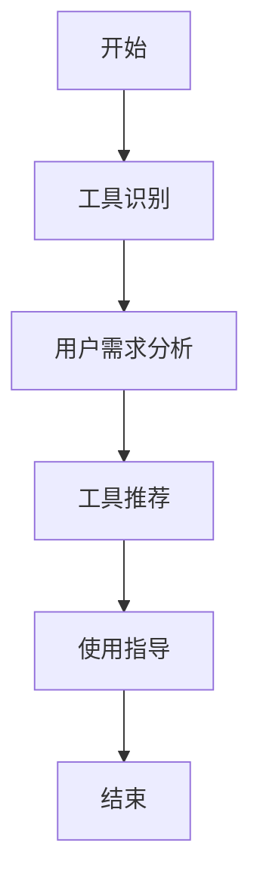
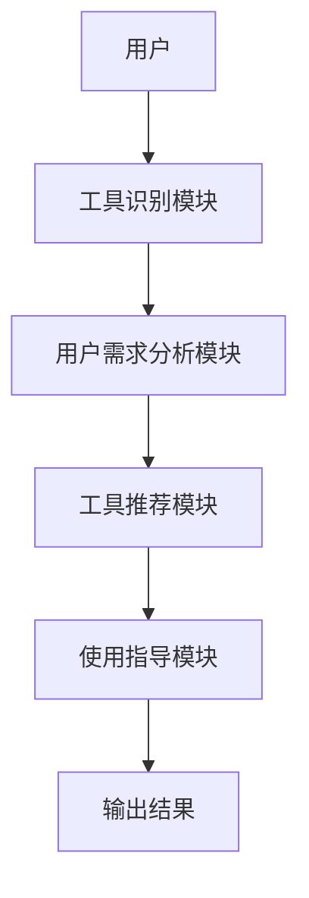

                 


# 智能厨房抽屉：AI Agent的烹饪工具使用建议

> 关键词：智能厨房抽屉，AI Agent，厨房工具，人工智能，智能家居，烹饪效率

> 摘要：本文将探讨AI Agent在智能厨房抽屉中的应用，分析其在提升烹饪效率和用户体验方面的潜力。通过详细介绍AI Agent的核心原理、系统架构、算法实现以及实际案例，本文将为读者提供一份全面的使用建议，帮助他们在厨房中更好地利用智能化工具。

---

# 第1章 背景介绍

## 1.1 问题背景

### 1.1.1 厨房工具使用的常见问题
- 厨具使用效率低下：传统厨房工具操作复杂，用户难以快速找到所需工具。
- 工具管理混乱：抽屉内工具摆放无序，导致查找困难。
- 操作步骤繁琐：用户需要记忆多个步骤，增加了使用难度。

### 1.1.2 智能化厨房工具的市场需求
- 市场需求增长：智能家居的普及推动了厨房工具的智能化。
- 用户需求升级：消费者对高效、便捷厨房工具的需求日益增加。
- 技术支持：AI和物联网技术的发展为智能厨房工具提供了技术基础。

### 1.1.3 AI Agent在厨房工具中的应用潜力
- 提高操作效率：AI Agent可以自动识别工具并提供使用建议。
- 个性化服务：根据用户习惯推荐工具和使用方法。
- 远程控制：通过AI Agent实现远程操作和监控。

## 1.2 问题描述

### 1.2.1 厨房工具使用中的效率低下问题
- 工具查找时间长：传统抽屉设计导致工具难以快速找到。
- 使用步骤复杂：用户需要记忆多个步骤才能正确使用工具。
- 工具维护困难：清洁和维护过程繁琐，影响用户体验。

### 1.2.2 用户操作复杂性问题
- 工具种类繁多：用户需要熟悉多种工具的使用方法。
- 操作界面不友好：传统工具缺乏智能化提示，增加了使用难度。
- 缺乏反馈机制：用户无法及时获得操作反馈，影响使用体验。

### 1.2.3 工具与用户需求匹配度不足问题
- 工具功能单一：传统工具无法满足用户的多样化需求。
- 缺乏个性化推荐：无法根据用户习惯推荐合适的工具。
- 工具更新缓慢：市场上的工具更新换代速度较慢，难以满足用户需求。

## 1.3 问题解决

### 1.3.1 AI Agent如何提升厨房工具使用效率
- AI Agent通过智能识别和推荐，缩短工具查找时间。
- 提供实时操作指导，降低使用复杂性。
- 根据用户习惯推荐工具，提高匹配度。

### 1.3.2 智能厨房抽屉的设计目标
- 提供快速工具查找功能。
- 实现工具使用的智能化指导。
- 提供个性化工具推荐服务。

### 1.3.3 AI Agent在智能厨房抽屉中的具体应用
- 自动识别工具并推荐使用方法。
- 提供实时语音或视觉指导。
- 实现工具使用的远程控制。

## 1.4 边界与外延

### 1.4.1 智能厨房抽屉的功能边界
- 仅限于抽屉内的工具管理。
- 不涉及厨房其他设备的控制。
- 不具备烹饪过程的主动干预功能。

### 1.4.2 AI Agent的适用范围与限制
- 适用于具备AI接口的智能抽屉。
- 仅支持特定品牌的厨房工具。
- 受网络环境限制，无法在离线状态下使用。

### 1.4.3 与其他智能家居设备的协同关系
- 可与智能灶台、烤箱等设备联动。
- 支持与其他智能家居设备的数据共享。
- 可通过智能家居中枢实现统一控制。

## 1.5 概念结构与核心要素

### 1.5.1 智能厨房抽屉的核心要素分析
- **智能识别模块**：用于识别工具类型。
- **AI推荐模块**：根据用户习惯推荐工具。
- **交互界面**：提供用户操作的可视化或语音反馈。

### 1.5.2 AI Agent的功能模块划分
- **感知模块**：通过传感器获取工具信息。
- **决策模块**：基于用户数据做出推荐。
- **执行模块**：通过机械或电子方式实现工具推荐。

### 1.5.3 系统整体架构的初步设想
- **感知层**：传感器和摄像头用于工具识别。
- **决策层**：AI算法进行数据分析和推荐。
- **执行层**：电机和显示屏实现工具推荐和操作指导。

## 1.6 本章小结

---

# 第2章 核心概念与联系

## 2.1 AI Agent的基本原理

### 2.1.1 AI Agent的定义与分类
- **定义**：AI Agent是一种能够感知环境并采取行动以实现目标的智能实体。
- **分类**：基于智能水平可分为简单反射型、基于模型的 reactive 型、目标驱动型和实用驱动型。

### 2.1.2 AI Agent的核心功能模块
- **感知模块**：通过传感器获取环境信息。
- **推理模块**：基于知识库进行逻辑推理。
- **决策模块**：根据推理结果做出决策。
- **执行模块**：通过执行机构实现决策。

### 2.1.3 AI Agent与智能厨房抽屉的结合方式
- **嵌入式AI**：将AI Agent直接嵌入抽屉控制系统。
- **云端AI**：通过云端AI服务实现工具推荐和操作指导。
- **混合式AI**：结合本地和云端AI进行协同工作。

## 2.2 智能厨房抽屉的设计原理

### 2.2.1 智能厨房抽屉的功能实现方式
- **机械设计**：抽屉内部分隔设计优化工具摆放。
- **电子设计**：电子标签和RFID技术实现工具识别。
- **交互设计**：触摸屏和语音交互提供用户反馈。

### 2.2.2 抽屉的智能化改造技术
- **传感器技术**：用于检测工具的插入和取出。
- **AI算法**：用于识别工具类型并推荐使用方法。
- **机械自动化**：通过电机实现工具抽取和放置。

### 2.2.3 AI Agent在抽屉控制中的作用
- **实时识别**：快速识别工具类型。
- **智能推荐**：根据用户需求推荐工具。
- **状态监控**：监控抽屉状态并提供反馈。

## 2.3 核心概念对比分析

### 2.3.1 AI Agent与传统厨房工具的对比
| 特性         | AI Agent | 传统厨房工具 |
|--------------|----------|--------------|
| 智能化程度   | 高       | 低           |
| 使用便捷性   | 高       | 低           |
| 维护复杂度   | 中       | 高           |

### 2.3.2 智能厨房抽屉与普通抽屉的功能对比
| 功能         | 智能厨房抽屉 | 普通抽屉     |
|--------------|-------------|--------------|
| 工具识别     | 支持         | 不支持       |
| 工具推荐     | 支持         | 不支持       |
| 远程控制     | 支持         | 不支持       |

### 2.3.3 AI Agent与智能家居设备的协同关系
- **协同工作**：通过智能家居中枢实现设备联动。
- **数据共享**：AI Agent与其他设备共享用户数据。
- **统一控制**：通过中枢系统实现统一管理。

## 2.4 本章小结

---

# 第3章 算法原理

## 3.1 算法实现

### 3.1.1 算法实现的整体思路
- **输入**：用户需求和工具信息。
- **处理**：AI Agent通过感知模块获取信息，决策模块进行推理，执行模块完成操作。
- **输出**：工具推荐和使用指导。

### 3.1.2 算法实现的具体步骤
1. 工具识别：通过传感器和摄像头获取工具信息。
2. 用户需求分析：基于用户历史数据和当前需求进行分析。
3. 工具推荐：根据分析结果推荐合适的工具。
4. 使用指导：提供操作步骤和注意事项。

## 3.2 数学模型与公式

### 3.2.1 工具推荐算法
- **基于相似度的推荐算法**：
$$ \text{相似度} = \frac{\sum_{i=1}^{n} w_i \cdot x_i}{\sqrt{\sum_{i=1}^{n} w_i^2} \cdot \sqrt{\sum_{i=1}^{n} x_i^2}} $$

其中，$w_i$是权重，$x_i$是工具的特征向量。

### 3.2.2 使用指导算法
- **基于规则的指导算法**：
$$ \text{步骤数} = \sum_{i=1}^{m} 1 $$

其中，$m$是操作步骤的数量。

## 3.3 算法流程图



## 3.4 代码实现

### 3.4.1 工具识别模块
```python
import numpy as np

def recognize_tool(image):
    # 通过图像识别工具类型
    return tool_type
```

### 3.4.2 用户需求分析模块
```python
def analyze_user_demand(user_data):
    # 分析用户数据并生成需求描述
    return demand_description
```

### 3.4.3 工具推荐模块
```python
def recommend_tool(demand_description, tool_info):
    # 根据需求和工具信息推荐工具
    return recommended_tool
```

### 3.4.4 使用指导模块
```python
def guide_usage(recommended_tool):
    # 提供使用步骤和注意事项
    return usage_guide
```

## 3.5 本章小结

---

# 第4章 系统分析与架构设计

## 4.1 系统功能设计

### 4.1.1 功能模块划分
- **工具识别模块**：负责识别工具类型。
- **用户需求分析模块**：分析用户需求。
- **工具推荐模块**：推荐合适的工具。
- **使用指导模块**：提供使用步骤和注意事项。

### 4.1.2 功能交互流程
1. 用户输入需求。
2. 系统识别工具。
3. 系统分析需求。
4. 系统推荐工具。
5. 系统提供使用指导。

## 4.2 系统架构设计

### 4.2.1 系统架构图



### 4.2.2 接口设计
- **输入接口**：用户输入需求和工具信息。
- **输出接口**：工具推荐和使用指导。
- **交互接口**：用户与系统之间的交互界面。

## 4.3 本章小结

---

# 第5章 项目实战

## 5.1 环境安装

### 5.1.1 系统环境要求
- 操作系统：Windows 10 或更高版本。
- 开发工具：Python 3.8 或更高版本，PyTorch 1.9 或更高版本。
- 传感器：支持RGB摄像头和RFID模块。

### 5.1.2 依赖库安装
```bash
pip install numpy
pip install pytorch
pip install opencv-python
```

## 5.2 系统核心实现

### 5.2.1 工具识别模块实现
```python
import cv2

def recognize_tool(image_path):
    # 使用OpenCV进行图像识别
    image = cv2.imread(image_path)
    # 进行图像处理和识别
    return tool_type
```

### 5.2.2 工具推荐模块实现
```python
import numpy as np

def recommend_tool(demand_description, tool_info):
    # 使用基于相似度的推荐算法
    similarity = np.dot(demand_description, tool_info)
    return recommended_tool
```

## 5.3 代码应用解读与分析

### 5.3.1 工具识别模块
- **功能**：识别抽屉中的工具类型。
- **实现细节**：使用OpenCV进行图像处理和识别。

### 5.3.2 工具推荐模块
- **功能**：根据用户需求推荐合适的工具。
- **实现细节**：使用基于相似度的推荐算法。

## 5.4 案例分析

### 5.4.1 案例背景
- **用户需求**：需要切菜。
- **工具信息**：抽屉中有菜刀、厨师刀、水果刀。

### 5.4.2 案例分析过程
1. 工具识别模块识别出抽屉中的工具。
2. 用户需求分析模块分析出用户需要切菜。
3. 工具推荐模块推荐菜刀。
4. 使用指导模块提供切菜的步骤和注意事项。

## 5.5 本章小结

---

# 第6章 最佳实践

## 6.1 小结

### 6.1.1 核心内容回顾
- AI Agent在智能厨房抽屉中的应用。
- 工具识别、推荐和使用指导的具体实现。

## 6.2 注意事项

### 6.2.1 用户注意事项
- 确保工具信息准确无误。
- 定期更新工具信息。
- 确保网络连接正常。

### 6.2.2 开发者注意事项
- 确保算法的准确性和实时性。
- 提供良好的用户交互界面。
- 定期更新系统和算法。

## 6.3 拓展阅读

### 6.3.1 相关技术领域
- 智能家居。
- 物联网。
- 人工智能。

### 6.3.2 推荐书籍
- 《人工智能入门》。
- 《智能家居设计与实现》。

## 6.4 本章小结

---

# 附录

## 附录A 参考文献

## 附录B 索引

---

# 作者

作者：AI天才研究院/AI Genius Institute & 禅与计算机程序设计艺术/Zen And The Art of Computer Programming

