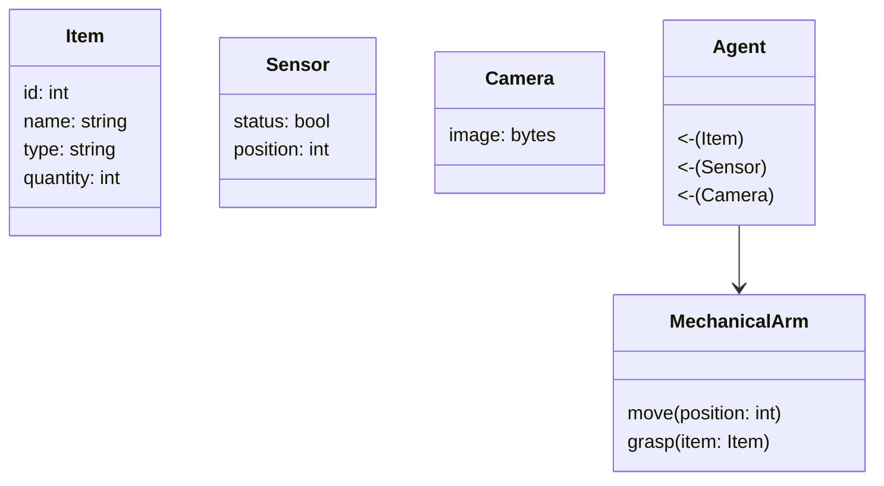
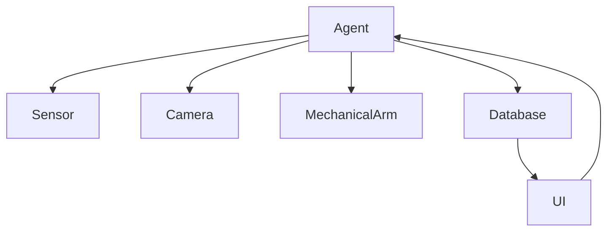
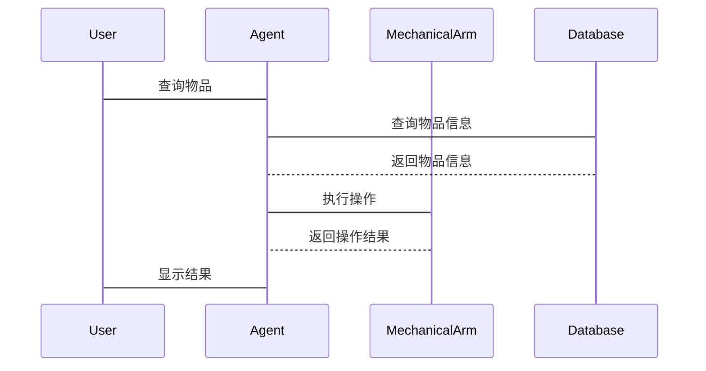

                 


# 智能厨房抽屉：AI Agent的物品管理系统

> 关键词：AI Agent、智能厨房、物品管理系统、计算机视觉、自然语言处理、系统架构

> 摘要：本文深入探讨了智能厨房抽屉中AI Agent的物品管理系统。通过分析厨房物品管理的传统挑战，提出了基于AI Agent的智能化解决方案。从AI Agent的核心原理到系统架构设计，再到项目实战与优化，本文详细阐述了智能厨房抽屉AI Agent的实现过程，为读者提供了从理论到实践的全面指导。

---

# 第一部分: 智能厨房抽屉AI Agent的背景与概念

## 第1章: 智能厨房抽屉与AI Agent概述

### 1.1 智能厨房抽屉的背景与问题背景

#### 1.1.1 厨房物品管理的传统挑战
传统厨房抽屉管理存在以下问题：
- **物品丢失**：常用物品难以快速找到，导致使用不便。
- **管理混乱**：物品分类不明确，导致存储效率低下。
- **维护困难**：手动记录物品状态容易出错，维护成本高。

#### 1.1.2 智能化管理的需求与趋势
随着智能家居的普及，厨房物品管理的智能化需求日益增长：
- 用户期望通过智能设备快速找到物品。
- 自动化管理减少人工干预，提升效率。
- 数据驱动的决策优化物品使用策略。

#### 1.1.3 AI Agent在厨房管理中的应用潜力
AI Agent（智能体）具备以下优势：
- **感知能力**：通过传感器和摄像头感知环境。
- **决策能力**：基于数据进行智能决策。
- **执行能力**：通过机械臂或指示灯执行操作。

### 1.2 智能厨房抽屉的定义与问题描述

#### 1.2.1 智能厨房抽屉的定义
智能厨房抽屉是一种集成AI Agent的智能设备，能够实现厨房物品的自动识别、分类、存储和管理。

#### 1.2.2 传统厨房抽屉管理的痛点
- **低效率**：手动查找物品耗时耗力。
- **管理混乱**：物品分类不明确，导致存储混乱。
- **维护困难**：手动记录物品状态容易出错。

#### 1.2.3 AI Agent在智能厨房抽屉中的角色与目标
AI Agent在智能厨房抽屉中的目标：
- **实时感知**：通过摄像头和传感器感知物品状态。
- **智能决策**：基于历史数据优化存储策略。
- **用户交互**：通过语音或屏幕与用户互动。

### 1.3 AI Agent的核心概念与边界

#### 1.3.1 AI Agent的基本定义
AI Agent是一种能够感知环境、自主决策并执行任务的智能实体。

#### 1.3.2 智能厨房抽屉中的AI Agent边界
- **感知范围**：仅限于厨房抽屉内部。
- **决策范围**：仅针对物品管理任务。

#### 1.3.3 系统的外延与限制
- **外延**：AI Agent可以与其他智能家居设备联动。
- **限制**：仅支持有限的物品类型和数量。

### 1.4 核心概念结构与组成要素

#### 1.4.1 系统组成要素分析
- **传感器**：用于感知物品状态。
- **摄像头**：用于识别物品。
- **机械臂**：用于操作物品。
- **用户界面**：用于与用户交互。

#### 1.4.2 各要素之间的关系
- 传感器感知环境，摄像头识别物品，机械臂执行操作。
- 用户通过界面与系统互动。

#### 1.4.3 系统的层次结构
- **感知层**：传感器和摄像头。
- **决策层**：AI Agent进行决策。
- **执行层**：机械臂执行操作。
- **用户层**：用户与系统交互。

---

## 第2章: AI Agent的核心原理与工作流程

### 2.1 AI Agent的核心原理

#### 2.1.1 感知与理解
AI Agent通过摄像头和传感器感知环境，识别物品类型和状态。

#### 2.1.2 决策与规划
基于感知数据，AI Agent通过算法决策如何存储和检索物品。

#### 2.1.3 执行与反馈
AI Agent通过机械臂执行操作，并根据反馈调整策略。

### 2.2 物品管理的核心机制

#### 2.2.1 物品识别与分类
AI Agent使用图像识别技术对物品进行分类。

#### 2.2.2 存储与检索策略
基于物品类型和使用频率，AI Agent优化存储位置。

#### 2.2.3 使用习惯分析
AI Agent通过分析用户行为，优化物品管理策略。

### 2.3 AI Agent与物品管理的协同机制

#### 2.3.1 数据流分析
- 感知数据流：传感器和摄像头的数据。
- 决策数据流：AI Agent的决策指令。
- 执行数据流：机械臂的操作反馈。

#### 2.3.2 交互逻辑设计
- 用户通过界面查询物品。
- AI Agent根据数据返回结果。
- 执行操作后反馈结果。

#### 2.3.3 系统优化方向
- 提高识别准确率。
- 优化存储策略。
- 提升用户交互体验。

---

## 第3章: AI Agent的算法与数学模型

### 3.1 基于规则的AI Agent

#### 3.1.1 基于规则的决策机制
AI Agent根据预设规则进行决策。

#### 3.1.2 规则的定义与实现
- **规则定义**：如“常用物品放在顶部”。
- **规则实现**：通过条件判断执行操作。

#### 3.1.3 规则系统的优缺点
- 优点：简单易实现。
- 缺点：灵活性差，难以应对复杂场景。

### 3.2 基于机器学习的AI Agent

#### 3.2.1 机器学习的基本原理
- 数据输入：物品特征。
- 特征提取：提取物品关键特征。
- 模型训练：训练分类器。

#### 3.2.2 监督学习与无监督学习的应用
- **监督学习**：标记数据训练分类器。
- **无监督学习**：聚类分析物品类型。

#### 3.2.3 深度学习在AI Agent中的应用
- 使用卷积神经网络（CNN）进行图像识别。

### 3.3 混合型AI Agent

#### 3.3.1 混合型AI Agent的定义
结合规则和机器学习的AI Agent。

#### 3.3.2 混合型AI Agent的优势
- 综合规则和机器学习的优势。

#### 3.3.3 混合型AI Agent的实现
- 结合规则和机器学习模型进行决策。

---

## 第4章: 系统分析与架构设计

### 4.1 系统功能设计

#### 4.1.1 领域模型类图


#### 4.1.2 系统架构图


#### 4.1.3 系统接口设计
- **传感器接口**：返回抽屉状态。
- **摄像头接口**：返回图像数据。
- **机械臂接口**：执行操作指令。
- **数据库接口**：存储和检索物品信息。
- **用户界面接口**：显示状态和接受用户指令。

#### 4.1.4 系统交互序列图


---

## 第5章: 项目实战与优化

### 5.1 环境安装与配置

#### 5.1.1 硬件安装
- 安装摄像头、传感器和机械臂。
- 硬件连接与调试。

#### 5.1.2 软件安装
- 安装Python、OpenCV、TensorFlow。
- 安装相关库和框架。

### 5.2 系统核心实现

#### 5.2.1 物品识别模块
- 使用OpenCV进行图像处理。
- 使用TensorFlow训练分类模型。

#### 5.2.2 AI Agent实现
- 实现感知、决策和执行模块。
- 编写主程序逻辑。

#### 5.2.3 机械臂控制模块
- 控制机械臂执行操作。
- 实现位置规划和运动控制。

### 5.3 代码实现与解读

#### 5.3.1 物品识别代码
```python
import cv2
import numpy as np

def detect_item(image):
    # 图像预处理
    gray = cv2.cvtColor(image, cv2.COLOR_BGR2GRAY)
    edges = cv2.Canny(gray, 50, 150)
    return edges
```

#### 5.3.2 AI Agent核心逻辑
```python
class Agent:
    def __init__(self):
        self.items = []
        self.sensors = []
        self.camera = None
        self.mechanical_arm = None

    def感知(self):
        # 获取传感器和摄像头数据
        pass

    def 决策(self):
        # 基于数据进行决策
        pass

    def 执行(self):
        # 执行操作
        pass
```

#### 5.3.3 机械臂控制代码
```python
class MechanicalArm:
    def __init__(self):
        self.position = 0

    def move(self, pos):
        self.position = pos
        print(f"机械臂移动到位置{pos}")

    def grasp(self, item):
        print(f"抓取物品：{item}")
```

### 5.4 实际案例分析

#### 5.4.1 案例背景
用户希望快速找到常用调料。

#### 5.4.2 系统实现
AI Agent识别并抓取调料。

#### 5.4.3 系统优化
优化存储位置，提高查找速度。

### 5.5 项目小结

#### 5.5.1 项目总结
- 成功实现了智能厨房抽屉AI Agent。
- 提高了物品管理效率。

#### 5.5.2 经验与教训
- 系统集成复杂，需要详细设计。
- 数据准确性影响识别结果。

---

## 第6章: 最佳实践与系统优化

### 6.1 小结

#### 6.1.1 核心知识点回顾
- AI Agent的基本原理。
- 物品管理系统的实现。

#### 6.1.2 系统优化方向
- 提高识别准确率。
- 优化存储策略。

### 6.2 注意事项

#### 6.2.1 系统维护
- 定期检查传感器和摄像头。
- 更新模型以提高识别准确率。

#### 6.2.2 用户教育
- 提供使用手册。
- 提供培训。

### 6.3 拓展阅读

#### 6.3.1 推荐书籍
- 《人工智能：一种现代的方法》
- 《Python机器学习实战》

#### 6.3.2 相关技术
- 计算机视觉
- 自然语言处理
- 智能家居

---

# 结语

智能厨房抽屉AI Agent的物品管理系统通过智能化手段解决了传统厨房抽屉管理的痛点，提高了物品管理效率和用户体验。本文从理论到实践，详细介绍了系统的实现过程，为读者提供了全面的技术指导。

---

**作者：AI天才研究院/AI Genius Institute & 禅与计算机程序设计艺术 /Zen And The Art of Computer Programming**

