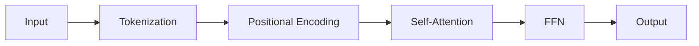
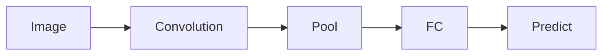
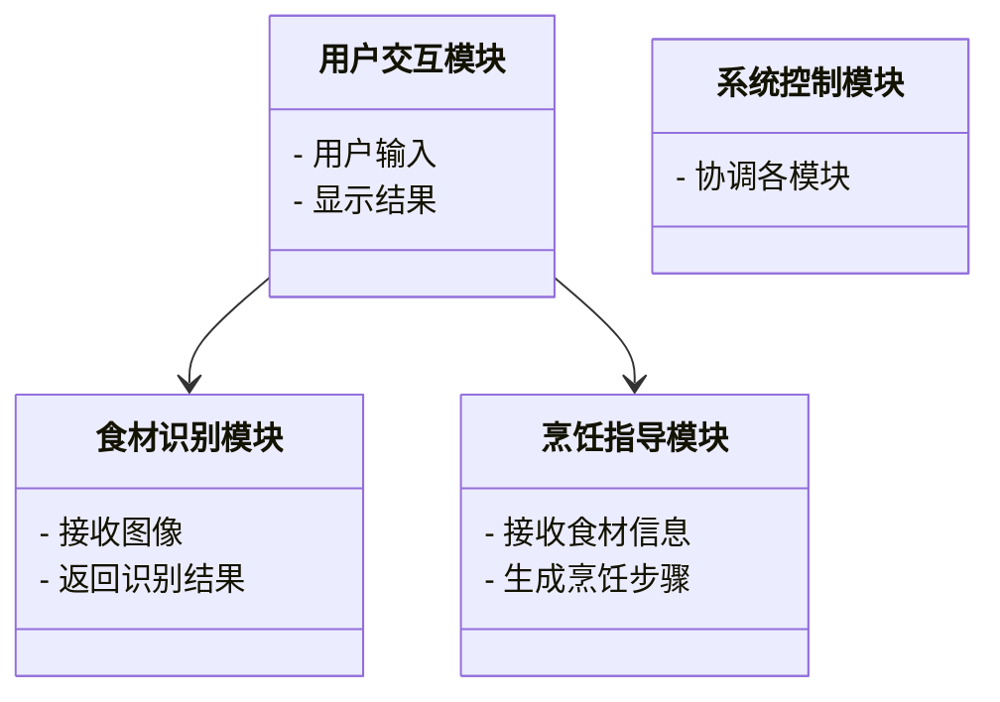
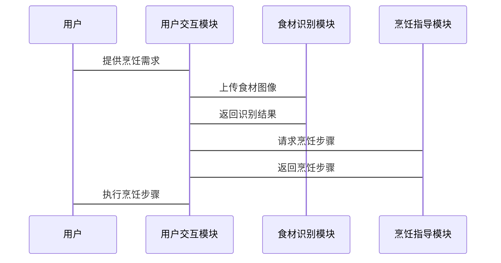
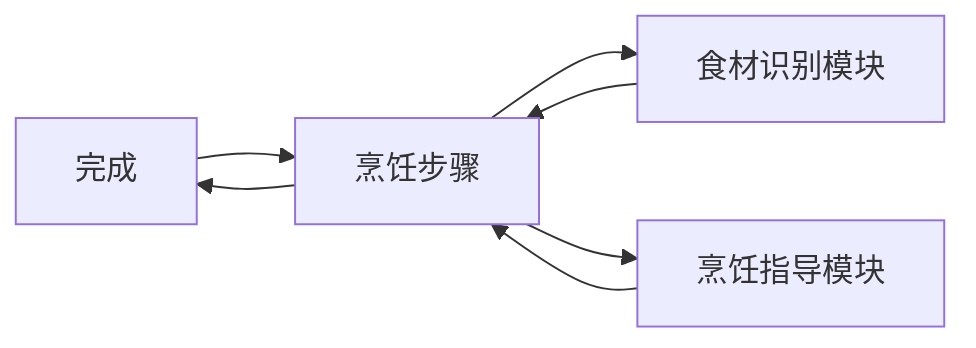

                 


# 智能厨房机器人：AI Agent的烹饪技巧指导

## 关键词：智能厨房机器人，AI Agent，烹饪技巧，自然语言处理，计算机视觉，机器学习

## 摘要：智能厨房机器人是一种结合人工智能和机器人技术的创新厨房工具，能够通过AI Agent提供个性化的烹饪指导。本文深入探讨了智能厨房机器人的背景、核心算法、系统架构，并通过实际案例展示了其在烹饪中的应用，最后总结了开发和使用的最佳实践。

---

# 第一部分: 智能厨房机器人概述

## 第1章: 智能厨房机器人的背景与现状

### 1.1 智能厨房机器人的概念与定义

智能厨房机器人是一种集成人工智能和机器人技术的厨房设备，能够通过AI Agent辅助用户进行烹饪。其核心功能包括食材识别、烹饪步骤指导、食谱推荐等。智能厨房机器人适用于家庭、餐厅和酒店，能够显著提升烹饪效率和质量。

### 1.2 智能厨房机器人的发展现状

全球智能厨房机器人市场正在快速增长，主要厂商包括Midea、iRobot和ChefSteps。这些产品利用AI技术实现智能烹饪指导，未来趋势是与物联网结合，提供更个性化的服务。

### 1.3 智能厨房机器人与传统厨房工具的对比

传统厨房工具如刀、锅缺乏智能化，而智能厨房机器人通过AI技术实现精准的食材识别和烹饪指导，显著提升了用户体验。

---

## 第2章: AI Agent在智能厨房机器人中的作用

### 2.1 AI Agent的基本概念

AI Agent是一种能够感知环境并采取行动以实现目标的智能体，能够处理自然语言和视觉信息，帮助用户完成烹饪任务。

### 2.2 AI Agent与智能厨房机器人的结合

AI Agent在烹饪中的应用场景包括理解用户需求、识别食材、指导烹饪步骤。其通过自然语言处理和计算机视觉技术实现智能化烹饪。

### 2.3 AI Agent的核心算法与技术

- **自然语言处理**：用于理解用户的烹饪需求，生成个性化的食谱。
- **计算机视觉**：用于识别食材，辅助用户完成烹饪步骤。
- **机器学习**：通过深度学习模型优化烹饪建议和食谱推荐。

---

## 第3章: 智能厨房机器人的系统架构

### 3.1 系统功能模块划分

- **用户交互模块**：负责与用户互动，接收指令。
- **食材识别模块**：利用计算机视觉技术识别食材。
- **烹饪指导模块**：基于识别结果生成烹饪步骤。
- **系统控制模块**：协调各模块的运行。

### 3.2 系统架构设计

系统采用分层架构：
1. 表现层：用户界面。
2. 业务逻辑层：处理用户指令和数据。
3. 数据访问层：与传感器和数据库交互。

---

# 第二部分: AI Agent的核心算法与技术

## 第4章: 自然语言处理技术

### 4.1 NLP技术在智能厨房机器人中的应用

NLP技术用于理解用户的烹饪需求，生成自然语言的烹饪步骤。例如，用户输入“我想做一道红烧肉”，系统会解析需求并提供详细步骤。

### 4.2 基于Transformer的烹饪指令处理

使用Transformer模型处理烹饪指令，其结构如下：



数学模型：

$$
\text{Output} = \text{FFN}(x + \text{Self-Attention}(x))
$$

---

## 第5章: 计算机视觉技术

### 5.1 计算机视觉技术的基本概念

计算机视觉用于识别食材种类和状态，辅助用户完成烹饪。

### 5.2 食材识别与菜品分类

使用卷积神经网络（CNN）进行食材识别：



数学模型：

$$
\text{Prediction} = \text{Softmax}(Wx + b)
$$

---

# 第三部分: 系统架构与实现

## 第6章: 系统架构设计

### 6.1 领域模型设计

系统模块关系如下：



### 6.2 系统架构设计

整体架构如下：


---

## 第7章: 接口设计与实现

### 7.1 系统接口设计

主要接口包括：

- 用户输入接口：处理用户的烹饪需求。
- 食材识别接口：接收图像并返回识别结果。
- 烹饪指导接口：生成烹饪步骤。

交互流程：



---

## 第8章: 交互流程实现

详细步骤：

1. 用户输入烹饪需求。
2. 系统识别食材。
3. 生成烹饪步骤。
4. 用户执行步骤。

流程图：



---

# 第四部分: 项目实战

## 第9章: 环境搭建与代码实现

### 9.1 环境安装

安装Python 3.8及以上版本，安装必要的库：

```bash
pip install numpy tensorflow keras opencv-python
```

### 9.2 核心代码实现

编写NLP处理模块：

```python
import tensorflow as tf
from tensorflow.keras.models import Model
from tensorflow.keras.layers import Input, LSTM, Dense

# 输入层
input_layer = Input(shape=(max_len, embedding_dim))
# LSTM层
lstm_layer = LSTM(units=128)(input_layer)
# 输出层
output_layer = Dense(units=num_classes, activation='softmax')(lstm_layer)

# 编译模型
model = Model(inputs=input_layer, outputs=output_layer)
model.compile(optimizer='adam', loss='categorical_crossentropy', metrics=['accuracy'])
```

## 第10章: 案例分析与项目总结

### 10.1 实际案例分析

以制作“红烧肉”为例，系统识别食材后生成详细步骤。

### 10.2 项目总结

智能厨房机器人通过AI Agent显著提升了烹饪效率和体验，未来将更加智能化和个性化。

---

# 第五部分: 最佳实践与注意事项

## 第11章: 最佳实践

### 11.1 开发建议

- 使用版本控制工具如Git管理代码。
- 定期更新模型以提高准确性。

### 11.2 部署与维护

- 可以选择云部署或本地部署。
- 定期维护模型和系统，确保其正常运行。

## 第12章: 未来展望

AI和机器人技术将继续进步，智能厨房机器人将在家庭和商业领域发挥更大作用，提供更智能、个性化的烹饪体验。

---

# 作者信息

作者：AI天才研究院/AI Genius Institute & 禅与计算机程序设计艺术 /Zen And The Art of Computer Programming

---

本文详细探讨了智能厨房机器人的背景、算法、架构及其实现，为读者提供了全面的技术指导。

