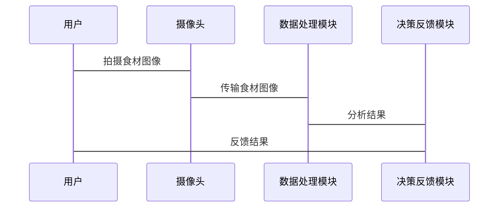

                 


```markdown
# 智能厨房案板：AI Agent的食品安全监控

> 关键词：AI Agent, 智能厨房, 食品安全, 图像识别, 深度学习, 自然语言处理

> 摘要：本文深入探讨了AI Agent在智能厨房案板中的应用，重点分析了AI Agent如何实现食品安全监控的核心原理与技术实现。通过系统化的分析与设计，本文提出了一种基于深度学习的图像识别和自然语言处理技术的食品安全监控系统，并通过实际案例展示了系统的实现过程与应用场景。

---

# 第1章 智能厨房案板与AI Agent的背景介绍

## 1.1 问题背景与问题描述

### 1.1.1 厨房食品安全问题的现状
现代厨房中，食品安全问题日益凸显。厨房案板作为食材处理的核心工具，常常面临细菌污染、食材变质等问题。传统的人工检查方式效率低下，且容易受到主观因素的影响，难以实现精准监控。

### 1.1.2 厨房案板的使用场景与挑战
厨房案板的使用场景复杂多样，涉及食材的切割、储存、处理等多个环节。如何在这些场景中实现对食材的实时监控，确保食材的安全性，是当前面临的主要挑战。

### 1.1.3 AI Agent在厨房场景中的应用潜力
AI Agent（智能代理）作为一种能够感知环境、自主决策的智能体，具备在厨房场景中实现食品安全监控的潜力。通过AI Agent，可以实时感知案板上的食材状态，主动识别潜在风险，并采取相应的措施。

## 1.2 问题解决与边界定义

### 1.2.1 AI Agent如何解决厨房食品安全问题
AI Agent可以通过图像识别技术实时监测案板上的食材状态，结合自然语言处理技术与用户交互，提供精准的食品安全建议。例如，通过图像识别检测食材是否变质，通过自然语言处理解答用户的食材处理问题。

### 1.2.2 系统的边界与外延
本系统专注于厨房案板的食品安全监控，边界包括食材的视觉检测和简单交互功能，不涉及食材的物理特性检测（如重金属检测）或其他复杂的烹饪指导。

### 1.2.3 核心功能与非核心功能的划分
- **核心功能**：食材状态的实时监测、异常情况的主动提醒。
- **非核心功能**：食材的营养价值分析、烹饪建议等。

## 1.3 核心概念与系统架构

### 1.3.1 AI Agent的核心概念
AI Agent是一种能够感知环境、自主决策并执行任务的智能体。在本系统中，AI Agent通过摄像头和传感器实时感知案板上的食材状态，利用深度学习算法进行分析，并通过自然语言处理技术与用户交互。

### 1.3.2 食品安全监控的系统架构
食品安全监控系统由数据采集模块、数据处理模块和决策反馈模块组成。数据采集模块负责采集食材的图像信息，数据处理模块利用深度学习算法进行分析，决策反馈模块根据分析结果提供相应的反馈。

### 1.3.3 核心要素与组成关系
- **核心要素**：食材、案板、AI Agent、用户。
- **组成关系**：食材通过案板进行处理，AI Agent通过摄像头采集食材图像，进行分析后向用户反馈结果。

---

# 第2章 AI Agent与食品安全监控的核心概念

## 2.1 AI Agent的原理与特点

### 2.1.1 AI Agent的基本原理
AI Agent通过感知环境、分析数据、做出决策并执行操作。在本系统中，AI Agent通过摄像头采集食材图像，利用深度学习算法进行图像识别，判断食材是否变质或存在异物。

### 2.1.2 AI Agent的核心特点
- **自主性**：AI Agent能够自主感知环境并做出决策。
- **反应性**：能够实时响应环境变化。
- **学习能力**：通过深度学习算法不断优化识别精度。

### 2.1.3 AI Agent与传统自动化系统的区别
AI Agent具备自主学习和决策能力，而传统自动化系统仅能按照预设规则执行任务。

## 2.2 食品安全监控的系统模型

### 2.2.1 食品安全监控的定义
食品安全监控是指通过技术手段实时监测食材的状态，确保其符合安全标准的过程。

### 2.2.2 监控系统的组成部分
- **数据采集模块**：负责采集食材的图像信息。
- **数据处理模块**：利用深度学习算法分析图像，判断食材状态。
- **决策反馈模块**：根据分析结果向用户反馈信息。

### 2.2.3 核心要素与组成关系
通过ER图（Entity-Relationship Diagram）展示核心要素及其关系：

```mermaid
er
actor: 用户
rectangle: 系统
rectangle: 食材
rectangle: 案板
rectangle: AI Agent
```

---

# 第3章 AI Agent的算法原理与实现

## 3.1 算法原理概述

### 3.1.1 AI Agent的感知与决策算法
AI Agent通过摄像头采集食材图像，利用卷积神经网络（CNN）进行图像识别，判断食材是否变质或存在异物。

### 3.1.2 基于深度学习的图像识别算法
图像识别算法的核心是卷积神经网络（CNN）。通过训练CNN模型，可以实现对食材图像的分类和识别。

### 3.1.3 基于自然语言处理的交互算法
通过自然语言处理技术，AI Agent能够理解用户的指令，并通过文本生成技术提供相应的反馈。

## 3.2 算法实现的数学模型

### 3.2.1 图像识别的卷积神经网络模型
CNN的数学模型如下：

$$\text{输出} = \text{Conv}(\text{输入}, \text{滤波器})$$

其中，Conv表示卷积操作，滤波器用于提取图像特征。

### 3.2.2 自然语言处理的转换器模型
自然语言处理模型采用Transformer架构，其注意力机制的计算公式如下：

$$\text{注意力权重} = \text{softmax}\left(\frac{QK^T}{\sqrt{d_k}}\right)$$

其中，Q为查询向量，K为键向量，$d_k$为向量维度。

## 3.3 算法实现的代码示例

### 3.3.1 图像识别的Python代码实现
```python
import tensorflow as tf
from tensorflow.keras import layers

model = tf.keras.Sequential([
    layers.Conv2D(32, (3, 3), activation='relu', input_shape=(224, 224, 3)),
    layers.MaxPooling2D((2, 2)),
    layers.Conv2D(64, (3, 3), activation='relu'),
    layers.MaxPooling2D((2, 2)),
    layers.Flatten(),
    layers.Dense(128, activation='relu'),
    layers.Dense(10, activation='softmax')
])
```

### 3.3.2 自然语言处理的Python代码实现
```python
import transformers

tokenizer = transformers.BertTokenizer.from_pretrained('bert-base-uncased')
model = transformers.BertForSequenceClassification.from_pretrained('bert-base-uncased')
```

---

# 第4章 系统分析与架构设计

## 4.1 系统功能设计

### 4.1.1 数据采集模块
数据采集模块通过摄像头采集食材图像，并将其传输至数据处理模块。

### 4.1.2 数据处理模块
数据处理模块利用深度学习算法对食材图像进行分类和识别，判断食材是否安全。

### 4.1.3 决策与反馈模块
决策与反馈模块根据分析结果向用户反馈信息，例如通过LCD屏幕显示食材状态或通过语音助手提醒用户。

## 4.2 系统架构设计

### 4.2.1 分层架构设计
系统采用分层架构，包括数据采集层、数据处理层和决策反馈层。

### 4.2.2 微服务架构设计
系统采用微服务架构，数据采集、数据处理和决策反馈模块分别作为独立的服务运行。

### 4.2.3 组件间的交互关系
通过mermaid序列图展示组件间的交互关系：



## 4.3 系统接口设计

### 4.3.1 数据接口
系统通过摄像头接口采集食材图像，并通过API将图像传输至数据处理模块。

### 4.3.2 用户接口
系统通过LCD屏幕和语音助手向用户反馈食材状态。

---

# 第5章 项目实战

## 5.1 环境安装与配置

### 5.1.1 安装TensorFlow
```bash
pip install tensorflow
```

### 5.1.2 安装OpenCV
```bash
pip install opencv-python
```

## 5.2 核心代码实现

### 5.2.1 图像识别代码
```python
import cv2
import numpy as np

# 加载预训练模型
model = tf.keras.models.load_model('food_safety_model.h5')

# 拍摄食材图像
cap = cv2.VideoCapture(0)
ret, frame = cap.read()

# 预测食材状态
prediction = model.predict(np.array([frame]))
print("食材状态：", prediction)
```

### 5.2.2 自然语言处理代码
```python
from transformers import BertTokenizer, BertForSequenceClassification

tokenizer = BertTokenizer.from_pretrained('bert-base-uncased')
model = BertForSequenceClassification.from_pretrained('bert-base-uncased')

# 用户输入
input_text = "这个食材是否新鲜？"
input_ids = tokenizer.encode(input_text, return_tensors='pt')
output = model(input_ids)
print("模型输出：", output)
```

## 5.3 实际案例分析

### 5.3.1 案例一：检测食材变质
用户将食材放在案板上，AI Agent通过摄像头采集图像，利用CNN模型识别食材是否变质，并通过LCD屏幕显示结果。

### 5.3.2 案例二：用户交互
用户询问“这个食材是否可以食用？”，AI Agent通过自然语言处理技术分析问题，并通过语音助手提供相应的建议。

---

# 第6章 总结与展望

## 6.1 最佳实践
在实际应用中，建议结合具体的厨房场景优化AI Agent的功能，例如增加更多类型的食材识别或优化模型的响应速度。

## 6.2 小结
本文详细探讨了AI Agent在智能厨房案板中的应用，重点分析了食品安全监控的核心原理与技术实现。通过系统化的分析与设计，本文提出了一种基于深度学习的图像识别和自然语言处理技术的食品安全监控系统。

## 6.3 注意事项
在实际应用中，需要注意模型的泛化能力和鲁棒性，确保系统能够在复杂多变的厨房环境中稳定运行。

## 6.4 拓展阅读
建议进一步阅读相关领域的最新研究成果，例如《深度学习在图像识别中的应用》和《自然语言处理在智能交互中的应用》。

---

# 作者：AI天才研究院/AI Genius Institute & 禅与计算机程序设计艺术 /Zen And The Art of Computer Programming
```

