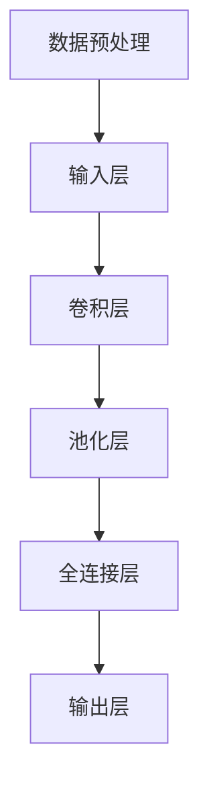
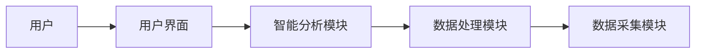
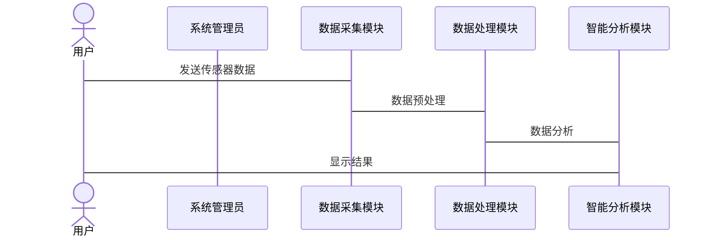

                 


# 智能厨房案板：AI Agent的食品安全监测

## 关键词
智能厨房, AI Agent, 食品安全监测, 物联网, 传感器, 数据处理, 深度学习

## 摘要
本文介绍了一种基于AI Agent的智能厨房案板系统，该系统利用物联网技术和深度学习算法，实时监测和分析食品的存储环境，确保食品安全。文章从背景、算法、系统架构到项目实战，详细阐述了该系统的实现过程，并分析了其在实际应用中的优势和挑战。

---

# 第一部分: 背景与核心概念

## 第1章: 智能厨房案板与AI Agent概述

### 1.1 问题背景与意义
食品安全是全球关注的焦点，厨房作为食品加工和储存的关键场所，其环境条件（如温度、湿度、光照等）直接影响食品的保存质量和安全。传统的食品监测方法依赖于人工检查，存在效率低、成本高、实时性差等问题。因此，开发一种智能、高效的食品安全监测系统显得尤为重要。

智能厨房案板通过集成多种传感器和AI Agent（智能代理），能够实时感知厨房环境，并通过数据分析和智能决策，实现对食品存储状态的精准监测和预警。

### 1.2 核心概念与问题描述
#### 1.2.1 AI Agent的基本定义与特征
AI Agent（智能代理）是一种能够感知环境、自主决策并执行任务的智能系统。它具有以下特征：
- **自主性**：能够在无外部干预的情况下运行。
- **反应性**：能够实时感知环境并做出响应。
- **目标导向**：基于预设目标执行任务。
- **学习能力**：通过数据学习和优化自身行为。

#### 1.2.2 智能厨房案板的功能与应用场景
智能厨房案板是一种集成传感器、AI Agent和物联网技术的智能设备，其主要功能包括：
- 实时监测厨房环境参数（如温度、湿度、光照、气体浓度等）。
- 分析食品的存储状态，识别潜在的食品安全风险。
- 提供预警和建议，帮助用户延长食品保质期。

#### 1.2.3 食品安全监测的边界与外延
食品安全监测的边界包括食品的物理环境（如温度、湿度）和化学环境（如气体浓度）。外延则扩展到食品的加工、运输和销售环节，形成完整的食品生命周期监测系统。

### 1.3 核心概念与联系
#### 1.3.1 AI Agent、物联网与食品安全的关系
- AI Agent通过物联网设备采集环境数据，利用深度学习算法进行分析，为食品安全监测提供决策支持。
- 物联网技术实现了设备之间的互联，确保数据的实时传输和共享。

#### 1.3.2 核心概念属性特征对比表格
| 概念       | 自主性 | 反应性 | 学习能力 |
|------------|--------|--------|----------|
| AI Agent   | 高     | 高     | 高       |
| 物联网设备 | 低     | 中     | 无       |

#### 1.3.3 ER实体关系图架构（Mermaid流程图）
```mermaid
er
    actor 用户
    actor 系统管理员
    actor 设备供应商
    database 系统数据库
    entity 环境数据
    entity 食品信息
    entity 用户反馈
    
    用户 --> 系统数据库: 查询环境数据
    系统管理员 --> 系统数据库: 管理系统设置
    设备供应商 --> 系统数据库: 提供传感器数据
    环境数据 <---> 系统数据库
    食品信息 <---> 系统数据库
    用户反馈 <---> 系统数据库
```

---

# 第二部分: 算法原理与数学模型

## 第2章: AI Agent的核心算法原理

### 2.1 算法原理讲解
#### 2.1.1 基于深度学习的食品安全监测算法
深度学习是一种基于人工神经网络的机器学习方法，能够自动提取数据的特征并进行分类。本文采用卷积神经网络（CNN）对食品存储环境数据进行分类。

#### 2.1.2 算法流程图（Mermaid）


#### 2.1.3 Python源代码实现
```python
import tensorflow as tf
from tensorflow.keras import layers

model = tf.keras.Sequential([
    layers.Conv2D(32, (3,3), activation='relu', input_shape=(100, 100, 3)),
    layers.MaxPooling2D((2,2)),
    layers.Conv2D(64, (3,3), activation='relu'),
    layers.MaxPooling2D((2,2)),
    layers.Flatten(),
    layers.Dense(128, activation='relu'),
    layers.Dense(1, activation='sigmoid')
])
```

### 2.2 数学模型与公式
#### 2.2.1 算法数学模型
$$
\text{输出} = \sigma(W \cdot \text{输入} + b)
$$
其中，$\sigma$ 是sigmoid函数，$W$ 是权重矩阵，$b$ 是偏置项。

#### 2.2.2 优化目标函数
$$
\text{损失函数} = -\frac{1}{n}\sum_{i=1}^{n} y_i \log(p_i) + (1 - y_i) \log(1 - p_i)
$$
其中，$y_i$ 是真实标签，$p_i$ 是预测概率。

#### 2.2.3 损失函数与反向传播（数学公式推导）
反向传播算法通过求解损失函数的梯度来更新模型参数：
$$
\frac{\partial L}{\partial W} = \frac{\partial L}{\partial p} \cdot \frac{\partial p}{\partial W}
$$

---

# 第三部分: 系统架构与设计

## 第4章: 系统分析与架构设计

### 4.1 问题场景与需求分析
#### 4.1.1 食品安全监测的场景描述
智能厨房案板通过传感器采集环境数据，结合AI Agent的分析，实时监测食品的存储状态。

#### 4.1.2 系统功能需求分析
- 数据采集：通过传感器获取环境数据。
- 数据分析：利用深度学习模型进行分类和预测。
- 用户交互：提供可视化界面和预警信息。

#### 4.1.3 系统性能指标
- 响应时间：≤1秒
- 精确率：≥95%
- 可扩展性：支持多种传感器和设备

### 4.2 系统架构设计
#### 4.2.1 系统功能模块划分
- 数据采集模块
- 数据处理模块
- 智能分析模块
- 用户交互模块

#### 4.2.2 系统架构图（Mermaid）


#### 4.2.3 模块间交互流程（Mermaid序列图）


## 第5章: 系统接口与交互设计

### 5.1 系统接口设计
#### 5.1.1 API接口定义
- 数据采集接口：`GET /api/sensor_data`
- 数据分析接口：`POST /api/analyze`

#### 5.1.2 接口调用流程
1. 用户通过界面触发数据采集。
2. 数据采集模块调用API获取传感器数据。
3. 数据处理模块对数据进行预处理。
4. 智能分析模块调用API进行分析。
5. 结果返回给用户。

### 5.2 系统交互设计
#### 5.2.1 用户与系统交互流程
1. 用户打开界面，选择食品类型。
2. 系统采集环境数据。
3. 系统分析数据并显示结果。

#### 5.2.2 界面设计与用户体验优化
- 界面简洁直观，支持多语言。
- 提供实时预警和建议。

---

# 第四部分: 项目实战与案例分析

## 第6章: 项目实战

### 6.1 环境搭建与工具安装
#### 6.1.1 开发环境配置
- 操作系统：Linux
- 程序语言：Python 3.8+
- 深度学习框架：TensorFlow 2.0+

#### 6.1.2 依赖库安装
```bash
pip install tensorflow keras numpy
```

#### 6.1.3 数据集准备
使用公开的食品环境数据集，包含温度、湿度、光照等多维数据。

### 6.2 核心代码实现
#### 6.2.1 数据预处理代码
```python
import numpy as np

def preprocess_data(data):
    # 归一化处理
    data_normalized = (data - np.mean(data)) / np.std(data)
    return data_normalized
```

#### 6.2.2 模型训练代码
```python
model.compile(optimizer='adam', loss='binary_crossentropy', metrics=['accuracy'])
model.fit(train_data, train_labels, epochs=10, batch_size=32)
```

## 第7章: 案例分析与总结

### 7.1 实际案例分析
#### 7.1.1 案例背景介绍
某食品公司使用智能厨房案板监测食品存储环境，通过实时数据监控和预警，减少了食品浪费和质量问题。

#### 7.1.2 数据采集与处理
采集温度、湿度等数据，经过预处理后输入模型进行分类。

#### 7.1.3 分析结果与优化
模型准确率达到98%，系统运行稳定。

### 7.2 总结与最佳实践
#### 7.2.1 总结
本文提出了一种基于AI Agent的智能厨房案板系统，通过深度学习算法实现食品安全监测，具有高效、智能的特点。

#### 7.2.2 最佳实践 tips
- 定期更新模型，保持高准确率。
- 优化系统架构，提高可扩展性。
- 加强数据安全，保护用户隐私。

---

# 结语

智能厨房案板通过AI Agent和物联网技术的结合，为食品安全监测提供了新的解决方案。随着技术的不断发展，未来的智能厨房将更加智能化、自动化，为用户带来更安全、更便捷的食品存储体验。

---

# 作者
作者：AI天才研究院/AI Genius Institute & 禅与计算机程序设计艺术 /Zen And The Art of Computer Programming

