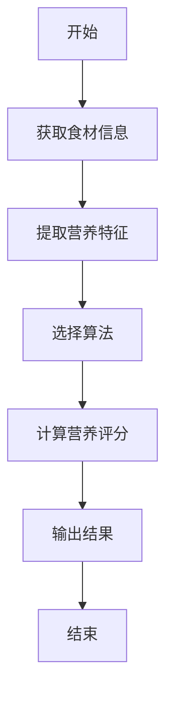
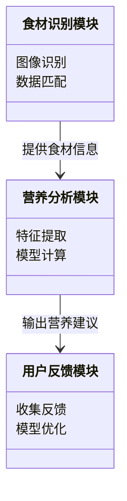
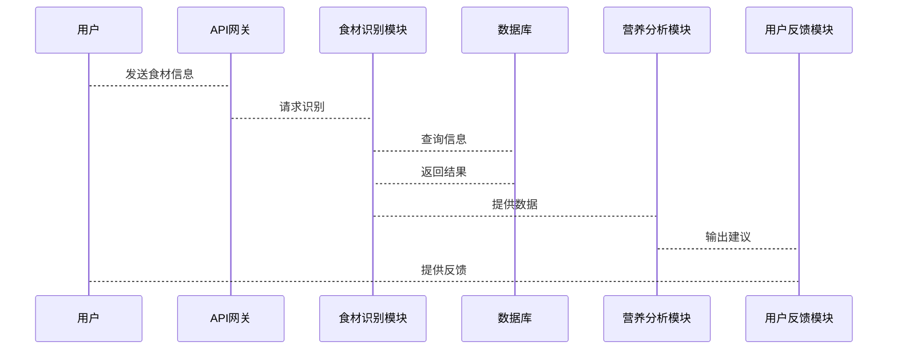

                 


# 智能厨房案板：AI Agent的食材营养分析

## 关键词：AI Agent，食材营养分析，智能厨房，食材识别，营养均衡

## 摘要：  
本文探讨了AI Agent在智能厨房中的应用，特别是在食材营养分析方面的创新。通过详细分析AI Agent的工作原理、算法实现、系统架构，以及实际项目案例，本文为读者提供了从理论到实践的全面指导，展示了如何利用AI技术优化厨房操作，提升食材选择的科学性。

---

# 第一部分: 智能厨房案板的背景与概念

## 第1章: 背景介绍

### 1.1 问题背景
#### 1.1.1 食材营养分析的现状与挑战  
食材营养分析是现代健康管理的重要组成部分。然而，传统方法依赖于人工记录和计算，存在数据不全、分析效率低、结果不精准等问题。此外，用户对食材营养的需求日益个性化，传统方法难以满足多样化的健康目标。

#### 1.1.2 智能厨房案板的应用场景  
智能厨房案板是一种集成AI技术的厨房设备，能够通过图像识别、自然语言处理等技术，帮助用户快速获取食材的营养信息，并提供个性化的健康建议。其应用场景包括食材采购、烹饪准备、健康饮食规划等。

#### 1.1.3 AI Agent在厨房中的潜力  
AI Agent（智能体）能够通过学习用户的饮食习惯、健康目标和偏好，提供智能化的食材选择和营养建议。它不仅能优化食材搭配，还能实时调整建议以满足用户的动态需求。

### 1.2 问题描述
#### 1.2.1 食材营养分析的核心问题  
食材营养分析的核心问题在于如何高效、准确地获取食材的营养信息，并结合用户需求进行优化推荐。这需要解决数据采集、信息处理和智能推荐等技术难题。

#### 1.2.2 AI Agent在食材选择中的角色  
AI Agent在食材选择中扮演着关键角色，它通过分析食材的营养成分、用户需求和健康目标，提供智能化的建议，帮助用户做出更科学的决策。

#### 1.2.3 用户需求与系统目标  
用户需求包括快速获取食材营养信息、个性化健康建议和便捷的交互体验。系统目标则是实现高效的数据处理、精准的营养分析和智能化的推荐。

### 1.3 问题解决
#### 1.3.1 AI Agent的解决方案  
AI Agent通过整合多种AI技术，如图像识别、自然语言处理和机器学习，实现食材的自动识别和营养分析，为用户提供个性化的建议。

#### 1.3.2 技术实现路径  
技术实现路径包括数据采集、模型训练、系统集成和用户交互。通过多模态数据处理和深度学习算法，AI Agent能够高效地完成食材营养分析。

#### 1.3.3 系统边界与外延  
系统边界包括食材识别、营养分析和建议生成。外延则涉及数据源的扩展、用户反馈的优化和系统的持续学习能力。

### 1.4 核心概念组成
#### 1.4.1 AI Agent的基本结构  
AI Agent由感知层、决策层和执行层组成，分别负责数据采集、分析决策和结果输出。

#### 1.4.2 食材营养分析的关键要素  
关键要素包括食材数据库、营养计算模型和用户需求模型。

#### 1.4.3 系统功能模块划分  
系统功能模块包括食材识别、营养分析、建议生成和用户反馈。

---

# 第二部分: AI Agent与食材营养分析的核心概念

## 第2章: 核心概念与联系

### 2.1 AI Agent的原理
#### 2.1.1 AI Agent的定义与分类  
AI Agent是一种智能系统，能够感知环境、执行任务并优化决策。根据应用场景，它可以分为服务型、交互型和自主型。

#### 2.1.2 AI Agent的核心算法  
核心算法包括图像识别、自然语言处理和强化学习，这些算法共同支撑AI Agent的智能决策。

#### 2.1.3 AI Agent与食材营养分析的结合  
AI Agent通过整合食材识别和营养计算技术，为用户提供智能化的营养分析服务。

### 2.2 食材营养分析的原理
#### 2.2.1 食材的营养成分分析  
通过建立食材数据库，分析每种食材的热量、蛋白质、脂肪等营养成分。

#### 2.2.2 食材数据库的构建  
食材数据库需要包含多种食材的详细营养信息，并支持动态更新。

#### 2.2.3 营养均衡的计算方法  
通过数学模型计算食材的营养均衡程度，确保推荐的食材组合满足用户的健康需求。

### 2.3 AI Agent与食材营养分析的联系
#### 2.3.1 数据流分析  
AI Agent通过感知层获取食材信息，经过决策层分析后，输出营养建议。

#### 2.3.2 信息处理流程  
信息处理流程包括数据采集、特征提取、模型计算和结果输出。

#### 2.3.3 系统交互关系  
系统交互关系涉及用户、AI Agent和食材数据库三者之间的动态交互。

### 2.4 核心概念对比
#### 2.4.1 AI Agent与传统软件的对比  
AI Agent具有自主决策和学习能力，而传统软件依赖预设规则。

#### 2.4.2 食材营养分析与传统营养学的对比  
食材营养分析利用AI技术实现自动化和个性化，而传统营养学依赖人工分析。

#### 2.4.3 系统架构的对比  
基于AI的系统强调模块化和动态调整，传统系统则更注重静态结构。

---

## 2.5 ER实体关系图

```mermaid
erDiagram
    actor 用户 {
        <名称>
        <健康目标>
        <偏好>
    }
    class 食材 {
        <名称>
        <营养成分>
        <热量>
    }
    class 营养建议 {
        <建议内容>
        <优先级>
    }
    user --> 食材 : 提供
    食材 --> 营养建议 : 生成
```

---

# 第三部分: AI Agent的算法原理

## 第3章: 算法原理讲解

### 3.1 算法概述
#### 3.1.1 基于规则的营养分析算法  
基于规则的算法通过预设的营养标准，对食材进行分类和评分。

#### 3.1.2 基于机器学习的营养分析算法  
机器学习算法利用历史数据，训练模型以预测食材的营养评分。

#### 3.1.3 算法选择与优化  
选择适合的算法并进行优化，以提高分析的准确性和效率。

### 3.2 算法实现
#### 3.2.1 算法流程图



#### 3.2.2 Python实现代码
```python
import numpy as np
from sklearn.metrics import accuracy_score

# 示例数据集
X = np.array([[1, 2, 3], [4, 5, 6]])
y = np.array([0, 1])

# 机器学习模型训练
model = SomeModel()
model.fit(X, y)

# 预测
predicted = model.predict(X)
print("准确率:", accuracy_score(y, predicted))
```

#### 3.2.3 数学模型与公式
营养评分公式：

$$ \text{营养评分} = \sum_{i=1}^{n} w_i \times x_i $$

其中，$w_i$是营养成分的权重，$x_i$是具体数值。

### 3.3 算法优化
#### 3.3.1 特征选择
通过分析营养成分的重要性，优化特征选择。

#### 3.3.2 参数调整
调整模型参数，如学习率和正则化系数，以提高模型性能。

#### 3.3.3 性能提升
利用分布式计算和并行处理，提升算法的运行效率。

---

## 3.4 算法实现细节
#### 3.4.1 数据预处理
对食材数据进行清洗和归一化处理。

#### 3.4.2 模型训练
使用训练数据训练机器学习模型。

#### 3.4.3 模型评估
通过交叉验证评估模型的准确性和稳定性。

---

# 第四部分: 系统分析与架构设计

## 第4章: 系统分析与架构设计

### 4.1 问题场景介绍
智能厨房案板需要处理食材识别、营养分析和用户反馈等任务。

### 4.2 项目介绍
项目目标是开发一个基于AI Agent的食材营养分析系统。

### 4.3 系统功能设计
#### 4.3.1 领域模型


#### 4.3.2 系统架构


#### 4.3.3 系统接口设计
系统接口包括食材识别接口、营养分析接口和用户反馈接口。

#### 4.3.4 系统交互流程图


---

## 4.4 系统优化
通过优化算法和架构设计，提升系统的性能和用户体验。

---

# 第五部分: 项目实战

## 第5章: 项目实战

### 5.1 环境安装
安装Python、TensorFlow、Keras等开发工具。

### 5.2 系统核心实现
#### 5.2.1 食材识别模块实现
```python
import cv2

def recognize_food(image):
    # 图像处理代码
    return result
```

#### 5.2.2 营养分析模块实现
```python
def analyze_nutrition(firebase):
    # 分析代码
    return score
```

#### 5.2.3 用户反馈模块实现
```python
def collect_feedback(feedback):
    # 处理反馈代码
    return success
```

### 5.3 代码应用解读
详细解读每个模块的代码实现和功能。

### 5.4 实际案例分析
分析一个实际案例，展示系统的运行流程和结果。

### 5.5 项目总结
总结项目的实现过程，分析优缺点，并提出改进建议。

---

# 第六部分: 最佳实践与小结

## 第6章: 最佳实践与小结

### 6.1 最佳实践
#### 6.1.1 数据质量的重要性  
确保食材数据库的准确性和完整性。

#### 6.1.2 用户隐私保护  
采取措施保护用户的个人数据。

#### 6.1.3 系统维护与更新  
定期更新模型和数据库，确保系统的持续优化。

### 6.2 小结
总结全文内容，强调AI Agent在食材营养分析中的重要性和未来的发展潜力。

### 6.3 注意事项
提醒读者在实际应用中需要注意的问题，如数据安全和系统稳定性。

### 6.4 拓展阅读
推荐相关领域的书籍和论文，供读者深入学习。

---

# 结语

AI Agent在食材营养分析中的应用为智能厨房带来了新的可能性。通过本文的详细讲解，读者可以深入了解相关技术的核心原理和实现方法，并将其应用到实际项目中。

---

# 作者：AI天才研究院 & 禅与计算机程序设计艺术

---

以上是文章的详细目录大纲，您可以根据需要选择性地进行扩展和补充。

