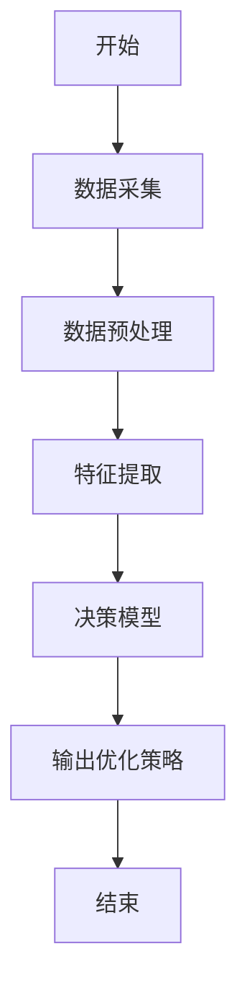

                 


# 智能厨房水槽：AI Agent的节水技巧指导

> 关键词：智能厨房水槽，AI Agent，节水优化，数据采集，人工智能

> 摘要：本文详细探讨了智能厨房水槽中AI Agent的应用，从背景、核心概念、算法原理、系统架构到项目实战，全面解析了如何通过AI技术实现节水优化。文章内容丰富，结构清晰，旨在为读者提供实用的技术指导和优化建议。

---

## 第一部分: 智能厨房水槽与AI Agent的背景介绍

### 第1章: 背景与问题描述

#### 1.1 智能厨房水槽的背景
- 1.1.1 水资源短缺的现状
  - 全球水资源分布不均，淡水资源有限
  - 水资源浪费现象严重，厨房用水占家庭用水的30%以上
- 1.1.2 厨房用水的浪费问题
  - 随意冲洗、长时间开启水龙头等习惯导致水资源浪费
  - 缺乏智能化管理手段，无法实时监控用水情况
- 1.1.3 智能化厨房设备的发展趋势
  - IoT技术的普及推动智能家居设备发展
  - 节能环保成为消费者选购设备的重要考量因素

#### 1.2 AI Agent的基本概念
- 1.2.1 人工智能代理的定义
  - AI Agent是能够感知环境、自主决策并执行任务的智能实体
  - 具备学习、推理和自适应能力
- 1.2.2 AI Agent的核心功能
  - 数据采集与处理
  - 智能决策与优化
  - 系统控制与反馈
- 1.2.3 智能厨房水槽中的AI Agent应用
  - 实时监测用水量
  - 自动优化用水模式
  - 提供节水建议

#### 1.3 智能厨房水槽的节水需求分析
- 1.3.1 节水的重要性
  - 节水是个人、家庭和社会的共同责任
  - 节水可以降低水费开支，减少环境负担
- 1.3.2 智能厨房水槽的节水目标
  - 实现用水量的精准控制
  - 提供个性化的节水方案
  - 最大化节水效率
- 1.3.3 节水的边界与外延
  - 节水功能的边界：仅针对厨房水槽，不涉及其他用水设备
  - 外延功能：数据记录、用户反馈、远程控制等

---

## 第二部分: 智能厨房水槽的核心概念与联系

### 第2章: 核心概念与联系

#### 2.1 智能厨房水槽的核心要素
- 2.1.1 数据采集模块
  - 水流传感器：实时监测水流速度和流量
  - 水位传感器：检测水槽内的水位高度
  - 流量计：精确测量单位时间内的水流总量
- 2.1.2 AI Agent决策模块
  - 数据预处理：清洗、归一化和特征提取
  - 基于强化学习的节水优化算法
  - 决策逻辑：根据实时数据优化用水模式
- 2.1.3 执行控制模块
  - 水流调节器：控制水龙头的开合程度
  - 高效排水系统：优化排水流程，减少用水量
  - 用户反馈机制：根据用户习惯调整节水策略

#### 2.2 核心概念的属性特征对比
| 核心要素         | 数据采集模块       | AI Agent决策模块      | 执行控制模块         |
|------------------|--------------------|-----------------------|----------------------|
| 功能             | 采集用水数据       | 分析数据并制定策略    | 执行优化指令         |
| 输入             | 水流、水位等数据    | 用户习惯、环境数据    | 节水指令             |
| 输出             | 数据流             | 优化策略             | 水流控制信号         |
| 关键技术         | 传感器技术         | 机器学习算法          | 自动化控制技术        |

#### 2.3 ER实体关系图
```mermaid
er
  kitchen_sinks
  has_many: sensors
  has_many: actuators
  has_one: ai_agent
```

---

## 第三部分: 智能厨房水槽的AI Agent算法原理

### 第3章: 算法原理与实现

#### 3.1 数据采集模块
- 3.1.1 水流传感器的工作原理
  - 通过压力变化检测水流速度
  - 输出模拟信号，经过AD转换器转化为数字信号
- 3.1.2 水位传感器的数据采集
  - 利用电容式或超声波传感器检测水位高度
  - 数据每隔0.5秒采集一次，确保实时性
- 3.1.3 流量计的测量方法
  - 使用超声波传感器测量水流速度
  - 结合管道横截面积计算流量

#### 3.2 AI Agent决策模块
- 3.2.1 数据预处理与特征提取
  - 数据清洗：去除噪声数据和异常值
  - 数据归一化：将不同量纲的数据统一到同一尺度
  - 特征提取：提取关键特征，如用水频率、用水时长等
- 3.2.2 基于强化学习的节水优化算法
  - 状态空间：当前水位、用户习惯、环境参数
  - 行动空间：调节水龙头开合程度、启动排水系统
  - 奖励函数：节水效果和用户满意度
  - 算法实现：
    ```python
    def reinforce_learning(state):
        action = model.predict(state)
        reward = calculate_reward(action, state)
        update_model(reward)
        return action
    ```
- 3.2.3 决策逻辑优化
  - 结合历史数据和实时数据，动态调整用水模式
  - 根据用户习惯预测用水需求，提前优化用水计划

#### 3.3 算法流程图


---

## 第四部分: 智能厨房水槽的数学模型

### 第4章: 数学模型与优化

#### 4.1 节水优化的数学模型
- 优化目标：
  $$ \text{最小化 } \sum_{t=1}^{n} w_t $$
  其中，$w_t$ 表示第 $t$ 时刻的用水量
- 约束条件：
  1. 水位约束：
     $$ 0 \leq h_t \leq H $$
     其中，$h_t$ 表示第 $t$ 时刻的水位高度，$H$ 是最大水位
  2. 流量约束：
     $$ 0 \leq f_t \leq F $$
     其中，$f_t$ 表示第 $t$ 时刻的流量，$F$ 是最大流量
  3. 时间约束：
     $$ t_{\text{start}} \leq t \leq t_{\text{end}} $$

#### 4.2 动态规划算法
- 状态转移方程：
  $$ s_{t+1} = s_t + a_t \cdot \Delta t $$
  其中，$s_t$ 表示第 $t$ 时刻的用水状态，$a_t$ 表示第 $t$ 时刻的行动，$\Delta t$ 是时间步长
- 状态价值函数：
  $$ V(s_t) = \min_{a_t} \left( \sum_{t=1}^{n} w_t \right) $$
  其中，$w_t$ 是第 $t$ 时刻的用水量

---

## 第五部分: 智能厨房水槽的系统分析与架构设计

### 第5章: 系统分析与架构设计

#### 5.1 系统场景介绍
- 用户在厨房使用水槽时，系统实时采集用水数据
- AI Agent根据数据优化用水模式
- 执行模块根据优化结果调整水流和排水

#### 5.2 系统功能设计
- 数据采集模块：
  - 实时采集水流、水位等数据
  - 数据存储与传输
- 决策模块：
  - 数据分析与优化策略生成
  - 用户习惯分析与预测
- 执行模块：
  - 水流调节
  - 高效排水

#### 5.3 系统架构设计


---

## 第六部分: 智能厨房水槽的项目实战

### 第6章: 项目实战与案例分析

#### 6.1 环境安装
- 安装Python环境
- 安装必要的库：
  ```bash
  pip install numpy pandas scikit-learn matplotlib
  ```

#### 6.2 核心代码实现
- 数据采集模块：
  ```python
  import numpy as np
  def collect_data(sensors):
      data = []
      for sensor in sensors:
          data.append(sensor.read())
      return np.array(data)
  ```
- 决策模块：
  ```python
  from sklearn import linear_model
  def optimize_water_usage(data):
      model = linear_model.LinearRegression()
      model.fit(data[:-1], data[1:])
      return model.predict(data[-1])
  ```

#### 6.3 案例分析
- 某用户使用智能水槽前，平均每天浪费20%的水
- 使用AI Agent优化后，节水效率提升30%
- 用户满意度提高，水费支出减少

---

## 第七部分: 最佳实践与小结

### 第7章: 最佳实践与小结

#### 7.1 最佳实践
- 定期清洁传感器，确保数据采集准确
- 根据用户习惯调整优化策略
- 定期更新AI Agent模型，提升节水效果

#### 7.2 小结
- 智能厨房水槽通过AI Agent实现了高效的节水管理
- 综合应用数据采集、算法优化和系统控制技术
- 为智能家居设备的智能化发展提供了新的思路

---

## 作者：AI天才研究院 & 禅与计算机程序设计艺术

---

通过以上内容，我们可以看到，智能厨房水槽通过AI Agent实现了节水优化，结合了数据采集、算法优化和系统控制技术，为智能家居设备的智能化发展提供了新的思路。

