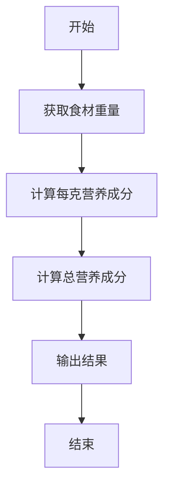
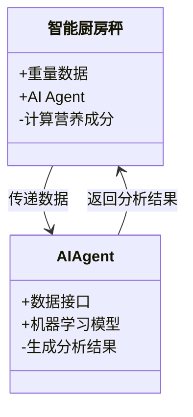

                 


# 智能厨房秤：AI Agent的营养成分分析

> 关键词：智能厨房秤, AI Agent, 营养成分分析, 人工智能, 物联网, 数据分析

> 摘要：本文将深入探讨智能厨房秤如何利用AI Agent进行营养成分分析。通过分析智能厨房秤的发展背景、AI Agent的基本原理、营养成分分析的数学模型以及系统架构设计，结合实际项目案例，展示AI技术在智能厨房秤中的应用及其对未来健康管理的重要意义。

---

# 第一部分：智能厨房秤与AI Agent的背景与概念

## 第1章：智能厨房秤的发展与应用

### 1.1 智能厨房秤的定义与功能

#### 1.1.1 智能厨房秤的基本概念
智能厨房秤是一种结合了物联网技术和智能传感器的厨房工具，能够实时测量食材的重量，并通过内置的AI算法分析食材的营养成分。

#### 1.1.2 智能厨房秤的核心功能
1. 实时重量测量
2. 营养成分分析
3. 健康建议生成
4. 数据同步与云端存储

#### 1.1.3 智能厨房秤的市场现状
随着健康意识的增强和科技的进步，智能厨房秤在市场上的需求日益增长，尤其是在注重健康管理的用户群体中。

### 1.2 AI Agent的基本概念

#### 1.2.1 人工智能代理的定义
AI Agent（人工智能代理）是一种能够感知环境、执行任务并做出决策的智能实体。它可以理解用户需求、处理数据并提供解决方案。

#### 1.2.2 AI Agent的核心特点
1. 感知能力：通过传感器或数据接口获取信息。
2. 决策能力：基于数据进行分析和推理。
3. 交互能力：与用户或其他系统进行实时交互。

#### 1.2.3 AI Agent在智能厨房秤中的应用
AI Agent负责接收食材重量数据，结合预设的营养成分数据库，分析出食材的热量、蛋白质、碳水化合物等营养成分，并生成健康建议。

### 1.3 营养成分分析的重要性

#### 1.3.1 营养成分分析的基本概念
营养成分分析是对食物中各种营养成分（如热量、蛋白质、脂肪、碳水化合物、维生素等）进行量化评估的过程。

#### 1.3.2 营养均衡的重要性
合理的营养摄入是维持身体健康的基础，营养成分分析能够帮助用户制定科学的饮食计划。

#### 1.3.3 智能厨房秤在营养分析中的作用
智能厨房秤通过AI Agent快速、准确地分析食材的营养成分，为用户提供个性化的饮食建议。

### 1.4 智能厨房秤与AI Agent的结合

#### 1.4.1 AI Agent在智能厨房秤中的角色
AI Agent作为智能厨房秤的核心，负责数据处理、分析和反馈生成。

#### 1.4.2 营养成分分析的智能化
通过AI算法，智能厨房秤能够自动识别食材种类，并计算其营养成分。

#### 1.4.3 智能厨房秤的用户价值
用户可以通过智能厨房秤快速获取食材的营养信息，并根据建议调整饮食习惯。

### 1.5 本章小结
本章介绍了智能厨房秤和AI Agent的基本概念，分析了它们在营养成分分析中的作用和价值，为后续内容奠定了基础。

---

## 第2章：AI Agent与营养成分分析的核心概念

### 2.1 AI Agent的基本原理

#### 2.1.1 AI Agent的感知与决策机制
AI Agent通过传感器或数据接口获取食材重量数据，并结合预设的营养成分数据库进行分析。

#### 2.1.2 AI Agent的学习与优化
通过机器学习算法，AI Agent可以不断优化营养成分分析的准确性。

#### 2.1.3 AI Agent的通信与交互
AI Agent可以通过云端与用户或其他设备进行数据交互，提供实时反馈。

### 2.2 营养成分分析的基本原理

#### 2.2.1 营养成分的分类与指标
营养成分主要分为热量、蛋白质、脂肪、碳水化合物、维生素等。

#### 2.2.2 营养成分分析的方法
1. 数据采集：通过智能秤获取食材重量。
2. 数据处理：结合食材数据库进行分析。
3. 结果输出：生成营养成分报告。

#### 2.2.3 营养成分分析的数学模型
数学模型用于计算不同营养成分的含量，例如：
$$ \text{热量} = \text{重量} \times \text{每克热量} $$

### 2.3 AI Agent与营养成分分析的结合

#### 2.3.1 数据采集与处理
AI Agent接收食材重量数据，并结合食材种类进行分析。

#### 2.3.2 数据分析与推理
通过机器学习算法，AI Agent可以预测食材的营养成分。

#### 2.3.3 结果输出与反馈
AI Agent将分析结果反馈给用户，并提供健康建议。

### 2.4 核心概念对比表

| 概念 | 属性 | 描述 |
|------|------|------|
| AI Agent | 感知 | 数据采集与处理 |
| 营养成分分析 | 分析 | 数据建模与推理 |
| 结果输出 | 反馈 | 用户反馈与优化 |

### 2.5 ER实体关系图

```mermaid
er
  actor: 用户
  smart_scale: 智能厨房秤
  agent: AI代理
  nutrient_analysis: 营养成分分析结果
  actor --> smart_scale: 使用智能厨房秤
  smart_scale --> agent: 传递数据
  agent --> nutrient_analysis: 生成分析结果
  nutrient_analysis --> actor: 提供健康建议
```

### 2.6 本章小结
本章详细介绍了AI Agent的基本原理以及营养成分分析的核心概念，通过对比和实体关系图展示了两者结合的逻辑关系。

---

## 第3章：营养成分分析的算法原理

### 3.1 数据采集与预处理

#### 3.1.1 数据采集流程
1. 用户放置食材于智能秤上。
2. 智能秤测量并记录食材重量。

#### 3.1.2 数据预处理
对采集的数据进行清洗和标准化处理，确保数据准确性。

### 3.2 数据分析与建模

#### 3.2.1 营养成分分析的数学模型
营养成分的计算公式：
$$ \text{营养成分} = \text{重量} \times \text{每克营养成分} $$

#### 3.2.2 机器学习算法的应用
使用回归算法预测食材的营养成分。

### 3.3 算法实现

#### 3.3.1 Python代码实现
```python
# 示例代码：计算蛋白质含量
weight = 100  # 克
protein_per_gram = 0.2  # 克/克
total_protein = weight * protein_per_gram
print(f"蛋白质含量为：{total_protein}克")
```

#### 3.3.2 算法流程图


### 3.4 算法优化

#### 3.4.1 参数优化
通过调整机器学习模型的参数，提高分析精度。

#### 3.4.2 数据增强
增加训练数据的多样性，提升模型的泛化能力。

### 3.5 本章小结
本章详细讲解了营养成分分析的算法原理，通过代码和流程图展示了实现过程。

---

## 第4章：系统分析与架构设计方案

### 4.1 问题场景介绍

#### 4.1.1 需求分析
用户希望智能厨房秤能够快速分析食材的营养成分。

#### 4.1.2 系统目标
设计一个高效的营养成分分析系统，满足用户的日常需求。

### 4.2 项目介绍

#### 4.2.1 项目背景
随着健康意识的提升，用户需要更智能的工具来管理饮食。

#### 4.2.2 项目目标
开发一款结合AI Agent的智能厨房秤，提供精准的营养成分分析。

### 4.3 系统功能设计

#### 4.3.1 领域模型


#### 4.3.2 系统架构设计
```mermaid
graph TD
    A[用户] --> B[智能厨房秤]
    B --> C[AI Agent]
    C --> D[数据库]
    D --> B: 返回分析结果
    B --> A: 提供健康建议
```

### 4.4 系统接口设计

#### 4.4.1 接口描述
1. 数据采集接口：接收食材重量数据。
2. 分析接口：调用AI Agent进行营养成分分析。
3. 反馈接口：将分析结果返回给用户。

#### 4.4.2 接口实现
```python
# 示例代码：接口实现
class SmartScale:
    def __init__(self):
        self.agent = AIAgent()

    def measure_weight(self, weight):
        return self.agent.analyze_nutrition(weight)

class AIAgent:
    def analyze_nutrition(self, weight):
        # 示例分析逻辑
        return {"蛋白质": weight * 0.2, "热量": weight * 1.5}
```

### 4.5 系统交互流程

#### 4.5.1 交互流程图
```mermaid
sequenceDiagram
    actor 用户
    system 智能厨房秤
    system AI Agent
    用户 -> 智能厨房秤: 放置食材
    智能厨房秤 -> AI Agent: 请求分析
    AI Agent -> 智能厨房秤: 返回分析结果
    智能厨房秤 -> 用户: 提供健康建议
```

### 4.6 本章小结
本章通过系统分析和架构设计，展示了智能厨房秤与AI Agent结合的实现方案。

---

## 第5章：项目实战

### 5.1 环境安装

#### 5.1.1 安装Python
安装Python 3.8或更高版本。

#### 5.1.2 安装依赖库
安装numpy、scikit-learn等机器学习库。

### 5.2 系统核心实现

#### 5.2.1 智能厨房秤代码实现
```python
class SmartScale:
    def __init__(self):
        self.agent = AIAgent()

    def measure_weight(self, weight):
        return self.agent.analyze_nutrition(weight)

    def display_result(self, result):
        print(f"蛋白质含量：{result['蛋白质']}克")
        print(f"热量：{result['热量']}千卡")
```

#### 5.2.2 AI Agent代码实现
```python
class AIAgent:
    def __init__(self):
        pass

    def analyze_nutrition(self, weight):
        # 示例分析逻辑
        protein = weight * 0.2
        calories = weight * 1.5
        return {"蛋白质": protein, "热量": calories}
```

### 5.3 代码应用解读与分析

#### 5.3.1 代码功能分析
1. SmartScale类负责与用户交互，接收重量数据并调用AI Agent进行分析。
2. AIAgent类负责具体的营养成分计算。

#### 5.3.2 代码优化建议
可以引入更复杂的机器学习模型，如随机森林，提高分析精度。

### 5.4 实际案例分析

#### 5.4.1 案例描述
用户放置100克鸡肉于智能秤上，系统分析其营养成分。

#### 5.4.2 分析过程
1. 智能秤测量重量为100克。
2. AI Agent计算蛋白质含量为20克，热量为150千卡。

#### 5.4.3 结果反馈
系统建议用户根据摄入量调整饮食。

### 5.5 本章小结
本章通过实际项目案例，展示了智能厨房秤与AI Agent结合的实现过程和应用效果。

---

## 第6章：总结与展望

### 6.1 本章总结
本文详细探讨了智能厨房秤与AI Agent结合的营养成分分析方法，通过理论分析和实际案例，展示了其在健康管理中的重要性。

### 6.2 未来展望
随着AI技术的不断发展，智能厨房秤将更加智能化，能够提供更精准的营养成分分析和个性化的健康建议。

### 6.3 最佳实践 Tips
1. 定期校准智能秤以确保测量准确性。
2. 结合多种数据源（如食材种类数据库）提高分析精度。

### 6.4 小结
智能厨房秤与AI Agent的结合为健康管理提供了新的可能性，未来将有更广泛的应用场景。

### 6.5 注意事项
- 确保数据安全，保护用户隐私。
- 定期更新AI模型以提升分析精度。

### 6.6 拓展阅读
建议读者进一步了解机器学习在健康管理中的应用，探索更多AI技术在厨房秤中的潜在功能。

---

# 作者

作者：AI天才研究院/AI Genius Institute & 禅与计算机程序设计艺术/Zen And The Art of Computer Programming

---

以上是《智能厨房秤：AI Agent的营养成分分析》的技术博客文章的完整内容，涵盖了从理论到实践的各个方面，结合实际案例和代码实现，帮助读者全面理解智能厨房秤与AI Agent结合的技术细节和应用场景。

