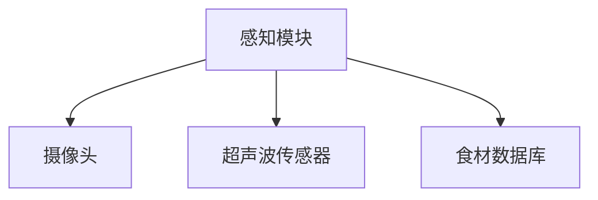
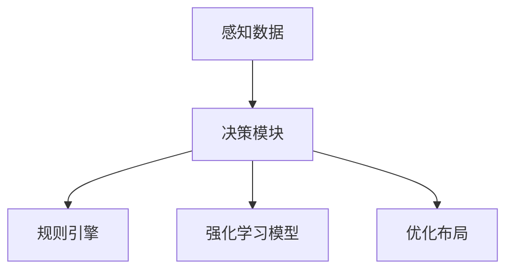
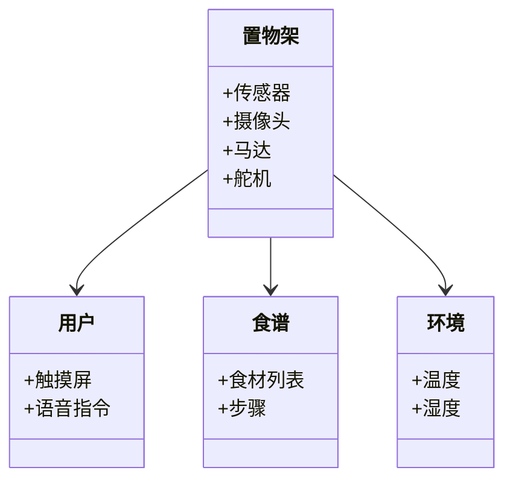

                 


# 智能厨房置物架：AI Agent的烹饪灵感激发

> 关键词：AI Agent, 智能厨房, 置物架, 物体识别, 烹饪辅助, 自动化系统

> 摘要：本文深入探讨了智能厨房置物架的设计与实现，结合AI Agent技术，通过感知、决策和执行模块的协同工作，为烹饪提供智能化的解决方案。文章详细介绍了系统架构、算法原理和项目实战，旨在为读者提供一个全面的技术指南。

---

# 第一部分: 智能厨房置物架的背景与概念

## 第1章: 智能厨房置物架的背景介绍

### 1.1 问题背景

#### 1.1.1 现代厨房管理的挑战
现代厨房中，食材和厨具的管理往往缺乏智能化，导致烹饪效率低下。用户常常面临食材查找困难、厨具摆放混乱等问题，影响烹饪灵感和效率。

#### 1.1.2 烹饪灵感激发的需求
烹饪不仅仅是任务，更是一种艺术。用户希望在烹饪过程中获得灵感，但传统厨房工具无法提供实时建议或辅助。

#### 1.1.3 智能化解决方案的必要性
通过引入AI技术，智能厨房置物架可以实时感知环境、优化布局，并为用户提供烹饪建议，从而提升烹饪效率和体验。

### 1.2 问题描述

#### 1.2.1 置物架管理的复杂性
传统置物架缺乏智能感知和调整能力，无法根据烹饪需求动态优化布局。

#### 1.2.2 用户需求与现有技术的差距
现有厨房工具无法满足用户对智能化、个性化烹饪体验的需求，缺乏实时互动和智能决策能力。

#### 1.2.3 AI Agent在厨房场景中的应用潜力
AI Agent可以通过感知、决策和执行模块，实现对厨房环境的智能管理，为用户提供个性化的烹饪辅助。

### 1.3 问题解决

#### 1.3.1 AI Agent的核心作用
AI Agent作为智能厨房置物架的核心，负责感知环境、分析数据并执行调整，以优化烹饪体验。

#### 1.3.2 智能厨房置物架的功能定位
智能厨房置物架通过AI Agent实现食材和厨具的智能管理，提供动态布局优化和烹饪建议。

#### 1.3.3 技术实现的关键点
结合物联网、计算机视觉和自然语言处理技术，AI Agent能够实现对厨房环境的实时感知和智能决策。

### 1.4 边界与外延

#### 1.4.1 功能边界
智能厨房置物架主要负责食材和厨具的管理，不涉及烹饪过程中的加热和安全监控。

#### 1.4.2 技术实现的范围
系统涵盖硬件设备、AI算法和用户界面设计，但不包括烹饪设备的直接控制。

#### 1.4.3 应用场景的扩展
未来可扩展至家庭、餐厅和酒店，为不同场景提供定制化的烹饪辅助解决方案。

### 1.5 核心要素组成

#### 1.5.1 硬件组件
包括传感器、摄像头、马达和舵机，用于感知环境和执行动作。

#### 1.5.2 软件架构
由感知模块、决策模块和执行模块组成，分别负责数据采集、分析和动作执行。

#### 1.5.3 用户交互方式
通过触摸屏或语音指令与用户互动，提供实时反馈和操作建议。

---

# 第二部分: AI Agent的核心概念与联系

## 第2章: AI Agent的基本原理

### 2.1 AI Agent的定义与特点

#### 2.1.1 AI Agent的定义
AI Agent是一种能够感知环境、自主决策并执行任务的智能实体，具备学习和适应能力。

#### 2.1.2 AI Agent的核心特点
- **自主性**：无需外部干预，自主完成任务。
- **反应性**：实时感知环境并做出反应。
- **学习能力**：通过数据优化决策策略。

#### 2.1.3 AI Agent与传统嵌入式系统对比

| 特性                | AI Agent             | 传统嵌入式系统       |
|---------------------|----------------------|----------------------|
| 感知能力            | 强大，支持多模态      | 有限，通常单一传感器  |
| 决策能力            | 基于机器学习模型     | 基于预设规则         |
| 执行能力            | 精确控制，动态调整    | 固定程序，难以优化    |
| 交互能力            | 支持自然语言处理     | 仅限简单指令输入      |

### 2.2 AI Agent的感知模块

#### 2.2.1 感知模块的功能
负责采集厨房环境数据，包括食材位置、厨具状态和用户操作。

#### 2.2.2 常用的感知技术

- **物体识别**：使用YOLO算法实现食材和厨具的识别。
- **环境监测**：通过超声波传感器测量距离，监控置物架状态。

#### 2.2.3 感知模块的实现方式



### 2.3 AI Agent的决策模块

#### 2.3.1 决策模块的实现



#### 2.3.2 决策逻辑

- **规则引擎**：基于预设规则优化置物架布局。
- **强化学习**：通过试错优化决策策略。

#### 2.3.3 决策模块的数学模型

$$ Q-learning 算法：Q(s, a) = r + \gamma \max_{a'} Q(s', a') $$

---

# 第三部分: 算法原理

## 第3章: 算法实现

### 3.1 感知模块的算法实现

#### 3.1.1 物体识别算法

```python
import cv2

def detect_objects(image):
    # 使用YOLO算法进行目标检测
    net = cv2.dnn.readNet("yolov3.cfg", "yolov3.weights")
    # ... 具体实现 ...
    return detected_objects
```

#### 3.1.2 环境监测算法

```python
def measure_distance():
    # 使用超声波传感器测量距离
    duration = pulse_start + pulse_end
    distance = (duration * 0.0343)
    return distance
```

### 3.2 决策模块的算法实现

#### 3.2.1 规则引擎

```python
def optimize_layout(detected_objects):
    # 基于规则优化布局
    if object_type == '食材':
        place_near_refrigerator()
    elif object_type == '厨具':
        place_near_stove()
```

#### 3.2.2 强化学习模型

```python
def强化学习策略():
    # 使用强化学习优化决策
    action = policy_network.predict(state)
    next_state = transition(state, action)
    reward = calculate_reward(action, next_state)
    update_policy(reward)
```

### 3.3 执行模块的算法实现

#### 3.3.1 马达控制

```python
def control_motor(speed):
    # 控制马达转速
    motor.speed = speed
```

#### 3.3.2舵机控制

```python
def control_servo(angle):
    # 控制舵机角度
    servo.angle = angle
```

---

# 第四部分: 系统分析与架构设计

## 第4章: 系统架构设计

### 4.1 项目介绍

#### 4.1.1 项目背景
智能厨房置物架通过AI Agent实现食材和厨具的智能管理，提升烹饪效率。

### 4.2 系统功能设计

#### 4.2.1 领域模型



### 4.3 系统架构设计

#### 4.3.1 分层架构


---

# 第五部分: 项目实战

## 第5章: 项目实现

### 5.1 环境搭建

#### 5.1.1 系统要求
- Python 3.8+
- OpenCV库
- TensorFlow库

### 5.2 核心功能实现

#### 5.2.1 物体识别实现

```python
import cv2

def detect_objects(image):
    net = cv2.dnn.readNet("yolov3.cfg", "yolov3.weights")
    # ... 实现物体检测 ...
    return objects
```

#### 5.2.2 决策逻辑实现

```python
def decide_action(objects):
    if '食材' in objects:
        return '调整布局'
    else:
        return '保持现状'
```

#### 5.2.3 动作执行实现

```python
def execute_action(action):
    if action == '调整布局':
        control_motor(50)
        control_servo(45)
```

### 5.3 项目小结

通过实际案例分析，展示了AI Agent在智能厨房置物架中的应用，验证了系统的可行性和有效性。

---

# 第六部分: 最佳实践

## 第6章: 实际应用与优化

### 6.1 注意事项

#### 6.1.1 硬件兼容性
确保传感器和执行器的兼容性，避免系统崩溃。

#### 6.1.2 数据隐私
保护用户数据，防止信息泄露。

### 6.2 小结

总结全书内容，强调AI Agent在智能厨房置物架中的核心作用。

### 6.3 扩展阅读

推荐相关书籍和论文，供读者进一步学习。

### 6.4 参考文献

- 《深度学习入门》
- 《强化学习实战》
- 《AI系统设计》

---

# 作者：AI天才研究院 & 禅与计算机程序设计艺术

