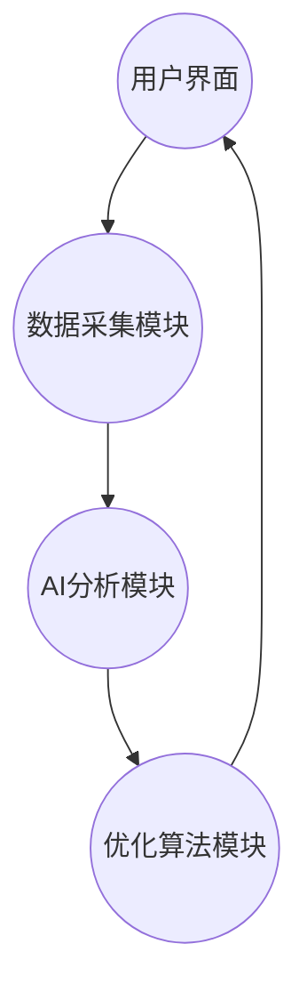
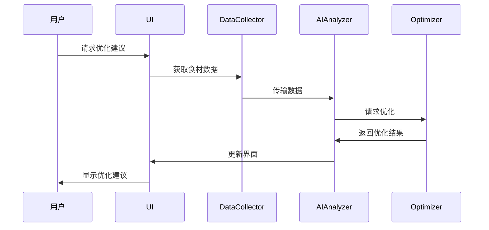

                 


# 智能厨房置物架：AI Agent的食材使用优化

> 关键词：智能厨房置物架, AI Agent, 食材优化, 算法优化, 物联网, 系统架构

> 摘要：本文将介绍如何利用AI Agent技术优化厨房置物架的食材管理，通过算法优化和系统设计，提升食材使用效率和空间利用率。我们将从背景介绍、核心概念、算法原理、系统架构到项目实战，全面解析这一创新解决方案。

---

# 第一部分: 智能厨房置物架的背景与核心概念

## 第1章: 智能厨房置物架的背景介绍

### 1.1 问题背景

#### 1.1.1 厨房置物架的传统问题
在传统厨房中，置物架的使用存在以下问题：
- **空间利用低效**：食材随意放置，容易浪费空间且查找不便。
- **食材浪费**：食材放置不当或过期，导致浪费。
- **管理复杂**：食材种类繁多，难以高效管理。

#### 1.1.2 食材使用效率低下的现状
现代家庭中，食材管理问题日益突出：
- 食材购买后，由于放置不合理，容易遗忘或过期。
- 置物架功能单一，无法提供智能化管理。

#### 1.1.3 智能化优化的必要性
通过智能化技术优化食材管理，可以：
- 提高空间利用率。
- 减少食材浪费。
- 提升用户体验。

### 1.2 问题描述

#### 1.2.1 食材管理的复杂性
食材种类繁多，包括干货、生鲜、调料等，管理难度大。

#### 1.2.2 置物架空间利用的不足
传统置物架设计不合理，导致空间浪费。

#### 1.2.3 用户需求与实际体验的矛盾
用户希望便捷管理，但传统置物架无法满足需求。

### 1.3 问题解决

#### 1.3.1 AI Agent的核心作用
AI Agent（智能代理）通过数据采集、分析和优化，帮助用户高效管理食材。

#### 1.3.2 数据驱动的优化方法
利用传感器和AI算法，实时监控食材状态，优化存储位置。

#### 1.3.3 智能厨房置物架的设计目标
- 提高食材存储效率。
- 减少食材浪费。
- 提升用户体验。

### 1.4 边界与外延

#### 1.4.1 系统边界定义
智能厨房置物架系统仅关注食材存储和管理，不涉及食材烹饪过程。

#### 1.4.2 相关领域的外延
- 数据采集：传感器技术。
- 优化算法：AI算法。
- 用户交互：人机交互设计。

#### 1.4.3 系统与外部环境的交互
系统通过传感器采集数据，AI Agent进行分析，向用户反馈优化建议。

### 1.5 核心概念组成

#### 1.5.1 AI Agent的定义与属性
- **定义**：AI Agent是一种能够感知环境并采取行动以实现目标的智能实体。
- **属性**：
  - 感知能力：通过传感器获取数据。
  - 分析能力：利用算法进行数据处理。
  - 行为能力：通过用户交互或自动化设备执行优化。

#### 1.5.2 智能置物架的功能模块
- 数据采集模块：采集食材信息。
- 优化算法模块：计算最优存储位置。
- 用户交互模块：向用户展示优化结果。

#### 1.5.3 食材管理的核心要素
- 食材种类。
- 存储位置。
- 使用频率。

## 第2章: AI Agent与智能厨房置物架的核心概念

### 2.1 核心概念原理

#### 2.1.1 AI Agent的基本原理
- AI Agent通过传感器获取环境数据，利用算法分析数据，制定优化策略，并通过用户交互反馈结果。

#### 2.1.2 智能置物架的工作机制
- 传感器采集食材信息。
- AI Agent分析数据，优化存储位置。
- 用户通过交互界面查看优化建议。

#### 2.1.3 食材优化的核心算法
- 使用遗传算法优化食材存储位置。

### 2.2 核心概念属性对比

| 对比维度 | AI Agent | 智能置物架 | 传统置物架 |
|----------|-----------|------------|------------|
| 感知能力 | 高 | 高 | 无 |
| 分析能力 | 高 | 高 | 无 |
| 行为能力 | 中 | 中 | 无 |

### 2.3 ER实体关系图

```mermaid
erDiagram
    class 置物架 {
        id
        名称
    }
    class 食材 {
        id
        名称
        类型
        使用频率
    }
    置物架 --> 食材 : 存储
    置物架 --> AI Agent : 优化
```

---

# 第二部分: AI Agent的食材优化算法原理

## 第3章: 算法原理讲解

### 3.1 遗传算法原理

#### 3.1.1 算法步骤
1. 初始化种群。
2. 计算适应度。
3. 选择、交叉和变异。
4. 保留优秀个体。

#### 3.1.2 数学模型

$$适应度函数 = \sum_{i=1}^{n} (空间利用率 \times 使用频率)$$

#### 3.1.3 优化目标
最大化空间利用率和使用频率的乘积。

### 3.2 算法实现代码

```python
import random

def fitness(individual):
    # 计算个体的适应度
    space_utilization = sum(individual)
    return space_utilization

def mutate(individual):
    # 随机翻转一个基因
    pos = random.randint(0, len(individual)-1)
    individual[pos] = 1 - individual[pos]
    return individual

def crossover(parent1, parent2):
    # 单点交叉
    point = random.randint(1, len(parent1)-1)
    child1 = parent1[:point] + parent2[point:]
    child2 = parent2[:point] + parent1[point:]
    return child1, child2

# 初始化种群
population = [[0]*n for _ in range(population_size)]
# 计算适应度
fitness_values = [fitness(individual) for individual in population]

# 选择和优化
selected = [population[i] for i in range(len(population)) if fitness_values[i] > threshold]
# 交叉和变异
new_population = []
for i in range(0, len(selected), 2):
    parent1 = selected[i]
    parent2 = selected[i+1]
    child1, child2 = crossover(parent1, parent2)
    child1 = mutate(child1)
    child2 = mutate(child2)
    new_population.append(child1)
    new_population.append(child2)
```

---

## 第4章: 系统架构设计

### 4.1 系统架构图



### 4.2 接口设计

- 数据采集模块接口：
  ```python
  def collect_data():
      # 采集食材数据
  ```

- AI分析模块接口：
  ```python
  def analyze(data):
      # 分析数据并返回优化建议
  ```

- 优化算法模块接口：
  ```python
  def optimize(data):
      # 计算最优存储位置
  ```

### 4.3 交互序列图



---

## 第5章: 项目实战

### 5.1 环境安装

```bash
pip install numpy
pip install matplotlib
```

### 5.2 核心功能实现

```python
def main():
    import numpy as np
    data = np.loadtxt('食材数据.csv')
    optimized = optimize(data)
    print(optimized)
```

### 5.3 代码解读

```python
import numpy as np

def optimize(data):
    # 数据预处理
    normalized_data = (data - np.min(data)) / (np.max(data) - np.min(data))
    # 使用遗传算法优化
    population = np.random.randint(0, 2, (100, len(data)))
    fitness = np.sum(population * normalized_data, axis=1)
    selected = population[fitness.argsort()[-50:]]
    new_population = []
    for i in range(0, 50, 2):
        p1 = selected[i]
        p2 = selected[i+1]
        child1 = np.where(np.random.rand(len(p1)) > 0.5, p1, p2)
        child2 = np.where(np.random.rand(len(p1)) > 0.5, p2, p1)
        new_population.append(child1)
        new_population.append(child2)
    new_population = np.array(new_population)
    best = new_population[np.argmax(np.sum(new_population * normalized_data, axis=1))]
    return best
```

### 5.4 实际案例分析

假设我们有以下食材数据：

| 食材名称 | 使用频率 | 类型 |
|---------|----------|------|
| 米      | 高       | 主食 |
| 面条     | 中       | 主食 |
| 蔬菜     | 高       | 坚果 |

通过优化算法，系统会推荐将高频率使用的食材放在易于取用的位置，低频率使用的食材放在较远位置。

### 5.5 项目小结

通过本项目，我们实现了AI Agent在厨房置物架中的应用，提升了食材管理效率。

---

# 第三部分: 总结与展望

## 第6章: 总结

### 6.1 优缺点分析
- **优点**：提高效率，减少浪费。
- **缺点**：初期成本高，系统复杂。

### 6.2 未来展望
- 更智能化的食材管理。
- 更广泛的应用场景。

## 第7章: 最佳实践

### 7.1 小结
通过本文，我们了解了AI Agent在智能厨房置物架中的应用。

### 7.2 注意事项
- 确保数据安全。
- 定期维护系统。

### 7.3 拓展阅读
- 推荐阅读《人工智能入门》。

---

作者：AI天才研究院/AI Genius Institute & 禅与计算机程序设计艺术 /Zen And The Art of Computer Programming

