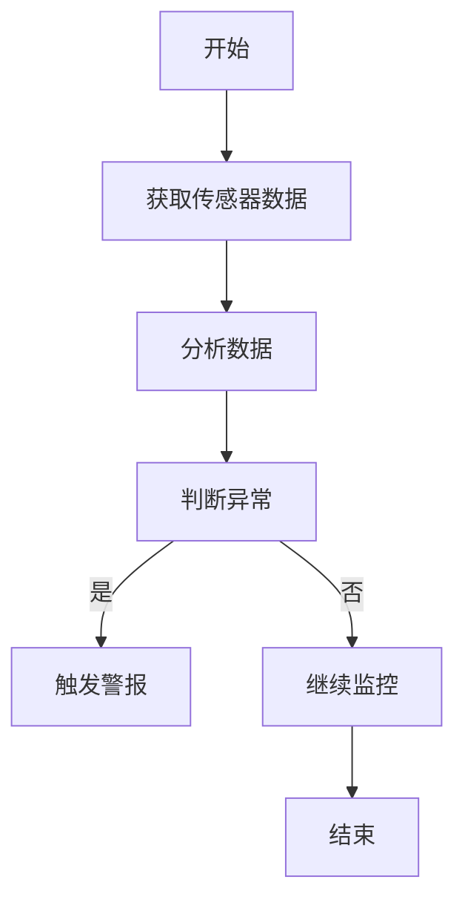
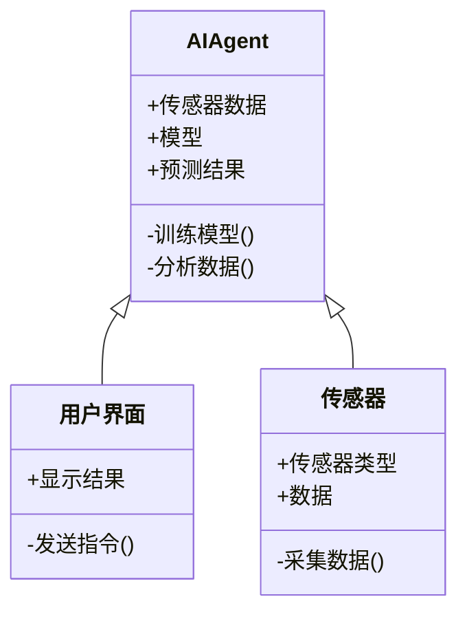
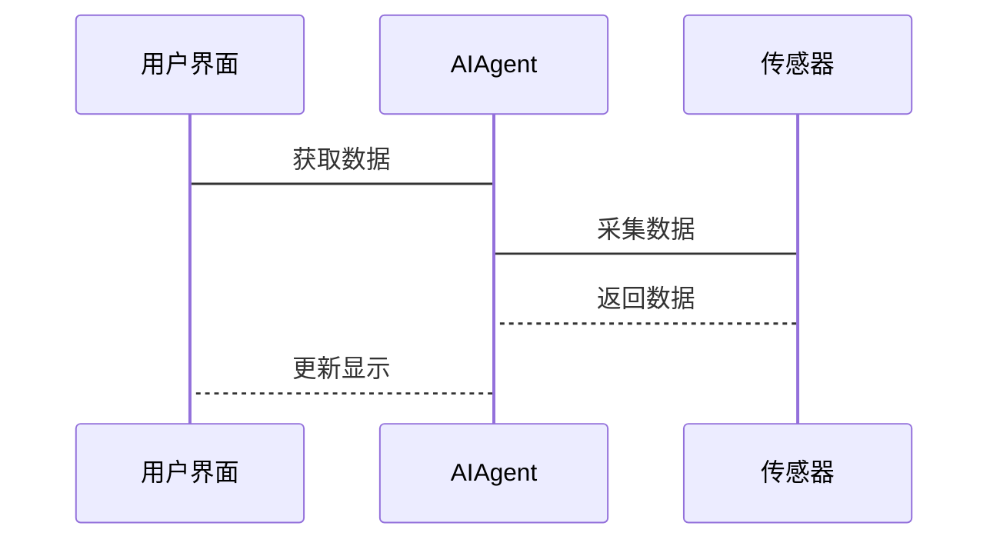

                 


# 智能厨房置物架：AI Agent的食材保鲜监控

> 关键词：AI Agent, 食材保鲜, 物联网, 智能厨房, 传感器技术

> 摘要：本文探讨了AI Agent在智能厨房置物架中的应用，通过食材保鲜监控系统，利用物联网技术和传感器，实现食材的最佳保鲜管理。文章从背景介绍、核心概念、算法原理、系统架构、项目实战、最佳实践等多个方面进行详细分析，为读者提供全面的技术解析。

---

## 第一部分：背景介绍

### 第1章：智能厨房置物架的背景与问题背景

#### 1.1 问题背景与问题描述

- **问题背景**：现代家庭中，食材保鲜是一个普遍关注的问题。传统冰箱和保鲜盒虽然提供了基本的保鲜功能，但缺乏智能化的管理，导致食材容易过期或浪费。如何通过技术手段优化食材管理，延长保鲜时间，成为亟待解决的问题。

- **问题描述**：食材保鲜监控系统需要实时感知食材的状态（如温度、湿度、气味等），并根据数据进行智能决策，调整保存条件或提醒用户及时处理食材。

#### 1.2 问题解决与边界

- **AI Agent的作用**：AI Agent（智能代理）通过整合传感器数据，利用机器学习算法，实时分析食材状态，优化保存策略，提醒用户处理即将过期的食材。

- **边界与外延**：系统专注于食材保鲜监控，不涉及食材的购买、烹饪或其他厨房功能。外延包括传感器技术、数据传输和用户界面设计。

#### 1.3 核心概念与问题模型

- **核心概念**：AI Agent、传感器、食材保鲜数据。
- **问题模型**：食材保鲜监控系统通过AI Agent整合多源传感器数据，实现对食材状态的实时监控和智能决策。

---

## 第二部分：核心概念与联系

### 第2章：AI Agent与食材保鲜监控的核心概念

#### 2.1 核心概念原理

- **AI Agent**：AI Agent通过传感器获取数据，利用机器学习算法分析食材状态，提供保鲜建议或自动调整存储条件。
- **传感器技术**：温度、湿度、气味传感器实时监测食材环境，数据传输至AI Agent进行处理。
- **食材保鲜监控系统**：整合AI Agent和传感器，形成闭环系统，实现食材的智能管理。

#### 2.2 核心概念属性特征对比

| 概念        | 属性特征               |
|-------------|------------------------|
| AI Agent    | 数据分析能力、自主决策、实时响应 |
| 传感器技术   | 多模态感知、实时监测、高精度    |
| 食材保鲜系统 | 综合管理、智能优化、用户交互    |

#### 2.3 ER实体关系图

```mermaid
erd
    title AI Agent与食材保鲜监控的实体关系图
    entity AI Agent {
        id
        智能传感器连接
        数据分析能力
    }
    entity 智能传感器 {
        id
        传感器类型
        连接的AI Agent
    }
    entity 食材保鲜数据 {
        id
        数据类型
        数据来源
    }
    AI Agent -[拥有]-> 食材保鲜数据
    智能传感器 -[连接]-> AI Agent
```

---

## 第三部分：算法原理讲解

### 第3章：AI Agent的核心算法

#### 3.1 算法原理

- **状态识别**：AI Agent通过传感器数据（如温度、湿度）分析食材状态。
- **异常检测**：基于历史数据，识别异常情况（如温度骤升），触发警报。
- **决策推理**：结合食材类型和保质期，生成保鲜策略。

#### 3.2 算法流程图



#### 3.3 代码实现

```python
import numpy as np
from sklearn.ensemble import RandomForestClassifier

class AIAgent:
    def __init__(self):
        self.model = RandomForestClassifier()

    def train(self, data, labels):
        self.model.fit(data, labels)

    def predict(self, features):
        return self.model.predict(features)

# 示例数据
X = np.array([[22, 60], [23, 58], [20, 65]])
y = np.array([0, 0, 1])

agent = AIAgent()
agent.train(X, y)
print(agent.predict(X))
```

#### 3.4 数学模型

- **概率模型**：食材状态的预测概率可以用贝叶斯定理计算。
- **决策树**：构建决策树模型，用于分类食材状态。

$$ P(y|x) = \frac{P(x|y)P(y)}{P(x)} $$

---

## 第四部分：系统分析与架构设计方案

### 第4章：系统架构设计

#### 4.1 问题场景介绍

- **场景描述**：用户希望智能厨房置物架能够实时监控食材状态，提供保鲜建议。

#### 4.2 项目介绍

- **项目目标**：实现食材保鲜监控系统，延长食材保质期。
- **核心组件**：AI Agent、传感器、用户界面。

#### 4.3 系统功能设计

- **领域模型类图**



#### 4.4 系统架构设计

- **分层架构**：数据采集层、数据处理层、应用层。


#### 4.5 系统接口设计

- **传感器接口**：提供数据采集接口。
- **用户界面接口**：提供交互界面。

#### 4.6 系统交互序列图



---

## 第五部分：项目实战

### 第5章：项目实战

#### 5.1 环境安装

- **Python 3.8+**
- **依赖库**：numpy, scikit-learn, mermaid

#### 5.2 系统核心实现

- **传感器模拟**：使用虚拟传感器生成数据。
- **AI Agent实现**：训练模型，分析数据。

#### 5.3 代码实现

```python
import numpy as np
from sklearn.ensemble import RandomForestClassifier

class AIAgent:
    def __init__(self):
        self.model = RandomForestClassifier()

    def train(self, data, labels):
        self.model.fit(data, labels)

    def predict(self, features):
        return self.model.predict(features)

# 示例数据
X = np.array([[22, 60], [23, 58], [20, 65]])
y = np.array([0, 0, 1])

agent = AIAgent()
agent.train(X, y)
print(agent.predict(X))
```

#### 5.4 实际案例分析

- **案例1**：温度异常，触发警报。
- **案例2**：湿度正常，继续监控。

#### 5.5 项目小结

- **实现细节**：传感器数据采集、模型训练、结果展示。
- **注意事项**：数据准确性、模型泛化能力。

---

## 第六部分：最佳实践

### 第6章：最佳实践

#### 6.1 实践建议

- **传感器校准**：定期校准传感器，确保数据准确性。
- **模型优化**：使用更复杂模型或增加数据量，提升预测准确率。
- **用户反馈**：根据用户反馈优化系统功能。

#### 6.2 小结

- **总结**：AI Agent在食材保鲜中的应用潜力巨大，通过传感器和算法优化，能够显著提升食材管理效率。
- **注意事项**：数据隐私、系统稳定性、用户体验。
- **未来展望**：AI Agent将更加智能化，与智能家居系统深度融合。

---

## 附录

### 附录A：传感器数据格式

- 温度：整数类型，单位℃
- 湿度：浮点数类型，单位%

### 附录B：API接口文档

- **接口1**：获取传感器数据
  - 请求：GET /api/sensors
  - 响应：JSON格式的数据

### 附录C：系统架构图


### 附录D：算法流程图


---

## 作者

作者：AI天才研究院/AI Genius Institute & 禅与计算机程序设计艺术/Zen And The Art of Computer Programming

---

本文通过详细分析智能厨房置物架的背景、核心概念、算法原理、系统架构和项目实战，为读者提供了一个全面的技术解析。希望本文能够帮助读者更好地理解AI Agent在食材保鲜中的应用，并为相关项目的开发提供参考。

