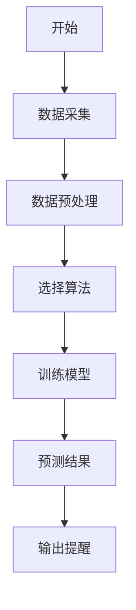
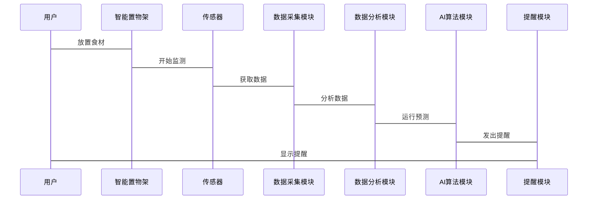

                 


# 智能厨房置物架：AI Agent的食材新鲜度监控

> 关键词：智能厨房置物架、AI Agent、食材新鲜度、传感器技术、时间序列分析、机器学习、物联网

> 摘要：本文探讨了智能厨房置物架在AI Agent技术下的食材新鲜度监控系统，详细分析了背景、核心概念、算法原理、系统架构，以及实际项目的实现与优化。

---

## 第一部分：背景与核心概念

### 第1章：智能厨房置物架的背景与问题描述

#### 1.1 食材新鲜度管理的重要性
- 食材新鲜度直接影响健康和烹饪效果。
- 食材浪费导致经济和环境问题。
- 智能化管理提升生活品质和资源利用效率。

#### 1.2 传统食材管理方式的局限性
- 手工检查耗时且容易遗忘。
- 温湿度变化影响保存效果。
- 数据记录不准确，依赖用户记忆。

#### 1.3 AI Agent在食材管理中的应用优势
- 自动监控，实时反馈。
- 数据分析精准，提升管理效率。
- 提供个性化建议，优化存储方案。

#### 1.4 问题背景与目标
- 问题背景：食材管理低效，新鲜度难以把控。
- 核心问题：如何实现智能化监控。
- 边界与外延：专注于厨房环境，考虑传感器和AI算法的集成。

---

## 第二部分：核心概念与系统架构

### 第2章：核心概念与系统架构

#### 2.1 AI Agent的基本原理
- 定义与特点：AI Agent是具备感知和决策能力的智能体。
- 核心功能模块：数据采集、分析、反馈。

#### 2.2 食材新鲜度监控的关键技术
- 传感器数据采集：温度、湿度、气体浓度等。
- 数据分析与预测：时间序列分析和机器学习。
- 用户反馈机制：提醒推送和存储建议。

#### 2.3 系统架构的ER实体关系图
```mermaid
er
    actor: 用户
    smart_shelf: 智能置物架
    sensor: 传感器
    freshness_data: 新鲜度数据
    notification: 提醒信息

    用户 --> 智能置物架: 使用
    智能置物架 --> 传感器: 集成
    传感器 --> 新鲜度数据: 采集
    新鲜度数据 --> 提醒信息: 分析
```

---

## 第三部分：算法原理与数学模型

### 第3章：食材新鲜度预测算法

#### 3.1 时间序列分析
- 原理：分析历史数据，预测未来趋势。
- ARIMA模型：用于时间序列预测。
  $$ ARIMA(p, d, q) $$
  其中，p为自回归阶数，d为差分阶数，q为移动平均阶数。

#### 3.2 机器学习算法
- 线性回归模型：简单但适用于线性关系。
  $$ y = \beta_0 + \beta_1x + \epsilon $$
- 支持向量机（SVM）：处理非线性关系。
- 随机森林：通过集成学习提高准确性。

#### 3.3 算法流程图


---

## 第四部分：系统架构与交互流程

### 第4章：系统架构与交互流程

#### 4.1 系统架构设计
- 传感器模块：采集环境数据。
- 数据处理模块：清洗和转换数据。
- AI处理模块：应用算法进行预测。
- 用户界面：显示结果和操作提示。

#### 4.2 系统交互流程


---

## 第五部分：项目实战与代码实现

### 第5章：项目实战与代码实现

#### 5.1 环境安装
- Python 3.8+
- NumPy、Pandas、Scikit-learn库安装：
  ```bash
  pip install numpy pandas scikit-learn
  ```

#### 5.2 核心代码实现
```python
import numpy as np
from sklearn.linear_model import LinearRegression

# 示例数据
X = np.array([1, 2, 3, 4, 5]).reshape(-1, 1)
y = np.array([2, 4, 5, 4, 6])

# 训练模型
model = LinearRegression()
model.fit(X, y)

# 预测
predicted_y = model.predict(X)
print(predicted_y)
```

#### 5.3 代码解读与分析
- 数据预处理：清洗和转换数据以适应算法。
- 算法选择：根据数据特点选择合适的模型。
- 模型训练：使用训练数据优化模型参数。
- 预测与评估：验证模型的准确性和可靠性。

---

## 第六部分：最佳实践与小结

### 第6章：最佳实践与小结

#### 6.1 最佳实践
- 定期校准传感器以保证准确性。
- 更新算法模型以适应新数据。
- 用户教育：指导用户如何使用系统。

#### 6.2 小结
- 智能厨房置物架通过AI Agent实现了食材新鲜度的智能化监控。
- 传感器技术和算法模型的结合提升了管理效率和用户体验。
- 未来发展方向：多传感器融合、模型优化和用户界面改进。

---

作者：AI天才研究院 & 禅与计算机程序设计艺术

