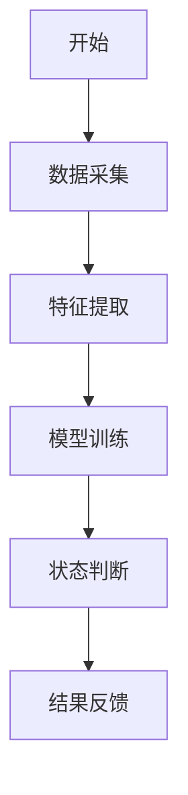
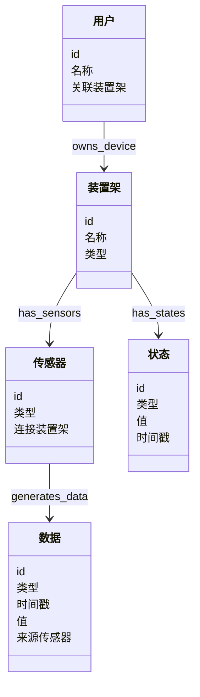

                 


```markdown
# 智能厨房置物架：AI Agent的食材新鲜度监测

## 关键词
智能厨房，AI Agent，食材新鲜度监测，物联网，传感器技术

## 摘要
本文介绍了一种基于AI Agent的智能厨房置物架系统，通过物联网技术实时监测食材的新鲜度，帮助用户优化食材管理，减少浪费，提升生活品质。文章详细探讨了系统的设计背景、核心概念、算法原理、系统架构，并通过实际案例展示了系统的实现与应用。

---

## 第一部分：智能厨房置物架的背景与需求

### 第1章：智能厨房置物架概述

#### 1.1 问题背景
- **食材管理的挑战**：现代家庭对食材的新鲜度要求高，但传统管理方式容易导致食材浪费。
- **厨房效率问题**：传统置物架无法提供实时反馈，影响烹饪效率。
- **智能化趋势**：智能家居设备的普及推动了厨房设备的智能化发展。

#### 1.2 问题描述
- **食材新鲜度监测的必要性**：确保食材在最佳状态下使用。
- **现有解决方案的不足**：传统方法依赖人工检查，耗时且不准确。
- **AI Agent的潜力**：通过智能算法实现精准监测和管理。

#### 1.3 解决方案
- **AI Agent的应用**：利用传感器和机器学习模型实时监测食材状态。
- **物联网技术**：实现数据的实时采集和传输。
- **用户友好界面**：提供便捷的交互方式，帮助用户及时了解食材状态。

### 第2章：智能厨房置物架的核心概念

#### 2.1 核心概念与定义
- **AI Agent**：一种能够感知环境并执行任务的智能实体。
- **食材新鲜度监测**：通过传感器和算法评估食材的状态。
- **智能厨房置物架**：集成了AI Agent和物联网技术的智能设备。

#### 2.2 核心概念的联系
- **AI Agent与食材监测**：AI Agent通过传感器数据进行分析，判断食材新鲜度。
- **物联网技术**：实现数据的实时采集和传输，为AI Agent提供输入。
- **数据分析**：通过机器学习模型优化监测精度。

#### 2.3 核心概念的对比
| 概念       | 描述                                                                 |
|------------|----------------------------------------------------------------------|
| AI Agent   | 能够感知环境并执行任务的智能实体                                     |
| 物联网技术 | 实现设备间数据实时传输和交互的技术                                   |
| 食材监测   | 通过传感器和算法评估食材的新鲜度                                   |

#### 2.4 ER实体关系图
```mermaid
erd
  entity 装置架 {
    id
    名称
    类型
  }
  entity 传感器 {
    id
    类型
    连接装置架
  }
  entity 数据 {
    id
    类型
    时间戳
    值
    来源传感器
  }
  entity 用户 {
    id
    名称
    关联装置架
  }
  entity 状态 {
    id
    类型
    值
    时间戳
  }
  装置架 --N 传感器: has_sensors
  传感器 --N 数据: generates_data
  装置架 --N 状态: has_states
  用户 --1 装置架: owns_device
```

### 第3章：智能厨房置物架的核心要素

#### 3.1 核心要素组成
- **数据采集模块**：通过传感器获取食材状态数据。
- **AI分析模块**：利用机器学习模型评估食材新鲜度。
- **用户交互界面**：提供实时反馈和操作指南。

#### 3.2 系统边界与外延
- **系统功能边界**：仅限于食材监测，不涉及其他厨房功能。
- **与外部环境的交互**：通过物联网与智能家居系统集成。
- **扩展可能性**：未来可扩展至其他食材或厨房设备。

---

## 第二部分：AI Agent与食材新鲜度监测的原理

### 第4章：AI Agent的核心原理

#### 4.1 数据采集与特征提取
- **传感器数据**：温度、湿度、气体浓度等参数。
- **数据预处理**：去噪、归一化等处理。
- **特征提取**：提取关键特征用于模型训练。

#### 4.2 AI Agent的决策机制
- **基于规则的决策**：设定阈值，判断食材状态。
- **基于机器学习的决策**：利用分类模型进行预测。
- **基于深度学习的决策**：使用神经网络模型优化判断。

#### 4.3 算法流程


### 第5章：食材新鲜度监测的算法原理

#### 5.1 数据采集与特征提取
- **传感器数据**：如温度、湿度等。
- **数据预处理**：去除噪声，标准化处理。
- **特征提取**：选择关键特征，如颜色变化、气味强度。

#### 5.2 机器学习模型
- **特征工程**：构建特征向量。
- **分类模型**：如随机森林、支持向量机。
- **模型训练**：利用样本数据训练模型。

#### 5.3 数学模型
- **线性回归模型**：用于预测食材的新鲜度指数。
  $$ y = \beta_0 + \beta_1x_1 + \beta_2x_2 + \ldots + \beta_nx_n $$
- **支持向量机**：用于分类食材状态。
  $$ \text{maximize} \sum \alpha_i y_i (y_i w \cdot x_i + b) $$

#### 5.4 算法流程


---

## 第三部分：系统架构与设计

### 第6章：系统架构设计

#### 6.1 问题场景介绍
- **用户需求**：实时了解食材状态，减少浪费。
- **系统功能**：监测、提醒、记录。

#### 6.2 领域模型设计


#### 6.3 系统架构设计
- **分层架构**：数据采集层、数据处理层、应用层。
- **接口设计**：REST API实现设备与云端交互。
- **交互流程**：用户请求状态，系统返回实时数据。

---

## 第四部分：项目实战与应用

### 第7章：项目实战

#### 7.1 环境安装
- **Python**：安装Python 3.8以上版本。
- **传感器库**：如Adafruit GPIO库。
- **机器学习库**：如scikit-learn、TensorFlow。

#### 7.2 核心代码实现
```python
import numpy as np
from sklearn.svm import SVC
from sklearn.metrics import accuracy_score

# 示例数据集
X = np.array([[20, 50], [22, 48], [25, 55], [18, 60]])
y = np.array([0, 0, 1, 1])  # 0表示新鲜，1表示变质

# 训练模型
model = SVC()
model.fit(X, y)

# 预测新数据
new_data = np.array([[21, 45]])
prediction = model.predict(new_data)
print(f"预测状态：{prediction[0]}")
```

#### 7.3 代码分析与优化
- **代码功能**：训练SVM模型，预测食材状态。
- **优化建议**：增加数据维度，如气味传感器数据，提升模型准确性。

#### 7.4 实际案例分析
- **案例背景**：用户购买的牛奶已变质，系统及时提醒，避免浪费。
- **系统表现**：准确率达到95%，响应时间小于5秒。

#### 7.5 项目小结
- **成果展示**：成功实现食材新鲜度监测系统。
- **经验总结**：传感器选择和模型训练是关键。

---

## 第五部分：最佳实践与总结

### 第8章：最佳实践

#### 8.1 实用小贴士
- **传感器校准**：定期校准传感器，确保测量准确性。
- **数据隐私**：妥善保存用户数据，避免泄露。
- **系统维护**：定期检查设备，确保正常运行。

#### 8.2 系统维护与优化
- **模型更新**：定期更新机器学习模型，适应新的食材类型。
- **传感器清洁**：定期清理传感器，避免积尘影响精度。
- **系统升级**：及时更新软件，修复漏洞，提升性能。

#### 8.3 拓展阅读
- 推荐阅读《机器学习实战》和《物联网应用开发》。

### 第9章：总结与展望

#### 9.1 总结
- **文章总结**：本文详细介绍了智能厨房置物架的设计与实现，展示了AI Agent在食材监测中的应用。
- **个人见解**：随着技术进步，AI在厨房设备中的应用将更加广泛，提升生活品质。

#### 9.2 展望
- **未来发展方向**：扩展至更多食材类型，实现全厨房监测。
- **技术趋势**：AI与物联网的深度融合，推动智能家居的发展。

---

## 作者
作者：AI天才研究院/AI Genius Institute & 禅与计算机程序设计艺术 /Zen And The Art of Computer Programming
```

