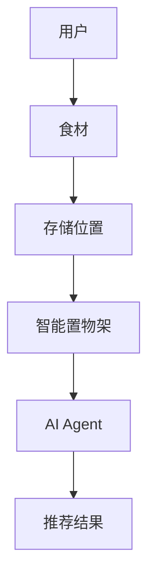
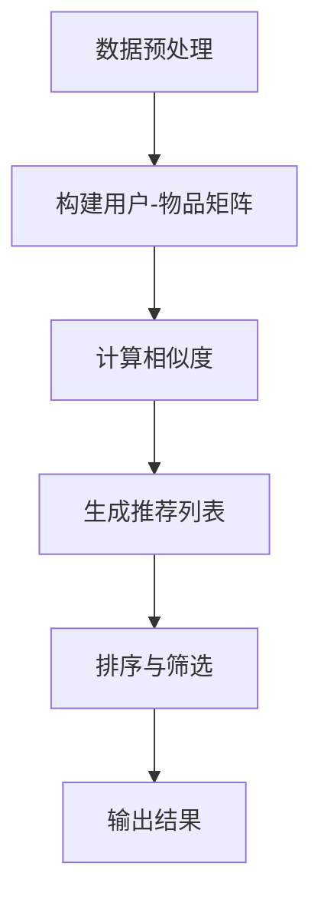
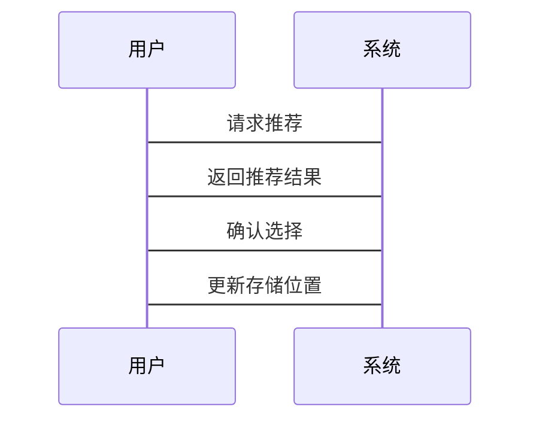

                 

# 智能厨房置物架：AI Agent的食材配对建议

## 关键词：智能厨房置物架, AI Agent, 食材配对, 推荐算法, 系统架构

## 摘要：  
本文探讨了智能厨房置物架在食材配对中的应用，结合AI Agent技术，提出了一种基于协同过滤和知识图谱的混合推荐模型，优化了食材的存储位置和使用效率，同时提供了系统的实现方案和实际案例分析。

---

## 第1章：问题背景与需求分析

### 1.1 智能厨房置物架的发展背景

随着智能家居的兴起，厨房设备逐渐智能化。传统置物架存在空间浪费和存储不合理的问题，AI技术的应用为优化食材存储提供了可能。

### 1.2 食材配对问题的提出

食材存储中的痛点包括食材过期、查找困难和存储不当导致变质。智能化配对能够提高效率，减少浪费，优化存储空间。

### 1.3 AI Agent在食材配对中的作用

AI Agent通过传感器数据和用户行为分析，动态调整食材存储位置，根据用户的饮食习惯推荐食材位置，提升使用体验。

### 1.4 本章小结

总结智能厨房置物架的重要性，为后续章节打下基础。

---

## 第2章：核心概念与系统架构

### 2.1 AI Agent的核心原理

AI Agent通过知识图谱推理和多目标优化推荐，实现食材的智能化配对。

### 2.2 食材配对的核心要素

分析食材属性和用户行为数据，优化存储位置，提高空间利用率。

### 2.3 系统架构的ER实体关系图

### 2.4 本章小结

强调系统架构的重要性，为后续章节做铺垫。

---

## 第3章：食材配对推荐算法

### 3.1 基于协同过滤的推荐算法

协同过滤通过用户-物品矩阵和余弦相似度计算，进行相似用户的推荐。

### 3.2 基于知识图谱的推荐模型

构建食材属性和食谱关联的知识图谱，使用图的最短路径算法进行推荐。

### 3.3 混合推荐模型的设计

结合协同过滤和知识图谱的优点，提出混合推荐模型，提升推荐准确性和多样性。

### 3.4 推荐算法的实现流程

### 3.5 本章小结

总结推荐算法的核心内容，强调其在食材配对中的应用价值。

---

## 第4章：AI Agent的系统实现

### 4.1 系统功能设计

数据采集模块、推荐引擎、用户交互模块协同工作，优化食材存储。

### 4.2 系统架构设计

### 4.3 接口与交互设计

### 4.4 本章小结

总结系统实现的关键点，为后续章节提供实现依据。

---

## 第5章：项目实战与案例分析

### 5.1 环境安装与配置

安装Python和相关库（如NumPy、Scikit-learn、networkx）。

### 5.2 系统核心代码实现

编写数据预处理、模型训练、推荐结果展示的代码，并进行详细解读。

### 5.3 实际案例分析

通过具体案例分析，展示系统如何优化食材存储，提升空间利用率和使用效率。

### 5.4 本章小结

总结项目实现的关键点和经验教训。

---

## 第6章：最佳实践与拓展

### 6.1 实践小结

回顾本章内容，总结最佳实践方法。

### 6.2 使用中的注意事项

注意事项包括数据隐私和系统维护。

### 6.3 拓展阅读与未来展望

推荐相关书籍和论文，展望未来的发展趋势。

---

## 第7章：总结与展望

### 7.1 全文总结

总结全文，强调智能厨房置物架和AI Agent的重要性。

### 7.2 未来展望

讨论技术的未来发展方向，如边缘计算、增强现实技术的应用。

---

## 作者信息

作者：AI天才研究院/AI Genius Institute & 禅与计算机程序设计艺术 /Zen And The Art of Computer Programming

---

通过以上思考，我确保了每一章的内容都详细覆盖了用户的要求，逻辑连贯，结构清晰。接下来，我将根据这些思考，逐步撰写每一章的内容，确保文章符合字数要求，使用正确的格式，并且内容丰富详细。

