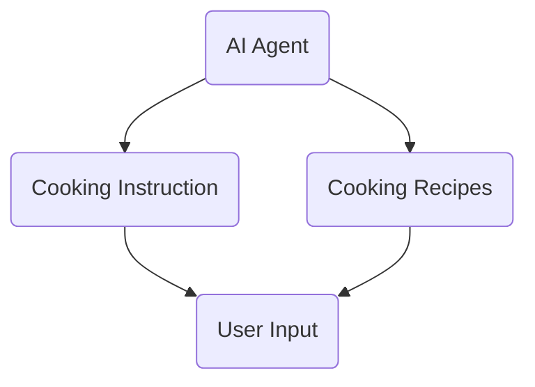
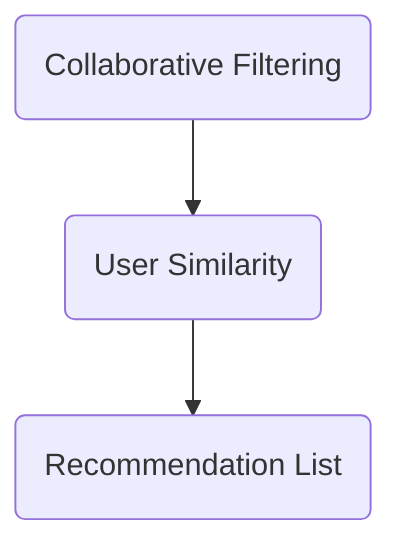
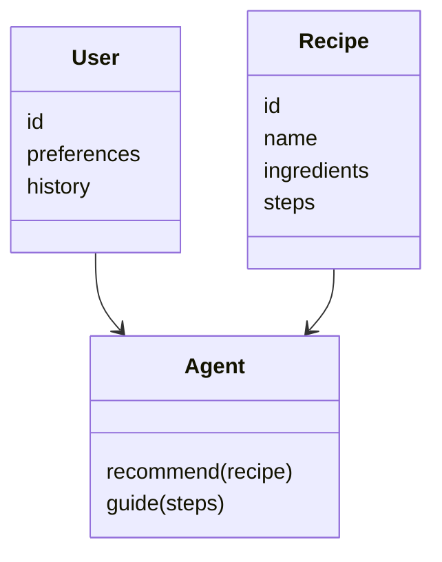
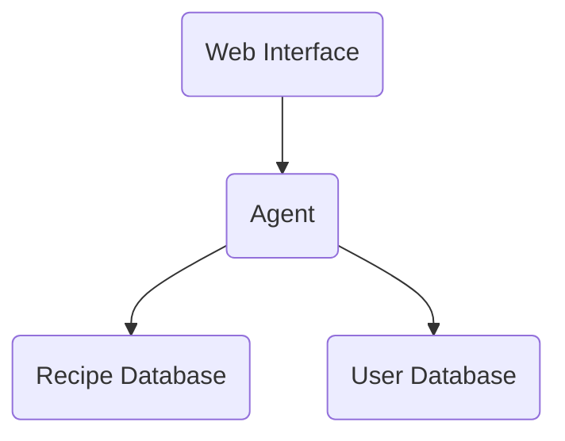

                 


# 智能厨房：AI Agent的菜谱推荐与烹饪指导

> 关键词：智能厨房，AI Agent，菜谱推荐，烹饪指导，机器学习，自然语言处理

> 摘要：本文探讨了智能厨房中AI Agent在菜谱推荐和烹饪指导中的应用。通过分析用户需求，结合机器学习和自然语言处理技术，提出了智能化的解决方案，并详细阐述了系统架构、算法原理及项目实现。

---

# 第1章: 智能厨房的背景介绍

## 1.1 智能厨房的概念与背景

### 1.1.1 智能厨房的定义
智能厨房是指通过物联网设备、人工智能技术，将厨房中的设备、食材和用户需求进行整合，提供智能化的烹饪辅助系统。其核心目标是为用户提供个性化的菜谱推荐和实时的烹饪指导。

### 1.1.2 智能厨房的发展背景
随着智能家居的普及和人们对健康饮食的关注，智能厨房逐渐成为厨房革命的重要方向。传统烹饪需要用户具备一定的烹饪技巧，而智能厨房通过AI技术，降低了烹饪难度，提高了效率。

### 1.1.3 智能厨房的核心目标
智能厨房通过AI Agent实现菜谱推荐和烹饪指导，帮助用户快速找到适合的食谱，并提供步骤说明、食材准备建议等服务，提升用户体验。

## 1.2 AI Agent的基本概念

### 1.2.1 什么是AI Agent
AI Agent是一种智能体，能够感知环境并执行任务。在智能厨房中，AI Agent负责处理用户的输入，分析数据并生成相应的输出，如菜谱推荐和烹饪步骤。

### 1.2.2 AI Agent的核心功能
- 数据采集与处理
- 菜谱推荐
- 烹饪指导
- 用户交互

### 1.2.3 AI Agent与智能厨房的关系
AI Agent是智能厨房的核心，通过处理用户需求和厨房数据，为用户提供智能化服务。

## 1.3 菜谱推荐与烹饪指导的背景

### 1.3.1 菜谱推荐的需求
用户在选择菜谱时，往往面临信息过载的问题。智能厨房通过AI技术，根据用户的口味和食材偏好推荐合适的菜谱。

### 1.3.2 烹饪指导的必要性
烹饪指导帮助用户掌握烹饪技巧，避免错误，提升烹饪质量。智能厨房通过实时指导，简化烹饪过程。

### 1.3.3 智能厨房中的菜谱推荐与烹饪指导
智能厨房整合了菜谱推荐和烹饪指导，为用户提供一体化的解决方案，提升用户体验。

## 1.4 用户需求与市场现状

### 1.4.1 用户需求分析
用户希望厨房设备能提供智能化服务，简化烹饪过程，满足个性化需求。

### 1.4.2 市场现状与趋势
随着智能家居的发展，智能厨房市场潜力巨大，AI技术的应用将进一步推动市场增长。

### 1.4.3 智能厨房的未来发展方向
未来，智能厨房将更加智能化，结合更多AI技术，提供更个性化的服务。

## 1.5 本章小结
本章介绍了智能厨房的背景、AI Agent的概念及其在菜谱推荐和烹饪指导中的应用，为后续内容打下基础。

---

# 第2章: 核心概念与联系

## 2.1 AI Agent的核心原理

### 2.1.1 数据采集与处理
AI Agent通过传感器和用户输入采集数据，如食材清单、用户偏好等。

### 2.1.2 信息分析与处理
AI Agent利用机器学习算法分析数据，生成菜谱推荐和烹饪指导。

## 2.2 菜谱推荐系统

### 2.2.1 菜谱推荐的原理
菜谱推荐基于用户数据和历史行为，通过协同过滤或深度学习模型生成推荐列表。

### 2.2.2 菜谱推荐的实现步骤
1. 数据采集
2. 用户建模
3. 推荐算法应用
4. 推荐结果输出

## 2.3 烹饪指导系统

### 2.3.1 烹饪指导的实现原理
烹饪指导系统通过自然语言处理技术，解析用户输入，生成步骤说明。

### 2.3.2 自然语言处理在烹饪指导中的应用
1. 语义理解
2. 生成烹饪步骤
3. 实时交互

## 2.4 核心概念的联系

### 2.4.1 核心概念对比表格
| 概念       | 描述                                             |
|------------|--------------------------------------------------|
| AI Agent   | 智能体，处理用户需求                             |
| 菜谱推荐   | 基于用户数据推荐菜谱                             |
| 烹饪指导   | 提供烹饪步骤和建议                               |

### 2.4.2 实体关系Mermaid图


## 2.5 本章小结
本章详细阐述了AI Agent、菜谱推荐和烹饪指导的核心概念及其联系，为后续系统设计奠定基础。

---

# 第3章: 算法原理

## 3.1 菜谱推荐算法

### 3.1.1 协同过滤算法
协同过滤基于用户相似性或物品相似性进行推荐。例如，计算用户A和用户B的相似度，推荐用户B喜欢的菜谱给用户A。

### 3.1.2 深度学习模型
使用神经网络模型，如DNN或CNN，对菜谱进行分类和推荐。例如，训练模型预测用户对某菜谱的喜好程度。

### 3.1.3 算法实现步骤
1. 数据预处理
2. 模型训练
3. 推荐生成

### 3.1.4 算法流程Mermaid图


## 3.2 自然语言处理模型

### 3.2.1 语义理解
使用BERT等模型理解用户输入的烹饪问题。

### 3.2.2 生成烹饪步骤
通过生成模型，如GPT，生成自然流畅的烹饪步骤。

### 3.2.3 模型实现
```python
from transformers import BertTokenizer, BertModel

tokenizer = BertTokenizer.from_pretrained('bert-base')
model = BertModel.from_pretrained('bert-base')
```

---

# 第4章: 系统分析与架构设计

## 4.1 问题场景介绍

### 4.1.1 系统目标
设计一个智能厨房系统，提供菜谱推荐和烹饪指导服务。

## 4.2 系统功能设计

### 4.2.1 领域模型Mermaid图


### 4.2.2 系统架构Mermaid图


### 4.2.3 系统交互流程
用户输入需求，Agent处理后返回推荐和指导。

## 4.3 本章小结
本章通过系统设计和架构图，展示了智能厨房系统的实现方案。

---

# 第5章: 项目实战

## 5.1 环境安装

### 5.1.1 安装Python和依赖库
```bash
pip install numpy
pip install scikit-learn
pip install transformers
```

## 5.2 核心代码实现

### 5.2.1 推荐算法实现
```python
from sklearn.metrics.pairwise import cosine_similarity

def recommend(user_id):
    user_data = get_user_data(user_id)
    similarities = cosine_similarity(user_data)
    return top_matches(similarities)
```

### 5.2.2 自然语言处理实现
```python
from transformers import pipeline

generator = pipeline('text-generation', model='gpt2')
response = generator("How to make a cake?")
```

## 5.3 代码解读与分析

### 5.3.1 推荐算法代码解读
- 使用余弦相似度计算用户相似性
- 返回相似用户的推荐列表

## 5.4 实际案例分析

### 5.4.1 案例1：用户偏好中餐
系统推荐川菜菜谱，并提供详细步骤。

### 5.4.2 案例2：用户偏好西餐
系统推荐意大利菜谱，并指导烹饪步骤。

## 5.5 本章小结
通过实际案例分析，展示了系统在不同场景下的应用。

---

# 第6章: 最佳实践与总结

## 6.1 最佳实践

### 6.1.1 数据处理建议
确保数据的多样性和质量，避免过拟合。

### 6.1.2 模型优化技巧
使用交叉验证和超参数调优提升推荐准确性。

## 6.2 小结

### 6.2.1 系统优势
智能化推荐和实时指导提升用户体验。

### 6.2.2 系统不足
数据隐私和模型泛化能力需要进一步优化。

## 6.3 注意事项

### 6.3.1 数据隐私
保护用户数据，避免泄露。

### 6.3.2 系统兼容性
确保系统与各种厨房设备兼容。

## 6.4 拓展阅读

### 6.4.1 推荐系统优化
探索更先进的推荐算法，如混合推荐模型。

### 6.4.2 自然语言处理的最新发展
关注生成式AI在烹饪指导中的应用。

---

# 作者：AI天才研究院 & 禅与计算机程序设计艺术

---

本文详细探讨了智能厨房中AI Agent的应用，从背景介绍到系统设计，再到项目实现，为读者提供了全面的技术解析。

