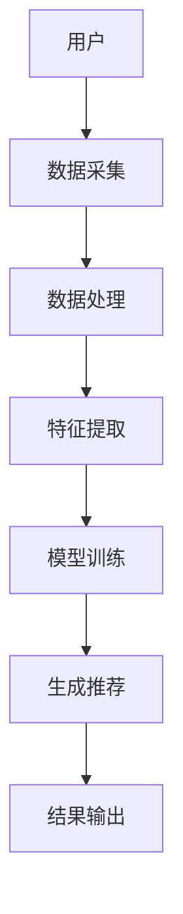

                 


# 智能咖啡机：AI Agent的个性化口味定制

> **关键词**：AI Agent、智能咖啡机、个性化口味定制、推荐系统、协同过滤、混合推荐算法  
> **摘要**：本文探讨AI Agent在智能咖啡机中的应用，重点分析个性化口味定制的技术实现。通过背景介绍、核心概念、算法原理、系统架构和项目实战，详细阐述如何利用AI技术提升用户体验，实现个性化的咖啡口味定制。

---

# 第一部分: 智能咖啡机与AI Agent概述

## 第1章: 背景介绍

### 1.1 智能咖啡机的发展历程

#### 1.1.1 从传统咖啡机到智能咖啡机的演变
传统咖啡机仅能提供预设的几种咖啡类型，用户选择有限。随着技术进步，智能咖啡机引入物联网和AI技术，能够联网获取用户数据，学习用户偏好，实时调整咖啡参数。

#### 1.1.2 智能咖啡机的核心技术发展
智能咖啡机结合传感器、物联网和AI算法，能够实时采集用户数据，分析用户偏好，调整咖啡制作参数，如温度、压力、萃取时间等，以满足个性化需求。

#### 1.1.3 个性化口味定制的背景与意义
个性化口味定制是智能咖啡机的核心功能，通过AI Agent分析用户历史数据，预测用户偏好，提供个性化建议和定制服务，提升用户体验。

### 1.2 AI Agent的基本概念

#### 1.2.1 AI Agent的定义与特点
AI Agent是一种智能实体，能够感知环境、自主决策并执行任务。在智能咖啡机中，AI Agent负责数据采集、用户偏好分析和咖啡制作参数调整。

#### 1.2.2 AI Agent在智能咖啡机中的应用
AI Agent通过收集用户的口味数据，分析用户的饮用习惯和偏好，实时调整咖啡制作参数，提供个性化咖啡体验。

#### 1.2.3 个性化口味定制的核心要素
个性化口味定制依赖于AI Agent的数据分析能力、推荐算法和系统集成。AI Agent通过协同过滤和基于内容的推荐算法，为用户提供个性化建议。

### 1.3 问题背景与目标

#### 1.3.1 用户需求分析
用户希望智能咖啡机能够根据他们的口味偏好，提供个性化的咖啡选择和建议，提升饮用体验。

#### 1.3.2 现有咖啡机的局限性
传统咖啡机无法根据用户偏好调整咖啡参数，个性化服务不足。AI Agent的应用弥补了这一不足，提升了用户体验。

#### 1.3.3 个性化口味定制的目标与边界
目标是通过AI Agent实现个性化咖啡推荐和定制，边界包括数据采集、用户隐私保护和系统稳定性。

---

## 第2章: 核心概念与联系

### 2.1 AI Agent的工作原理

#### 2.1.1 感知模块
AI Agent通过传感器和用户输入获取数据，识别用户的口味偏好和使用习惯。

#### 2.1.2 决策模块
基于感知模块的数据，AI Agent利用推荐算法生成个性化建议，优化咖啡制作参数。

#### 2.1.3 执行模块
AI Agent将决策结果传递给咖啡机，调整制作参数，实现个性化咖啡制作。

### 2.2 实体关系分析

#### 2.2.1 用户与咖啡机的关系
用户与咖啡机通过AI Agent进行交互，用户输入数据，咖啡机根据建议制作咖啡。

#### 2.2.2 咖啡口味与用户偏好的关系
用户偏好影响咖啡口味参数，AI Agent通过分析用户数据，调整咖啡制作参数。

#### 2.2.3 AI Agent与咖啡机的交互关系
AI Agent作为中介，连接用户和咖啡机，实现数据采集、分析和执行。

### 2.3 核心概念对比表

| 比较维度       | 协同过滤 | 基于内容的推荐 | 混合推荐 |
|----------------|----------|----------------|----------|
| 数据需求       | 用户评分 | 物品属性        | 两者结合 |
| 适用场景       | 用户间相似度高 | 物品特征明显 | 综合场景 |
| 优点           | 精准度高 | 解释性强 | 高效性 |
| 缺点           | 数据稀疏 | 冷启动问题 | 复杂性 |

---

## 第3章: 算法原理讲解

### 3.1 推荐算法概述

#### 3.1.1 协同过滤算法
协同过滤通过分析用户历史行为，寻找相似用户，推荐相似物品。

#### 3.1.2 基于内容的推荐算法
基于物品特征，分析用户偏好，推荐相关物品。

#### 3.1.3 混合推荐算法
结合协同过滤和基于内容的推荐，利用两者优势，提升推荐精度。

### 3.2 推荐系统流程图



### 3.3 协同过滤算法实现

```python
def collaborative_filtering(user_id, user_matrix):
    # 计算用户相似度
    similarities = compute_similarities(user_matrix)
    # 获取目标用户相似的用户
    similar_users = find_similar_users(user_id, similarities)
    # 计算推荐分数
    recommendations = calculate_recommendations(similar_users, user_matrix)
    return recommendations
```

---

## 第4章: 系统分析与架构设计

### 4.1 系统架构设计


---

## 第5章: 项目实战

### 5.1 环境搭建

#### 5.1.1 安装Python和相关库
安装Python和机器学习库，如scikit-learn和pandas。

### 5.2 核心功能实现

#### 5.2.1 数据采集与处理
通过传感器和用户输入获取数据，清洗和预处理。

#### 5.2.2 模型训练与推荐生成
利用协同过滤算法训练模型，生成推荐列表。

### 5.3 案例分析

#### 5.3.1 数据分析与结果解读
分析推荐结果，优化模型参数，提升推荐精度。

---

## 第6章: 最佳实践与总结

### 6.1 总结
本文详细阐述了AI Agent在智能咖啡机中的应用，展示了如何通过个性化口味定制提升用户体验。

### 6.2 实用技巧
定期更新模型，确保推荐结果准确；保护用户隐私，确保数据安全。

### 6.3 注意事项
避免数据稀疏问题，处理冷启动问题；优化系统性能，确保运行稳定。

### 6.4 拓展阅读
推荐相关技术书籍和论文，深入学习推荐系统和AI技术。

---

**作者：AI天才研究院/AI Genius Institute & 禅与计算机程序设计艺术 /Zen And The Art of Computer Programming**

---

通过以上内容，我详细分析了智能咖啡机中AI Agent的个性化口味定制，从背景到系统实现，再到项目实战，为读者提供了全面的技术解析。

