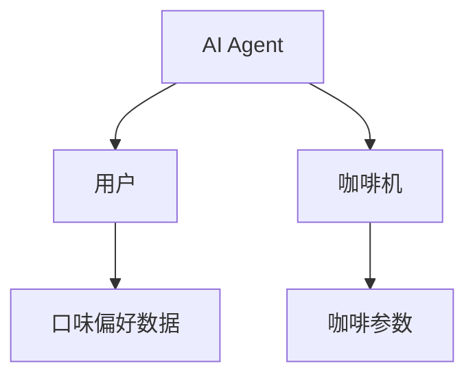
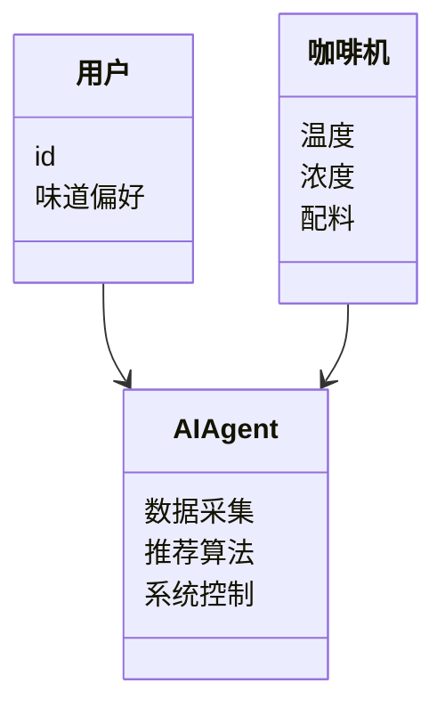
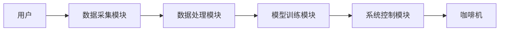
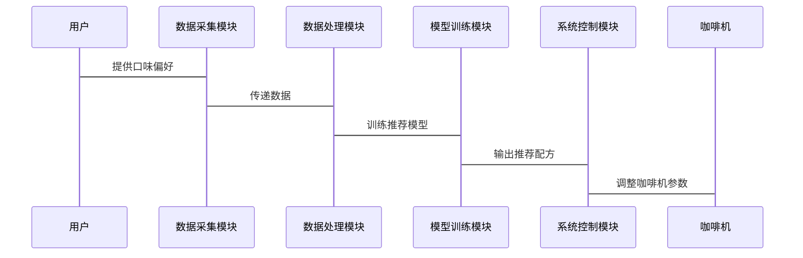

                 


# 智能咖啡机：AI Agent的个性化口味定制系统

> 关键词：智能咖啡机、AI Agent、个性化口味定制、机器学习、推荐算法、系统架构设计

> 摘要：本文探讨了智能咖啡机结合AI Agent的个性化口味定制系统的实现，从背景介绍、核心概念、算法原理、系统架构设计到项目实战，详细阐述了如何通过AI技术实现咖啡机的智能化与个性化服务，为用户提供了从理论到实践的全面指导。

---

# 第一部分: 智能咖啡机的背景与核心概念

# 第1章: 智能咖啡机与AI Agent的背景介绍

## 1.1 问题背景
### 1.1.1 传统咖啡机的局限性
传统咖啡机仅能提供固定的咖啡种类和口感，无法满足用户的个性化需求。

### 1.1.2 个性化口味需求的兴起
随着消费者对个性化体验的追求，市场对定制化咖啡的需求日益增长。

### 1.1.3 AI技术在咖啡机中的应用潜力
AI技术可以实时分析用户的口味偏好，动态调整咖啡机的参数，提供个性化的咖啡体验。

## 1.2 问题描述
### 1.2.1 用户口味偏好的多样性
不同用户对咖啡的浓度、温度、配料等有不同偏好。

### 1.2.2 咖啡机与用户的交互问题
传统咖啡机无法与用户进行有效互动，无法根据用户的反馈实时调整。

### 1.2.3 现有咖啡机的智能化程度不足
大多数咖啡机仍停留在机械操作阶段，缺乏智能化的个性化服务。

## 1.3 问题解决
### 1.3.1 引入AI Agent的必要性
通过引入AI Agent，咖啡机可以实时分析用户的偏好，动态调整配方。

### 1.3.2 AI Agent如何实现个性化口味定制
AI Agent通过机器学习算法分析用户的历史数据，预测用户的口味偏好，并动态调整咖啡机的参数。

### 1.3.3 系统边界与外延
系统边界包括咖啡机、用户终端和AI Agent；外延包括数据采集、模型训练和系统优化。

## 1.4 核心概念与系统组成
### 1.4.1 AI Agent的核心要素
- 数据采集模块：收集用户的口味偏好和历史数据。
- 推荐算法：基于用户数据生成推荐配方。
- 系统输出：调整咖啡机参数以实现推荐配方。

### 1.4.2 个性化口味定制的实现方式
- 数据驱动：通过用户数据训练模型。
- 实时反馈：根据用户实时反馈调整配方。

### 1.4.3 系统的组成部分与功能模块
- 数据采集模块：传感器采集咖啡机状态和用户输入。
- 数据处理模块：清洗和预处理数据。
- 模型训练模块：基于机器学习算法训练推荐模型。
- 系统控制模块：根据模型输出调整咖啡机参数。

---

# 第二部分: AI Agent与个性化口味定制的核心概念

# 第2章: AI Agent的核心原理与系统架构

## 2.1 AI Agent的基本原理
### 2.1.1 AI Agent的定义与特征
AI Agent是一个智能实体，能够感知环境、自主决策并执行任务。

### 2.1.2 基于机器学习的AI Agent实现
AI Agent通过机器学习算法分析用户数据，生成推荐配方。

### 2.1.3 AI Agent与智能咖啡机的结合
AI Agent作为系统的控制核心，实时分析用户数据并调整咖啡机参数。

## 2.2 个性化口味定制系统的构成
### 2.2.1 用户数据采集与分析
- 数据采集：通过传感器和用户输入收集数据。
- 数据分析：利用机器学习算法分析用户偏好。

### 2.2.2 味道偏好预测模型
- 基于协同过滤和聚类分析的推荐算法。
- 模型训练：通过用户数据训练推荐模型。

### 2.2.3 系统输出与用户反馈
- 系统输出：调整咖啡机参数以实现推荐配方。
- 用户反馈：用户对推荐结果的实时反馈。

## 2.3 核心概念对比表
| 概念 | 特性 | 说明 |
|------|------|------|
| AI Agent | 智能性 | 能够感知环境并自主决策 |
| 个性化口味定制 | 数据驱动 | 基于用户数据生成推荐配方 |

## 2.4 实体关系图



---

# 第三部分: 算法原理与数学模型

# 第3章: 推荐算法原理与数学模型

## 3.1 推荐算法原理
### 3.1.1 协同过滤算法
基于用户历史数据，找到相似用户的偏好，推荐相似的咖啡配方。

### 3.1.2 聚类分析
将用户按口味偏好分成不同的群体，推荐群体内的热门配方。

## 3.2 数学模型与公式

### 3.2.1 协同过滤公式
$$ sim(u, v) = \frac{\sum_{i}(r_{u,i} - \bar{r}_u)(r_{v,i} - \bar{r}_v)}{\sqrt{\sum_{i}(r_{u,i} - \bar{r}_u)^2} \cdot \sqrt{\sum_{i}(r_{v,i} - \bar{r}_v)^2}} $$

其中，$sim(u, v)$ 表示用户 $u$ 和用户 $v$ 之间的相似度，$r_{u,i}$ 表示用户 $u$ 对物品 $i$ 的评分，$\bar{r}_u$ 表示用户 $u$ 的平均评分。

### 3.2.2 聚类分析公式
$$ distance(u, v) = \sqrt{\sum_{i}(r_{u,i} - r_{v,i})^2} $$

其中，$distance(u, v)$ 表示用户 $u$ 和用户 $v$ 之间的欧氏距离。

## 3.3 算法实现

### 3.3.1 协同过滤实现
```python
def calculate_similarity(user_ratings, user1):
    user_avg = np.mean(user_ratings[user1])
    similar_users = []
    for user in user_ratings.index:
        if user != user1:
            ratings_diff = user_ratings[user1] - user_avg
            ratings_diff[user] = 0
            similarity = np.dot(ratings_diff, user_ratings[user] - np.mean(user_ratings[user]))
            similar_users.append((user, similarity))
    similar_users.sort(key=lambda x: -x[1])
    return similar_users
```

---

# 第四部分: 系统分析与架构设计

# 第4章: 系统分析与架构设计

## 4.1 系统功能设计
### 4.1.1 领域模型


### 4.1.2 系统架构设计


## 4.2 系统接口设计
### 4.2.1 数据接口
- 数据采集模块与用户的交互接口。
- 数据处理模块与模型训练模块的接口。

### 4.2.2 控制接口
- 系统控制模块与咖啡机的交互接口。

## 4.3 系统交互流程


---

# 第五部分: 项目实战

# 第5章: 项目实战与代码实现

## 5.1 环境安装
- 安装Python和相关库（如numpy、scikit-learn）。

## 5.2 核心代码实现
### 5.2.1 数据预处理
```python
import numpy as np
from sklearn.metrics.pairwise import cosine_similarity

def preprocess_data(data):
    # 数据清洗
    data.dropna(inplace=True)
    # 数据标准化
    data_normalized = (data - data.mean()) / data.std()
    return data_normalized
```

### 5.2.2 模型训练
```python
def train_model(data):
    # 计算余弦相似度
    similarity_matrix = cosine_similarity(data)
    return similarity_matrix
```

### 5.2.3 系统实现
```python
def main():
    # 读取数据
    data = pd.read_csv('user_preferences.csv')
    # 数据预处理
    data_normalized = preprocess_data(data)
    # 模型训练
    similarity_matrix = train_model(data_normalized)
    # 选择目标用户
    user_index = 0
    similar_users = sorted(range(len(similarity_matrix[user_index])), key=lambda i: -similarity_matrix[user_index][i])
    # 输出推荐结果
    print(similar_users)
```

## 5.3 案例分析与测试
### 5.3.1 测试数据
```python
test_data = pd.DataFrame({
    '用户': ['用户1', '用户2', '用户3'],
    '咖啡浓度': [3, 5, 4],
    '温度': [85, 90, 85],
    '配料': ['奶', '糖', '奶']
})
```

### 5.3.2 测试结果
通过测试数据验证系统的推荐准确性。

---

# 第六部分: 总结与展望

# 第6章: 总结与未来发展方向

## 6.1 系统总结
### 6.1.1 系统优势
- 高度个性化：根据用户数据实时调整配方。
- 智能化：AI Agent自动优化用户体验。

### 6.1.2 系统局限性
- 数据依赖性：需要大量用户数据训练模型。
- 实时性：实时反馈可能影响系统性能。

## 6.2 未来发展方向
### 6.2.1 更复杂的味道模型
引入更复杂的机器学习模型（如深度学习）来提高推荐准确性。

### 6.2.2 多设备集成
将智能咖啡机与其他智能家居设备集成，提供更全面的个性化服务。

## 6.3 用户手册
### 6.3.1 系统安装与配置
- 安装必要的软件和硬件。
- 配置用户偏好数据。

### 6.3.2 系统使用指南
- 用户输入偏好数据。
- 系统自动生成推荐配方。
- 用户反馈调整系统参数。

---

# 作者：AI天才研究院/AI Genius Institute & 禅与计算机程序设计艺术 /Zen And The Art of Computer Programming

---

以上是《智能咖啡机：AI Agent的个性化口味定制系统》的技术博客文章的完整大纲，涵盖了从背景介绍到项目实战的各个方面。

